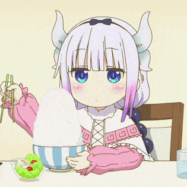
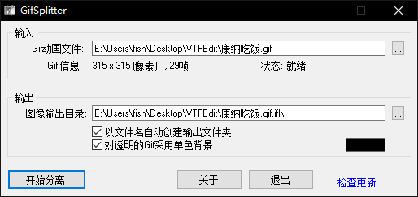
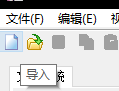
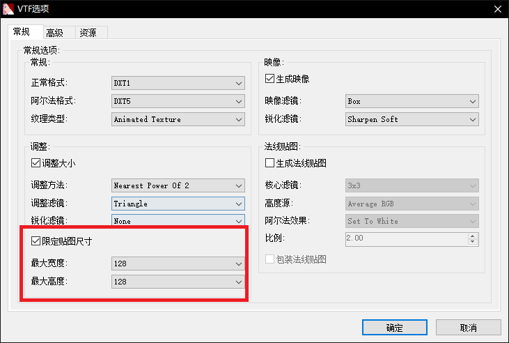
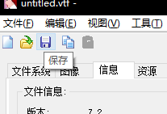
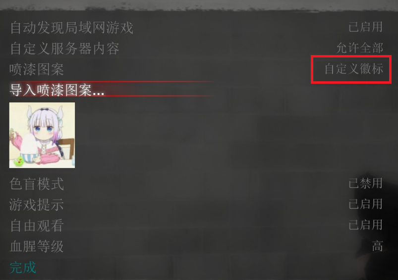

# 为《求生之路 2》制作动态喷漆

## 前言

动态的喷漆也是这个游戏的乐趣之一，尝试自己制作一下动态喷漆，将 GIF 图片转换为可以在游戏中使用的动态喷涂文件。

文中使用的工具和成品可以从 [这里](https://zfile.iuok.me/1/articles/making-dynamic-spray-paint-for-left-4-dead-2) 下载。

## 准备工作

1. 一张 GIF 图片；
2. GIF 图片分解工具，用于把动态图的每一帧分解出来，文中使用的是 GifSplitter[^1]；
3. VTFEdit[^2]，核心工具，用于制作 VTF 格式的动态图。

## 分解 GIF

这里使用的是 GifSplitter，目的是将 GIF 图片的每一帧都分解出来；其他功能类似的软件和在线工具都可以。

## 制作 VTF

打开 VTFEdit，点击左上角的「导入」按钮，选择并导入上一步中分离出来的所有图片。

接下来设置贴图尺寸，选中「限定贴图尺寸」，高度和宽度都设置为 128，其他设置保持默认。

再切换到「信息」页中，查看文件大小；**要确保其小于 512KB，否则无法喷出**。如果文件太大的话，就把要导入的图片删除一些，再重复这些步骤，直至满足条件。

再满足条件之后就可以保存了，保存的时候注意**不要使用中文文件名**，不然在游戏里浏览文件的时候中文名会乱码。

## 在游戏中导入

打开游戏，在游戏设置中依次找到「导入喷漆图案」，选择上一步中制作好的 VTF 文件。

## 后记

整个制作过程也不复杂，核心工具是 VTFEdit；至于分解 GIF 的工具就很多了，可以很灵活地选择其他软件来完成这个任务。

最重要的是控制文件大小，不能超过限制，不然在游戏中无法使用。如果文件大小太大的话可以考虑在分解出的图片中删除一些图片，来达到减小文件大小的目的。比如可以隔帧删除，每隔一张图片就删除一张图片，应该会很有效。

[^1]: [GifSplitter - Break GIF animation down into individual image frames](https://www.xoyosoft.com/gs/)
[^2]: [VTFEdit - Valve Developer Community](https://developer.valvesoftware.com/wiki/VTFEdit)
