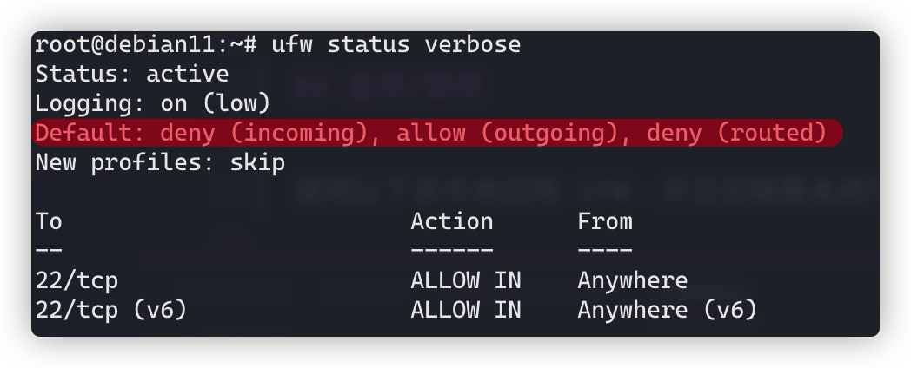
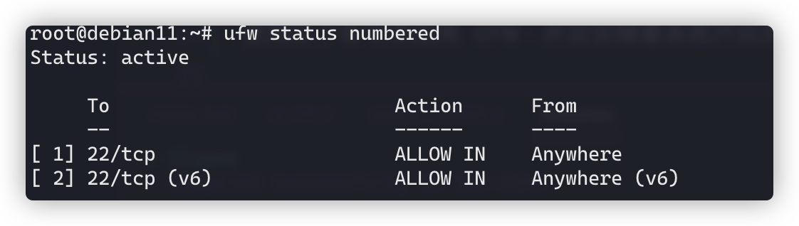

# UFW：简单易上手的防火墙规则管理工具

## 前言

UFW 是一款在 Debian 系系统中可用的防火墙规则管理工具，可以帮助你快速配置各种服务的端口访问权限，而不用书写冗长的 iptables 规则命令。

## 安装

可以使用`apt`快速安装。

```bash
apt install ufw
```

## 启用/禁用

使用以下命令来启用 UFW，并且会随着系统开启而启动。

```bash
ufw enable
```

使用以下命令来停止 UFW。

```bash
ufw disable
```

## 默认行为

使用`ufw default`命令来配置默认行为，以下两条是 UFW 初始化的默认行为；默认拒绝所有入流量，允许所有出流量。

```bash
ufw default deny incoming
ufw default allow outgoing
```

你可以使用`ufw default`命令来覆盖默认行为，使用`allow`/`deny`和`incoming`/`outgoing`/`routed`组合。

使用下面的命令来查看当前的默认行为。

```bash
ufw status verbose
```



## 添加规则

### 放行/禁止端口

以下命令用于放行 53 端口的 TCP 和 UDP 流量。

```bash
ufw allow 53
```

以下命令用于仅放行 53 端口的 TCP 流量。

```bash
ufw allow 53/tcp
```

以下命令用于仅放行 53 端口的 UDP 流量。

```bash
ufw allow 53/udp
```

还可以一次放行一个范围内的端口。

```bash
ufw allow 1000:2000/tcp
```

禁止命令就是用`deny`替代`allow`。

```bash
ufw deny 53
ufw deny 53/tcp
ufw deny 53/udp
ufw deny 1000:2000/tcp
```

### 放行/禁止 IP

```bash
ufw allow from 1.2.3.4
ufw deny from 1.2.3.4
```

## 删除规则

使用`ufw delete`命令来删除一条之前添加的规则。

```bash
ufw delete allow 53
ufw delete deny from 1.2.3.4
```

或者使用下面的命令列出添加的规则并编号，通过编号删除规则。

```bash
ufw status numbered
ufw delete 2
```



## 常用服务端口

在添加或删除关于端口的规则时，除了手动指出端口号之外，还可以通过服务名称来放行/禁止端口。

```bash
ufw allow ssh
ufw deny ssh
ufw delete allow ssh
ufw delete deny ssh
```

服务名和端口号定义在`/etc/services`文件中。在其中有关`ssh`服务的部分是这样写的。

```text
ssh   22/tcp        # SSH Remote Login Protocol
```

UFW 会根据此文件内容管理端口。

常用的服务名称有`ssh`、`http`和`https`等。

## 参考资料

- [Uncomplicated Firewall (ufw) - Debian Wiki](https://wiki.debian.org/Uncomplicated%20Firewall%20%28ufw%29)
- [UFW - Community Help Wiki](https://help.ubuntu.com/community/UFW)
- [Uncomplicated Firewall - Wikipedia](https://en.wikipedia.org/wiki/Uncomplicated_Firewall)
- [An Introduction to Uncomplicated Firewall (UFW) - Linux.com](https://www.linux.com/training-tutorials/introduction-uncomplicated-firewall-ufw/)
- [UFW Tutorial: How To Set Up a Firewall with UFW on Ubuntu 20.04 | ArubaCloud.com](https://www.arubacloud.com/tutorial/how-to-set-up-and-configure-ufw-firewall-on-ubuntu-20-04.aspx)
- [How To Set Up a Firewall with UFW on Ubuntu 20.04 | DigitalOcean](https://www.digitalocean.com/community/tutorials/how-to-set-up-a-firewall-with-ufw-on-ubuntu-20-04)
