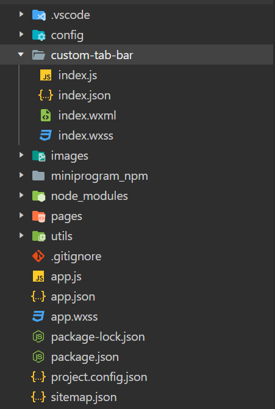
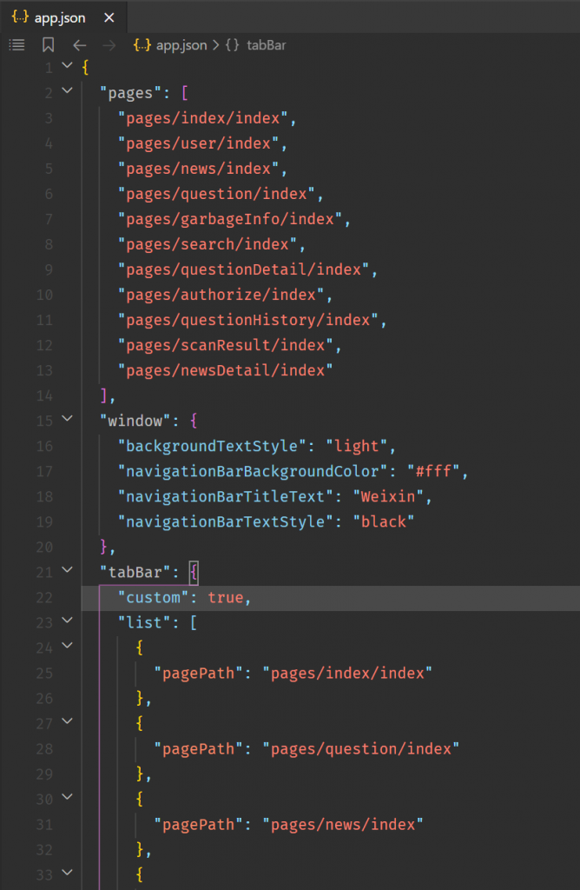

# 使用 Vant Weapp 自定义微信小程序 TabBar

## 前言

微信小程序原生的 TabBar 虽然设置简单，但是样式不好看，也不能使用字体图标，但是微信小程序有自定义 TabBar 的机制。

Vant WeApp[^1] 是有赞出品的针对微信小程序的一套开源组件库，结合 van-tabbar[^2] 和微信的自定义 TabBar 机制 [^3] 可以实现一套比较好看的 TabBar。

## 新建 custom-tab-bar 组件

如图所示，在微信小程序工程文件夹根目录下新建一个名为 `custom-tab-bar` 的组件。



其中各个文件中的代码如下：

```json
{
  "component": true,
  "usingComponents": {
    "van-tabbar": "@vant/weapp/tabbar/index",
    "van-tabbar-item": "@vant/weapp/tabbar-item/index"
  }
}
```

```javascript
// custom-tab-bar/index.js
Component({
  /**
   * 组件的属性列表
   */
  properties: {},

  /**
   * 组件的初始数据
   */
  data: {
    active: -1,
    list: [{
        icon: "search",
        text: "搜索",
        url: "/pages/index/index",
      },
      {
        icon: "question-o",
        text: "答题",
        url: "/pages/question/index",
      },
      {
        icon: "ellipsis",
        text: "关于",
        url: "/pages/user/index",
      },
    ],
  },

  /**
   * 组件的方法列表
   */
  methods: {
    onChange(event) {
      wx.switchTab({
        url: this.data.list[event.detail].url,
      });
    },

    init() {
      const {
        route
      } = getCurrentPages().pop();
      const active = this.data.list.findIndex(
        (item) => item.url === `/${route}`
      );
      console.log("active:", active);
      this.setData({
        active,
      });
    },
  },
});
```

```xml
<!-- custom-tab-bar/index.wxml -->
<van-tabbar active="{{ active }}" bind:change="onChange">
    <van-tabbar-item wx:for="{{list}}" wx:key="index" icon="{{item.icon}}">
        {{item.text}}
    </van-tabbar-item>
</van-tabbar>
```

## 启用自定义 TabBar 设置

修改 `app.js` 中 `tabBar` 设置，设置 `custom` 为 `true`。其中 `list` 中的对象只需保留 `path` 属性。



## 在每个 Tab 页中配置

在开启了自定义 TabBar 设置后，可以在每个页面中通过 `getTabBar()` 获取 TabBar 组件实例。

现在需要在每个 Tab 页中设置当前 Tab 页图标高亮。

可以在每个 Tab 页的 `onShow()` 生命周期方法中调用 TabBar 的 `init()` 方法，修改当前激活页，来高亮当前 Tab 页的图标。

```javascript
/**
* 生命周期函数 -- 监听页面显示
*/
onShow: function () {
  this.getTabBar().init();
},
```

[^1]: [Vant - 轻量、可靠的移动端组件库 (gitee.io)](https://vant-contrib.gitee.io/vant/#/zh-CN/)
[^2]: [Tabbar 标签栏 - Vant Weapp](https://vant-contrib.gitee.io/vant-weapp/#/tabbar)
[^3]: [自定义 tabBar | 微信开放文档](https://developers.weixin.qq.com/miniprogram/dev/framework/ability/custom-tabbar.html)
