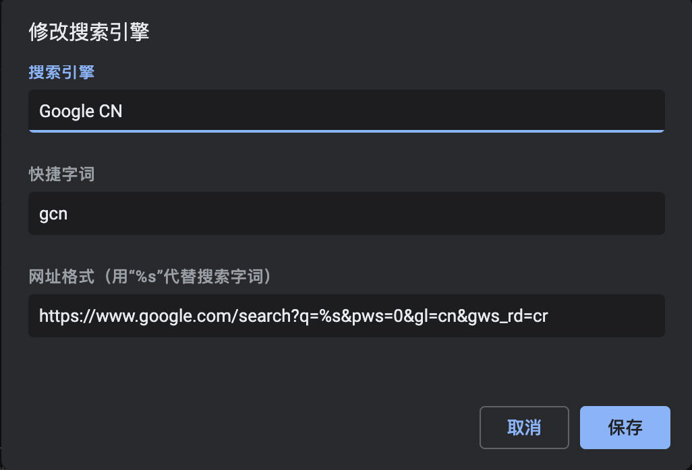

# 使用 Google 搜索时指定 No Counrty Redirect

## 前言

在使用爱国上网的过程中，IP 地址经常在不同国家间变动。默认情况下 Google 搜索的结果会偏好当前 IP 属地的语言，这就导致在使用日本 IP 时会有一堆日文结果看不懂。

你可以在搜索参数中加上`gws_rd=cr`来组织这样的默认行为，并且加上`gl=cn`来强制使用中文。

<!-- more -->

## 使用

搜索时使用如下请求，`%s`替换为搜索词。`gl`参数可以改为任意国家代码。

```
https://www.google.com/search?q=%s&pws=0&gl=cn&gws_rd=cr
```

## 在 Chrome 中设置

在 Chrome 搜索引擎的设置中添加一个新的搜索引擎，然后将其设为默认搜索引擎。



## 参考资料

- [建议大家都把 Google 给 ncr 一下 - V2EX](https://v2ex.com/t/770093)
