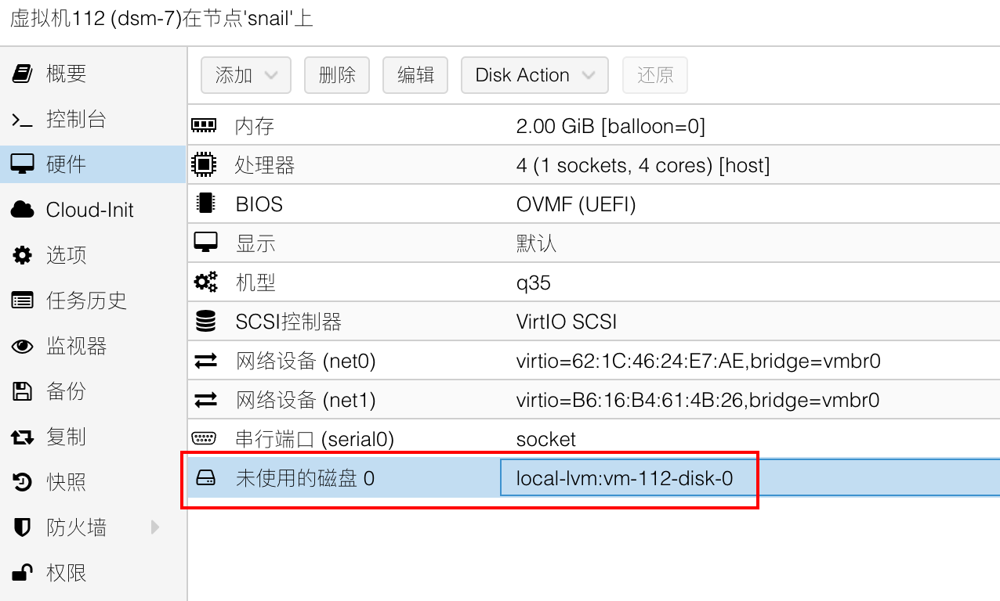

# 在 Proxmox VE 中安装群晖 DSM 7

## 前言

DSM 7 已经发布很久了，最近在 Proxmox VE 中安装了 DSM 7，记录一下流程。

这是一个新安装的流程，并不是从 DSM 6 升级到 DSM 7。升级的流程可能并不一样，注意备份自己的数据。

本文中使用 DS920+ 型号对应的引导和系统，并在构建引导的过程中加入了需要的驱动。

<!-- more -->

## 文中从互联网上下载的文件备份

文中的资源都是从互联网中下载，为了防止你在阅读此文的时候资源失效，这里提供一个 *备份* [^1]。

## arpl 项目介绍

使用 *arpl* [^2] 项目构建引导。该项目提供了一个可启动的小型 Linux 系统和便捷的操作菜单，可以让你很方便地构建 DSM 7 的引导。

## 下载 arpl 镜像

在其 *Releases 页面* [^3] 中，你可以下载该项目可启动的镜像文件。

我需要在 PVE 中使用，下载 img 文件即可。如图所示，下载的文件是一个 zip 压缩包，解压缩即可得到 img 文件。


## 创建虚拟机

在 PVE 的 Web 控制台中创建虚拟机。

1. 常规。需要注意一下 VM ID，后面导入引导磁盘的时候用的到；

    

2. 操作系统。选择「不使用任何介质」；

    

3. 系统。机型选择「q35」；BIOS 选择「OVMF (UEFI)」；取消勾选「添加 EFI 磁盘」；

    

4. 磁盘。删除默认的磁盘；

    

5. CPU。根据需要设置核心数，类别选择「host」；

    

6. 内存。根据需要设置；取消勾选「Ballooning 设备」；

    

7. 网络。网卡模型选择「VirtIO」或者「Intel E1000」；

    

8. 确认；

    

9. 删除 CD/DVD 驱动器；

    

10. 添加一个串行端口，可以在控制台上看到 DSM 启动日志，对于排查错误很有帮助；

    

11. 根据我自己的需求，我又添加了一张网卡。

    

## 导入 arpl 虚拟硬盘

把之前下载的`arpl.img`文件通过 SFTP 工具上传到 PVE 主机中。

使用 SSH 客户端连接上 PVE 主机，执行命令。

执行下面的命令来转换磁盘格式。

```bash
qemu-img convert -f raw -O qcow2 arpl.img arpl.qcow2
```

执行下面的命令来导入磁盘。其中`112`是虚拟机 ID，`local-lvm`是存储位置的名称；你可能要根据你的情况对命令进行一些修改。

```bash
qm importdisk 112 arpl.qcow2 local-lvm
```


命令执行完毕之后可以在 PVE Web 控制台中查看到一个未使用的磁盘。



双击该磁盘或点击「编辑」即可添加这个磁盘到虚拟机。总线选择 SATA，位置选择 0。


在虚拟机选项中修改引导顺序，只勾选「sata0」，其余的选项都不选择。


## 添加数据盘

此处为了演示我只添加了一块虚拟磁盘作为数据盘。实际使用的时候推荐直通 SATA/SAS 控制器，具体可以参考 *安装 DSM 6* [^4] 文章中的内容。


## 构建引导

启动虚拟机，打开 noVNC 控制台。

如果该虚拟机所处的网络中有 DHCP 服务器的话，你可以打开 Web 终端来构建引导；如果不能通过 Web 访问虚拟机的话，你可以通过 noVNC 控制台执行`./menu.sh`来打开构建向导，构建程序需要连接互联网下载文件。


根据控制台中输出的信息，访问`http://192.168.10.111:7681`来通过 Web 终端构建引导。可以通过键盘操作终端，方向键和 TAB 键切换选择焦点，回车键确认；也可以通过鼠标点击操作。


1. Choose a model。选择机型，这里选「DS920+」；

    

2. Choose a Build Number。选择系统版本，这里选择「42962」，待会儿安装系统的时候下载相同版本的系统文件即可。

    

    

3. Choose a serial number。选择序列号，这里选随机生成。

    

    

4. Cmdline menu。更改网口数量和 MAC 地址。

    

    默认只有一个网口。`netif_num`参数值对应了网口数量，需要修改这个参数。

    

    

    选择「Add/edit a cmdline item」；

    

    输入`netif_num`，改为 2。

    

    

    还需要修改`mac1`和`mac2`的值，改为对应网卡的 MAC 地址即可，在虚拟机信息中可以看到，这里不需要加冒号。

    

    

    

    

    最终所有的参数值如下。

    

    

5. Modules。添加驱动；

    

    首先取消选择所有驱动，默认把驱动都加上了。

    

    再自己选择需要的驱动加上。使用空格选择，回车确认。这里我添加了 e1000 和 virtio 相关驱动。

    

    

    

    

6. Build the loader。构建引导，此过程比较耗时，耐心等待即可。

    

    

## 通过引导启动 DSM

引导构建完毕之后选择「Boot the loader」即可启动 DSM。


或者重启虚拟机之后你会发现启动菜单中多出了几个选项，默认选择的启动项是「Boot DSM」，即通过引导启动 DSM。

## 打开串口控制台

在启动 DSM 之前记得打开串口控制台，可以看到 DSM 的日志输出，其中包括了 IP 地址，并且可以根据日志内容排查错误。


在 DSM 启动过程中输出了网卡信息，如果没有网卡信息就是网卡驱动没弄好。


DSM 启动过程中 noVNC 控制台中也会打印出 IP 信息，但是不一定准确，还是看串口控制台好。


## 安装 DSM

根据串口控制台中输出的 IP 信息，在浏览器中访问该地址即可打开 DSM 系统安装向导。


安装过程中需要断掉 DSM 的外网，在路由器中设置禁止联网；等系统安装完毕之后解禁。


在 *Synology Archive Download Site* [^5] 下载 DSM 系统文件。选择和构建引导时相同的版本的系统下载。


在我下载系统的时候发现最初版的系统「7.1.1-42962」已经不提供了，但是小版本更新大概率不影响启动，我们可以试一下「7.1.1-42962 Update 1」。上图中「7.1.1-42962-1」和「7.1.1-42962-2」是小版本的增量更新文件；我们需要从「7.1.1-42962 (with Update 1)」中下载全量系统安装文件。选择「920+」机型的系统下载，下载的时候注意文件大小，太小的就是下载错了。


下载完毕后得到`DSM_DS920+_42962.pat`文件。在 DSM 安装向导中上传即可。记得要先在路由器中断掉虚拟机的外网。


安装过程比较耗时，耐心等待即可。


在串口控制台中可以看到系统启动过程中输出的日志，首次启动比较耗时，启动完毕后可以通过命令看到 IP 地址。

按回车可以登录，完成系统初始化之前可以用`root`账户和空密码登录；用`ifconfig`命令看 网口的 IP 配置信息。


访问对应的地址即可打开系统初始化向导。


搞定，此时就可以在路由器中解禁 DSM 联网了。


## 修改引导并重新构建

如果你对之前构建的引导不满意，你可以修改信息并重新构建。在开机菜单中选择「Configure loader」即可重新构建引导。在菜单中修改完信息后选择「Build the loader」再次构建引导即可。


## 其它小问题记录

1. 「Proxy SwitchyOmega」这款浏览器插件可能会影响访问 DSM 安装向导，导致网页一直加载中，不显示内容。当你访问不了安装向导网页时可以尝试关闭此浏览器插件和其他代理软件；
2. 如果 DSM 系统安装过程中遇到其它错误，可以尝试先在 Windows PE 系统中删除数据硬盘的所有分区，再尝试安装 DSM 系统；
3. 安装系统的过程中记得要断开 NAS 的外网，不然会一直循环安装系统的过程；
4. 系统初始化设置完成之前可以通过`root`账户和空密码在串口控制台登录；初始化完成之后就只能通过创建的用户的用户名和密码登录了；不过都可以通过`ifconfig`命令看网络配置信息。

## 参考资料

以下是在编写本文时使用到的、但未在文中明确引用的参考资料，希望对你有帮助。

- [【授人鱼不如授人以渔】史上最简单的黑群晖 DSM7.X 引导编译方法，小学生都能操作！（黑群晖 DSM7.X 引导编译教程） - GXNAS 博客](https://wp.gxnas.com/12245.html)

分隔线之后是文章的脚注部分。

[^1]: [ZFile | install-synology-dsm-7-in-proxmox-ve](https://zfile.iuok.me/1/articles/install-synology-dsm-7-in-proxmox-ve)
[^2]: [fbelavenuto/arpl: Automated Redpill Loader](https://github.com/fbelavenuto/arpl)
[^3]: [Releases · fbelavenuto/arpl](https://github.com/fbelavenuto/arpl/releases)
[^4]: [在 Proxmox VE 中安装群晖 DSM 6 | 我的学习笔记](install-synology-dsm-in-proxmox-ve.md#硬盘直通)
[^5]: [Synology Archive Download Site - Index of /download/Os/DSM](https://archive.synology.com/download/Os/DSM)
