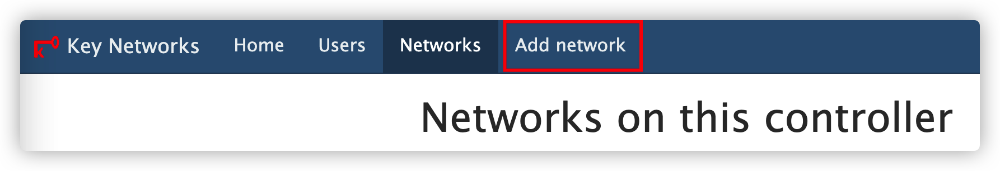
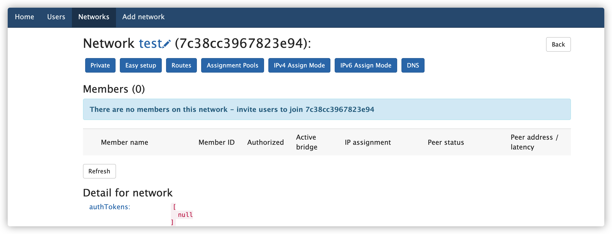
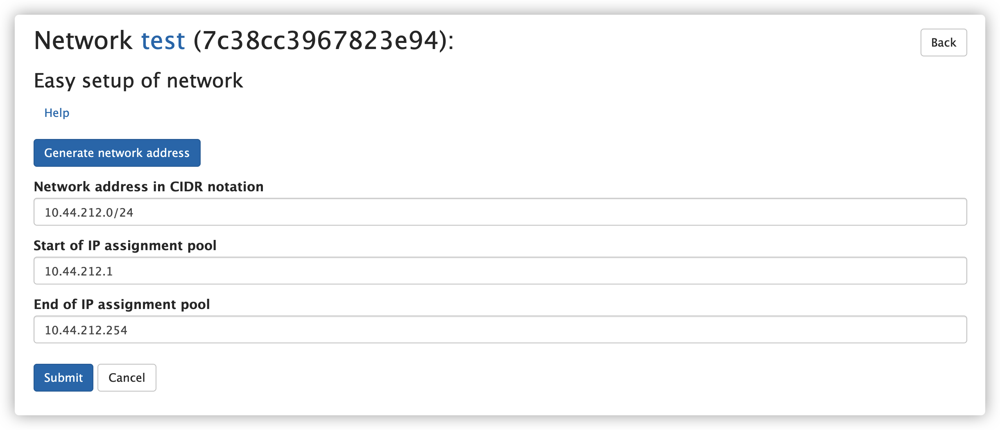
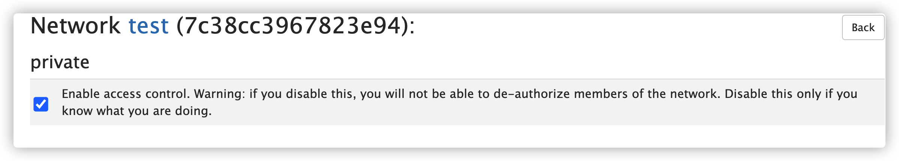
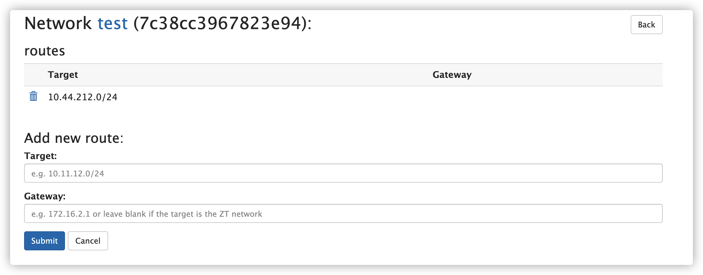
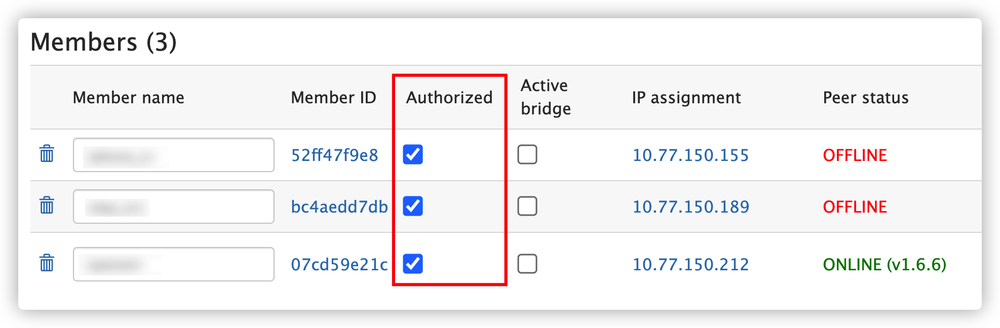

# ztncui：自建 Zerotier 网页控制器

## 前言

自建 Zerotier 行星节点和网页控制器可以解除 50 个设备数量限制，但是客户端还是使用的国外根服务器，并不能改善网络稳定性。

<!-- more -->

## 运行项目

使用`docker-compose`可以快速运行项目。`docker-compose.yml`的内容如下。

```yaml
version: '3'
services:
  ztncui:
    image: keynetworks/ztncui
    restart: unless-stopped
    ports:
      - '3000:3000'
    environment:
      MYADDR: 172.38.38.38
      HTTP_ALL_INTERFACES: "yes"
      ZTNCUI_PASSWD: PASS
      TZ: Asia/Shanghai
    volumes:
      - ztncui:/opt/key-networks/ztncui/etc/
      - zerotier-one:/var/lib/zerotier-one/
volumes:
  ztncui: null
  zerotier-one: null
```

其中一些环境变量需要设置。

- `MYADDR`：机器的公网 IP 地址
- `HTTP_ALL_INTERFACES`：监听所有网络接口
- `ZTNCUI_PASSWD`：设置`admin`用户的密码。

`ztncui`和`zerotier-one`两个 Volume 持久化配置信息，防止重新创建容器后丢失配置。

在当前目录下用`docker-compose up -d`启动容器。

防火墙需要放行`3000`端口。

## 网络配置

访问`IP:3000`可以进入网页管理 UI，也可以用反响代理服务器来转发此端口的流量，并用域名和 HTTPS 访问。用户名是`admin`，密码是你之前配置的环境变量`ZTNCUI_PASSWD`的值。

控制面板的使用方法和操作逻辑和官方控制面板差不多。

在底部的导航栏中点击「Networks」，再点击`Add network`创建一个网络。给网络起一个名字之后你就能在「Networks」中看见你刚刚创建的网络了。



点击该网络名就能进入该网络设置的设置页面。



点击「Easy setup」按钮为网络设置网段。在该页面中点击「Generate network address」按钮可以随机生成网段，点击「Submit」按钮保存信息。



点击「Private」按钮设置私有网络/公开网络。



点击「Routes」按钮设置静态路由。



## 客户端

使用各个平台的原生客户端直接可以连接到自建网络。Network ID 填自己的就行了。

客户端在加入私有网络的时候需要在网络管理页面手动批准认证；勾选对应的「Authorized」列选框即可。



## 参考资料

- [ZeroTier Planet 行星服务器，一键私有部署，可突破 50 台设备限制 - 小众软件](https://www.appinn.com/zerotier-planet-server-docker-install/)
- [Jonnyan404/zerotier-planet: 一分钟自建 zerotier-planet](https://github.com/Jonnyan404/zerotier-planet)
- [key-networks/ztncui: ZeroTier network controller UI](https://github.com/key-networks/ztncui)
- [key-networks/ztncui-containerized: A Docker image that contains ZeroTier One and ztncui to set up a standalone ZeroTier network controller with a web user interface in a container.](https://github.com/key-networks/ztncui-containerized)
