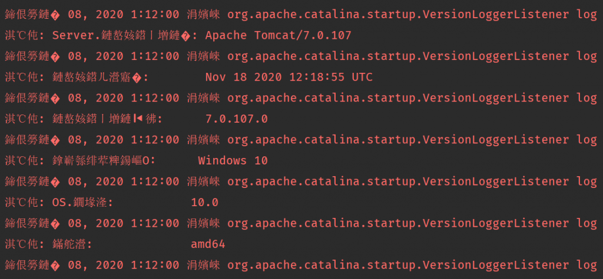
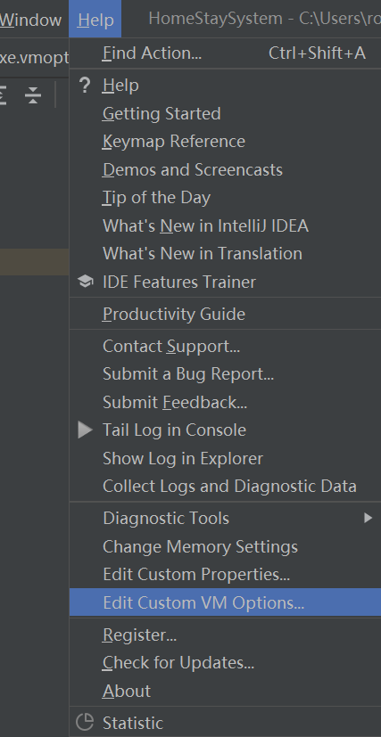
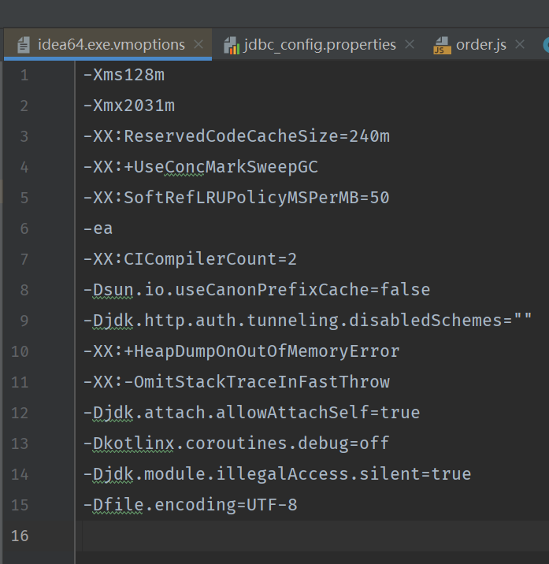
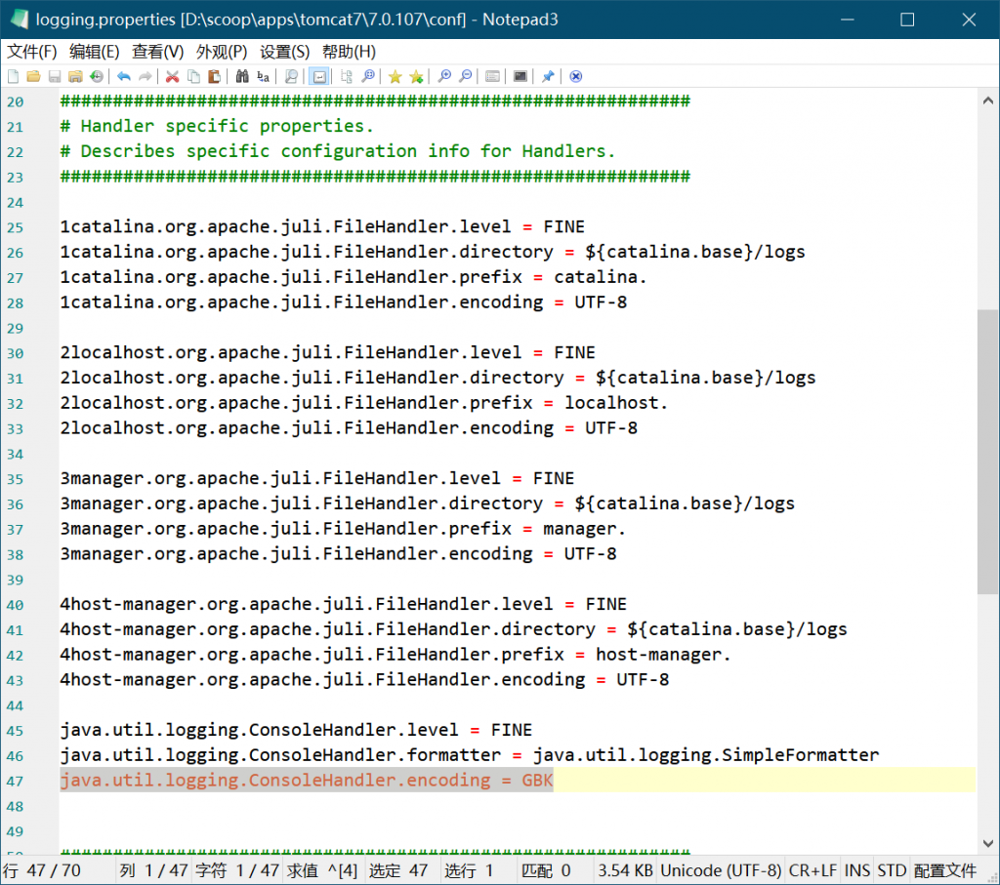
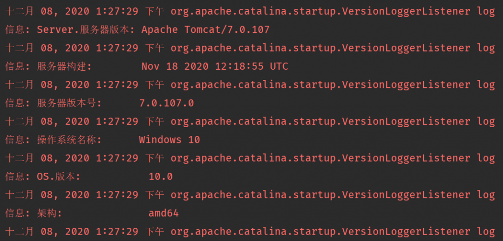

# 解决 IntelliJ IDEA 中 Tomcat 日志输出乱码的问题

## 前言

在用 IntelliJ IDEA 运行 Java Web 项目时，在 Tomcat 的日志输出区域会出现乱码，效果如下图所示。

在网络上查了一些资料 [^1]，记录下解决办法。



## 原因分析

可能是因为 IDEA 控制台中所采用的字符编码与 Tomcat 输出所采用的字符编码不一致，导致了出现乱码。

IDEA 控制台输出采用的是 GBK 编码，Tomcat 输出采用的是 UTF-8 编码。

## 解决办法

### 法一：修改 IDEA 控制台输出编码为 UTF-8

在 IDEA 的上方工具栏中，依次选择`Help`->`Edit Custome VM Options...`。



在`vmoptions`中添加如下一行参数，之后重启 IDEA。

```bash
-Dfile.encoding=UTF-8
```

该文件实际位于`C:\Users\<用户名>\AppData\Roaming\JetBrains\IntelliJIdea2020.3\idea64.exe.vmoptions`，所以直接修改此文件应该也可行。



### 法二：修改 Tomcat 输出编码为 GBK

在 Tomcat 安装位置下的 conf 文件中存在`logging.properties`配置文件。

修改其中的配置，将`java.util.logging.ConsoleHandler.encoding`的属性由`UTF-8`改为`GBK`。

保存之后重启 Tomcat 即可。



## 结果

两种方法均可以解决问题。



[^1]: [idea tomcat 乱码问题的解决及相关设置 - 行而思 - 博客园](https://www.cnblogs.com/shej123/p/10312806.html)
