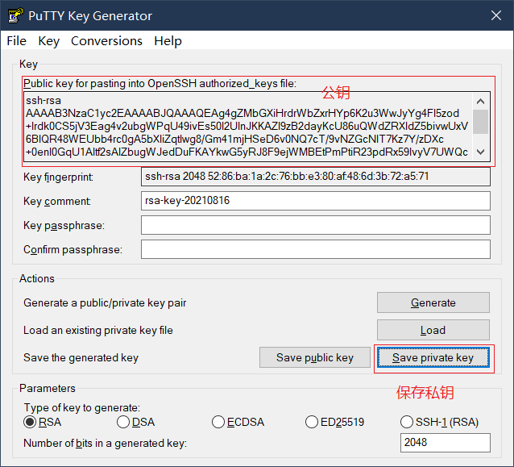

# SSH 密钥登录

## 前言

> SSH 默认采用密码登录，这种方法有很多缺点，简单的密码不安全，复杂的密码不容易记忆，每次手动输入也很麻烦。密钥登录是比密码登录更好的解决方案。[^1]

## 生成秘钥

可以用 OpenSSH 中的`ssh-keygen`命令行工具来生成秘钥。`-t`参数指定了加密方式，通常为`ras`或`dsa`。

```bash
ssh-keygen -t rsa
```

生成的密钥文件默认就会是`~/.ssh/id_rsa`（私钥）和`~/.ssh/id_rsa.pub`（公钥）。

也可以用 PuTTY 中提供的 PuTTY Key Generator（puttygen.exe）[^2] 来用可视化用户界面来生成秘钥文件。



## 把公钥放在服务器上

用户公钥保存在`~/.ssh/authorized_keys`文件中，如果该文件不存在，你可以手动创建一个。

然后将公钥的文本内容放入其中，每行一个。

## 关闭密码登录

编辑`/etc/ssh/sshd_config`文件，找到对应的配置项并修改。

```conf
# 不允许密码直接登录
PasswordAuthentication no
# 不允许空密码登录
PermitEmptyPasswords
# 不允许交互式密码登录
ChallengeResponseAuthentication no
# 不允许 root 用户使用密码登录
PermitRootLogin prohibit-password
# 使用秘钥登录
PubkeyAuthentication yes
```

重启`sshd`，让配置生效。

```bash
sudo systemctl restart sshd
```

## 测试配置是否生效

使用`ssh`命令连接远程服务器，使用`-i`参数传递私钥文件。

```bash
ssh -i .\centos7\.vagrant\machines\default\virtualbox\private_key vagrant@192.168.33.12
```

## 参考资料

- [How To Configure SSH Key-Based Authentication on a Linux Server | DigitalOcean](https://www.digitalocean.com/community/tutorials/how-to-configure-ssh-key-based-authentication-on-a-linux-server)
- [14.3. Using OpenSSH Certificate Authentication Red Hat Enterprise Linux 6 | Red Hat Customer Portal](https://access.redhat.com/documentation/en-us/red_hat_enterprise_linux/6/html/deployment_guide/sec-using_openssh_certificate_authentication)

[^1]: [SSH 密钥登录 - SSH 教程 - 网道](https://wangdoc.com/ssh/key.html)
[^2]: [Download PuTTY: latest release (0.76)](https://www.chiark.greenend.org.uk/~sgtatham/putty/latest.html)
