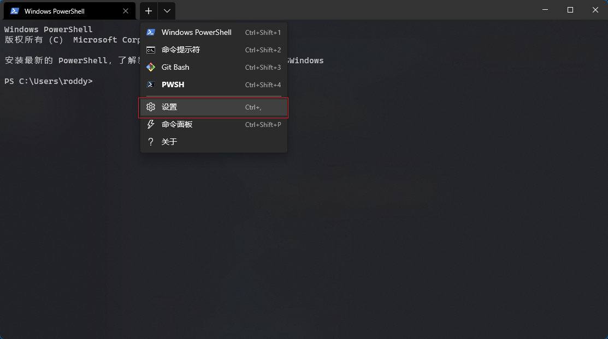

# Windows Terminal + pwsh + oh my posh3 + PSReadLine 打造一个好用的终端

## 前言

在 macOS 中用 zsh 配合 oh-my-zsh 可以打造出一个用的很舒服的终端，其实在 Windows 中也可以。

在 Windows 中可以用 pwsh[^1] 和 oh-my-posh[^2] 打造出一个好用的终端。

Windows 自带的 PowerShell 版本低，所以需要额外安装一个新版本的 pwsh，而不是用系统提供的。

oh-my-posh3 现在已基于 Go 语言重构，是一个跨平台的命令行工具，安装和配置方式和 oh-my-posh2 相比有些变化。

终端软件用的是 Windows Terminal[^3]，这是一个现代化的、可自定义的好看的终端模拟器。

历史命令提示是通过 PowerShell 的 PSReadLine[^4] 模组实现的。

## 前置条件

Scoop[^5] 是 Windows 上的一款基于 PowerShell 的包管理器，接下来的软件都是用 Scoop 安装的，因为它能很方便地管理软件和配置环境变量。Scoop 的安装及使用不在本文的讨论范围内。

由于多数软件来源于 Github，在网络不好的情况下可能会安装失败，请自行寻找代理软件。

以下命令用于在 PowerShell 中配置代理，请自行替换地址和端口号。

```powershell
$Env:http_proxy="http://127.0.0.1:11223";$Env:https_proxy="http://127.0.0.1:11223"
```

Scoop 基于 Git，为了让 Scoop 能正常工作，请参考以下命令用于配置 Git 的代理。

```bash
git config --global http.proxy http://127.0.0.1:11223
git config --global https.proxy https://127.0.0.1:11223
```

## 安装 pwsh

```powershell
scoop install pwsh
```

## 安装 Windows Terminal

```powershell
scoop install windows-terminal
```

## 安装 Cascadia Code 字体

部分命令行字符需要正确配置字体才能正常显示，安装字体需要管理员权限，注意授权提示。

更多命令行字符字体可参考 nerd-fonts[^6] 项目。

```powershell
scoop install sudo
scoop bucket add nerd-fonts
sudo scoop install CascadiaCode-NF-Mono
```

## 在 Windows Terminal 中集成 pwsh

在 Window Terminal 中添加一个新的终端配置。命名为“PWSH”，命令为`pwsh`。设置字体为“CaskaydiaCove NF”。




保存此配置，在“启动”选项卡中把刚刚新增的“PWSH”配置文件设置为默认配置文件。


打开 PWSH，配置完成。


## 安装 oh-my-posh3

在 oh-my-posh 的官方文档中使用的安装命令为`scoop install https://github.com/JanDeDobbeleer/oh-my-posh/releases/latest/download/oh-my-posh.json`，请不要使用该命令。

oh-my-posh3 已存在于 Scoop 的 main 仓库中，请安装此软件包，后面的配置跟包名有关。

```powershell
scoop install oh-my-posh3
```

接下来编写 PWSH 的用户配置，以下命令用于创建一个配置文件并用记事本打开。该配置文件的作用是在每次 pwsh 初始化的时候自动执行其中的命令。

```powershell
if (!(Test-Path -Path $PROFILE )) { New-Item -Type File -Path $PROFILE -Force }
notepad $PROFILE
```

在弹出的记事本里写入 oh-my-posh 的初始化命令，该命令会在每次 pwsh 初始化的时候执行。

```powershell
$env:POSH_GIT_ENABLED = $true
oh-my-posh --init --shell pwsh --config "$(scoop prefix oh-my-posh3)\themes\wopian.omp.json" | Invoke-Expression
```

重新打开终端就能看到一个带主题的 PowerShell，如果有些字符显示不出来就是字体没有配置好。


## 配置历史命令提示

在 PWSH 中执行命令，安装 PSReadLine 模组。在安装时请输入“Y”来确认安装。以下命令用于安装 PSReadLine，请在 PWSH 中执行而不是在 PowerShell 中。

```powershell
Install-Module PSReadLine
```


然后编辑`$PROFILE`文件，在每次终端打开的时候对`PSReadLine`进行初始化。

```powershell
notepad $PROFILE
```

在配置文件中附加上以下内容。

```powershell
Set-PSReadLineOption -PredictionSource History # 设置预测文本来源为历史记录
Set-PSReadlineKeyHandler -Key Tab -Function Complete # 设置 Tab 键补全
Set-PSReadLineKeyHandler -Key "Ctrl+d" -Function MenuComplete # 设置 Ctrl+d 为菜单补全和 Intellisense
Set-PSReadLineKeyHandler -Key "Ctrl+z" -Function Undo # 设置 Ctrl+z 为撤销
Set-PSReadLineKeyHandler -Key UpArrow -Function HistorySearchBackward # 设置向上键为后向搜索历史记录
Set-PSReadLineKeyHandler -Key DownArrow -Function HistorySearchForward # 设置向下键为前向搜索历史纪录
```

保存配置文件，重启终端，就能看到一个带历史命令提示的终端了。


## 更改 oh-my-posh 的主题

oh-my-posh 提供了多套主题可供选择，在 PWSH 中执行以下命令对所有主题进行预览。

```powershell
Get-ChildItem -Path "$(scoop prefix oh-my-posh3)\themes\*" -Include '*.omp.json' | Sort-Object Name | ForEach-Object -Process {
    $esc = [char]27
    Write-Host ""
    Write-Host "$esc[1m$($_.BaseName)$esc[0m"
    Write-Host ""
    oh-my-posh --config $($_.FullName) --pwd $PWD
    Write-Host ""
}
```


其中以`.omp`结尾的是主题文件的名称，如果需要使用某个主题就替换掉`$PROFILE`文件中初始化命令中的配置文件名就可以了。

以下命令用于用记事本打开`$PROFILE`文件。

```powershell
notepad $PROFILE
```

在打开的记事本中你会看到 oh-my-posh 的初始化命令。

```powershell
oh-my-posh --init --shell pwsh --config "$(scoop prefix oh-my-posh3)\themes\wopian.omp.json" | Invoke-Expression
```

将你中意的主题名称替换命令中的`wopian.omp`，保存该配置文件然后重启终端就可以看到新主题的效果了。

## 更改 Windows Terminal 的配色

在 Windows Terminal 中默认有多套配色方案可选，这里推荐一套自定义的配色方案，来自于 Dracula[^7]。

在 Windows Terminal 的设置页面中，点击“打开 JSON 文件”，在该文件的`schemes`数组中添加一个配色方案对象。

```json
"schemes": [
    {
        "name": "Dracula",
        "cursorColor": "#F8F8F2",
        "selectionBackground": "#44475A",
        "background": "#282A36",
        "foreground": "#F8F8F2",
        "black": "#21222C",
        "blue": "#BD93F9",
        "cyan": "#8BE9FD",
        "green": "#50FA7B",
        "purple": "#FF79C6",
        "red": "#FF5555",
        "white": "#F8F8F2",
        "yellow": "#F1FA8C",
        "brightBlack": "#6272A4",
        "brightBlue": "#D6ACFF",
        "brightCyan": "#A4FFFF",
        "brightGreen": "#69FF94",
        "brightPurple": "#FF92DF",
        "brightRed": "#FF6E6E",
        "brightWhite": "#FFFFFF",
        "brightYellow": "#FFFFA5"
    }
]
```

保存该 JSON 文件，重启 Windows Terminal，在 PWSH 的外观配置中选择新添加的 Dracula 配色方案。前文中我用的配色方案就是 Dracula。


## 在 VS Code 里使用

在 VS Code 的配置文件`settings.json`中加入以下配置。

```json
"terminal.integrated.profiles.windows": {
  "Windows PowerShell": {
    "path": "C:\\Windows\\System32\\WindowsPowerShell\\v1.0\\powershell.exe"
  },
  "PWSH": {
    "path": "pwsh"
  }
},
"terminal.integrated.defaultProfile.windows": "PWSH",
"terminal.integrated.fontFamily": "'CaskaydiaCove NF'"
```

[^1]: [PowerShell/PowerShell: PowerShell for every system!](https://github.com/PowerShell/PowerShell)
[^2]: [Home | Oh My Posh](https://ohmyposh.dev/)
[^3]: [microsoft/terminal: The new Windows Terminal and the original Windows console host, all in the same place!](https://github.com/microsoft/terminal)
[^4]: [PowerShell/PSReadLine: A bash inspired readline implementation for PowerShell](https://github.com/PowerShell/PSReadLine)
[^5]: [Scoop](https://scoop.sh/)
[^6]: [Nerd Fonts - Iconic font aggregator, glyphs/icons collection, & fonts patcher](https://www.nerdfonts.com/)
[^7]: [Dark theme for Windows Terminal and 218+ apps — Dracula](https://draculatheme.com/windows-terminal)
