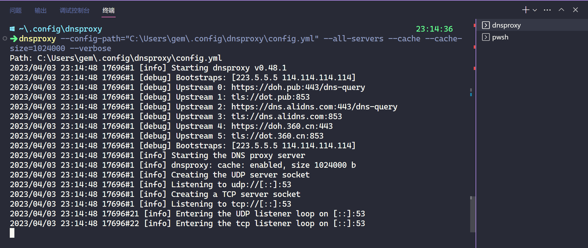
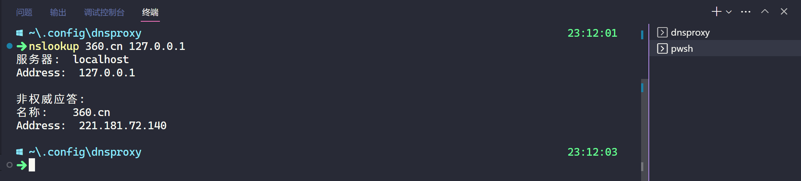
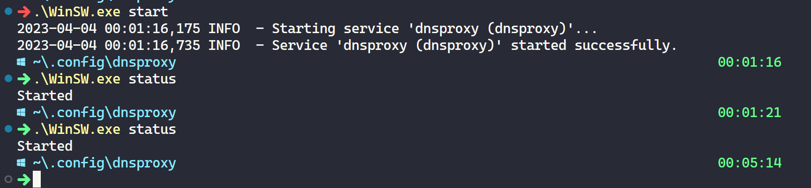
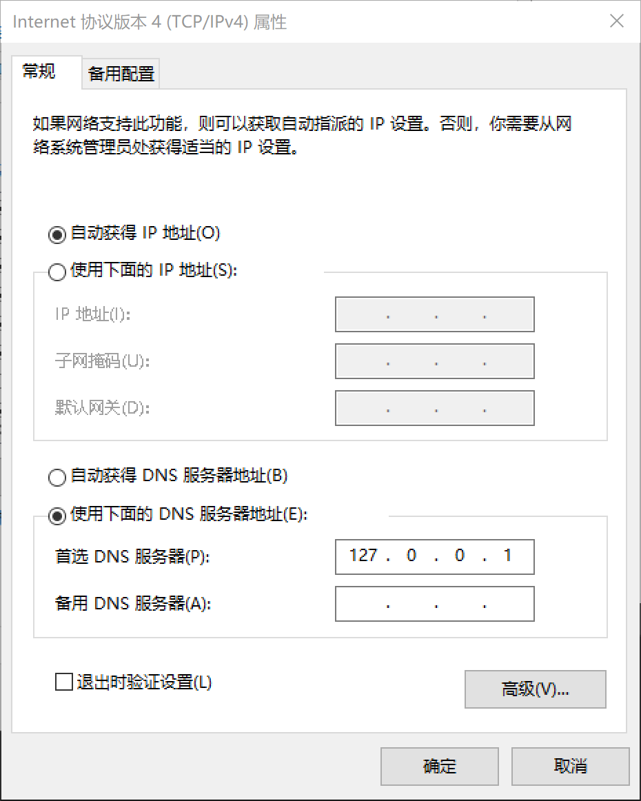

# 在 Windows 中使用安全 DNS

## 前言

在 Windows 10 及以下的系统版本中并没有原生的 DoH 和 DoT 支持。可以使用第三方软件代理上游安全 DNS，在本地启动一个 DNS 服务器供本机使用。

本文使用 [dnsproxy](https://github.com/AdguardTeam/dnsproxy) 作为 DNS 代理服务器，使用 [WinSW](https://github.com/winsw/winsw) 把 dnsproxy 注册为 Windows 服务以确保 dnsproxy 自动运行。

## 安装 dnsproxy

dnsproxy 是 AdguardTeam 组织下的项目，质量应该不错。

使用 Scoop 快速安装 dnsproxy。

```powershell
scoop install dnsproxy
```

## dnsproxy 配置文件

创建配置文件，位于`C:\Users\gem\.config\dnsproxy\config.yml`，你可以根据情况把配置文件安排在合适的位置；其内容如下：

```yaml
bootstrap:
  - https://1.12.12.12/dns-query
  - https://120.53.53.53/dns-query
  - tls://1.12.12.12
  - tls://120.53.53.53
upstream:
  - https://doh.pub/dns-query
  - tls://dot.pub
  - https://dns.alidns.com/dns-query
  - tls://dns.alidns.com
  - https://do.360.cn
  - tls://dot.360.cn
```

## 试运行

运行以下命令启动 dnsproxy，运行成功之后 dnsproxy 会默认监听本机的 53 端口并提供 DNS 解析服务。

```bash
dnsproxy --config-path="C:\Users\gem\.config\dnsproxy\config.yml" --all-servers --cache --cache-size=1024000
```



运行以下命令使用`nslookup`查询 DNS 记录。

```cmd
nslookup 360.cn 127.0.0.1
```



手动运行没问题之后就可以做下面的步骤了：把 dnsproxy 注册为 Windows 服务，开机自动运行。

## 安装 WinSW

WinSW 是一个 Windows 服务包装器。它负责把其他程序包装为服务，并管理程序的日志和生命周期。

dnsproxy 直接注册为服务时不能启动，因为 dnsproxy 没有实现 Windows 服务标准，启动之后不响应，结果就是超时之后被结束掉了。所以需要使用 WinSW 包装一下。

用 Scoop 安装的 WinSW 使用的时候有问题，所以不用 Scoop 安装了。

你需要在[发布页](https://github.com/winsw/winsw/releases)手动下载 WinSW 的可执行文件，比如`WinSW-x86.exe`。将其更名为`WinSW.exe`并将其和 dnsproxy 的配置文件`config.yml`放于同一目录下。

## WinSW 配置文件

在`WinSW.exe`同目录下创建配置文件，命名为`WinSW.xml`。请注意配置文件的名称和 WinSW 可执行文件的名称保持一致，后缀为`xml`。其内容如下：

```xml
<service>
  <id>dnsproxy</id>
  <name>dnsproxy</name>
  <description>dnsproxy service</description>
  <executable>D:\Personal\scoop\apps\dnsproxy\current\dnsproxy.exe</executable>
  <arguments>--config-path="C:\Users\gem\.config\dnsproxy\config.yml" --all-servers --cache --cache-size=1024000</arguments>
  <log mode="reset"/>
  <onfailure action="restart" />
</service>
```

## 注册并启动服务

此时的目录结构如下：

```text
..\dnsproxy\
├── config.yml
├── WinSW.exe
└── WinSW.xml
```

在目录`dnsproxy`中运行以下命令：

```powershell
# 注册服务
.\WinSW.exe install
# 启动服务
.\WinSW.exe start
# 查看服务状态
.\WinSW.exe status
```



运行之后 WinSW 会在同级目录下生成日志文件，你可以检查日志文件来确定 dnsproxy 是否启动成功。

```txt
..\dnsproxy\
├── config.yml
├── WinSW.err.log       # dnsproxy 的错误输出
├── WinSW.exe
├── WinSW.out.log       # dnsproxy 的标准输出
├── WinSW.wrapper.log   # WinSW 本身的日志
└── WinSW.xml
```

## 修改网卡 DNS 服务器地址

找到你正在使用的网卡，把 IPv4 DNS 服务器的地址更改为`127.0.0.1`，并保存设置。



如果你使用 IPv6 地址，就把 IPv6 关了，目前配合 IPv6 使用有问题。

## 参考资料

- [Public DNS+——DNSPod 推出的域名递归解析服务](https://www.dnspod.cn/Products/publicdns)
- [阿里公共 DNS](https://alidns.com/)
- [360 安全 DNS](https://sdns.360.net/)
- [免费公共 IPv4/IPv6/DoT/DoH DNS 服务器大全 Public DNS Server - DNS.iCoA.CN](https://dns.icoa.cn/)
- [Dns 检测 - 在线工具](http://www.all-tool.cn/Tools/dnstest/?&rand=a0b6e8ca42ca48f4822ecf574d137c4d)
- [如何为 Win10 开启 DoH(DNS over HTTPS)\_苏打呀的博客-CSDN 博客](https://blog.csdn.net/weixin_49393427/article/details/112948712)
- [PowerShell 中删除 Windows 服务的正确方法\_sysin.org 的博客-CSDN 博客](https://blog.csdn.net/netgc/article/details/113599321)
