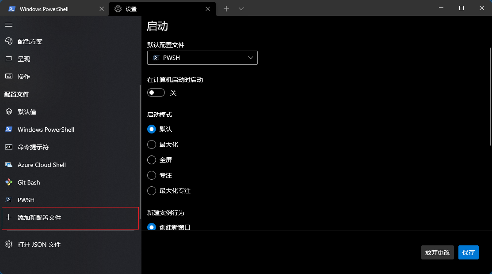
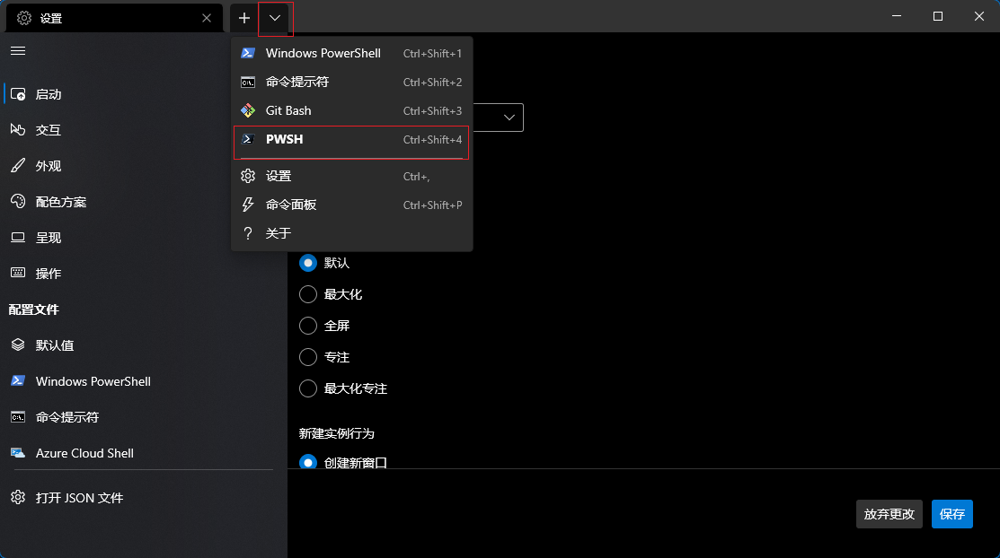
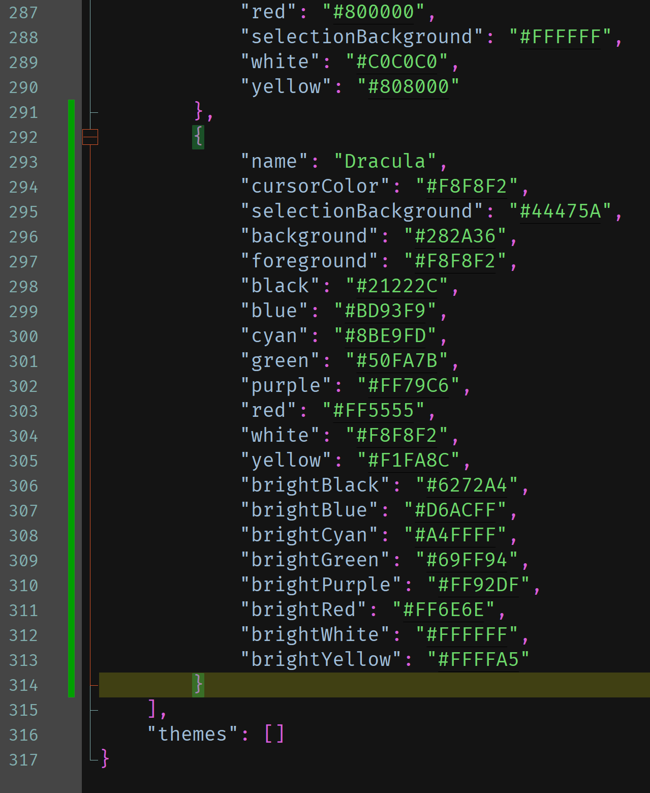

# 使用 Windows Terminal

## 前言

在 macOS 中使用 zsh 搭配 oh-my-zsh 可以打造一个好用的终端；现在在 Windows 中你可以通过使用 Windows Terminal、pwsh 和 oh-my-posh 的组合来实现类似的效果。

## 选角原因

- Windows 系统自带的 Windows PowerShell 不太美观，所以使用 Windows Termianl；
- pwsh 版本更新，有很多新特性可以用，比如历史命令提示功能；
- oh-my-posh 最初是一款针对于 PowerShell 的美化引擎，使用 PowerShell 脚本编写。现在已用 Go 语言重构，支持更多终端，并且可以跨平台。

## 前提

[Scoop](./scoop-the-windows-package-manager.md) 是 Windows 上的一款包管理器，接下来的软件都是用 Scoop 安装的，因为它能很方便地管理软件和配置环境变量。Scoop 的安装及使用不在本文的讨论范围内。

你需要正确配置网络代理，不然你可能无法访问 Github，导致软件安装失败。

以下命令用于在 PowerShell 中配置代理，请酌情替换其中的地址和端口号。

```powershell
$Env:http_proxy="http://127.0.0.1:7890"
$Env:https_proxy="http://127.0.0.1:7890"
```

## 安装 Windows Terminal

Windows 11 系统自带 Windows Termianl 软件。如果你使用 Windows 10 操作系统或者你的操作系统中没有这款软件，你可以手动安装它。

你可以采取下列方式之一安装 Windows Termianl：

1. 你可以在 Microsoft Store 中搜索并安装 Windows Termianl；

2. 使用 Scoop 安装 Windows Termianl。

   ```powershell
   scoop install windows-terminal
   ```

## 安装 pwsh

```powershell
scoop install pwsh
```

## 安装 Cascadia Code 字体

因为某些主题在命令行中显示了一些表情字符，默认的字体中不包含这些字符，所以你需要安装一个包含这些字符的字体。这里我选用了 Cascadia Code 字体，使用 [nerd-fonts](https://github.com/ryanoasis/nerd-fonts) 项目打包的版本，这个项目就是在普通字体中加入表情符号。

安装字体需要管理员权限，注意授权提示并确认。

```powershell
scoop install sudo
scoop bucket add nerd-fonts
sudo scoop install CascadiaCode-NF-Mono
```

## 配置 Windows Terminal

在 Window Terminal 中添加一个新的终端配置。命名为「PWSH」，命令为`pwsh`。设置字体为「CaskaydiaCove NF」。





保存此配置，在「启动」选项卡中把刚刚新增的「PWSH」配置文件设置为默认配置文件。


打开 PWSH。



## 安装 oh-my-posh

```powershell
scoop install oh-my-posh
```

接下来编写 pwsh 的用户配置，以下命令用于创建一个配置文件并用记事本打开。pwsh 在每次启动的时候会执行其中的命令。

```powershell
if (!(Test-Path -Path $PROFILE )) { New-Item -Type File -Path $PROFILE -Force }
notepad $PROFILE
```

在弹出的记事本里写入 oh-my-posh 的初始化命令。

```powershell
$env:POSH_GIT_ENABLED = $true
oh-my-posh init pwsh --config "$(scoop prefix oh-my-posh)\themes\wopian.omp.json" | Invoke-Expression
```

重新打开终端就能看到一个带主题的 PowerShell，如果有些字符显示不出来就是字体没有配置正确。


## 更改 oh-my-posh 的主题

oh-my-posh 提供了多套主题可供选择，在 PWSH 中执行以下命令对所有主题进行预览；或者你可以查看[网页](https://ohmyposh.dev/docs/themes) 预览。

```powershell
Get-PoshThemes "$(scoop prefix oh-my-posh)/themes"
```


以下命令用于用记事本打开`$PROFILE`文件。

```powershell
notepad $PROFILE
```

在打开的记事本中你会看到 oh-my-posh 的初始化命令。

```powershell
oh-my-posh init pwsh --config "$(scoop prefix oh-my-posh)\themes\wopian.omp.json" | Invoke-Expression
```

将你中意的主题名称替换命令中的`wopian`，保存该配置文件然后重启终端就可以看到新主题的效果了。

## 更改 Windows Terminal 的配色

在 Windows Terminal 中默认有多套配色方案可选，这里推荐一套自定义的配色方案，来自于 [Dracula](https://draculatheme.com/windows-terminal)。

在 Windows Terminal 的设置页面中，点击「打开 JSON 文件」，在该文件的`schemes`数组中添加一个配色方案对象。

```json
"schemes": [
    {
        "name": "Dracula",
        "cursorColor": "#F8F8F2",
        "selectionBackground": "#44475A",
        "background": "#282A36",
        "foreground": "#F8F8F2",
        "black": "#21222C",
        "blue": "#BD93F9",
        "cyan": "#8BE9FD",
        "green": "#50FA7B",
        "purple": "#FF79C6",
        "red": "#FF5555",
        "white": "#F8F8F2",
        "yellow": "#F1FA8C",
        "brightBlack": "#6272A4",
        "brightBlue": "#D6ACFF",
        "brightCyan": "#A4FFFF",
        "brightGreen": "#69FF94",
        "brightPurple": "#FF92DF",
        "brightRed": "#FF6E6E",
        "brightWhite": "#FFFFFF",
        "brightYellow": "#FFFFA5"
    }
]
```



保存该 JSON 文件，重启 Windows Terminal，在 PWSH 的外观配置中选择新添加的 Dracula 配色方案。


## 在 VS Code 里使用 pwsh

VS Code 中的默认终端是 Windows PowerShell，你需要修改一下配置文件来使用 pwsh。

在 VS Code 的配置文件`settings.json`中加入以下配置。

```json
"terminal.integrated.profiles.windows": {
  "Windows PowerShell": {
    "path": "C:\\Windows\\System32\\WindowsPowerShell\\v1.0\\powershell.exe"
  },
  "PWSH": {
    "path": "pwsh"
  }
},
"terminal.integrated.defaultProfile.windows": "PWSH",
"terminal.integrated.fontFamily": "'CaskaydiaCove NF'"
```
