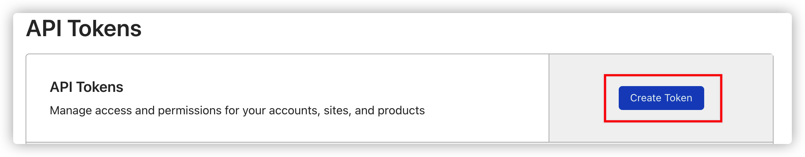
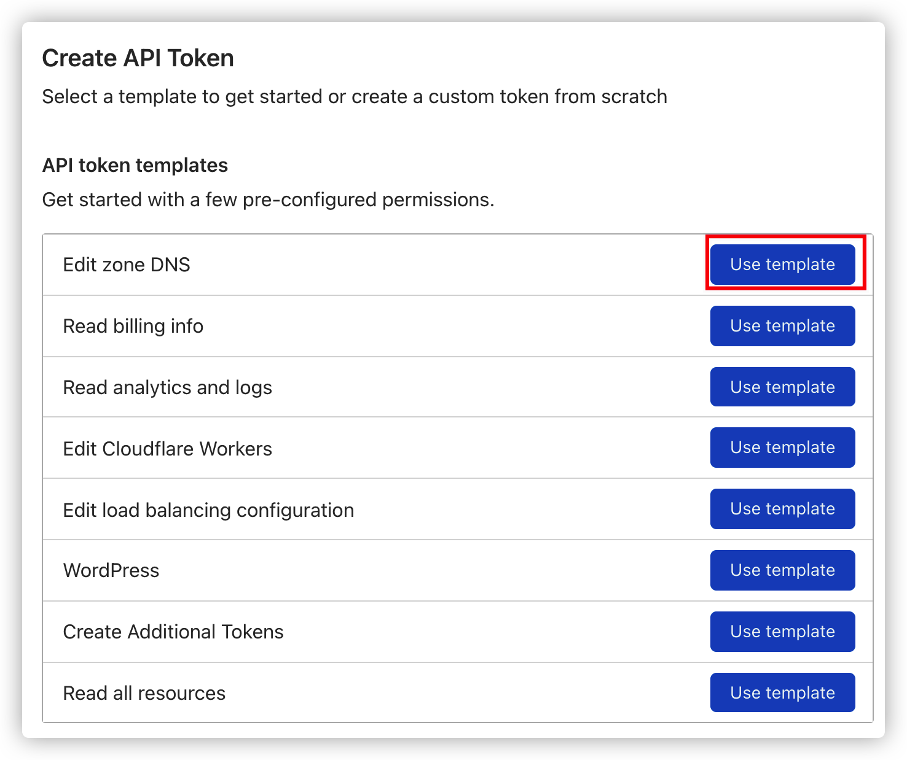
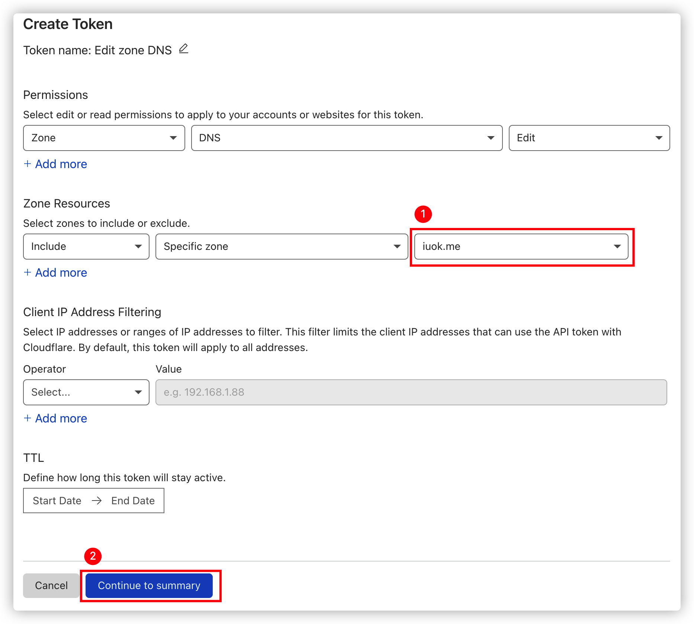
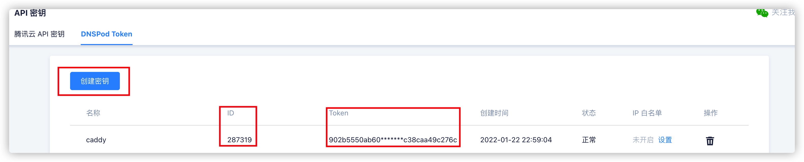

# 使用 Caddy 自动申请泛域名证书

## 泛域名证书

在 Caddy 中书写 Matcher 时可以使用通配符，如`*.example.com`，Caddy 会自动为你申请泛域名证书，但是需要合适的配置。

`*.example.com`包括`foo.example.com`、`bar.example.com`等其它二级域名，但是不包括顶级域名`example.com`；同时不包括其它等级的域名，只包括同等级域名。

通配符`*`只能放在最左边，如`*.example.com`、`*.foo.example.com`和`*.bar.example.com`等；不能写为`foo.*.example.com`。

## 需要做的事情

不像单域名证书可以使用文件验证的方式来完成申请，泛域名证书要求 DNS 验证，这要求你得有权限修改该域名的 DNS 记录，并且你的 DNS 服务商要被 Caddy 支持才可以。

Caddy 对 DNS 的修改功能是由 Caddy 的 DNS 模组实现的，使用模组可以很方便地扩展 Caddy。你可以在 caddy-dns 的仓库列表 [^1] 中查看你的 DNS 服务商是否受支持。

Caddy 的官方 Docker 镜像 [^2] 并不包括任何模组，只有原版的 Caddy，如果需要使用带模组的镜像话需要自己构建。Caddy 提供了 xcaddy[^3] 工具来帮助你编译带模组的 Caddy，并且也提供了使用示例 [^2]，参考这些说明可以很方便地构建自己的 Caddy 镜像。

下文中记录了我用过的两个 DNS 服务商模组，分别是 Cloudflare 和 DNSPod。

## Cloudflare 例子

### 编写 Dockerfile

`Dockerfile`文件内容如下，用于构建 Docker 镜像。

```dockerfile
FROM caddy:builder AS builder
RUN xcaddy build --with github.com/caddy-dns/cloudflare
FROM caddy
COPY --from=builder /usr/bin/caddy /usr/bin/caddy
```

每行命令的解释如下。

1. 使用`caddy:builder`镜像，起别名为`builder`，该镜像中包含了`go`环境和`xcaddy`工具；
2. 使用`xcaddy`来编译`caddy`，并使用`--with`参数指定附加的模组，该参数可以重复使用，意味着你可以附加多个模组，这里使用了`github.com/caddy-dns/cloudflare`[^4]；
3. 使用原版的`caddy`镜像；
4. 复制在`builder`镜像中你自己编译的`caddy`覆盖掉原版`caddy`，并使用此镜像作为最终镜像。

### 获取 Cloudflare Token

在 Cloudflare 的 API Tokens[^5] 页面中创建一个 API Token。



选择使用编辑 DNS 模板来创建 API Token。



在 Zone Resources 中选择目标域名。



确认之后会给你生成一个 Token，你需要保存它。

### 编写 Caddyfile

`Caddyfile`文件内容如下，作为 Caddy 的配置文件。

```caddyfile
{
  email example@gmail.com
}

*.example.com {
  tls {
    dns cloudflare <CF_API_TOKEN>
  }

  @foo host foo.example.com
  handle @foo {
    reverse_proxy localhost:1000
  }

  @bar host bar.example.com
  handle @bar {
    reverse_proxy localhost:2000
  }

  handle {
    abort
  }
}

example.com {
  reverse_proxy localhost:3000
}

foo.bar.example.com {
  reverse_proxy localhost:4000
}
```

- 1-3：全局配置区块，其中`email`指定申请证书时用的邮箱，写你自己的邮箱；
- 5-23：`*.example.com`泛域名配置；
  - 7：指定 DNS 服务商为 Cloudflare 并且配置 Cloudflare 的 API Token，替换`<CF_API_TOKEN>`为你自己的；
  - 10-18：使用具名 Matcher 和`handle`指令来配置每个使用泛域名证书的站点；
  - 20-22：其它未定义的域名直接丢弃连接，这需要写在所有站点后面。
- 25-31：其它不匹配泛域名的域名配置，还和正常使用一样。

### 使用 Docker Compose 运行

`docker-compose.yml`文件内容如下，用于快速运行容器。

```yml
version: "3"
services:
  caddy:
    build: .
    restart: unless-stopped
    network_mode: host
    volumes:
      - data:/data
      - ./Caddyfile:/etc/caddy/Caddyfile
volumes:
  data:
```

当前的目录结构如下。

```txt
caddy
├── Dockerfile
├── Caddyfile
└── docker-compose.yml
```

在 caddy 目录下运行命令。Docker Compose 会根据 Dockerfile 构建镜像并运行。

```bash
docker-compose up --build -d
```

## DNSPod 例子

和使用 Cloudflare 差不多。

### 编写 Dockerfile

```dockerfile
FROM caddy:builder AS builder
RUN go env -w GOPROXY=https://goproxy.cn,direct
RUN xcaddy build --with github.com/caddy-dns/dnspod
FROM caddy
COPY --from=builder /usr/bin/caddy /usr/bin/caddy
```

这个 Dockerfile 文件的内容和使用 Cloudfalre 时 Dockerfile 的内容有些许不同。

- 第 2 行指定了`go get`使用国内代理，因为我的这台服务器在国内，在下载依赖的时候遇到了一些网络问题，如果你在使用`go get`的时候也遇到了网络问题可以试试添加这行命令，在`xcaddy build`命令之前；
- 第 3 行使用`xcaddy`来编译`caddy`，并使用`--with`参数指定附加的模组，该参数可以重复使用，意味着你可以附加多个模组，这里使用了`github.com/caddy-dns/dnspod`[^6]；

### 获取 DNSPod Token

在 DNSPod API 密钥页面 [^7] 中生成一个 Token，在生成 Token 之后你需要保存下来，它只会完整地显示一次，以后都不能完整地查看了。



需要注意的是 DNSPod Token 使用时有些不一样，你申请的密钥有 ID 和 Token，在使用时需要把两者组合起来，中间用英文逗号分隔，如`<id>,<token>`，在使用时你需要将内容替换为自己的 ID 和 Token，更多说明请参考 DNSPod 的 API 使用文档 [^8]。

### 编写 Caddyfile

```txt
{
  email example@gmail.com
}

*.example.com {
  tls {
    dns dnspod <DNSPOD_TOKEN>
  }

  @foo host foo.example.com
  handle @foo {
    reverse_proxy localhost:1000
  }

  @bar host bar.example.com
  handle @bar {
    reverse_proxy localhost:2000
  }

  handle {
    abort
  }
}

example.com {
  reverse_proxy localhost:3000
}

foo.bar.example.com {
  reverse_proxy localhost:4000
}
```

第 7 行不一样，指定了 DNS 服务商为`dnspod`，并且你需要替换掉`<DNSPOD_TOKEN>`为你自己的。需要注意 DNSPod 的 API Token 格式特殊，是由 ID 和 Token 组合在一起，并用英文逗号分隔。

其它内容和使用 Cloudflare 时一样，请参考上文。

### 使用 Docker Compose 运行

和使用 Cloudflare 时一样，请参考上文。

## 后记

更多使用帮助请参考其官方文档 [^9]，镜像构建出错请查看构建日志，Caddy 运行时出错请查看 Caddy 镜像的日志。

[^1]: [caddy-dns](https://github.com/caddy-dns)
[^2]: [Caddy - Official Image | Docker Hub](https://hub.docker.com/_/caddy)
[^3]: [caddyserver/xcaddy: Build Caddy with plugins](https://github.com/caddyserver/xcaddy)
[^4]: [caddy-dns/cloudflare: Caddy module: dns.providers.cloudflare](https://github.com/caddy-dns/cloudflare)
[^5]: [API Tokens | Cloudflare](https://dash.cloudflare.com/profile/api-tokens)
[^6]: [caddy-dns/dnspod](https://github.com/caddy-dns/dnspod)
[^7]: [API 密钥 - DNSPod-免费智能 DNS 解析服务商 - 电信_网通_教育网，智能 DNS](https://console.dnspod.cn/account/token/token)
[^8]: [密钥管理 - DNSPod 服务与支持](https://docs.dnspod.cn/account/5f2d466de8320f1a740d9ff3/)
[^9]: [Common Caddyfile Patterns — Caddy Documentation](https://caddyserver.com/docs/caddyfile/patterns#wildcard-certificates)
