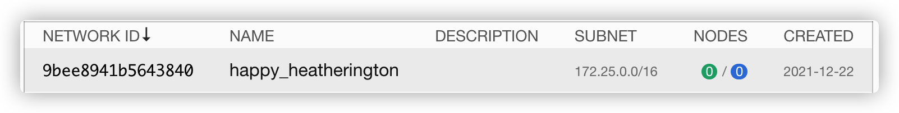
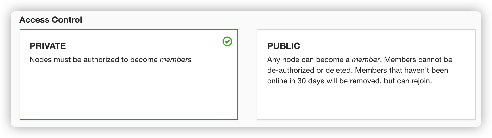
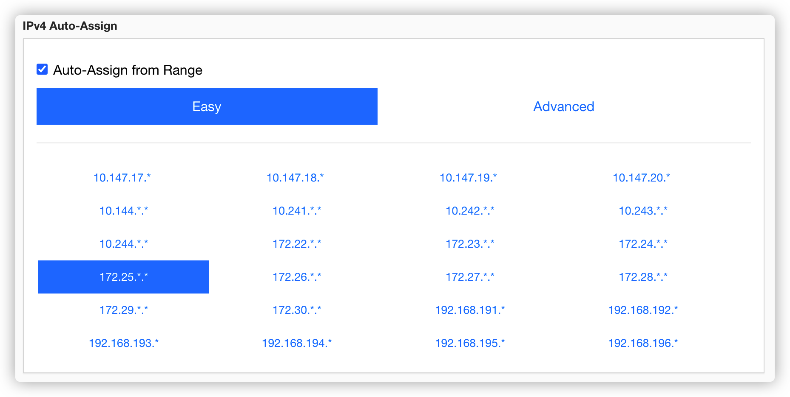
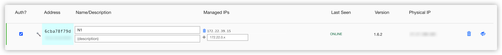
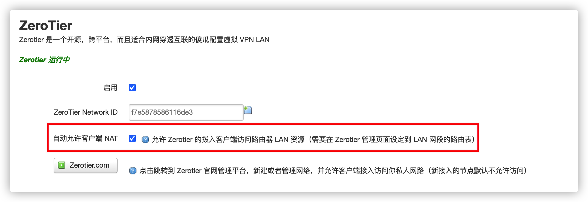
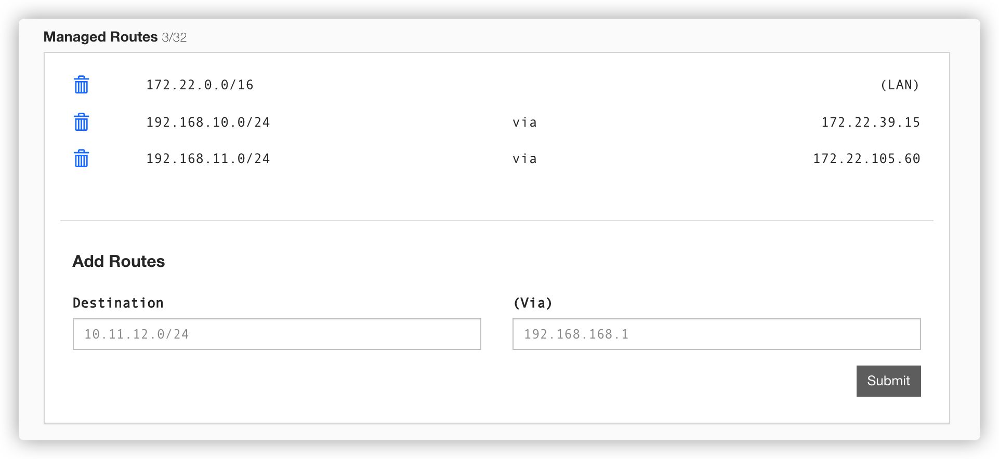
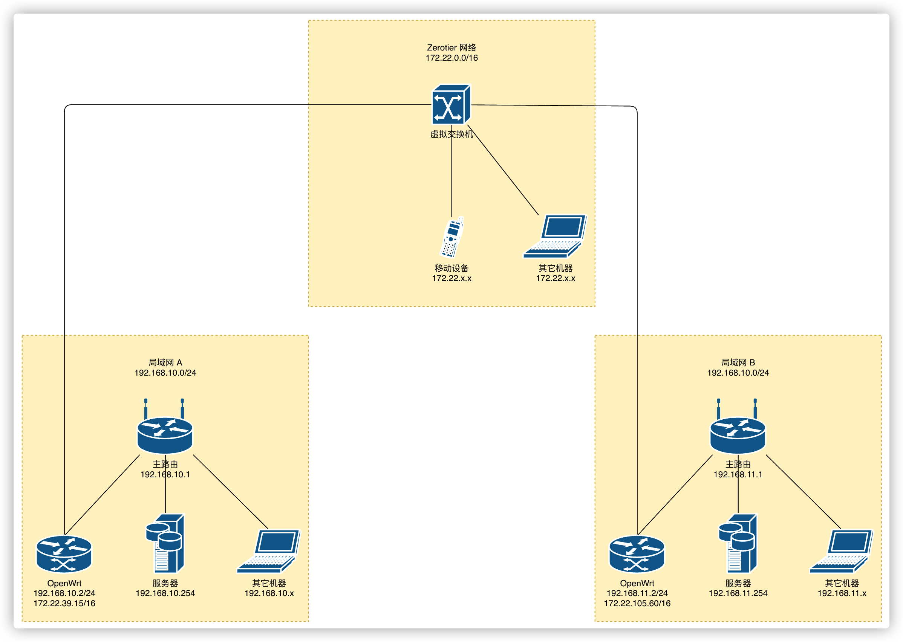

# Zerotier 异地组网

## 前言

Zerotier[^1] 是一个优秀的异地组网解决方案。其优点是组网灵活、不需要更改现有网络结构，支持 P2P 和转发。

Zerotier 使用也不是没有限制，免费版本的最多加入 50 个客户端，不过对于个人来说肯定够用了。

## 控制台

在控制台 [^2] 注册并登陆。

在创建网络后会得到一个 Network ID，此 ID 是唯一的，是客户端加入此网络所需的唯一参数。

在网络管理页面中，Access Control 控制客户端认证方式，如果选择`PRIVATE`则每个客户端的加入都需要在此页面经由你允许。

在 IPv4 Auto-Assign 中，可以对客户端的 IP 段进行配置，不和你原来的网络地址冲突即可。

在 Members 中你可以管理该网络下的所有客户端，勾选客户端对应的`Auth?`选框即可让客户端加入此网络。每个客户端在加入的时候会自动分配一个 IP 地址，你还可以手动分配客户端的 IP 地址。

在多个客户端加入网络后，即使处于不同的网络环境下，客户端都可以通过分配到的 IP 互相访问。

## 客户端

Zerotier 在常用平台上都有客户端，有图形化的有命令行的。

## 自动 NAT

在前面的方案中，如果多个机器互相访问就需要每个机器都安装 Zerotier 客户端并加入同一个网络。

借助 OpenWrt 和 Zerotier 可以暴露整个局域网到 Zerotier 网络中，只需要 OpenWrt 中的 Zerotier 加入网络即可。

勾选「自动允许客户端 NAT」即可。

许多 OpenWrt 的发行版都集成了此软件包。可以参考如下 Telegram 频道：

- [Telegram: Contact @OpenWRTcn](https://t.me/OpenWRTcn)
- [Telegram: Contact @aixiaoshao](https://t.me/aixiaoshao)
- [Telegram: Contact @passwallOpenWRT233](https://t.me/passwallOpenWRT233)

OpenWrt 不需要作为你的主路由，它可以通过 LAN 口接入你现有的局域网，关闭 LAN 口的 DHCP 服务，作为旁路由使用。

你还需要在 Zerotier 控制台中配置静态路由。

在添加静态路由的时候`Destination`填局域网的网络地址，`(Via)`为下一跳地址，即 OpenWrt 路由器的 Zerotier 地址。

上面的静态路由配置将`192.168.10.0/24`局域网和`192.168.11.0/24`局域网暴露在 Zerotier 网络中。`172.22.39.15`和`172.22.105.60`分别是两个 OpenWrt 路由器在 Zerotier 网络中的地址，这两个路由器均配置了自动允许客户端 NAT。

这样做的优点是管理方便，不需要在每个机器上安装客户端并且加入网络。并且即使你在使用移动网络的时候可以直接访问到家里局域网的 IP，并且还是通过局域网 IP 访问，并不需要修改软件配置。

大致的网络拓扑图如下。在外使用移动网络的情况下，你可以使用`192.168.10.0/24`或`192.168.11.0/24`网段的内网地址访问局域网 A 或局域网 B 内的资源。

如果局域网 A 中的某台设备需要访问局域网 B 中的资源，还是需要在该设备上安装 Zerotier 客户端，并且加入统一 Zerotier 网络，然后就可以通过`192.168.11.0/24`的内网  IP 地址来访问局域网 B 中的资源了。

[^1]: [ZeroTier – Global Area Networking](https://www.zerotier.com/)
[^2]: [ZeroTier Central](https://my.zerotier.com/network)
