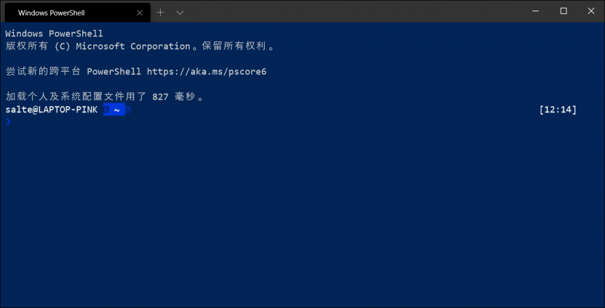
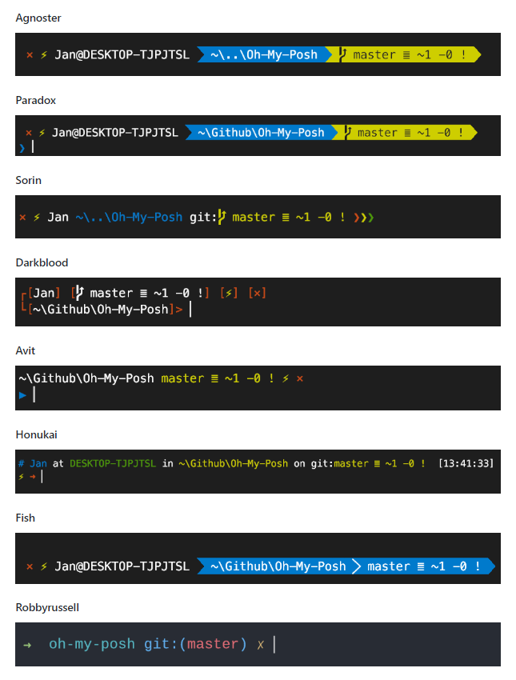
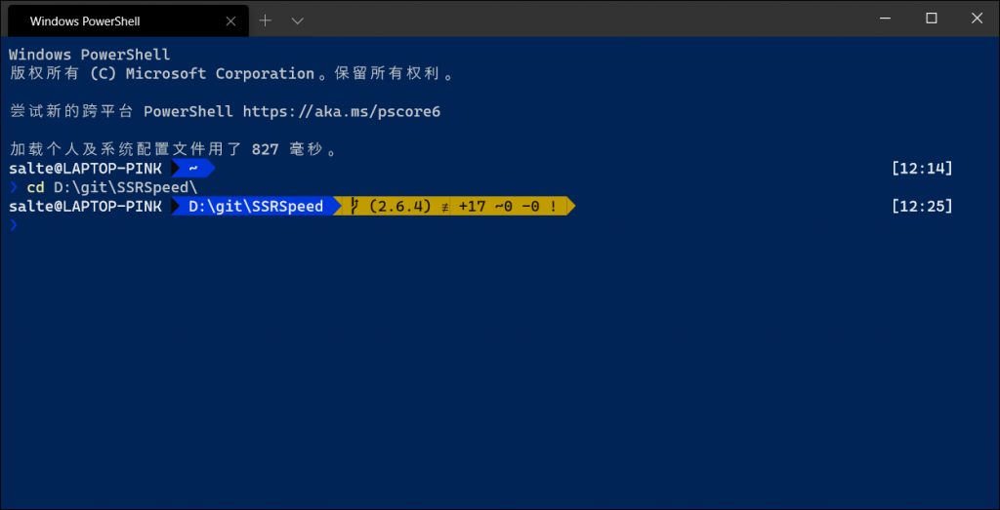
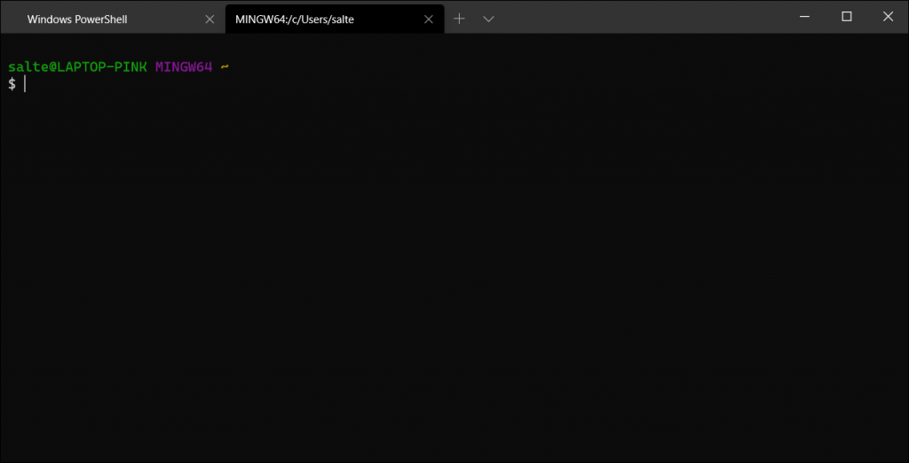

# 用 Windows Terminal 和 oh-my-posh 打造一个好用的终端

> 2021-11-14 备注
>
> oh-my-posh 项目已被重构，现在由 Go 语言实现，仓库地址为 [Github](https://github.com/JanDeDobbeleer/oh-my-posh)。
>
> 文章中所使用的版本现已被重命名为 oh-my-posh2，由 PowerShell 实现，仓库地址为 [Github](https://github.com/JanDeDobbeleer/oh-my-posh2)。

## 前言

Windows 中自带的终端使用体验确实说不上好，尝试了许多组合也感觉都不顺手。这次试试微软亲自出的 Windows Terminal[^1]，再加上 oh-my-posh[^2] 插件。

## 正文

### 安装 Windows Terminal

Windows Terminal 提供多种安装方式，你可以在 Microsoft Store 中安装；可以自行在该项目的 Github 仓库 [^1] 中上下载安装程序；虽然官方文档未提及，但是你也可以用 Scoop[^3] 安装：

```powershell
scoop install windows-terminal
```

### 安装 oh-my-posh

oh-my-posh 是针对 Windows PowerShell 设计的主题引擎，类似于 zsh 和 Oh My Zsh 的关系。它可以让你的命令行更强大。

打开 PowerShell，输入以下命令安装：

```powershell
Install-Module posh-git -Scope CurrentUser
Install-Module oh-my-posh -Scope CurrentUser
```

安装完成之后还更改 PowerShell 的用户配置，让它每次启动的时候自动加载 oh-my-posh 插件；执行以下命令：

```powershell
if (!(Test-Path -Path $PROFILE )) { New-Item -Type File -Path $PROFILE -Force }
notepad $PROFILE
```

不出意外的话接下来会出现记事本，你需要在里面写上以下内容：

```powershell
Import-Module posh-git
Import-Module oh-my-posh
Set-Theme Paradox
```

保存该文件，重新打开 PowerShell 你就能看到一个发生改变了的 PowerShell 。



oh-my-posh 提供了几组预设的主题供你选择，你可以通过 `Set-Theme` 命令来更改当前主题，可选的值有 `Agnoster`/`Paradox`/`Sorin`/`Darkblood`/`Avit`/`Honukai`/`Fish`/`Robbyrussell`。



这个主题设置只在当前会话生效，为了每次启动 PowerShell 的时候都能加载你想要的主题，你还需要修改以下用户配置文件，就像上一个步骤中做的一样，只需要修改 `Set-Theme` 命令的部分即可。

### 用上微软的 Cascadia Code 字体

或许你已经发现了有些字符显示不正常，那是因为默认的字体没有内嵌这些字符的形状，你还需要换一个字体。

微软的另一个开源项目，Cascadia Code[^4] 就是一款适用于终端和代码展示的字体，你可以使用 Scoop 来安装它；安装字体的时候需要使用到管理员权限，你可以使用 `sudo` 命令，或者用管理员权限重新打开 PowerShell，再执行安装。

在安装之前，你可能需要添加一下 `nerd-fonts` 仓库，因为字体软件的元信息都存放于这个仓库中。

```powershell
scoop bucket add nerd-fonts
```

在 Scoop 的仓库中存在着好几个版本的 Cascadia Code，其中：

- `Cascadia-Code`是原版不带 Powerline 字符的；
- `Cascadia-PL`是微软出品的，自带 Powerline 字符的；
- `CascadiaCode-NF`是 Nerd Fonts[^5] 项目出品的，后期补丁了大量 Powerline 字符。

没有特殊需求的话可以选择官方出的轻量级的 `Cascadia-PL`，执行以下命令：

```powershell
sudo scoop install Cascadia-PL
```

安装完成之后还需设置以下，指定 Windows Terminal 使用该字体。

目前 Windows Terminal 没有专门的设置界面，所有的配置项都在 `profiles.json` 配置文件里；在配置文件的对应地方设置 `fontFace` 的值为 `Cascadia Code PL`：

```json
// ...
"defaults":
{
    // Put settings here that you want to apply to all profiles
    "fontFace": "Cascadia Code PL"
},
// ...
```

保存配置文件后就能使配置文件生效；此时所有字符应该能正常显示了。



### 集成 Git Bash

首先将 Git 安装目录下的 `bin` 目录加入 `Path` 环境变量，如果你是用 Scoop 安装的 Git，则可以忽略此步骤，因为 Scoop 已经帮你完成了这个工作；然后修改 Windows Terminal 的配置文件，在 `profiles`->`list` 中新增一条配置：

```json
// ...
"list":
[

    {
        "guid": "{61c54bbd-c2c6-5271-96e7-009a87ff4411}",
        "name": "Git Bash",
        "commandline": "bash.exe",
        "hidden": false,
        "startingDirectory" : "%USERPROFILE%"
    }
]
// ...
```

注意 JSON 的语法格式，在列表中不要少加或者多加逗号。保存配置文件之后就能在 Windows Terminal 中快捷启动 Git Bash 了。



## 后记

新的 Windows Terminal 使用体验还是挺不错的，颜值也 OK，折腾一下也挺好用的。

[^1]: [microsoft/terminal: The new Windows Terminal and the original Windows console host, all in the same place!](https://github.com/microsoft/terminal)
[^2]: [JanDeDobbeleer/oh-my-posh2: A prompt theming engine for Powershell](https://github.com/JanDeDobbeleer/oh-my-posh2)

[^3]: [lukesampson/scoop: A command-line installer for Windows.](https://github.com/lukesampson/scoop)

[^4]: [microsoft/cascadia-code: This is a fun, new monospaced font that includes programming ligatures and is designed to enhance the modern look and feel of the Windows Terminal.](https://github.com/microsoft/cascadia-code)
[^5]: [ryanoasis/nerd-fonts: Iconic font aggregator, collection, & patcher. 3,600+ icons, 50+ patched fonts: Hack, Source Code Pro, more. Glyph collections: Font Awesome, Material Design Icons, Octicons, & more](https://github.com/ryanoasis/nerd-fonts)
