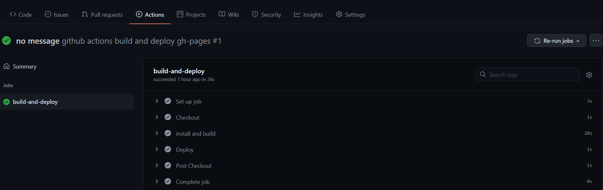
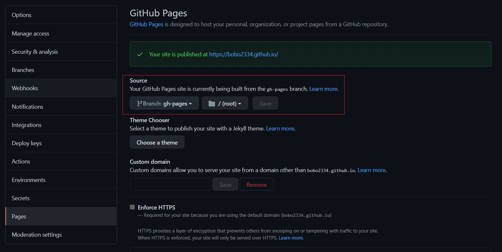

# 利用 Github Actions 部署 Vuepress 项目到 Github Pages

## 前言

Vuepress[^1]是一个基于Vue的静态网站生成器；Github Pages[^2]是Github提供的免费的静态网站托管服务；Github Actions[^3]是Github仓库中集成的CI/CD[^4]服务。

Vuepress是一个Node.js项目，它可以根据配置将Markdown文件转为HTML文件。你可以将输出的静态文件托管在Github Pages中，这样你就得到了一个可以访问的域名来展示这些静态的HTML文件。

传统的做法是在本地安装好Noed.js环境，自己手动构建项目之后将构建产物上传到Github仓库，从而触发Github Pages的构建。现在可以利用Github Actions来代替手工劳动，Github Actions可以自动被触发，它运行在Github提供的虚拟环境中，可以执行一系列任务从而代替重复枯燥的手动构建和部署的步骤。

## 创建 Github 仓库

在创建的Github仓库时要注意仓库名称，假如你的用户名是foo。

如果你创建了一个名为`foo.github.io`的仓库，你将可以通过`https://foo.github.io`来访问此仓库的Github Pages内容；

如果你创建其他名称的仓库如`bar`，你可以通过`https://foo.github.io/bar/`来访问此仓库的Github Pages内容。

你可以根据你期望的访问方式来选择仓库名称。

## 配置 Github Actions

Github Actions的配置文件应该放在项目根目录下的`.github/workflows/`文件夹中，你可以在一个项目中配置多个 Actions。配置文件是YAML格式，文件名形如`*.yml`。

每一个Action中可以包括多个job，每个job可以包括多个step。在step中你可以直接运行命令，或者引用其他人编写好的Action脚本。在本文的配置文件中，我们引用了github-pages-deploy-action[^5]来完成Github Pages部署，而不用关系其实现细节。

完成本文目标的Github Actions配置文件内容如下。

```yaml
name: "github actions build and deploy gh-pages"
on:
  push:
    branches:
      - master
jobs:
  build-and-deploy:
    runs-on: ubuntu-latest
    steps:
      - name: Checkout
        uses: actions/checkout@v2.3.1
        with:
          persist-credentials: false
      - name: install and build
        run: |
          npm install
          npm run build
      - name: Deploy
        uses: JamesIves/github-pages-deploy-action@4.1.4
        with:
          BRANCH: gh-pages
          FOLDER: docs/.vuepress/dist
```

其中的一些关键配置解释如下。

- `on.push.branches`，在推送到`master`分支时触发此Action；
- `jobs.build-and-deploy`，在一个Action中可以有多个job，这是其中的一个，名称是自己取的；每个任务可以有多个step；
- `jobs.build-and-deploy.steps[0]`，用`actions/checkout`检出仓库内容；
- `jobs.build-and-deploy.steps[1]`，执行`npm`命令安装开发环境；
- `jobs.build-and-deploy.steps[2]`，用`JamesIves/github-pages-deploy-action`部署`docs/.vuepress/dist`文件夹中的内容到`gh-pages`分支中。

在编写好配置文件后可以提交并推送文件至master分支，这会自动触发Action的执行，并且你可以在Actions栏目中查看执行日志。



## 配置 Github Pages

我们的构建产物放在gh-pages分支，我们需要告诉Github Pages源文件位置。

在Github仓库的Settings栏目中，从左侧的设置导航栏找到Pages设置。在这里你可以设置gh-pages为数据源。



如果没出错的话，在配置完成之后你就可以通过Github Pages给你提供的域名来访问你的静态网站了。

[^1]: [首页 | VuePress](https://v2.vuepress.vuejs.org/zh/)
[^2]: [GitHub Pages | Websites for you and your projects, hosted directly from your GitHub repository. Just edit, push, and your changes are live.](https://pages.github.com/)
[^3]: [Learn GitHub Actions - GitHub Docs](https://docs.github.com/en/actions/learn-github-actions)
[^4]: [什么是 CI/CD？一文带你理解CI持续集成和CD持续交付/部署 - 红帽](https://www.redhat.com/zh/topics/devops/what-is-ci-cd)
[^5]: [JamesIves/github-pages-deploy-action: Automatically deploy your project to GitHub Pages using GitHub Actions. This action can be configured to push your production-ready code into any branch you'd like.](https://github.com/JamesIves/github-pages-deploy-action)

