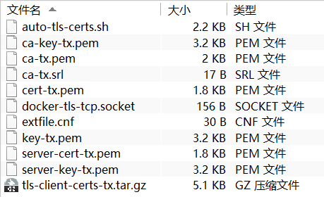
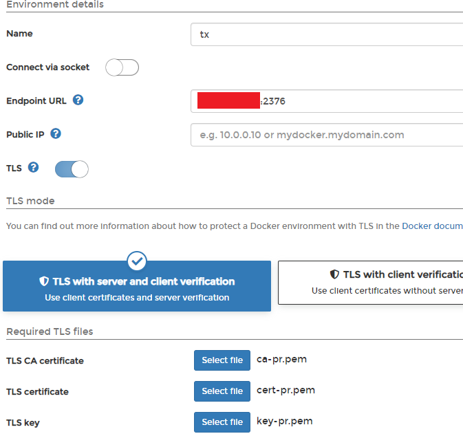

# 开启 Docker Remote API 并启用 TLS

## 前言

Portainer[^1]是一款Docker可视化管理面板，它不仅可以管理本地的Docker实例，还可以通过Docker Remote API访问管理远程Docker资源。Docker Remote API就是通过HTTP协议暴露Docker资源，启用TLS可以实现远程访问鉴权。

Docker的官方文档提供了详细的开启Docker Remote API和开启TLS的教程[^2]。但是在签发证书的过程中涉及到的命令比较多，且繁琐，我就从网络上寻找到了别人写好的签发证书的脚本[^3]，可以很方便地替代纯手工操作。

本文中的操作都在CentOS 7中完成。

## 签发证书

将脚本命名为`auto-tls-certs.sh`。其中需要配置的内容有：

1. `CODE`，作为文件名的后缀，用于区分文件；
2. `IP`，机器的公网IP地址；
3. `PASSWORD`，证书密码。

脚本内容如下：

```bash
#!/bin/bash
#
# -------------------------------------------------------------
# 自动创建 Docker TLS 证书
# -------------------------------------------------------------

# 以下是配置信息
# --[BEGIN]------------------------------

CODE="tx"
IP="1.1.1.1"
PASSWORD="pass"

COUNTRY="CN"
STATE="BEIJING"
CITY="BEIJING"
ORGANIZATION="Org"
ORGANIZATIONAL_UNIT="Dev"
COMMON_NAME="$IP"
EMAIL="."

# --[END]--

# Generate CA key
openssl genrsa -aes256 -passout "pass:$PASSWORD" -out "ca-key-$CODE.pem" 4096
# Generate CA
openssl req -new -x509 -days 365 -key "ca-key-$CODE.pem" -sha256 -out "ca-$CODE.pem" -passin "pass:$PASSWORD" -subj "/C=$COUNTRY/ST=$STATE/L=$CITY/O=$ORGANIZATION/OU=$ORGANIZATIONAL_UNIT/CN=$COMMON_NAME/emailAddress=$EMAIL"
# Generate Server key
openssl genrsa -out "server-key-$CODE.pem" 4096

# Generate Server Certs.
openssl req -subj "/CN=$COMMON_NAME" -sha256 -new -key "server-key-$CODE.pem" -out server.csr

echo "subjectAltName = IP:$IP,IP:127.0.0.1" >> extfile.cnf
echo "extendedKeyUsage = serverAuth" >> extfile.cnf

openssl x509 -req -days 365 -sha256 -in server.csr -passin "pass:$PASSWORD" -CA "ca-$CODE.pem" -CAkey "ca-key-$CODE.pem" -CAcreateserial -out "server-cert-$CODE.pem" -extfile extfile.cnf


# Generate Client Certs.
rm -f extfile.cnf

openssl genrsa -out "key-$CODE.pem" 4096
openssl req -subj '/CN=client' -new -key "key-$CODE.pem" -out client.csr
echo extendedKeyUsage = clientAuth >> extfile.cnf
openssl x509 -req -days 365 -sha256 -in client.csr -passin "pass:$PASSWORD" -CA "ca-$CODE.pem" -CAkey "ca-key-$CODE.pem" -CAcreateserial -out "cert-$CODE.pem" -extfile extfile.cnf

rm -vf client.csr server.csr

chmod -v 0400 "ca-key-$CODE.pem" "key-$CODE.pem" "server-key-$CODE.pem"
chmod -v 0444 "ca-$CODE.pem" "server-cert-$CODE.pem" "cert-$CODE.pem"

# 打包客户端证书
mkdir -p "tls-client-certs-$CODE"
cp -f "ca-$CODE.pem" "cert-$CODE.pem" "key-$CODE.pem" "tls-client-certs-$CODE/"
cd "tls-client-certs-$CODE"
tar zcf "tls-client-certs-$CODE.tar.gz" *
mv "tls-client-certs-$CODE.tar.gz" ../
cd ..
rm -rf "tls-client-certs-$CODE"

# 拷贝服务端证书
mkdir -p /etc/docker/certs.d
cp "ca-$CODE.pem" "server-cert-$CODE.pem" "server-key-$CODE.pem" /etc/docker/certs.d/
```

使用`sh auto-tls-certs.sh`命令来生成证书，并且生成好的证书会被自动打包为`.tar.gz`归档，非常方便。下面的图片展示了执行脚本后生成的文件列表。



## 配置 Docker

只需关注`.pem`文件，把证书找个专门的位置存放。

```bash
mkdir /etc/.docker
cp ~/docker-cert/*.pem /etc/.docker/
```

修改 Docker 启动文件。

```bash
nano /lib/systemd/system/docker.service
```

修改`Service`下的`ExecStart`配置。

```conf
ExecStart=/usr/bin/dockerd -H fd:// --containerd=/run/containerd/containerd.sock -D -H tcp://0.0.0.0:2376 --tlsverify --tlscacert=/etc/.docker/ca-tx.pem --tlscert=/etc/.docker/server-cert-tx.pem --tlskey=/etc/.docker/server-key-tx.pem
```


重启Docker。

```bash
systemctl daemon-reloadservice docker restart
```

## 开放端口

在防火墙、安全组中放行2376端口。

## 测试

把证书的压缩包`tls-client-certs-tx.tar.gz`下载到本机，解压得到证书文件。


用`curl`命令测试，如果有JSON格式的信息输出则配置成功。

```bash
curl https://你的IP/info --cert cert-tx.pem --key key-tx.pem --cacert ca-tx.pem
```


## 用 Portainer 连接

Portainer是一款非常好用的Docker可视化管理工具，通过暴露Docker Remote API可以远程连接并管理Docker资源。

在`Endpoints`页面中点击`Add endpoint`，`Environment type`选择`Docker`。

在对应的输入框中填写IP地址和端口号，开启TLS，选择三个对应的证书文件。



[^1]: [Documentation](https://documentation.portainer.io/)
[^2]: [Protect the Docker daemon socket | Docker Documentation](https://docs.docker.com/engine/security/protect-access/)
[^3]: [Docker 开启TLS访问,更加安全 - 实用教程 - 高亚轩的BLOG](https://www.gaoyaxuan.net/blog/324.html)

