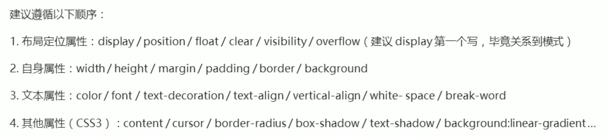
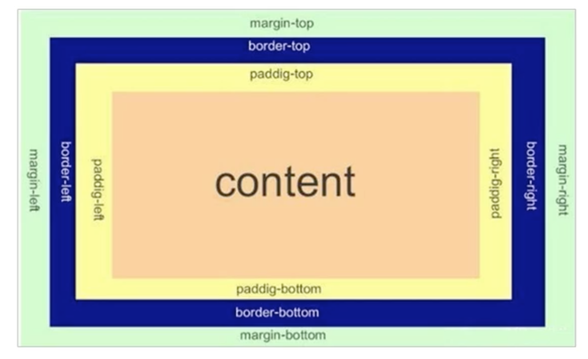
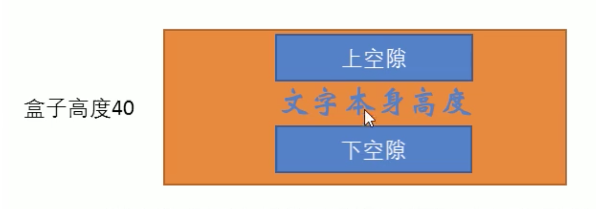
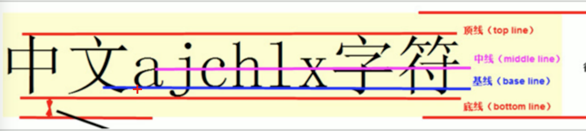

# CSS

## 参考资料

### 课程

- [2019 年黑马程序员前端入门视频教程 HTML5+CSS3-简单有趣好玩-pink 老师_哔哩哔哩 (゜-゜) つロ 干杯~-bilibili](https://www.bilibili.com/video/BV14J4114768)
- [CSS 看这个就够了，全面打通 CSS3 知识点，前端程序员必学（更新到第 15 章）_哔哩哔哩 (゜-゜) つロ 干杯~-bilibili](https://www.bilibili.com/video/BV1tJ411Y7fB)
- [27\_尚硅谷\_CSS 简介\_哔哩哔哩\_bilibili](https://www.bilibili.com/video/BV1XJ411X7Ud?p=27)
- [CSS Diner - Where we feast on CSS Selectors!](https://flukeout.github.io/)

### 手册

- [CSS 参考手册 | 菜鸟教程](https://www.runoob.com/cssref/css-reference.html)
- [CSS 参考 - CSS（层叠样式表） | MDN](https://developer.mozilla.org/zh-CN/docs/Web/CSS/Reference)
- [基础知识 | 后盾人](https://houdunren.gitee.io/note/css/1%20%E5%9F%BA%E7%A1%80%E7%9F%A5%E8%AF%86.html)

### 字体图标资源

- [Icon Font & SVG Icon Sets ❍ IcoMoon](https://icomoon.io/)
- [Iconfont-阿里巴巴矢量图标库](https://www.iconfont.cn/)
- [Font Awesome](https://fontawesome.com/icons?d=gallery&m=free)

## Emmet

在 CSS 编写区域，可以只输入属性的首字母然后接值就能自动生成对应的 CSS 规则了。

例如`tac`就会生成`text-align: center;`。

## 引入方式

```html
<!-- 行内 -->
<p style=""></p>

<!-- 内部 -->
<style></style>

<!-- 外部 -->
<link rel="stylesheet" href="css/style.css">
```

## 注释

```css
/* CSS 注释 */
```

## 选择器

### 基础选择器

- `p {}`标签选择器
- `.class {}`类选择器
- `#id {}`id 选择器
- `* {}`通配符选择器

### 复合选择器

把其它的选择器放一起使用。

- `空格`后代选择器
- `>`子元素选择器，只会选择直接后代
- `,`并集选择器
- `+`兄弟选择器，选择之后紧接着的；`div + a` selects every `a` element that directly follows a `div`
- `~`兄弟选择器，选择之后所有；`A ~ B` selects all `B` that follow a `A`

### 属性选择器

- `E[att]`选择具有`att`属性的`E`元素
- `E[att="val"]`
- `E[att^="val"]`以`val`开头
- `E[att$="val"]`以`val`结尾
- `E[att*="val"]`含有`val`

### 伪类选择器

- `a`
  - `a:link`所有未被访问的链接
  - `a:visited`已被访问的链接
  - `a:hover`鼠标悬停的链接
  - `a:active`鼠标按下的链接
  - 必须按照上面的顺序来书写
- `input:focus`获取焦点的组件

### 结构伪类选择器

根据文档结构的伪类选择器。

- `first-child`选择元素，这些元素是其他元素的第一个子元素
- `last-child`选择元素，这些元素是其他元素的最后一个子元素
- `nth-child(n)`选择元素，这些元素是其他元素的第 n 个子元素
  - 可以写数字
  - 也可以写关键字
    - `even`
    - `odd`
  - 或者是公式，`n`从 0 开始，每次都代入公式，得出的结果会被选中，不存在索引的会被忽略
    - `n`选择所有
    - `2n`偶数
    - `2n+1`奇数
    - `5n`5、10、15
    - `n+5`从第 5 个开始
    - `-n+5`只包含前 5 个
- `:nth-last-child`跟上个差不多，倒着数
- `first-of-type`
- `last-of-type`
- `nth-of-type(n)`
- `:only-child`选择元素，这些元素是其它元素内的唯一子元素
- `:only-of-type`选择元素，这些元素是其它元素内的唯一同类型子元素
- `:last-of-type`
- `:empty`选择没有子元素的元素
- `:not()`选择不满足其中条件的元素，参数内可以写其它 CSS 选择器

`nth-child`和`nth-of-type`的用法类似。不同的是，前者会把所有的子元素都排号，先验证序号是否被选中，再验证是否是希望的标签，如果不是则不选择；后者只会将希望类型的标签排号，然后再从中选。

### 伪元素选择器

利用 CSS 创建标签元素，简化 HTML 结构。

CSS2 是用单冒号，CSS3 是用双冒号，标准写法是用双冒号，但是使用单冒号也会被正确解析。

伪元素选择器的和标签选择器一样，权重为 1。

- `::before`
- `::after`
- `::first-letter`
- `::first-line`
- `::selection`

`before`和`after`必须有`content`属性。生成的是行内元素。

## CSS 属性书写顺序



## CSS 三大特性

### 层叠性

当样式冲突时，遵循的原则是就近原则，后声明的会覆盖掉先声明的。

### 继承性

子标签会继承父标签的某些样式，但不是所有样式。背景和布局相关的样式不会被继承。

具体某个属性会不会被继承可以去查 MDN 文档。

### 优先级

- 如果选择器相同，则执行层叠性；
- 如果选择器不同，则根据选择器权重执行；

| 选择器                   | 权重     |
| ------------------------ | -------- |
| 「继承」、`*`            | 0,0,0,0  |
| 元素选择器、伪元素选择器 | 0,0,0,1  |
| 类选择器、伪类选择器     | 0,0,1,0  |
| ID 选择器                | 0,1,0,0  |
| 行内样式                 | 1,0,0,0  |
| `!important`             | $\infty$ |

继承的权重是 0，不管父元素的权重是多少。

复合选择器会有权重叠加的问题，结果是所有选择器的权重加起来。权重会叠加，但是不会进位，计算的时候对应位置加起来。

## 单位

### 像素和百分比

像素的单位是`px`，由于用户的显示设备 DPI 可能相异，所以显示效果可能不同。

百分比的单位是`%`，是相对于父元素的大小。

### em 和 rem

`em`是一个字体的宽度，是和当前元素的字体大小`font-size`属性相关的，`1em`就是一个字体大小。

`rem`是相对于根元素的字体大小来计算的。

### RGB 和 HSL

RGB 格式形如`rgb(0, 0, 0)`，每个颜色用`0`至`255`数字表示；还可以加上透明度参数，形如`rgba(0, 0, 0, .5)`，最后一个参数是「不透明度」，`1`表示完全不透明，`0`表示完全透明；

十六进制格式形如`#000000`，每个颜色用`00`至`ff`的十六进制数表示；

HSL 分别为色相、饱和度和亮度。形如`hsl(0, 100%, 100%)`或`hsla(0, 100%, 100%, .5)`。

### vh 和 vw

// TODO

## 文档流

默认的文档流（Normal flow）是从左至右，从上至下。

元素在文档流中有一些特性。

- 块元素
  - 自上向下垂直排列
  - 独占一行
  - 默认宽度是父容器的宽度
  - 默认高度是内容的高度
- 行内元素
  - 设置`width`和`height`没用
  - 自左向右水平排列
  - 如果一行中不能容纳所有的行内元素，则会换行接着显示
  - 默认宽度是内容宽度
  - 默认高度是内容高度
  - 垂直 margin 不生效
  - 垂直 padding 不会挤走其它元素，但是会覆盖其它元素的背景

## 盒子模型

外边距、边框、内边距、实际内容。



### 内容区域

盒子的`width`和`height`是设置的内容区域的大小。`padding`和`border`都会撑大盒子的可见大小。`margin`会影响盒子的实际占地面积。

### border 边框

- `border: width style color`一次性设置 3 个属性值，顺序不作要求
- `border-style`设置「上右下左」四个边框的样式，从上边框开始顺时针应用
- `border-radius`设置四个角的圆角，从左上角顺时针。可以写单位数值也可以写百分数

边框会影响盒子的实际大小，实际大小为内容大小加上两侧边框的宽度。

每个边框并不是一个矩形，而是一个梯形。所以可以用 CSS 画三角形。

1. 可以用一个没有大小的盒子，加上粗边框制作三角形；
2. 用两个相邻细边框配合旋转制作出不闭合的三角。

下面的属性针对表格边框：

- `border-collapse`合并相邻边框，不会让两个边框变得更粗

### padding 内边距

- `padding`设置上右下左四个方向的内边距

`padding`也会影响盒子的实际大小，会把盒子撑大。内容区的背景颜色会延伸到内边距区域。

如果盒子本身没有指定`height`或`width`属性，则`padding`属性不会撑开盒子大小。

### margin 外边距

- `margin`设置外边距，允许使用负值

### 盒子水平居中

对于块元素，子元素的`margin-left`+`border-left`+`padding-left`+`width`+`padding-right`+`border-right`+`margin-right`必须等于父元素的内容区宽度`width`，如果等式不成立就会触发过渡约束机制，浏览器会自动纠正等式，修改子元素的`margin-right`属性使等式成立；如果子元素的`margin-left`或`margin-right`或`width`设置了`auto`属性，则调整设置了`auto`属性的字段。如果三个字段都是`auto`，则宽度最大，外边距没有；如果宽度固定，两个边距为`auto`，则两个边距会自动设置为相同的值，且满足等式，就做到了盒子水平居中。一定要指定`width`的值，因为该值默认是`auto`。

1. 盒子指定了宽度
2. 把左右的外边距设置为`auto`

对于行内元素和行内块元素来说，你可以把它视为文字，在父元素上设置`text-align`就可以居中了。

### 兄弟元素垂直外边距的重叠

两个兄弟元素垂直方向的相邻的外边距会重叠，边距会取两者之间的绝对值的较大值。如果两个边距一正一负，则会取两者之和。

这是正常情况。

### 嵌套块元素垂直外边距的塌陷

对于两个嵌套关系的块元素，父元素有上外边距的同时子元素也有上外边距，此时父元素的外边距会变为较大的外边距值，子元素也不会在父元素中下移。

这个情况会影响网页布局，所以需要处理。

浮动盒子不会有外边距塌陷的问题。

解决方案：

1. 为父元素定义上边框
2. 为父元素指定上内边距
3. 为父元素添加`overflow: hidden`

### 清除内外边距

网页元素很多都带有默认的内外边距，而且不同的浏览器默认值也不一致，所以为了开发的统一性，可以统一地清除这些元素的内外边距。

```css
* {
    padding: 0;
    margin: 0;
}
```

上面的做法比较粗暴，实际上生产环境中会引入专门的 CSS 库来覆盖浏览器默认的样式表。

- [CSS Tools: Reset CSS](https://meyerweb.com/eric/tools/css/reset/)
- [Normalize.css: Make browsers render all elements more consistently.](https://necolas.github.io/normalize.css/)

行内元素为了照顾兼容性，尽量只设置左右内外边距，不要设置上下内外边距。转为行内块元素和块级元素不受限制。

### outline 轮廓线

语法和`border`一样，区别是`outline`不会挤走其它元素，而是覆盖在其它元素上方，不会影响布局。

### 盒子阴影

- `box-shadow`
  - `h-shadow`必需，影子水平位置，可以为负值
  - `v-shadow`必需，影子垂直位置，可以为负值
  - `blur`模糊距离
  - `spread`阴影尺寸
  - `color`颜色
  - `inset`写上就是内阴影，不写是外阴影

阴影不占空间，不影响其他盒子的排列。

### CSS3 新盒子模型

- `box-sizing`
  - `content-box`之前默认的，盒子以内容为中心，边框和内边距都会撑大盒子
  - `border-box`新的，盒子实际大小就是指定的大小，如果有边框和内边距的话会缩小内容区域

## 基础属性

### 字体

- `font-family`字体
- `font-size`字号
- `font-weight`粗细，400 是比较正常的
- `font-style`样式
  - `normal`正常
  - `italic`斜体
- `font`复合属性，可以把上面的属性集合到一条写
  - `font-style` `font-weight` `font-size`/`line-height` `font-family`
  - `font-size`和`font-family`不可以省略，其它都可以省略

#### 复合属性的写法

这个`/`是必须要有的，`line-height`可以是像素`px`为单位，也可以不带单位。不带单位的时候默认单位是`em`，表示以当前字体大小为基准的多少倍数。

```css
font: 12px/1.5 'Microsoft YaHei';
```

#### 单行文字的垂直居中

- 把`height`和`line-height`设置为一样的值。



### 文本

- `color`文本颜色
  - 预定义颜色：`pink`
  - 十六进制颜色：`#cc00ff`
  - RGB 颜色：`rgb(255, 0, 255)`
- `text-align`文本对齐
- `text-decoration`
  - `none`
  - `underline`
  - `overline`
  - `line-through`
- `text-indent`首行缩进，可以用 em 作为单位
- `line-height`行间距
- `text-shadow`文字阴影
  - `h-shadow`
  - `v-shadow`
  - `blur`
  - `color`

### 背景

- `background-color`设置背景颜色
  - `transparent`透明，默认值
  - 其它颜色值
  - `rgba(0, 0, 0, 0.3)` 最后一个参数可以指定透明度，0.3 中的 0 可以省略
- `background-image`背景图片，非常便于控制位置
  - `none`无背景
  - `url()`指定一个背景图片
- `background-repeat`设置背景图片平铺
  - `repeat`默认值
  - `no-repeat`
  - `repeat-x`
  - `repeat-y`
- `background-position: x y`设置背景图片的位置
  - 方位名词：`top`、`center`、`bottom`、`left`、`right`
    - 如果两个都是方位名词，则与顺序无关
    - 如果只写一个，另一个省略，则默认为居中
  - 精确单位：百分数，浮点数和单位
    - 顺序有要求
    - 如果只写一个则 y 轴居中对齐
  - 混合用
    - 顺序有要求
- `background-attachment`背景附着
  - `scroll`滚动，默认值
  - `fixed`
- `background`背景的复合写法
  - 背景颜色 背景图片地址 背景平铺 背景图片滚动 背景位置
  - 顺序没啥要求

#### 精灵图

将网页中的小图片整合到一张大图里，在请求图片的时候只用请求一次就可以了。

1. 精灵技术主要针对于背景图片使用；
2. 把背景设置为大图，然后移动背景图片的位置就可以了。

## display 元素显示模式

### 显示模式切换

可以通过`display`属性转换。

- `inline`
- `block`
- `inline-block`
- `flex`
- `grid`

### block 块元素

- 独占一行
- 高度、宽度和内外边距都可以控制
- 默认宽度占满父容器
- 里面可以放其它元素，除了`<h1>`和`<p>`里面不能放块元素

1. `<h1>`
2. `<p>`
3. `<ul>`
4. `<div>`
5. `<ol>`
6. `<li>`

### inline 行内元素

- 一行可以显示多个
- 高度、宽度直接设置是无效的
- 默认宽度是内容宽度
- 只能容纳行内元素
  - `<a>`里面可以放块元素
  - `<a>`里面不能再放`<a>`

### inline-block 行内块元素

同时具有两者的特点。默认宽度就是里面内容的宽度。

行内块元素相当于文字，可以用`text-align`控制；并且每个行内块元素之间都会有默认间距。

### flex 弹性盒子

把父元素设置为弹性容器，子元素在里面排列。

#### 容器属性

- `display: flex`
- `flex-direction`此属性指定的方向成为主轴，垂直于此方向的成为辅轴
  - `row`
  - `row-reverse`
  - `column`
  - `column-reverse`
- `justify-content`调整内容在主轴方向上的排列方式
  
- `align-items`对齐元素在辅轴上的对齐方式
  - `flex-start`往上靠
  - `flex-end`往下靠
  - `center`居中
  - `baseline`，以子元素的第一行文字对齐
  - `stretch`撑满
- `align-content`对齐多行内容在辅轴上的排列方式
- `flex-wrap`设置是否折行

#### 子元素属性

- `order`
- `margin`设置为`auto`则会自动获取弹性盒子中剩余空间
- `align-self`设置纵轴上的对齐方式
- `flex`设置子元素如何分配空间，占多大比重就写多少，不带单位

## float 浮动

多个块级元素纵向排列找标准流，横向排列找浮动。浮动可以把多个块级元素在一行内排列显示。

- `float`用于创建浮动框，将其移动到另一边，直到触及父元素边框或另一个浮动框。
  - `none`
  - `left`
  - `right`

### 浮动特性

1. 浮动元素会脱离标准流
   1. 脱离标准流的控制移动到指定位置
   2. 浮动的盒子不再保留原先位置
   3. 浮动的盒子只会影响后面的标准流，不会影响前面的标准流
2. 浮动元素会一行内显示并且元素顶部对齐
   1. 会在上沿对齐
   2. 一行内装不下的时候会自动换行
3. 浮动元素会具有行内块元素的特性
   1. 任何元素都可以浮动
   2. 如果行内元素添加了浮动就不需要再转为行内块元素就能直接设置宽度和高度
4. 浮动元素不会压住下面标准流的内容，文字或图片会环绕显示

### 清除浮动

希望浮动的子盒子能撑开父盒子的高度。

清除浮动的本质是清除浮动元素造成的影响。

清除浮动后，父盒子会根据子盒子自动设置高度，就不会影响父盒子后面的标准流了。

- `clear`
  - `left`
  - `right`
  - `both`

清除浮动的策略是闭合浮动。

有 4 种办法来清除浮动：

1. 额外标签法，也称隔墙法，是 W3C 推荐的做法。在最后一个浮动盒子后面加一个标签，必须是块级元素，设置`clear: both`样式；

2. 给父级元素添加`overflow`属性，值设置为`hidden`、`auto`或`scroll`都行；

3. 父级添加`after`伪元素，算是额外标签法的升级版；

   ```css
   .clearfix:after {
       content: "";
       display: block;
       height: 0;
       clear: both;
       visibility: hidden;
   }
   .clearfix {
       /* IE6 IE7 的写法 */
       *zoom: 1;
   }
   ```

4. 父级添加双伪元素。

   ```css
   .clearfix:before,
   .clearfix:after {
       content: "";
       display: table;
   }
   .clearfix:after {
       clear: both;
   }
   .clearfix {
       /* IE6 IE7 的写法 */
       *zoom: 1;
   }
   ```

## position 定位

定位可以让盒子自由地在某个盒子内移动位置或者固定在屏幕中某个位置，并且可以压住其它盒子。定位$=$定位模式$+$边偏移。

### 定位模式

- `position`
  - `static`
    - 默认方式
    - 在标准流内
  - `relative`
    - 根据元素原来在标准流中的位置来定位
    - 会保留原来的位置，不会脱标
    - 通常用来限制绝对定位元素的移动
  - `absolute`
    - 绝对定位，相对于它的祖先元素来定位
    - 当没有祖先元素时，以浏览器为准定位
    - 当祖先元素没有定位时，以浏览器定位为准
    - 当有祖先元素时，并且祖先元素有定位，以离自己关系最近的那个祖先元素为准进行定位
    - 不保留原先位置
  - `fixed`
    - 固定在可视区的某个位置，不会根据滚动而改变位置
    - 脱离标准流，不占有原先的位置
  - `sticky`
    - 粘性定位
    - 以可是窗口作为参照元素
    - 占有位置
    - 必须至少添加上下左右其中一个才有效果

### 边偏移

- `top`
- `bottom`
- `left`
- `right`

### 子绝父相

子元素用绝对定位，不占用元素位置。父级用相对定位，约束子元素的位置。

### 叠放次序

- `z-index`

默认是`auto`，数值越大盒子越靠上。如果值相同，则按照书写顺序，后来者在上。

### 绝对定位的盒子居中

巧用负值`margin`。

```css
left: 50%;
margin-left: -100px;
top: 50%
margin-top: -100px;
```

### 定位特性

1. 行内元素添加绝对定位或固定定位，可以直接设置宽度和高度；
2. 块级元素添加了绝对定位或固定定位，默认大小是内容大小；
3. 脱标的盒子不会触发外边距塌陷；
4. 绝对定位会完全压住下面的盒子，包括内容。

## 元素的显示与隐藏

- `display: none`隐藏元素，不再占有原来的位置
- `visibility`隐藏元素，继续占有原来的位置
  - `hidden`
  - `visible`
- `overflow`隐藏溢出的部分
  - `hidden`
  - `visible`
  - `scrool`显示横向和纵向滚动条
  - `auto`在需要的时候添加横向或纵向滚动条

## 字体图标

1. 体积小
2. 不失真
3. 灵活性高
4. 兼容性好

## 用户界面样式

### 鼠标

- `cursor`
  - `default`
  - `pointer`
  - `move`
  - `text`
  - `not-allowed`

### 表单轮廓线

- `outline`
  - `none`
  - `color style width`

### 防止文本域拖拽

- `resize`
  - `none`
  - `both`
  - `horizontal`
  - `vertical`

## 小技巧

### 垂直居中

行内块元素的垂直居中。

- `vertical-align`
  - `baseline`默认。元素放置在父元素的基线上。
  - `sub`
  - `super`
  - `top`把元素的顶端与行中最高元素的顶端对齐
  - `text-top`把元素的顶端与父元素字体的顶端对齐
  - `middle`把此元素放置在父元素的中部。
  - `bottom`
  - `text-bottom`
  - `length`
  - `%`



### 去除图片底部空白缝隙

2 种解决办法：

1. `vertical-align: middle|top|bottom`设置垂直对齐方式，不是`baseline`就行；
2. 把图片转为块级元素。

### 溢出文字用省略号显示

#### 单行文本

3 个步骤：

1. `white-space: nowrap`强制一行内显示文本；
2. `overflow: hidden`超出部分隐藏；
3. `text-overflow: ellipsis`省略号代替超出部分。

#### 多行文本

适合于 WebKit 浏览器，有兼容性问题。

```less
p {
    overflow: hidden;
    text-overflow: ellipsis;
    // 弹性盒子模型显示
    display: -webkit-box;
    // 限制行数
    -webkit-line-clamp: 2;
    // 设置排列方式
    -webkit-box-orient: vertical;
}
```

### 重叠边框合并

默认排列下两个边框合在一起会变粗，可以利用负值`margin`来让边框重叠。

但是这样也带来一些问题，比如在改变边框颜色的时候，前面盒子的边框会被后面盒子边框覆盖。

1. 如果周围不需要用到定位的话在`:hover`中设置`position: relative;`；
2. 如果父元素用到了定位的话可以通过修改`z-index`来让当前需要改变边框颜色的盒子优先级更高。

### 文字围绕浮动元素

浮动元素不会压住其它盒子的内容，文字会围绕浮动元素。

### CSS 初始化

为了照顾不同浏览器默认值的差异，所以要先统一初始化。在同一初始化的基础上能让样式在不同浏览器上保持一致性。

## CSS3 新特性

### 滤镜

- `filter`
  - `blur(5px)`
  - ...

### 计算

- `calc()`

可以用在需要用到计算的地方，比如`width: calc(100% - 30px)`。

### transition 过渡

谁做过渡给谁加。

- `transition`
  - `property`必需
    - `all`
    - 用逗号分隔的属性列表
  - `duration`必需
    - 可以是秒或毫秒
  - `timing-function`
    - `linear`
    - `ease`
    - `ease-in`
    - `ease-out`
    - `ease-in-out`
    - `cubic-bezier(*n*,*n*,*n*,*n*)`
  - `delay`
    - 规定在过渡效果开始之前需要等待的时间，以秒或毫秒计

### transform 转换

通过`transform`属性，配合一些函数完成转换，优点是不影响其他盒子。

转换函数可以一次使用多个，用空格分隔即可，函数书写顺序会影响结果。

- `transform`
  - `translate(x,y)`
  - `translate3d(x,y,z)`
  - `scale(x[,y]?)`2D 缩放。参数没有单位，表示当前元素的宽高倍数。
  - `rotate(angle)`2D 旋转，单位是`deg`，度数。配合`transform-origin`属性可以更改旋转原点。
  - `rotate3d(x,y,z,angle)`
- `transform-origin`
- `transform-style`
- `perspective`

### animation 动画

先使用`@keyframes`定义动画，再在元素中使用`animation-name`属性使用动画。

在定义动画的时候定义关键帧，比如开始和结束时的状态。

- `@keyframes`定义一个动画，动画名字可以被`animation-name`属性引用。`from`可以表示`0%`，`to`可以表示`100%`。
- `animation: name duration timing-function delay iteration-count direction fill-mode play-state;`动画复合属性写法。
- `animation-name`
- `animation-duration`
- `animation-iteration-count`
- `animation-play-state`
