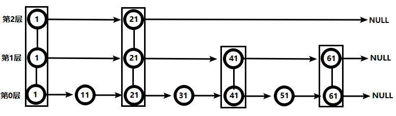

# Redis

## 参考资料

- [【尚硅谷】Redis 6 入门到精通 超详细 教程\_哔哩哔哩\_bilibili](https://www.bilibili.com/video/BV1Rv41177Af)
- [Commands | Redis](https://redis.io/commands/)

## NoSQL 数据库概述

NoSQL（Not Only SQL），意即「不仅仅是 SQL」，泛指非关系型的数据库。
NoSQL 不依赖业务逻辑方式存储，而以简单的 key-value 模式存储。因此大大的增加了数据库的扩展能力。

## 常用命令

### Generic

- `KEYS pattern`，查看匹配条件的 key
- `keys *`，查看当前库所有 key
- `EXISTS key [key ...]`，判断某个 key 是否存在
- `TYPE key`，查看你的 key 是什么类型
- `DEL key [key ...]`，删除指定的 key 数据
- `UNLINK key [key ...]`，根据 value 选择非阻塞删除，仅将 keys 从 keyspace 元数据中删除，真正的删除会在后续异步操作
- `EXPIRE key seconds [NX | XX | GT | LT]`，为给定的 key 设置过期时间，时间单位为秒
- `TTL key`，查看还有多少秒过期，-1 表示永不过期，-2 表示已过期

### Connection management

- `SELECT index`，切换数据库

### Server managment

- `DBSIZE`，查看当前数据库的 key 的数量
- `FLUSHDB [ASYNC | SYNC]`，清空当前库
- `FLUSHALL [ASYNC | SYNC]`，清空所有库

## 数据类型

### String

#### 简介

String 是 Redis 最基本的类型，一个 key 对应一个 value。一个 Redis 中字符串 value 最多可以是 512M。

#### 常用命令

- `SET key value [NX | XX] [GET] [EX seconds | PX milliseconds | EXAT unix-time-seconds | PXAT unix-time-milliseconds | KEEPTTL]`
- `GET key`
- `APPEND key value`
- `STRLEN key`
- `INCR key`
- `DECR key`

#### 数据结构

String 的数据结构为简单动态字符串 (Simple Dynamic String，缩写 SDS)。是可以修改的字符串，内部结构实现上类似于 Java 的 ArrayList，采用预分配冗余空间的方式来减少内存的频繁分配。

String 内部为当前字符串实际分配的空间 capacity 一般要高于实际字符串长度 len。当字符串长度小于 1M 时，扩容都是加倍现有的空间，如果超过 1M，扩容时一次只会多扩 1M 的空间。需要注意的是字符串最大长度为 512M。

### List

#### 简介

Redis 列表是简单的字符串列表，按照插入顺序排序。你可以添加一个元素到列表的头部（左边）或者尾部（右边）。

它的底层实际是个双向链表，对两端的操作性能很高，通过索引下标的操作中间的节点性能会较差。

#### 常用命令

- `LPUSH key element [element ...]`
- `LPUSHX key element [element ...]`
- `LPOP key [count]`
- `RPOP key [count]`
- `LINDEX key index`
- `LLEN key`
- `LINSERT key <BEFORE | AFTER> pivot element`
- `LREM key count element`
- `LSET key index element`

#### 数据结构

List 的数据结构为快速链表 quickList。

首先在列表元素较少的情况下会使用一块连续的内存存储，这个结构是 ziplist，也即是压缩列表。它将所有的元素紧挨着一起存储，分配的是一块连续的内存。当数据量比较多的时候才会改成 quicklist。

因为普通的链表需要的附加指针空间太大，会比较浪费空间。比如这个列表里存的只是 int 类型的数据，结构上还需要两个额外的指针 prev 和 next。

Redis 将链表和 ziplist 结合起来组成了 quicklist。也就是将多个 ziplist 使用双向指针串起来使用。这样既满足了快速的插入删除性能，又不会出现太大的空间冗余。

### Set

#### 简介

Redis 的 Set 是 string 类型的无序集合。它底层其实是一个 value 为 null 的 hash 表，所以添加，删除，查找的复杂度都是 $O(1)$。

#### 常用命令

- `SADD key member [member ...]`
- `SMEMBERS key`
- `SISMEMBER key member`
- `SCARD key`，返回该集合的元素个数
- `SREM key member [member ...]`
- `SPOP key [count]`，随机从该集合中吐出 n 个值
- `SRANDMEMBER key [count]`，随机从该集合中取出 n 个值。不会从集合中删除
- `SMOVE source destination member`，把集合中一个值从一个集合移动到另一个集合
- `SINTER key [key ...]`，返回集合的交集
- `SUNION key [key ...]`，返回集合的并集
- `SDIFF key [key ...]`，返回集合的差集，包含首个 set 中的元素，不包含后续的 set 中的元素

#### 数据结构

Set 数据结构是 dict 字典，字典是用哈希表实现的。

### Hash

#### 简介

Redis hash 是一个键值对集合。

Redis hash 是一个 string 类型的 field 和 value 的映射表，hash 特别适合用于存储对象。

类似 Java 里面的 `Map<String, Object>`

#### 常用命令

- `HSET key field value [field value ...]`
- `HSETNX key field value`
- `HGET key field`
- `HKEYS key`
- `HVALS key`
- `HINCRBY key field increment`
- `HINCRBYFLOAT key field increment`

#### 数据结构

Hash 类型对应的数据结构是两种：ziplist（压缩列表），hashtable（哈希表）。当 field-value 长度较短且个数较少时，使用 ziplist，否则使用 hashtable。

### Sorted Set

#### 简介

Redis 有序集合 zset 与普通集合 set 非常相似，是一个没有重复元素的字符串集合。

不同之处是有序集合的每个成员都关联了一个评分（score），这个评分（score）被用来按照从最低分到最高分的方式排序集合中的成员。集合的成员是唯一的，但是评分可以是重复了。

#### 常用命令

- `ZADD key [NX | XX] [GT | LT] [CH] [INCR] score member [score member ...]`
- `ZRANGE key start stop [BYSCORE | BYLEX] [REV] [LIMIT offset count] [WITHSCORES]`
- `ZINCRBY key increment member`
- `ZREM key member [member ...]`
- `ZCOUNT key min max`
- `ZRANK key member`

#### 数据结构

SortedSet(zset) 是 Redis 提供的一个非常特别的数据结构，一方面它等价于 Java 的数据结构 `Map<String, Double>`，可以给每一个元素 value 赋予一个权重 score，另一方面它又类似于 TreeSet，内部的元素会按照权重 score 进行排序，可以得到每个元素的名次，还可以通过 score 的范围来获取元素的列表。

zset 底层使用了两个数据结构。

1. hash，hash 的作用就是关联元素 value 和权重 score，保障元素 value 的唯一性，可以通过元素 value 找到相应的 score 值；
2. 跳跃表，跳跃表的目的在于给元素 value 排序，根据 score 的范围获取元素列表。

### Bitmap

#### 简介

Bitmap 是可以进行位操作的字符串，可以看做是位组成的数组。

#### 常用命令

- `SETBIT key offset value`，设置 Bitmap 中某个偏移量的值（0 或 1）
- `GETBIT key offset`，获取 Bitmap 中某个偏移量的值
- `BITCOUNT key [start end [BYTE | BIT]]`，统计字符串被设置为 1 的 bit 数
- `BITOP operation destkey key [key ...]`，求多个 Bitmap 的交集、并集、差集或者异或的结果

### HyperLogLog

#### 简介

Redis HyperLogLog 是用来做基数统计的算法，HyperLogLog 的优点是，在输入元素的数量或者体积非常非常大时，计算基数所需的空间总是固定的、并且是很小的。

简单理解就是只存元素的 hash，不存储原始数据的 set。

#### 常用命令

- `PFADD key [element [element ...]]`
- `PFCOUNT key [key ...]`
- `PFMERGE destkey sourcekey [sourcekey ...]`

### Geospatial indices

#### 简介

Redis 3.2 中增加了对 GEO 类型的支持。GEO，Geographic，地理信息的缩写。该类型，就是元素的 2 维坐标，在地图上就是经纬度。Redis 基于该类型，提供了经纬度设置，查询，范围查询，距离查询，经纬度 Hash 等常见操作。

#### 常用命令

- `GEOADD key [NX | XX] [CH] longitude latitude member [longitude latitude member ...]`
- `GEOPOS key member [member ...]`
- `GEODIST key member1 member2 [M | KM | FT | MI]`，获取两个位置之间的直线距离
- `GEORADIUS key longitude latitude radius <M | KM | FT | MI> [WITHCOORD] [WITHDIST] [WITHHASH] [COUNT count [ANY]] [ASC | DESC] [STORE key] [STOREDIST key]`，以给定的经纬度为中心，找出某一半径内的元素

## 配置文件

// TODO

## 发布和订阅

Redis 发布订阅 (pub/sub) 是一种消息通信模式：发送者 (pub) 发送消息，订阅者 (sub) 接收消息。

Redis 客户端可以订阅任意数量的频道。

- `SUBSCRIBE channel [channel ...]`
- `PUBLISH channel message`

## 持久化

### RDB

RDB 在指定的时间间隔内将内存中的数据集快照写入磁盘，也就是行话讲的 Snapshot 快照，它恢复时是将快照文件直接读到内存里。

Redis 会单独创建（fork）一个子进程来进行持久化，会先将数据写入到 一个临时文件中，待持久化过程都结束了，再用这个临时文件替换上次持久化好的文件。整个过程中，主进程是不进行任何 IO 操作的，这就确保了极高的性能 如果需要进行大规模数据的恢复，且对于数据恢复的完整性不是非常敏感，那 RDB 方式要比 AOF 方式更加的高效。RDB 的缺点是最后一次持久化后的数据可能丢失。

### AOF

以日志的形式来记录每个写操作（增量保存），将 Redis 执行过的所有写指令记录下来（读操作不记录），只许追加文件但不可以改写文件，Redis 启动之初会读取该文件重新构建数据，换言之，Redis 重启的话就根据日志文件的内容将写指令从前到后执行一次以完成数据的恢复工作。

## 主从复制

// TODO

## 集群

// TODO

## 常见问题

### 缓存穿透

#### 问题描述

#### 解决方案

### 缓存击穿

#### 问题描述

#### 解决方案

### 缓存雪崩

#### 问题描述

#### 解决方案

## 分布式锁

## Redis 6

### ACL

### IO 多线程

### 工具支持 Cluster

### 其它新特性

## Redis 7

// TODO
