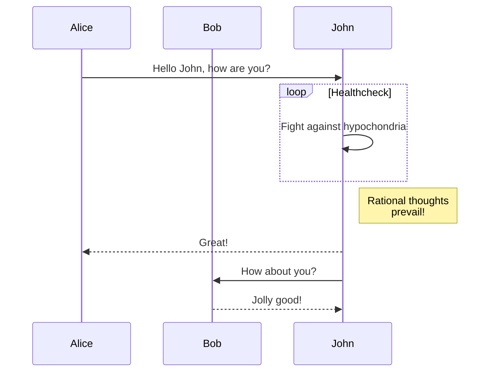
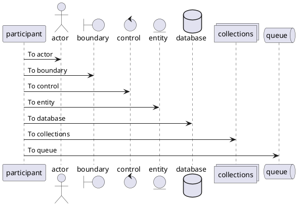

# Markdown 渲染测试

## Autolink

If the `autolink` extension is enabled the URL https://www.github.com is displayed as a link.

## Emoji

Using the `emoji` extension you can replace the `:smile:` with :smile:.

You can choose to use the standard emoji font or the GitHub images.
Multibyte emoji are also supported, so `:it:` equivalent to the code `\u1f1ee\u1f1f9` must be rendered as the Italian flag :it:.

## Inline images

The `inline image` extension embed the local image inside the HTML output. **Is required for view local images in the Quick Look preview.**


## Table
| Option | Description                                                  |
| -----: | :----------------------------------------------------------- |
|   data | path to data files to supply the data that will be passed into templates. |
| engine | engine to be used for processing templates. Handlebars is the default. |
|    ext | extension to be used for dest files.                         |

## Strikethrough
You can choose to recognize the single tilde \~ on ~test~ or only the double tilde \~\~ on ~~another test~~.

## Syntax Highlight

This fenced block uses the php syntax highlight:

```java
public static <K,V> Map<K,V> synchronizedMap(Map<K,V> m) {
    return new SynchronizedMap<>(m);
}
```

## Task list
* [x] step 1
* [ ] step 2
* [ ] step 3

## Footnotes

The `smart quote` option format the quote as "curly" [^1].

[^1]: If the option `footnotes` is enabled this text is rendered as a foot note. Footnotes is not recognized in the github pages.

## Mermaid



## PlantUML




## Tex

$c = \sqrt{a^{2}+b_{xy}^{2}+e^{x}}$

$$
c = \sqrt{a^{2}+b_{xy}^{2} +e^{x}}
$$
