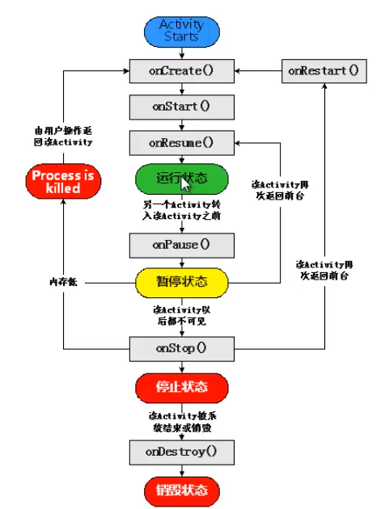

# Android

## Android 应用程序构成

### 清单文件简介

#### 几个重要的标签

1. `<manifest>`配置文件根元素；
2. `<user-permission>`用户权限配置标签；
3. `<user-sdk>`SDK 版本配置；
4. `<application>`应用程序配置的根元素；
5. `<activity>`活动/页面配置；
6. `<service>`服务配置；
7. `<receiver>`广播接收者配置；
8. `<provider>`内容提供者配置。

### 进程与线程

进程的优先级

- 前台进程
- 可见进程
- 服务进程
- 后台进程
- 空进程

## 布局管理器

### RelativeLayout

在父组件中的相对位置：

- layout_alignParentLeft
- layout_alignParentRight
- ...Top
- ...Buttom
- layout_centerHorizontal
- layout_centerVertical
- layout_centerInParent

相对于其他组件：

- layout_above
- layout_below
- layout_toRightOf(toEndOf)
- layout_toLeftOf(toStartOf)

对齐：

- layout_alignLeft
- layout_alignRight
- layout_alignTop
- layout_alignBottom

### LinearLayout

- orientation: 用于指定水平和垂直方向
- gravity: 指定容器内组件的对齐方式，可以同时取多个值`right|bottom`
- layout_gravity: 指定组件相对于父容器的位置
- layout_weight: 所占比重

### FrameLayout

- foreground: 前景图片，一直在其他组件的上方
- foregroundGravtiy: 前景图的位置

### TableLayout

- `<TableRow>`表格行容器
- collapseColumns: 折叠列/隐藏列，从0开始，多个值用逗号分隔
- stretchColumns: 拉伸列
- shrinkColums: 允许列被收缩

### GridLayout

对比表格布局：

- 表格布局只可以跨列，网格布局可以跨行跨列
- 表格布局中一行组件过多会不显示，网格布局会自动起新行显示

`<GridLayout>`

- columnCount: 最大列数
- rowCount: 最大行数
- orientation: 方向

子组件

- layout_column: 指定位于网格的第几列
- layout_columnSpan: 跨列数
- layout_columnWeight: 比重
- layout_gravity: 子组件在网格内部的对齐
- layout_row...

### 嵌套

原则

1. 根布局管理器必须包含`xmlns`属性；
2. 只能由一个根布局管理器；
3. 嵌套太深会影响性能。

## 基本 UI 组件

### TextView

- layout_width
- layout_height
- text
- singleLine: 单行，多余的会被截断，用省略号显示
- gravity: 指定文字对齐方式，可以多选值，用`|`分隔

### EditText

- hint: 输入提示
- inputType
- drawableLeft: 左边显示图标
- drawableStart
- drawable...
- drawPadding: 图标与输入框的间隔
- lines: 行数

### Button

- onClick: 写触发事件的方法名，该方法有一个 View 参数
- textAllCaps: 默认为`true`，会将所有字母大写

### ImageButton

没有`text`属性。

- src: 指定图片
- background: `##0000`可以设置为透明

### RadioButton

- checked: 设置选中状态

`<RadioGroup>`用于包裹单选按钮组。

### CheckBox

- text: 文字

### DatePicker

### TimePicker

### Chronometer

- format: 格式化

### ProgressBar

- visibility: 设置可见状态，所有组件都可以用
  - visible: 可见
  - invisible: 不可见，但是还是占据原来的位置
  - gone: 不可见，不占据位置
- progress: 设置进度

### SeekBar

是进度条的子类，所以可以使用进度条的属性和方法

- thumb: 改变进度条位置指示器的内容，可以换成别的图片

### RatingBar

其实就是拖动条

- numStars: 设置星星数量
- rating: 已选的星星数量
- stepSize: 步进，默认 0.5，可以选择半颗
- isIndicator: 只读

### ImageView

- scaleType: 设置缩放方式
  - [ImageView | Android 开发者 | Android Developers](https://developer.android.com/reference/android/widget/ImageView##attr_android:scaleType)
- adjustViewBounds: 允许调整边界以保持图片长宽比，可以消除组件内的空白区域
- tint: 设置前景色，带透明度的颜色可以当滤镜使用

控制 ImageView 大小的方法：


### ImageSwitcher

### GridView

网格视图，通过适配器来设置内容。

- numColumns: 列数

### Spinner

- entries: 设置可以选择的内容，也可以在代码中通过适配器来设置

### ListView

- entries

通知数据更新

```java
studentAdapter.notifyDataSetChanged();
```

### ScrollView

默认是垂直的，水平的需要使用`<HorizontalScrollView>`

一个滚动视图里只能放置一个组件，如果需要使用多个的话需要用 ViewGroup 包裹起来

### 选项卡

1. 在布局文件中添加 TabHost、TabWeiget、TabContent 组件；

    

2. 编写各标签页的 XML 布局文件；
3. 获取并初始化 TabHost 组件；
4. 为 TabHost 添加标签页。

### AlertDialog

```java
AlertDialog.Builder dialog = new AlertDialog.Builder(MainActivity.this);
dialog.setTitle("");
dialog.setMessage("");
dialog.setCancelable(false);
dialog.setPositiveButton("OK", new DialogInterface.OnClickListener(){
   @Override
    public void onClick(DialogInterface dialog, int width){
        // do something here
    }
});
dialog.show();
```

### ProgressDialog

带进度条的 Dialog。

## Activity

### 介绍

Activity 是`android.content.Context`的间接子类，存在于`android.app`包中；开发者自定义 Activity 时，必须直接或间接继承于`Activity`类。

所有的 Activity 必须在`AndroidManifest.xml`文件中注册。

### 生命周期

运行态、暂停态、停止态。




### 手动创建 Activity

1. 创建一个类，继承于`android.app.Activity`；
2. 创建布局文件；
3. 重写`onCreate()`方法，用`setContentLayout(R.layout, activityLayoutName)`来关联布局文件；
4. 在`AndroidManifest.xml`中注册。

### 启动 Activity

除了主活动之外，其他活动可以通过 Intent 启动。

```java
startActivity(new Intent(MainActivity.this, RegistrationFormActivity.class));
```

还可以调用另一个 Activity 并返回结果。

1. 使用`StartActivityForResult`启动活动；

    

2. 使用`SetResult`设置结果；

    

3. 重写`onActivityResult`方法。

    

### 关闭 Activity

调用`finish()`方法，该方法继承于 Activity

## Bundle

类似于 HashMap，通过键值对的方式保存数据。


## Fragment

迷你的 Activity。


### 创建 Fragment

1. 创建一个类，继承`Fragment`；
2. 重写必要的方法，比如`onCreateView()`；


### 在 Activity 中添加 Fragment

#### 在布局文件中添加

使用`<fragment>`标签，使用`name`属性指定。

#### 代码动态添加

类似于数据库的事务管理，获取 TransactionManager，操作之后还需要手动 commit。


## 事件处理

### 基于监听的事件处理

注册各种 EventListener，满足条件时触发对应的监听器然后进行处理。

用于处理具体事件。

### 基于回调的事件处理

重写各种回调方法，比如重写 Activity 的方法，OnTouchEvent，OnKeyDown，OnKeyUp。

用于处理通用事件。

### 物理按键事件处理

三种状态：

1. OnKeyDown()
2. OnKeyUp()
3. OnKeyLongPress()

每个物理按键都有一个常量与之对应，形如`KeyEvent.KEYCODE_HOME`。

## 菜单

### 选项菜单

用手机的菜单按钮呼出，或者点击左上角三个点。

1. 编写 xml 布局文件，放在`res/menu`文件夹下；
2. 重写`onCreateOptionsMenu()`方法，用`new MenuInflater.inflate()`加载菜单项；
3. 重写`onOptionsItemSelected()`方法，为菜单注册点击事件。

### 上下文菜单

注册在具体的组件上，长按呼出。

1. 为组件注册上下文菜单；
    1. 创建菜单资源文件；
    2. `registerForContextMenu()`
2. 添加上下文菜单；
    1. 重写`onCreateContextMenu()`方法，还是用`MenuInflater`来解析菜单的布局文件。
3. 指定菜单项被选择时应作出的处理。
    1. 重写`onContextItemSelected()`方法。

## 多媒体

### MediaPlayer

用于播放音频，支持的文件格式：

- mp3
- ogg
- 3gp
- wav

#### 使用步骤

1. 创建 MediaPlayer 对象；

    `MediaPlayer.create()` ，创建的同时并且装载音频文件。

2. 装载音频文件。

### 平面图形绘制

#### 涉及到的类

1. Canvas: 画布
2. Paint: 画笔
3. Color
4. Path

#### 绘图的基本步骤

1. 继承自 View 类
2. 重写 onDraw() 方法

    ```java
    super.onDraw(canvas);
    Paint paint = new Paint();
    paint.setColor(0xffff6600);
    paint.setStyle(Paint.Style.FILL);
    canvas.drawRect(10, 10, 280, 150,  paint);
    ```

3. 将自定义 View 添加到 Activity 中

    ```java
    frameLayout.addView(new MyView(this));
    ```

#### 绘制几何图形

## Handler 消息处理

线程不安全，所以子线程中不能直接更改主线程的 UI。所以就有了 Handler 机制。

使用 `sendMessage()` 来发送消息。

重写其中的 `handleMessage()` 方法来处理消息。

```java
private Handler handler = new Handler() {
    @Override
    public void handleMessage(@NonNull Message msg) {
        switch (msg.what) {
            case 0:
                list.add((Bitmap) msg.obj);
                imageGridAdapter.notifyDataSetChanged();
                break;
            case 1:
                textView.setText((String) msg.obj);
                break;
        }
    }
};
```

### Message

#### 创建新的 Message 对象

1. Message.obtain()
2. Handler.obtainMessage()

```java
private void getImages() {
    new Thread() {
        @Override
        public void run() {
            try {
                Connection connection = Jsoup.connect(TARGET_URL);
                Document document = connection.timeout(3000).get();
                Elements elements = document.select("div a>img[class='lazy']");

                Message message = Message.obtain(handler);
                message.what = 1;
                message.obj = document.title();
                message.sendToTarget();

                for (int i = 0; i < elements.size(); i++) {
                    Log.i("getImages()", elements.get(i).toString());
                    String src = elements.get(i).attr("data-original");
                    Log.i("getImages()", src);
                    getBitmap(src);
                }
            } catch (IOException e) {
                e.printStackTrace();
            }
        }
    }.start();
}
```

### Messenger

### Looper

消息队列管理器。

在主线程创建 Handler 时系统会自动创建 Looper；在子线程中创建 Handler 需要手动创建 Looper 对象。

1. Lopper.prepare()
2. new Handler()
3. Looper.loop()

## Service

Service 是 Android 四大核心组件之一，主要用于执行无需与用户交互，且需长期执行的功能。

### 分类

#### 本地 Service

服务和启动服务的 Activity 在同一个进程中；

#### 远程 Service

1. ……不在……。

### Service 生命周期


### 创建本地服务

新服务必须继承自 Service 类，并且在 AndroidManifest.xml 文件中注册。

服务有两种启动方式：

1. 普通方式启动（Started Service）：无法控制服务的执行过程，无法获取服务状态；

    startService() 启动，stopSelf() 停止自身，stopService() 在其他组件中停止某个服务。

2. 绑定方式启动（Bound Service）：可以获取服务对象，可以控制服务的执行，能够获取服务状态。

## Broadcast

### 类型

#### 标准广播（Normal broadcasts）

是一种完全异步执行的广播，在发出之后所有的接收者几乎同时接收到这条广播消息，因此没有先后顺序。

#### 有序广播（Ordered broadcasts）

是一种同步执行的广播，在发出之后同一时刻只会有一个接收者接到消息，在当前接收者处理完逻辑之后才会传递给下一个接收者，所以这种类型的广播是有先后顺序的。并且前面接受广播的接收者可以截断广播，这样后面的接收者就不能接收了。


### 接收广播

#### 静态注册广播接收器

1. 在程序未启动的情况下也能接收广播
2. 新建类继承自 `BroadcastReceiver`，并重写 `onReceive()` 方法
3. 在 manifest 文件中注册广播接收器

#### 动态注册

1. 必须在已启动的清空下才能接受广播
2. 新建类继承……
3. 使用 `registerReceiver(BroadcastReceiver, IntentFilter)` 来注册接收器
    1. 其中 BroadcastReceiver 是接收器类的实例
    2. IntentFilter 用来确定要接受的广播的标识

        ```java
        IntentFilter intentFilter = new IntentFilter();
        intetnFilter.addAction(Intent.ACTION_SCREEN_ON);
        ```

    3. 在程序结束之前用 `unregisterReceiver(BroadcastReceiver)` 取消注册

### 发送广播

#### 发送标准广播

```java
Intent intent = new Intent("xxx"); // 这里给的广播标识
sendBroadcast(intent);
```

#### 发送有序广播

1. `sendOrderedBroadcast(Intent)`
2. 如果在 `onReceive()` 方法中调用了 `abortBroadcasat()` 方法，就表示将这条广播截断。

### 本地广播

只在本应用之内传递的广播。

#### 注册

```java
LocalBroadcastManager localBroadcastManager = LocalBroadcastManager.getInstance();
Intent intent = new Intent("xxx");
localBroadcastManager.sendBroadcast(intent);
```

#### 接收

和之前动态注册接收系统广播一样。

## 数据存储技术

### Shared Preference

安卓提供的，以最简单的方式永久保存数据的方法。

文件格式：`.xml`

存储路径：`data/data/<package name>/shared_prefs/<*.xml>`

#### 写入数据步骤

1. 获取 `SharedPreference` 对象
    1. `getSharedPreference(String name, int mode)`
        1. `name`文件名称，不包括扩展名
        2. `mode`访问权限，`MODE_PRIVATE/MODE_MULTI_PROCESS`
    2. `getPreference(int mode)`
        1. `mode`访问权限，同上
2. 获取 `SharedPreference.Editor` 对象
    1. `sharedPreference.edit()`
3. 添加数据
    1. `editor.putString()`
    2. `editor.putXxx()`
4. 提交数据
    1. `editor.commit()`
    2. 或者用 `apply()`

#### 读取数据步骤

1. 获取 `SharedPreference` 对象
2. `sharedPreference.getXxx()`

### 文件存储

通过 Java 的 IO 流来读取磁盘上的文件。

#### 内部存储

1. `data/data/<package name>/files/*`
2. 私有的，只有创建该存储空间的应用可以访问
3. 当应用被卸载的时候，对应的内部存储空间也会被清空

```java
// 这里省略了异常处理，实际使用的时候注意处理异常

FileInputStream in = openFileInput("filename");
in.read(buffer); // 用字节数组
String string = new String(buffer); // 转换成字符串
in.close();

FileOutputStream out = openFileOutput("filename", MODE_RPIVATE);
out.write(string.getBytes());
out.flush();
out.close();
```

#### 外部存储

1. 公共的，所有应用都可以访问
2. 表现为 SD 卡，虽然现在大多数手机不能插 SD 卡
3. 需要申请权限，要在 Manifest 文件中申请

```java
if (ActivityCompat.checkSelfPermission(this, Manifest.permission.READ_EXTERNAL_STORAGE) != PackageManager.PERMISSION_GRANTED
        || ActivityCompat.checkSelfPermission(this, Manifest.permission.WRITE_EXTERNAL_STORAGE) != PackageManager.PERMISSION_GRANTED) {
    ActivityCompat.requestPermissions(this, new String[]{
            Manifest.permission.READ_EXTERNAL_STORAGE,
            Manifest.permission.WRITE_EXTERNAL_STORAGE
    }, 1);
}
```

```java
// 这里省略了异常处理，实际使用的时候注意处理异常

File file = new File(Environment.getExternalStorageDirectory(), "filename");
FileOutputStream out = new FileOutputStream(file);
// ...

FileInputStream in = new FileInputStream(file);
// ...
```

### 数据库存储

```java
public class DatabaseHelper extends SQLiteOpenHelper {

    private static final String SQL_ON_CREATE = "CREATE TABLE student (" +
            "id INTEGER NOT NULL," +
            "stu_id TEXT(10) NOT NULL," +
            "stu_name TEXT(10) NOT NULL," +
            "stu_class TEXT(10) NOT NULL," +
            "CONSTRAINT android_PK PRIMARY KEY (id)" +
            ");";

    private Context mContext;

    public DatabaseHelper(@Nullable Context context, @Nullable String name, @Nullable SQLiteDatabase.CursorFactory factory, int version) {
        super(context, name, factory, version);
        mContext = context;
    }

    @Override
    public void onCreate(SQLiteDatabase db) {
        db.execSQL(SQL_ON_CREATE);
    }
}
```

### Content Provider

在不同应用之间实现数据共享，同时保证数据安全。

#### Content Provider 使用步骤

1. 继承 ContentProvider 类
2. 在 Manifest 中注册
3. getContentResolver()
4. ContentResolver.insert()/delete()/update()/query()

## 网络编程

### WebView

1. 如果使用网络资源的话记得申请权限
2. 在布局文件中添加 Webview 组件

```java
WebView webview = findViewById();
WebSettings settings = webView.getSettings();
settings.setJavaScriptEnabled(true);
settings.setSupportZoom(false);

// 使用内置浏览器打开链接
webView.setWebViewClient(new WebViewClient());
webView.loadUrl("https://ithome.com");
```

### URLConnection

```java
URL url = new URL(path);
URLConnection urlConnection = url.openConnection();
urlConnection.setConnectTimeout(3000);
urlConnection.connect();
InputStream inputStream = urlConnection.getInputStream();
```

### HttpURLConnecntion

```java
HttpsURLConnection connection = null;
BufferedReader bufferedReader = null;
StringBuilder response = null;

URL url = new URL(TARGET_URL);
connection = (HttpsURLConnection) url.openConnection();
connection.setRequestMethod("GET");
connection.setConnectTimeout(3000);
connection.setReadTimeout(3000);

if (connection.getResponseCode() != 200) {
    Message message = Message.obtain(handler);
    message.what = 0;
    message.obj = connection.getResponseMessage();
    return;
}

InputStream inputStream = connection.getInputStream();
bufferedReader = new BufferedReader(new InputStreamReader(inputStream));
response = new StringBuilder();
    String line;

while ((line = bufferedReader.readLine()) != null) {
    response.append(line);
}
```

## 问题记录

### 在 TableLayout 中的 EditText 不能自动换行了

```xml
<EditText
    android:id="@+id/comment"
    android:layout_width="0dp"
    android:layout_weight="1"
    android:gravity="start|top"
        android:inputType="textMultiLine"
    android:lines="5"
    android:minLines="5" />
```

设置`android:layout_weight="1"`，`android:width="0dp"`和`android:inputType="textMultiLine"`。

### 去除 ImageView 组件内多余的空白区域

```xml
<ImageView
    android:layout_width="0dp"
    android:layout_height="wrap_content"
    android:layout_rowWeight="0"
    android:layout_columnWeight="1"
    android:adjustViewBounds="true"
    android:src="@mipmap/i4" />
```

设置`adjustViewBounds`属性。

上面的布局用代码实现：

```java
// grid 行参数，设置 layout_rowWeight = 0
GridLayout.Spec rowSpec = GridLayout.spec(GridLayout.UNDEFINED, 0f);
// gird 列参数，设置 layout_columnWeight = 1
GridLayout.Spec columnSpec = GridLayout.spec(GridLayout.UNDEFINED, 1f);
// 构建 LayoutParams
GridLayout.LayoutParams params = new GridLayout.LayoutParams(rowSpec, columnSpec);
// 设置 layout_height 和 layout_width
params.height = GridLayout.LayoutParams.WRAP_CONTENT;
params.width = 0;

ImageView imageView = new ImageView(MainActivity.this);
imageView.setImageResource(id);
imageView.setLayoutParams(params);
// 去白边
imageView.setAdjustViewBounds(true);

layout.addView(imageView);
```

### GirdLayout 内组件平均分布

```xml
<ImageView
    android:layout_width="0dp"
    android:layout_columnWeight="1"
    android:src="@mipmap/i4" />
```

水平平均分布就设置`layout_width="0dp"`和`layout_columnWeight="1"`；垂直平均分布就设置`layout_height`和`layout_rowWeight`。

### Activity 和 BoundService 的双向交互

BoundService 的 IBinder 交给 Activity，Activity 通过 ServiceConnection 的 onServiceConnected() 方法获取，这样 Activity 就能通过 Binder 控制 Service 了；

Activity 里声明 Handler，通过 Intent.putExtra(Messenger) 交给 Service，其中 Messenger 封装了 Handler，Service 在其生命周期的 onBind() 方法获取 Messenger，然后通过 messenger.send(message) 方法向 Handler 发送消息，由 Activity 中的 Handler 处理，从而实现 Service 控制 Activity。
