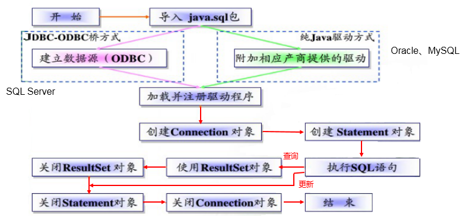

# JDBC

## 参考资料

- [尚硅谷 JDBC 核心技术视频教程（康师傅带你一站式搞定 jdbc）\_哔哩哔哩\_bilibili](https://www.bilibili.com/video/BV1eJ411c7rf)

## JDBC 程序编写步骤



## 获取数据库连接

```sql
// DriverManager.registerDriver(new com.mysql.cj.jdbc.Driver());
Connection connection = DriverManager.getConnection("jdbc:mysql://127.0.0.1:3306/atguigudb", "root", "root");
System.out.println(connection);
```

可以不使用`registerDriver`注册驱动，驱动会自动注册，详情请查看`DriverManager`中的静态代码块，通过`ServiceLoader`加载了 MySQL 驱动，在`com.mysql.cj.jdbc.Driver`中的静态代码块中会自动注册自己。

## 执行查询语句

```java
@Test
public void testQuery() throws IOException, SQLException {
    InputStream inputStream = GetConnectionTest.class.getClassLoader().getResourceAsStream("jdbc.properties");
    Properties properties = new Properties();
    properties.load(inputStream);
    Connection connection = DriverManager.getConnection((String) properties.get("url"), properties);
    PreparedStatement statement = connection.prepareStatement("select * from employees where employee_id = ?");
    statement.setObject(1, 100);
    ResultSet resultSet = statement.executeQuery();
    if (resultSet.next()) {
        for (int i = 0; i < resultSet.getMetaData().getColumnCount(); i++) {
            System.out.println(resultSet.getObject(i + 1));
        }
    }
    resultSet.close();
    statement.close();
    connection.close();
}
```

## 批量执行

```java
@Test
public void testInsert2() throws Exception{
    Connection conn = JDBCUtils.getConnection();
    //1.设置为不自动提交数据
    conn.setAutoCommit(false);
    String sql = "insert into goods(name)values(?)";
    PreparedStatement ps = conn.prepareStatement(sql);
    for(int i = 1;i <= 1000000;i++){
        ps.setString(1, "name_" + i);
        //1.“攒”sql
        ps.addBatch();
        if(i % 500 == 0){
            //2.执行
            ps.executeBatch();
            //3.清空
            ps.clearBatch();
        }
    }
    //2.提交数据
    conn.commit();
    JDBCUtils.closeResource(conn, ps);
}
```

## 事务

- 调用 Connection 对象的`setAutoCommit(false)`以取消自动提交事务
- 在所有的 SQL 语句都成功执行后，调用`commit()`方法提交事务
- 在出现异常时，调用`rollback()`方法回滚事务

若此时 Connection 没有被关闭，还可能被重复使用，则需要恢复其自动提交状态`setAutoCommit(true)`。尤其是在使用数据库连接池技术时，执行`close()`方法前，建议恢复自动提交状态。

## 数据库连接池

1. 资源重用。由于数据库连接得以重用，避免了频繁创建，释放连接引起的大量性能开销。在减少系统消耗的基础上，另一方面也增加了系统运行环境的平稳性；
2. 更快的系统反应速度。数据库连接池在初始化过程中，往往已经创建了若干数据库连接置于连接池中备用。此时连接的初始化工作均已完成。对于业务请求处理而言，直接利用现有可用连接，避免了数据库连接初始化和释放过程的时间开销，从而减少了系统的响应时间；
3. 新的资源分配手段。对于多应用共享同一数据库的系统而言，可在应用层通过数据库连接池的配置，实现某一应用最大可用数据库连接数的限制，避免某一应用独占所有的数据库资源；
4. 统一的连接管理，避免数据库连接泄漏。在较为完善的数据库连接池实现中，可根据预先的占用超时设定，强制回收被占用连接，从而避免了常规数据库连接操作中可能出现的资源泄露。
