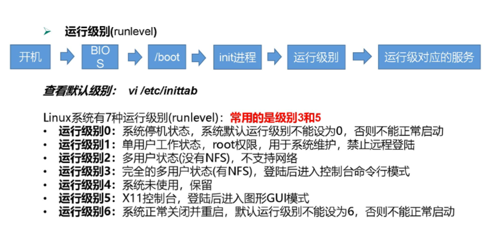

# Linux

## 参考资料

- [3 天搞定 Linux，1 天搞定 Shell，清华学神带你通关（2022 版）\_哔哩哔哩\_bilibili](https://www.bilibili.com/video/BV1WY4y1H7d3)
- [《Linux 就该这么学》 - 必读的 Linux 系统与红帽 RHCE 认证免费自学书籍](https://www.linuxprobe.com/)

## 手册

- [Linux 命令搜索引擎 命令，Linux Linux 命令搜索引擎 命令详解：最专业的 Linux 命令大全，内容包含 Linux 命令手册、详解、学习，值得收藏的 Linux 命令速查手册。 - Linux 命令搜索引擎](https://wangchujiang.com/linux-command/)
- [Linux man pages online](https://www.man7.org/linux/man-pages/index.html)
- [Linux man pages](https://linux.die.net/man/)
- [Man Pages Archive - manned.org](https://manned.org/)
- [tldr | simplified, community driven man pages](https://tldr.ostera.io/)

## Linux 文件与目录结构

// TODO

## VIM 编辑器

### 一般模式

- `yy`，复制 1 行
- `3yy`，`y3y`，复制 3 行
- `yw`，复制 1 个单词
- `y$`，复制到行尾
- `y^`，复制到行首

- `p`，粘贴
- `3p`，粘贴 3 次

- `dd`，删除 1 行
- `3dd`，删除 3 行
- `dw`，删除 1 个单词
- `d$`，删除至行尾
- `d^`，删除至行首

- `x`，剪切当前光标上的字符
- `X`，剪切当前光标前 1 个字符

- `u`，撤销上一步操作

- `e`，光标移动到当前单词末尾
- `w`，光标移动到下一个单词
- `^`，光标移动到行首
- `$`，光标移动到行尾
- `1G`，移动到页首
- `G`，移动到页尾

### 编辑模式

在一般模式下通过以下按键进入编辑模式。

- `i`，在当前光标前插入
- `a`，在当前光标后插入
- `o`，在当前光标的下一行插入
- `I`，在当前行最前插入
- `A`，在当前行最后插入
- `O`，在当前行的上一行插入

### 命令模式

在一般模式下，通过输入`:`或者`/`进入命令模式。

- `:w`，保存
- `:q`，退出
- `:!`，强制执行
- `/word`，查找「word」
  - `n`，向后查找
  - `N`，向前查找
- `:noh`，取消高亮显示
- `:set nu`，显示行号
- `:set nonu`，取消显示行号
- `%s/old/new/g`，全局替换

## 网络配置

### 网络地址

在 CentOS 7 中，网卡配置文件位于`/etc/sysconfig/network-scripts/ifcfg-ens33`，其中 ens33 是网卡名称。编辑该文件即可完成网络配置。

修改完成后使用命令`systemctl restart network`重启网络。

下面是动态获取 IP 配置示例。

```ini
ONBOOT=yes
BOOTPROTO=dhcp
```

下面是静态获取 IP 配置示例。

```ini
ONBOOT=yes
BOOTPROTO=static
IPADDR=192.168.233.234
NETMASK=255.255.255.0
GATEWAY=192.168.233.1
```

### 主机名

- `hostname`，查看主机名
- `hostnamectl status`，查看主机名设置的状态
- `hostnamectl set-hostname newname`，设置新主机名

`/etc/hostname`文件中存放主机名配置，修改后重启生效。

### hosts 文件

位于`/etc/hosts`，其中保存了主机名和 IP 地址的映射关系，系统在进行 DNS 解析之前会先从这里查询。

### 远程连接

使用 SSH。

## 系统管理

### 进程和服务

- 进程，正在运行的程序
- 服务，在后台一直存在，常驻内存的程序，由守护程序启动的进程

### 系统运行级别

CentOS 6 的运行级别有 7 个。



CentOS 7 中简化至 2 个。

- `multi-user.target`，等于原来的 3，多用户无图形界面
- `graphical.target`，等于原来的 5，多用户有图形界面

通过下面的命令来管理运行级别。

- `systemctl get-default`，查看当前运行级别
- `systemctl set-default multi-user.target`，修改运行级别

### 服务管理

CentOS 6 的服务定义在`/etc/init.d/`目录下。

- `service <服务名> start|stop|restart|status`，管理服务
- `chkconfig --level <级别> <服务名> on|off`，控制服务开机启动

CentOS 7 的服务定义在`/usr/lib/systemd/system`目录下。

- `systemctl start|stop|restart|status <服务名>`，管理服务
- `systemctl enable|disable`，控制服务开机启动
- `systemctl list-unit-files`，查看服务开机启动状态

### 关机重启

- `sync`，将数据由内存同步到硬盘中
- `halt`，停机，关闭系统，但不断电
- `poweroff`，关机，断电
- `reboot`，重启
- `shutdown`
  - `shutdown -r now`，重启
  - `shutdown -h now`，关机
  - `shutdown -r +5`，5 分钟后重启
  - `shutdown -c`，取消定时

## 常用基本命令

### man

查看命令帮助文档。

并不是所有命令的帮助文档都有，只有那些安装了帮助文档的命令可以看到。

man 命令会从`$MANPATH`环境变量设置的路径中搜索文档。

### help

Shell 内置命令。查看 Shell 内置命令的帮助文档。

### type

Shell 内置命令。查看某个命令的实际位置。

### which

查看某个命令的实际位置。

### pwd

显示当前工作目录的绝对路径。

### ls

列出目录的内容。

- `ls -1`，每行显示一条
- `ls -a`，显示隐藏文件
- `ls -l`，长格式
- `ls -F`，在文件夹名称后面加`/`

### cd

Shell 内置命令。改变当前的工作路径。

- `cd {{path/to/directory}}`，切换到某个目录
- `cd ..`，切换到父目录
- `cd`，切换到用户目录
- `cd ~{{username}}`，切换到某个用户的用户目录
- `cd -`，切换到上一个目录

### history

查看命令历史记录。

使用`!<命令编号>`来重复执行命令。

## 常用命令

### 文件夹管理

- `mkdir`
- `rmdir`
- `tree`

### 文件管理

- `touch`，创建文件
- `cp`，复制文件
- `mv`
- `rm`

### 文件权限

- `chmod`
- `chown`
- `chgrp`

### 链接

- `ln -s <source-location> <symlink-location>`，创建软链接
- `ln -sf <source-location> <symlink-location>`，创建软链接，如果目标存在则覆盖

### 文件内容

- `cat`
- `more`
- `less`
- `head`
- `tail`

### 查找

- `find`，查找文件名或其他属性
- `grep`，查找文件内容

### 压缩解压

- `gzip`，`gunzip`
- `zip`，`unzip`
- `tar`

### 输出和重定向

// TODO

### 日期时间

- `date`
- `cal`

### 用户管理

- `useradd`
- `userdel`
- `passwd`
- `id`
- `cat /etc/passwd`
- `su`
- `sudo`
- `who`
- `usermod`

### 组管理

- `groupadd`
- `groupdel`
- `groupmod`
- `cat /etc/group`

### 磁盘管理

- `du`
- `df`
- `lsblk`
- `mount`，`umount`
- `fdisk`
- `mkfs`

### 内存

- `free`

### 进程管理

- `ps`
- `kill`
- `top`
- `netstat`

### 定时任务

- `crontab`

### 软件包管理

- `rpm`
- `yum`
