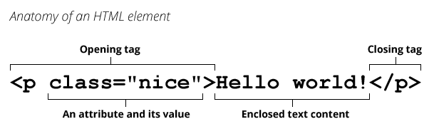

# HTML

## 参考资料

- [开始学习 HTML - 学习 Web 开发 | MDN](https://developer.mozilla.org/zh-CN/docs/Learn/HTML/Introduction_to_HTML/Getting_started)
- [尚硅谷 Web 前端零基础入门 HTML5+CSS3 基础教程丨初学者从入门到精通\_哔哩哔哩\_bilibili](https://www.bilibili.com/video/BV1XJ411X7Ud/)

## 简介

超文本标记语言（HyperText Markup Language，HTML）是一种用于创建网页的标准标记语言。

HTML 是一种基础技术，常与 CSS、JavaScript 一起被众多网站用于设计网页、网页应用程序以及移动应用程序的用户界面。

- HTML 用于描述页面的结构；
- CSS 用于控制页面中元素的样式；
- JavaScript 用于响应用户操作。

## 注释

```html
<!-- 注释文字 -->
```

## 标签



一个标签包含开始标签、结束标签和内容部分，其中标签属性包含在开始标签之中。

有种特殊的标签不包含内容部分，并且开始标签和结束标签合二为一，称为「自结束标签」或「空标签」，其格式如下。这种标签也不能含有子标签。

```html
<tag />
<meta name="" content="" />
```

## 基本结构

```html
<!DOCTYPE html>
<html>
  <head>
    <meta charset="utf-8">
    <title>My test page</title>
  </head>
  <body>
    
  </body>
</html>
```

- `<!DOCTYPE html>` — 文档类型。混沌初分，HTML 尚在襁褓（大约是 1991/92 年）之时，DOCTYPE 用来链接一些 HTML 编写守则，比如自动查错之类。DOCTYPE 在当今作用有限，仅用于保证文档正常读取。现在知道这些就足够了。
- `<html></html>` — 该元素包含整个页面的内容，也称作根元素。
- `<head></head>` — 该元素的内容对用户不可见，其中包含例如面向搜索引擎的搜索关键字（keywords）、页面描述、CSS 样式表和字符编码声明等。
- `<meta charset="utf-8">` — 该元素指定文档使用 UTF-8 字符编码，UTF-8 包括绝大多数人类已知语言的字符。基本上 UTF-8 可以处理任何文本内容，还可以避免以后出现某些问题，没有理由再选用其他编码。
- `<title></title>` — 该元素设置页面的标题，显示在浏览器标签页上，也作为收藏网页的描述文字。
- `<body></body>` — 该元素包含期望让用户在访问页面时看到的内容，包括文本、图像、视频、游戏、可播放的音轨或其他内容。

## HTML 实体

- [Entity - 术语表 | MDN](https://developer.mozilla.org/zh-CN/docs/Glossary/Entity)
- [HTML Standard](https://html.spec.whatwg.org/multipage/named-characters.html#named-character-references)

HTML 实体（Entity）是一段以连字号（`&`）开头、以分号（`;`）结尾的文本。实体常常用于显示保留字符（这些字符会被解析为 HTML 代码）和不可见的字符（如「不换行空格」）。你也可以用实体来代替其他难以用标准键盘键入的字符。

## HTML5 新元素

### 语义化标签

- `<header>`
- `<nav>`
- `<article>`
- `<section>`
- `<aside>`
- `<footer>`

### 多媒体标签

- `<video>`
- `<audio>`

### 表单类型

- `email`
- `url`
- `date`
- `time`
- `month`
- `week`
- `number`
- `tel`
- `search`
- `color`

### canvas

- [HTML 画布 | 菜鸟教程](https://www.runoob.com/tags/ref-canvas.html)

```html
<canvas id="myCanvas">
    An alternative text describing what your canvas displays.
</canvas>

<script type="text/javascript">
    var canvas=document.getElementById('myCanvas');
    var ctx=canvas.getContext('2d');
    ctx.fillStyle='#FF0000';
    ctx.fillRect(0,0,80,100);
</script>
```

## Emmet

- [Emmet — the essential toolkit for web-developers](https://emmet.io/)

Emmet 是一个快速生成 HTML 标签的工具，可以在许多编辑器中集成。以下是 Emmet 的语法。

- `*`控制数量
- `>`子节点
- `+`兄弟结点
- `^`父节点
- `.`控制类名
- `#`控制 id
- `[]`其它属性，例如 `a[href="#"]`
- `()`分组
- `$`自动编号
  - 一个`$`代表一位数
  - `@`可以指定起始编号
- `{}`控制标签内部文字
