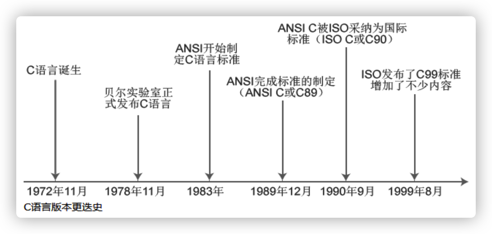
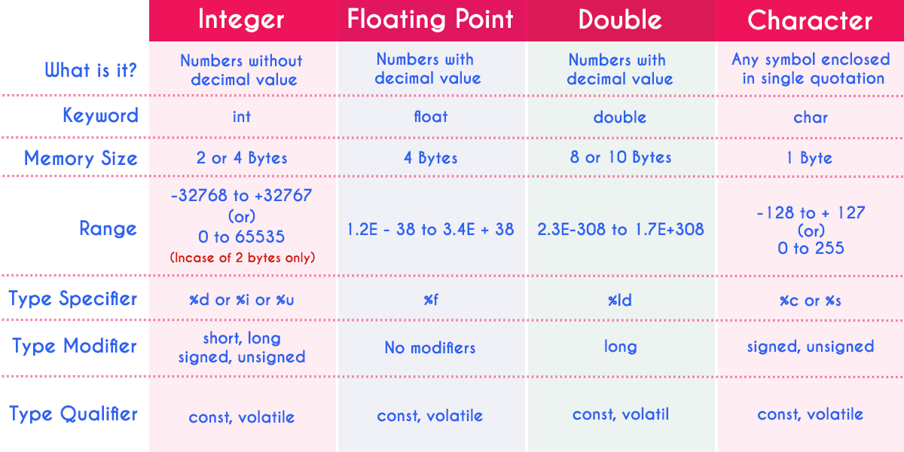

# C 语言

## 参考资料

- [C 语言教程 | 菜鸟教程](https://www.runoob.com/cprogramming/c-tutorial.html)
- [C 语言入门教程，C 语言学习教程（非常详细）](http://c.biancheng.net/c/)
- [C reference - cppreference.com](https://en.cppreference.com/w/c)

## C 简介

### 程序

一系列有序指令的集合，目的是执行某些操作或解决某个特定问题。

### C 语言发展历程



需要注意的几个版本：

1. ANSI C（标准 C）
2. C89
3. C99

### C 语言的特点

- 代码级别的跨平台
- 允许直接访问物理地址，对硬件进行操作
- 结构化程序设计，具有变量作用域以及递归功能的过程式语言
- 参数可以是指传递，也可以是指针传递
- 没有对象，可以用结构体
- 预编译处理

## 程序结构

### 基本结构

C 程序主要包括以下部分：

- 预处理器指令
- 函数
- 变量
- 语句 & 表达式
- 注释

### 程序入口

 程序的入口是`main`函数。

```c
int main(){
  // 方法体
}
```

### 开发过程

1. 编辑（`.c`/`.h`）
2. 编译（`.obj`）
3. 链接（`.exe`）
4. 运行

### 编译&执行命令

```bash
gcc test1.c -o main.out
./main.out
```

## 基本语法

- C 程序的入口是`main`函数
- C 程序源代码文件的扩展名为`.c`
- 头文件的扩展名为`.h`
- 语法区分大小写
- 每条执行语句以`;`结束

## 数据类型

- [C Tutorials - data types in C Programming Language](http://www.btechsmartclass.com/c_programming/C-Datatypes.html)



每一种数据都定义了明确的数据类型，在内存中分配了不同大小的内存空间。

1. 基本类型，它们是算术类型，包括两种类型：整数类型和浮点类型。
2. 枚举类型，它们也是算术类型，被用来定义在程序中只能赋予其一定的离散整数值的变量。
3. `void`，表明没有可用的值。
4. 派生类型，包括指针类型、数组类型、结构类型、共用体类型和函数类型。

### 字符类型

在 C 中，有一些特定的字符，当它们前面有反斜杠时，它们就具有特殊的含义。

- `\t`，制表位
- `\n`，换行符
- `\\`，`\`
- `\"`，`"`
- `\'`，`'`
- `\r`，回车

### 整数类型

前缀：

- `0x`，16 进制
- `0`，8 进制
- 无前缀，10 进制

后缀：

- `U`，`unsigned`，无符号整数
- `L`，`long`，长整数

### 枚举

```c
enum DAY
{
      MON=1, TUE, WED, THU, FRI, SAT, SUN
};
```

枚举本质上就是整形。默认情况下编号从 0 开始。

### 浮点类型

`float`是单精度浮点类型，1 位符号，8 位指数，23 位小数。


`double`是双精度浮点值。双精度是 1 位符号，11 位指数，52 位小数。


可以使用科学计数法表示，如`3.14e-11`，表示$3.14\times(10)^{-11}$。

### `void`类型

## 变量

### 初始值

局部变量不会被自动初始化；全局变量会被自动初始化。

| 数据类型 | 初始化默认值 |
| :------- | :----------- |
| int      | `0`          |
| char     | `'\0'`       |
| float    | `0`          |
| double   | `0`          |
| pointer  | `NULL`       |

## 常量

### 字面量

写出来的数字、字符、字符串都是字面量，是不变的。

### 定义常量

#### `#define`

```c
#define identifier value
```

这是一个预处理命令，实现原理是在编译时进行字符串替换。注意 value 使用括号包围起来，不然在某些地方会产生意料之外的结果。

#### `const`

```c
const type variable = value;
```

这是一个关键字，用于把变量所在的内存区域设置为只读。可以用在参数列表中，在该方法中，该参数不能被修改。

## 判断

### `switch`

```c
switch(expression){
    case constant-expression  :
       statement(s);
       break; /* 可选的 */
    case constant-expression  :
       statement(s);
       break; /* 可选的 */

    /* 您可以有任意数量的 case 语句 */
    default : /* 可选的 */
       statement(s);
}
```

`switch` 语句中的 expression 是一个常量表达式，必须是一个整型或枚举类型。

## 循环

### `goto`

```c
goto label;
// ..
// .
label: statement;
```

`label` 可以是任何除 C 关键字以外的纯文本，它可以设置在 C 程序中 `goto` 语句的前面或者后面。

## 函数

函数的参数传递都是值传递，没有引用传递。即使是指针，传递的也是指针值的复制。所以直接修改局部变量的指针地址是不会影响到外部的变量的。

传递结构体的时候也是传递了一个复制，而不是引用；包括结构体中的指针，也是传递了一个指针的复制。

## 数组

```c
// 逐个初始化
double balance[5];
balance[4] = 50.0;
// 使用初始化语句
double balance[5] = {1000.0, 2.0, 3.4, 7.0, 50.0};
// 可以省略掉长度
double balance[] = {1000.0, 2.0, 3.4, 7.0, 50.0};
```

数组名就是一个指针，指向数组的首地址。

## 指针

### 操作符

- `&`，取地址操作符
- `*`，取实例操作符

### 变量指针

指针变量中保存着一个内存地址。

### 指向数组的指针

数组名就是一个指针，指向数组的首地址。

### 多重指针

指针中的内存地址指向的还是指针。多维数组就是多重指针。

### 函数指针

```c
int max(int a, int b);
int (*fun_ptr)(int,int) = max; // 声明一个指向同样参数、返回值的函数指针类型
fun_ptr(1, 2); // 通过 fun_ptr 调用 max 函数
```

声明一个函数指针与声明一个变量类似；其中`fun_ptr`是变量名，前面的`int`是返回值类型，后面的是参数列表，参数列表可以不用写参数名称，只与参数类型和顺序有关。

通过函数指针可以实现回调函数。即将其声明在函数参数中，在函数内部可以调用传递进来的方法。

```c
#include <stdio.h>

int max(int a, int b) {
    return a > b ? a : b;
}

void callback(int (*p_max)(int, int)) {
    printf("%d\n", p_max(1, 2));
}

int main() {
    callback(max);
}
```

### 指针与算术运算符

可以对指针使用算数运算，如`+`、`-`、`*`、`/`；单位偏移量和指针类型有关，如`int`指针的单位偏移量为 4。可以使用这个特性来计算出每个数组元素的地址，可以通过指针访问该地址。

指针也可以用比较运算符进行比较。

## 字符串

字符串实际上是字符数组，字符串以`'\0'`结尾，无论该元素后是否还有字符。


在使用字符串常量时不需要手动在末尾放一个`'\0'`，编译器会自动给你加。

## `struct`结构体

把多种类型的数据声明在一起，结构体所占内存长度是其中最大字段大小的整数倍。

使用`.`来访问结构体成员；在通过结构体指针访问结构体成员时可以使用`->`。不用通过`*`符号取到结构体实力再操作成员，是一种简便写法。

```c
struct Books book1;
struct Books *struct_pointer;
struct_pointer = &book1;
// ->
struct_pointer->title;
// .
(*struct_pointer).title;
```

## `union`共用体

共用体的声明和使用与结构体类似。区别是共用体的长度是其内最大成员的长度；其内所有成员共用同一个内存区域来存储数据，修改一个成员的内容可能会对其它数据造成影响；在读取成员值的时候会按照该成员类型的长度来读取对应长度的内存值来解析为对应类型。

## `typedef`

给类型取新名字。

## I/O

在`<stdio.h>`中声明有三个`FILE *`，把输入/输出当作文件处理。

- `stdin`，标准输入
- `stdout`，标准输出
- `stderr`，错误输出

## 预处理命令

- [C 预处理器 | 菜鸟教程](https://www.runoob.com/cprogramming/c-preprocessors.html)

### `#include`

- `#include < >`引用的是编译器的类库路径里面的头文件；
- `#include " "`引用的是你程序目录的相对路径中的头文件，如果在程序目录没有找到引用的头文件则到编译器的类库路径的目录下找该头文件。

## 错误处理


## 可变参数


## 内存管理

这些函数在`<stdlib.h>`中。

- `void *malloc(int num);`
- `void *calloc(int num, int size);`
- `void free(void *address);`

## 标准库

### `stdio.h`

#### 结构

- `FILE`

#### 成员

声明有三个`FILE *`，把输入/输出当作文件处理。

- `stdin`，标准输入
- `stdout`，标准输出
- `stderr`，错误输出

#### 函数

- `int printf(const char *format, ...);`，格式化字符串并向`stdout`输出
- `int fprintf(FILE *stream, const char *format, ...);`格式化字符串，可以向指定的流输出
- `int sprintf(char *buffer, const char *format, ...);`，格式化字符串，写入另一个字符串
- `int scanf( const char *format, ... );`
- `int fscanf( FILE *stream, const char *format, ... );`
- `int sscanf( const char *buffer, const char *format, ... );`

| 格式化参数 | 备注                 | Precision             |
| ---------- | -------------------- | --------------------- |
| `%`        | `%`本身              |                       |
| `%c`       | `char`               |                       |
| `%s`       | 字符串               | 指定最大输出长度      |
| `%d`/`%i`  | `int`                |                       |
| `%u`       | `unsigned int`       | 指定小数位数，默认是6 |
| `%f`/`%F`  | `float`              |                       |
| `%e`/`%E`  | 十进制科学计数法     |                       |
| `%x`/`%X`  | 十六进制             |                       |
| `%p`       | 输出指针内的内存地址 |                       |

- `int getchar(void);`，从标准输入读一个字符
- `int getc( FILE *stream );`，从指定流读一个字符
- `int putchar(int ch);`，写出一个字符到标准输出
- `int putc( int ch, FILE *stream );`，写出一个字符到指定流
- `char *gets( char *str );`，字符串
- `char *fgets( char *str, int count, FILE *stream );`
- `int puts( const char *str );`
- `int fputs( const char *str, FILE *stream );`

文件读写：

- `FILE *fopen( const char *filename, const char *mode );`
- `int fclose( FILE *stream );`
- `size_t fread( void *buffer, size_t size, size_t count, FILE *stream );`，二进制读
- `size_t fwrite( const void *restrict buffer, size_t size, size_t count, FILE *restrict stream );`，二进制写
- `int fseek( FILE *stream, long offset, int origin );`，移动文件指针

`fopen`访问模式`mode`的值可以是下列值中的一个。

| 文本模式 | 二进制模式  | 备注                                 |
| -------- | ----------- | ------------------------------------ |
| `r`      | `rb`        | 打开已有文件，只读                   |
| `w`      | `wb`        | 读写，如果文件存在则清空文件覆盖写入 |
| `a`      | `ab`        | 读写，追加写入                       |
| `r+`     | `r+b`/`rb+` | 读写                                 |
| `w+`     | `w+b`/`wb+` | 读写，存在则清空，不存在则创建       |
| `a+`     | `a+b`/`ab+` | 读写，从头读，追加写                 |

`fseek`中`origin`有以下3个可选值。

1. `SEEK_SET`，以文件开头为基准
2. `SEEK_CUR`，以当前指针位置为基准
3. `SEEK_END`，以文件结束为基准

### `stdlib.h`


系统：

- `int system( const char *command );`，执行系统命令
- `void exit( int exit_code );`

随机数：

- `void srand( unsigned seed );`，重置随机数种子
- `int rand();`，生成`0`到`RAND_MAX的一个随机数

```c
#include <stdio.h>
#include <stdlib.h>
#include <time.h>
 
int main(void)
{
    srand(time(NULL)); // use current time as seed for random generator
    int random_variable = rand();
    printf("Random value on [0,%d]: %d\n", RAND_MAX, random_variable);
 
    // roll a 6-sided die 20 times
    for (int n=0; n != 20; ++n) {
        int x = 7;
        while(x > 6) 
            x = 1 + rand()/((RAND_MAX + 1u)/6); // Note: 1+rand()%6 is biased
        printf("%d ",  x); 
    }
}
```

```
// Possible output
Random value on [0,2147483647]: 448749574
3 1 3 1 4 2 2 1 3 6 4 4 3 1 6 2 3 2 6 1
```

### `stdbool.h`

定义了`bool`类型和`true`/`false`。

- `true`=`1`
- `false`=`0`

### `string.h`

类型转换函数：

- `int       atoi( const char *str );`，字符串转`int`
- `long      atol( const char *str );`
- `long long atoll( const char *str );`
- `double atof( const char* str );`

字符串操作：

- 


### `time.h`

### `ctype.h`

类型判断函数。
