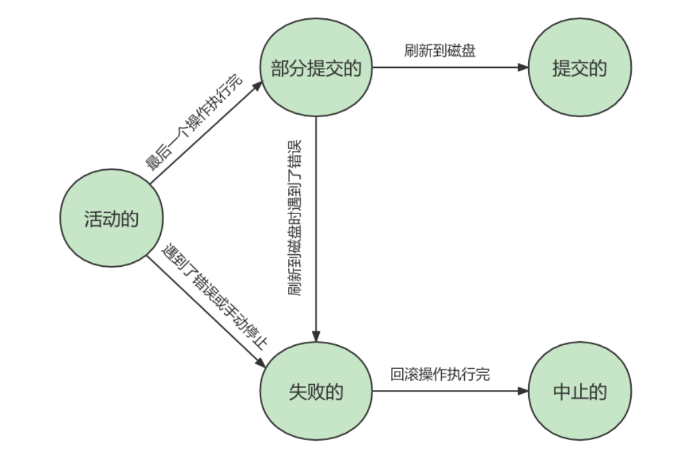
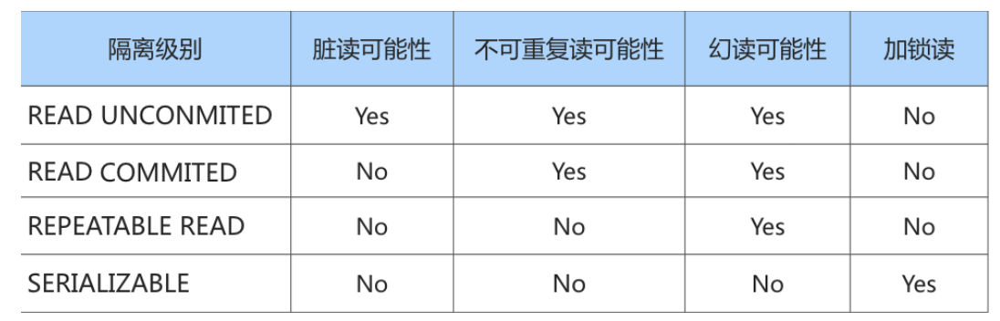

# MySQL 进阶

## 参考资料

- [MySQL 数据库教程天花板，mysql 安装到 mysql 高级，强！硬！\_哔哩哔哩\_bilibili](https://www.bilibili.com/video/BV1iq4y1u7vj?p=96)

## 用户与权限管理

### 用户管理

#### 登录服务器

```bash
mysql –h hostname|hostIP –P port –u username –p DatabaseName –e "SQL语句"
```

#### 创建用户

```sql
CREATE USER 用户名 [IDENTIFIED BY '密码'][,用户名 [IDENTIFIED BY '密码']];

CREATE USER zhang3 IDENTIFIED BY '123123'; # 默认host是 %
CREATE USER 'kangshifu'@'localhost' IDENTIFIED BY '123456';
```

#### 修改用户

```sql
# 改名
UPDATE mysql.user SET USER='li4' WHERE USER='wang5';
FLUSH PRIVILEGES;
```

#### 删除用户

```sql
DROP USER user[,user]...;

DROP USER li4 ; # 默认删除host为%的用户
DROP USER 'kangshifu'@'localhost';
```

#### 修改密码

```sql
# 1 只要有权限就可以改
ALTER USER USER() IDENTIFIED BY 'new_password';
alter user 'root'@'localhost' identified by 'abc123';

# 2，只能使用 root 用户改
SET PASSWORD='new_password';
SET PASSWORD FOR 'username'@'hostname'='new_password';
```

### 权限管理

```sql
show privileges;
```

```sql
GRANT 权限1,权限2,...权限n ON 数据库名称.表名称 TO 用户名@用户地址 [IDENTIFIED BY ‘密码口令’];

GRANT SELECT,INSERT,DELETE,UPDATE ON atguigudb.* TO li4@localhost ;
# 赋予所有权限，但是不包括 grant 权限
GRANT ALL PRIVILEGES ON *.* TO joe@'%' IDENTIFIED BY '123';
# WITH GRANT OPTION 这个选项表示该用户可以将自己拥有的权限授权给别人
GRANT ALL PRIVILEGES ON *.* TO joe@'%' IDENTIFIED BY '123' with grant option;
```

```sql
SHOW GRANTS;
SHOW GRANTS FOR CURRENT_USER;
SHOW GRANTS FOR CURRENT_USER();
SHOW GRANTS FOR 'user'@'主机地址' ;
```

```sql
REVOKE 权限1,权限2,...权限n ON 数据库名称.表名称 FROM 用户名@用户地址;

REVOKE ALL PRIVILEGES ON *.* FROM joe@'%';
REVOKE SELECT,INSERT,UPDATE,DELETE ON mysql.* FROM joe@localhost;
```

### 角色管理

```sql
CREATE ROLE 'role_name'[@'host_name'] [,'role_name'[@'host_name']]...


CREATE ROLE 'manager'@'localhost';
```

```sql
GRANT privileges ON table_name TO 'role_name'[@'host_name'];

GRANT SELECT ON demo.settlement TO 'manager';
```

```sql
SHOW GRANTS FOR 'manager';
```

```sql
REVOKE privileges ON tablename FROM 'rolename';
```

```sql
DROP ROLE 'school_read';
```

```sql
GRANT role [,role2,...] TO user [,user2,...];

GRANT 'school_read' TO 'kangshifu'@'localhost';
# 要手动激活角色
SET DEFAULT ROLE ALL TO 'kangshifu'@'localhost';
SELECT CURRENT_ROLE();
```

```sql
REVOKE role FROM user;
```

## 存储引擎

- InnoDB：具备外键支持功能的事务存储引擎；
- MyISAM：主要的非事务处理存储引擎。

## 索引结构

### InnoDB

在 InnoDB 中，数据和索引存放在相同的结构中，InnoDB 的数据文件就是一颗 B+树。

物理上分为聚簇索引和非聚簇索引。

#### 聚簇索引

每个表都有一个聚簇索引，数据和索引存放在一起。默认使用主键进行索引，如果没有主键则引擎会生成一个隐藏列作为主键。

- 使用记录主键值的大小进行记录和页的排序；
  - 页内的记录是按照主键的大小顺序排成一个单向链表；
  - 存放目录项记录的页分为不同层次，在同一层次中也是根据页中用户记录的主键大小顺序排成一个双向链表。
-  B+树的叶子节点存储的是完整的用户记录。

优点：

- 数据访问更快，因为聚簇索引将索引和数据保存在同一个 B+树中，因此从聚簇索引中获取数据比非 聚簇索引更快；
- 聚簇索引对于主键的 排序查找 和 范围查找 速度非常快；
- 按照聚簇索引排列顺序，查询显示一定范围数据的时候，由于数据都是紧密相连，数据库不用从多 个数据块中提取数据，所以 节省了大量的 io 操作。

缺点：

- 插入速度严重依赖于插入顺序，按照主键的顺序插入是最快的方式，否则将会出现页分裂，严重影 响性能。因此，对于 InnoDB 表，我们一般都会定义一个 自增的 ID 列为主键；
- 更新主键的代价很高，因为将会导致被更新的行移动。因此，对于 InnoDB 表，我们一般定义主键为 不可更新；
- 二级索引访问需要两次索引查找，第一次找到主键值，第二次根据主键值找到行数据。

#### 非聚簇索引

也称为辅助索引/二级索引。

对于表中其它字段的索引就是非聚簇索引。

其中页内节点的记录是按照该列的值大小排序的单项链表，除了保存该列的值之外，还保存了该条记录的主键 ID，目的是为了保证页内节点的唯一性；

其中记录保存了该列的值和主键值，在查找的时候如果需要其他字段的值的话会根据主键值去聚簇索引中查找该记录。

联合索引也是非聚簇索引，如果 a、b 字段联合索引的话，会先按照 a 字段排序、再按照 b 字段排序。

### MyISAM

在 MyISAM，数据和索引是分离的，索引中存放了对应数据在文件中的相对位置。

### 数据结构

#### Hash

- 只能等值比较，无法范围查找
- 无序
- 需要处理哈希冲突
- 对联合索引处理不好，不能使用联合索引中的部分字段查找
- InnoDB 不支持 Hash 索引

#### B-Tree


#### B+Tree


B+树和 B 树的差异：

1. B+树中只在叶子结点存放数据，非叶子结点只作索引；
2. B+树中所有关键字都在叶子结点出现，叶子结点构成一个有序链表，结点内部的关键字也构成了有序链表；
3. B+树中非叶子结点的关键字也会存储在子节点中，B 树中某个节点包含的关键字不会存储在子节点中。

## InnoDB 数据存储结构

### 数据存储的基本结构

InnoDB 将数据划分为页，页默认大小是 16KB。

以页作为磁盘和内存之间交互的基本单位，一个页中可以存储多条行记录。


页面之间可以不在物理上连续，只需要通过双向链表关联即可。每个数据页中的记录都会按照主键值排序，形成单项链表。


### 页的内部结构

按类型划分页：

- 数据页（保存 B+树节点）
- 系统页
- Undo 页
- 事务数据页


### 行格式

## 使用索引

### 索引分类

1. 普通索引（`INDEX`）
2. 唯一索引（`UNIQUE INDEX`）
3. 主键索引（`PRIMARY KEY`）
4. 单列索引（`INDEX`）
5. 联合索引（`INDEX`）
6. 全文索引（`FULLTEXT INDEX`）
7. 空间索引（`SPATIAL INDEX`）

### 查看索引

```sql
SHOW INDEX FROM test1;
```

### 创建索引

```sql
# 建表时一起创建索引
# 1. 普通索引
CREATE TABLE book(
  book_id INT ,
  book_name VARCHAR(100),
  authors VARCHAR(100),
  info VARCHAR(100) ,
  comment VARCHAR(100),
  year_publication YEAR,
  INDEX(year_publication)
);
# 2. 唯一索引
CREATE TABLE test1(
  id INT NOT NULL,
  name varchar(30) NOT NULL,
  UNIQUE INDEX uk_idx_id(id)
);
# 3. 主键索引
CREATE TABLE student (
  id INT(10) UNSIGNED  AUTO_INCREMENT ,
  student_no VARCHAR(200),
  student_name VARCHAR(200),
  PRIMARY KEY(id)
);
# 4. 单列索引
CREATE TABLE test2(
  id INT NOT NULL,
  name CHAR(50) NULL,
  INDEX single_idx_name(name(20))
);
# 5. 组合索引
CREATE TABLE test3(
  id INT(11) NOT NULL,
  name CHAR(30) NOT NULL,
  age INT(11) NOT NULL,
  info VARCHAR(255),
  INDEX multi_idx(id,name,age)
);
# 6. 全文索引
CREATE TABLE test4(
  id INT NOT NULL,
  name CHAR(30) NOT NULL,
  age INT NOT NULL,
  info VARCHAR(255),
  FULLTEXT INDEX futxt_idx_info(info)
);
SELECT * FROM papers WHERE MATCH(title,content) AGAINST (‘查询字符串’);
# 7. 空间索引
CREATE TABLE test5(
  geo GEOMETRY NOT NULL,
  SPATIAL INDEX spa_idx_geo(geo)
);

# 建表后创建索引
ALTER TABLE table_name ADD [UNIQUE | FULLTEXT | SPATIAL] [INDEX | KEY] [index_name] (col_name[length],...) [ASC | DESC]

CREATE [UNIQUE | FULLTEXT | SPATIAL] INDEX index_name ON table_name (col_name[length],...) [ASC | DESC]
```

### 删除索引

```sql
ALTER TABLE table_name DROP INDEX index_name;
DROP INDEX index_name ON table_name;
```

### 降序索引

MySQL 8.0 新特性。创建索引时使某个字段降序排序在 B+树中。

在某些情况下可以提升效率，如查询时使用某个字段降序排列作为条件。

```sql
CREATE TABLE ts1(a int,b int,index idx_a_b(a,b desc));
```

### 隐藏索引

MySQL 8.0 新特性。可以手动隐藏某个索引而不删除它，使查询优化器不使用它。

当索引被隐藏时，它的内容仍然是和正常索引一样实时更新的。如果一个索引需要长期被隐藏，那么可以将其删除，因为索引的存在会影响插入、更新和删除的性能。

```sql
 CREATE TABLE tablename(
    propname1 type1[CONSTRAINT1],
    propname2 type2[CONSTRAINT2],
    ......
    propnamen typen,
    INDEX [indexname](propname1 [(length)]) INVISIBLE
);

CREATE INDEX indexname ON tablename(propname[(length)]) INVISIBLE;
ALTER TABLE tablename ADD INDEX indexname (propname [(length)]) INVISIBLE;
# 切换成隐藏索引
ALTER TABLE tablename ALTER INDEX index_name INVISIBLE;
# 切换成非隐藏索引
ALTER TABLE tablename ALTER INDEX index_name VISIBLE;
```

## 索引的设计原则

### 适合创建索引的情况

1. 字段的数值有唯一性的限制
2. 频繁作为 WHERE 查询条件的字段
3. 经常 GROUPBY 和 ORDERBY 的列
4. UPDATE、DELETE 的 WHERE 条件列
5. DISTINCT 字段需要创建索引
6. 使用列的类型小的创建索引
7. 使用字符串前缀创建索引
8. 区分度高 (散列性高) 的列适合作为索引
9. 使用最频繁的列放到联合索引的左侧
10. 在多个字段都要创建索引的情况下，联合索引优于单值索引

### 不适合创建索引的情况

1. 在 where 中使用不到的字段，不要设置索引
2. 数据量小的表最好不要使用索引
3. 有大量重复数据的列上不要建立索引
4. 避免对经常更新的表创建过多的索引
5. 不建议用无序的值作为索引
6. 删除不再使用或者很少使用的索引
7. 不要定义冗余或重复的索引

## 性能分析工具的使用

### last_query_cost

```sql
SHOW STATUS LIKE 'last_query_cost';
```

```
+-----------------+----------+
| Variable_name   | Value    |
+-----------------+----------+
| Last_query_cost | 1.000000 |
+-----------------+----------+
```

可以查询到上一次查询使用了多少个页。

### slow_query_log

```sql
# 开启慢查询记录
set global slow_query_log='ON';
# 设置慢查询的时间阈值
set global long_query_time = 1;
```

开启慢查询日志之后，记录的查询语句默认保存在`/var/lib/mysql/<hostname>-slow.log`文件中。可以使用`mysqldumpslow`工具来分析这个日志文件。

### SHOW PROFILE

```sql
set profiling = 'ON';
# 查看当前会话下的 profiles
show profiles;
# 查看最近一次的 profile
show profile;
# 查看某个编号的 profile
show profile cpu,block io for query 2;
```

1. ALL：显示所有的开销信息。
2. BLOCK IO：显示块 IO 开销。
3. CONTEXT SWITCHES：上下文切换开 销。
4. CPU：显示 CPU 开销信息。
5. IPC：显示发送和接收开销信息。
6. MEMORY：显示内存开销信 息。
7. PAGE FAULTS：显示页面错误开销信息。
8. SOURCE：显示和 Source_function，Source_file，Source_line 相关的开销信息。
9. SWAPS：显示交换次数开销信息。

### EXPLAIN/DESCRIBE

#### table

EXPLAIN 语句输出的每条记录都对应着某个单表的访问方法。

#### id

- id 如果相同，可以认为是一组，从上往下顺序执行；
- 在所有组中，id 值越大，优先级越高，越先执行；
- 每个 id 表示一趟独立的查询，一个 sql 的查询趟数越少越好。

#### select_type

| 名称                 | 描述                                                         |
| -------------------- | ------------------------------------------------------------ |
| SIMPLE               | Simple SELECT (not using UNION or subqueries)                |
| PRIMARY              | Outermost SELECT                                             |
| UNION                | Second or later SELECT statement in a UNION                  |
| UNION RESULT         | ResultofaUNION                                               |
| SUBQUERY             | First SELECT in subquery                                     |
| DEPENDENT SUBQUERY   | First SELECT in subquery, dependent on outer query           |
| DEPENDENT UNION      | Second or later SELECT statement in a UNION, dependent on outer query |
| DERIVED              | Derived table                                                |
| MATERIALIZED         | Materialized subquery                                        |
| UNCACHEABLE SUBQUERY | A subquery for which the result cannot be cached and must be re-evaluated for each row of the outer query |
| UNCACHEABLE UNION    | The second or later select in a UNION that belongs to an uncacheable subquery (see UNCACHEABLE SUBQUERY) |

#### partitions

```sql
-- 创建分区表，
-- 按照 id 分区，id<100 p0 分区，其他 p1 分区
CREATE TABLE user_partitions (id INT auto_increment,
    NAME VARCHAR(12),PRIMARY KEY(id))
    PARTITION BY RANGE(id)(
        PARTITION p0 VALUES less than(100),
        PARTITION p1 VALUES less than MAXVALUE
);
```

```sql
DESC SELECT * FROM user_partitions WHERE id>200;
```

#### type

越靠前越好。SQL 性能优化的目标：至少要达到 range 级别，要求是 ref 级别，最好是 const 级别。

- system
- const
- eq_ref
- ref
- fulltext
- ref_or_null
- index_merge
- unique_subquery
- index_subquery
- range
- index
- ALL

#### possible_keys

可能会使用上的索引。

#### key

实际上用到的索引。

#### key_len

使用到的联合索引的长度，单位是字节。

#### ref

当使用索引列等值查询时，与索引列等值匹配的对象信息。

#### rows

预估需要读取的记录数。

#### filtered

经过搜索条件过滤后剩余记录数的百分比。

#### Extra

- `No tables used`，查询语句中没有使用到任何数据表
- `Impossible WHERE`
- `Using where`
- `No matching min/max row`
- `Using index`
- `Using index condition`
- `Using join buffer (Block Nested Loop)`
- `Not exists`
- `Using intersect(...)`
- `Using union(...)`
- `Using sort_union(...)`
- `Zero limit`
- `Using filesort`
- `Using temporary`
- `...`

#### 输出格式

1. 传统格式
2. JSON 格式
3. TREE 格式

```sql
EXPLAIN FORMAT=JSON SELECT ....
EXPLAIN FORMAT=TREE SELECT ....
```

### SHOW WARNINGS

使用`SHOW WARNINGS`来查看被优化过的 SQL 语句。

### trace

```sql
SET optimizer_trace="enabled=on",end_markers_in_json=on;
set optimizer_trace_max_mem_size=1000000;
```

```sql
select * from student where id < 10;
```

```sql
select * from information_schema.optimizer_trace;
```

### sys schema

#### 索引情况

```sql
#1. 查询冗余索引
select * from sys.schema_redundant_indexes;
#2. 查询未使用过的索引
select * from sys.schema_unused_indexes;
#3. 查询索引的使用情况
select index_name,rows_selected,rows_inserted,rows_updated,rows_deleted from sys.schema_index_statistics where table_schema='dbname' ;
```

#### 表相关

```sql
# 1. 查询表的访问量
select table_schema,table_name,sum(io_read_requests+io_write_requests) as io from sys.schema_table_statistics group by table_schema,table_name order by io desc;
# 2. 查询占用bufferpool较多的表
select object_schema,object_name,allocated,data
from sys.innodb_buffer_stats_by_table order by allocated limit 10;
# 3. 查看表的全表扫描情况
select * from sys.statements_with_full_table_scans where db='dbname';
```

#### 语句相关

```sql
#1. 监控SQL执行的频率
select db,exec_count,query from sys.statement_analysis order by exec_count desc;
#2. 监控使用了排序的SQL
select db,exec_count,first_seen,last_seen,query from sys.statements_with_sorting limit 1;
#3. 监控使用了临时表或者磁盘临时表的SQL
select db,exec_count,tmp_tables,tmp_disk_tables,query
from sys.statement_analysis where tmp_tables>0 or tmp_disk_tables >0 order by (tmp_tables+tmp_disk_tables) desc;
```

#### IO 相关

```sql
#1. 查看消耗磁盘IO的文件
select file,avg_read,avg_write,avg_read+avg_write as avg_io
from sys.io_global_by_file_by_bytes order by avg_read limit 10;
```

#### Innodb 相关

```sql
#1. 行锁阻塞情况
select * from sys.innodb_lock_waits;
```

## 索引优化与查询优化

### 索引失效的情况

1. 联合索引违反最左匹配原则；
2. 计算、函数、类型转换 (自动或手动) 导致索引失效；
3. 范围条件后边的列索引失效；
4. 不等于`!=`索引失效
5. is null 可以使用索引，is not null 无法使用索引
6. like 以通配符%开头索引失效
7. OR 前后存在非索引的列，索引失效
8. 使用不相同的字符集会导致索引失效

### JOIN 的优化

1. 保证被驱动表的 JOIN 字段已经创建了索引；
2. 需要 JOIN 的字段，数据类型保持绝对一致；
3. LEFT JOIN 时，选择小表作为驱动表，减少外层循环的次数；
4. INNER JOIN 时，MySQL 会自动将。选择相信 MySQL 优化策略；
5. 能够直接多表关联的尽量直接关联，不用子查询；
6. 不建议使用子查询，建议将子查询 SQL 拆开结合程序多次查询，或使用 JOIN 来代替子查询；
7. 衍生表建不了索引。

### JOIN 的原理

先在前表中寻找匹配条件的行，再去后表中对照比较。

### 子查询优化

使用 JOIN 代替子查询。连接查询不需要建立临时表，并且还能使用上索引。

### 排序优化

1. Order by 时 select * 是一个大忌。最好只 Query 需要的字段；

### GROUP BY 优化

1. where 效率高于 having，能写在 where 限定的条件就不要写在 having 中了；
2. group by 先排序再分组；
3. 包含了 order by、group by、distinct 这些查询的语句，where 条件过滤出来的结果集请保持在 1000 行 以内，否则 SQL 会很慢。

### 覆盖索引

 一个索引包含了满足查询结果的数据就叫做覆盖索引。

1. 避免 Innodb 表进行索引的二次查询 (回表)；
2. 可以把随机 IO 变成顺序 IO 加快查询效率。

索引字段的维护总是有代价的。因此，在建立冗余索引来支持覆盖索引时就需要权衡考虑了。这是业务 DBA，或者称为业务数据架构师的工作。

### 索引下推

Index Condition Pushdown(ICP) 是 MySQL 5.6 中新特性，是一种在存储引擎层使用索引过滤数据的一种优化方式。ICP 可以减少存储引擎访问基表的次数以及 MySQL 服务器访问存储引擎的次数。

## 数据库设计原则

### 范式

在关系型数据库中，关于数据表设计的基本原则、规则就称为范式。

目前关系型数据库有六种常见范式，按照范式级别，从低到高分别是：第一范式 (1NF)、第二范式 (2NF)、第三范式 (3NF)、巴斯-科德范式 (BCNF)、第四范式 (4NF) 和第五范式 (5NF，又称完美范式) 。

#### 第一范式

第一范式主要是确保数据表中每个字段的值必须具有原子性，也就是说数据表中每个字段的值为不可再次拆分的最小数据单元。

#### 第二范式

第二范式要求，在满足第一范式的基础上，还要满足数据表里的每一条数据记录，都是可唯一标识的。而且所有非主键字段，都必须完全依赖主键，不能只依赖主键的一部分。如果知道主键的所有属性的值，就可以检索到任何元组（行）的任何属性的任何值。（要求中的主键，其实可以拓展替换为候选键）。

#### 第三范式

第三范式是在第二范式的基础上，确保数据表中的每一个非主键字段都和主键字段直接相关，也就是说，要求数据表中的所有非主键字段不能依赖于其他非主键字段。通俗地讲，该规则的意思是所有非主键属性之间不能有依赖关系，必须相互独立。

#### 巴斯范式

它在 3NF 的基础上消除了主属性对候选键的部分依赖或者传递依赖关系。

### 反范式化

为满足某种商业目标，数据库性能比规范化数据库更重要。

## 数据库其它调优策略

### 调优的目标

1. 尽可能 节省系统资源，以便系统可以提供更大负荷的服务。(吞吐量更大)；
2. 合理的结构设计和参数调整，以提高用户操作 响应的速度。(响应速度更快)；
3. 减少系统的瓶颈，提高 MySQL 数据库整体的性能。

## 事务

### 事务的特性

#### 原子性

原子性是指事务是一个不可分割的工作单位，要么全部提交，要么全部失败回滚。

#### 一致性

致性是指事务执行前后，数据从一个合法性状态变换到另外一个合法性状态。

#### 隔离型

事务的隔离性是指一个事务的执行不被其他事务干扰。

#### 持久性

持久性是指一个事务一旦被提交，它对数据库中数据的改变就是永久性的，接下来的其他操作和数据库故障不应该对其有任何影响。

### 事务的状态

MySQL 根据这些操作所执行的不同阶段把事务大致划分成几个状态。

1. 活动的 (active)
2. 部分提交的 (partially committed)
3. 失败的 (failed)
4. 中止的 (aborted)
5. 提交的 (committed)



### 显式事务

```sql
# 1.
BEGIN;
# 2.
START TRANSACTION;
START TRANSACTION READ ONLY;
START TRANSACTION READ WRITE;
START TRANSACTION WITH CONSISTENT SNAPSHOT;
```

### 隐式事务

每条 DML 语句都在一个事务中，默认会自动提交，可以设置`autocommit`来关闭自动提交。

```sql
SET autocommit = 0;
SET autocommit = OFF;
```

在一些情况下会触发隐式自动提交事务。

1. 执行 DDL 语句；
2. 开启一个新事务；
3. 加载数据的语句；
4. 关于 MySQL 复制的语句；
5. 其它。

### 隔离级别



```sql
SET [GLOBAL|SESSION] TRANSACTION ISOLATION LEVEL 隔离级别;
#其中，隔离级别格式:
# > READ UNCOMMITTED
# > READ COMMITTED
# > REPEATABLE READ
# > SERIALIZABLE
```

## 事务日志

- 事务的隔离性由锁机制实现；
- 而事务的原子性、一致性和持久性由事务的 redo 日志和 undo 日志来保证。
  - REDO LOG 称为 重做日志，提供再写入操作，恢复提交事务修改的页操作，用来保证事务的持久性；
  - UNDO LOG 称为 回滚日志，回滚行记录到某个特定版本，用来保证事务的原子性、一致性。

## 锁

### 表锁

#### 意向锁（intention lock）

意向锁是由存储引擎，用户无法手动操作意向锁，在为数据行加共享、排他锁之前，InooDB 会先获取该数据行所在数据表的对应意向锁。

意向锁不会与**行级**的共享、排他锁互斥！正因为如此，意向锁并不会影响到多个事务对不同**数据行**加排他锁时的并发性。

#### 元数据锁（MDL）

当对一个表做增删改查操作的时候，加 MDL 读锁；当要对表做结构变更操作的时候，加 MDL 写锁。

### 行锁

#### 记录锁（Record Locks）

记录锁也就是仅仅把一条记录锁上。

#### 间隙锁（Gap Locks）

用来解决幻读问题。gap 锁的提出仅仅是为了防止插入幻影记录而提出的。

#### 临键锁（Next-Key Locks）

锁住某条记录，并且阻止其他事务在该记录前边的间隙插入新记录。是记录锁和间隙锁的结合。

#### 插入意向锁（Insert Intention Locks）

InnoDB 规定事务在等待的时候也需要在内存中生成一个锁结构，表明有事务想在某个间隙中插入新记录，但是现在在等待。插入意向锁并不会阻止别的事务继续获取该记录上任何类型的锁。

### 加锁方式

可以隐式加锁，每条DML语句都自动会使用锁；也可以显式加锁。

```sql
# 共享锁
select .... lock in share mode
# 排他锁
select .... for update
```

