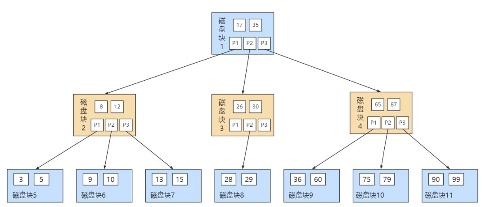
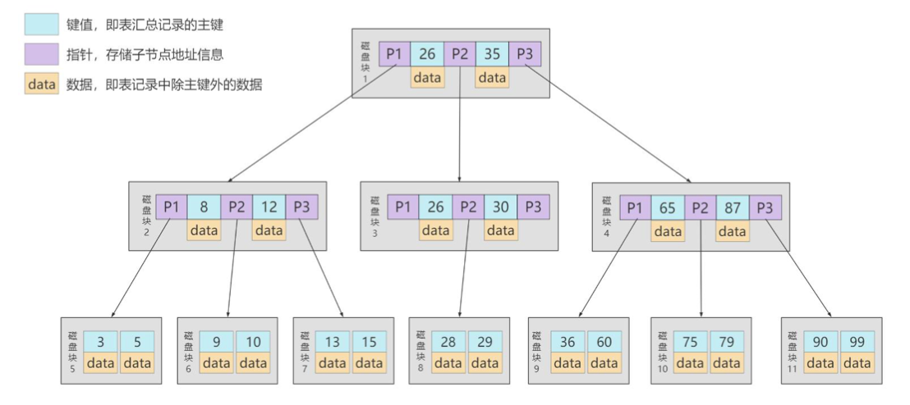
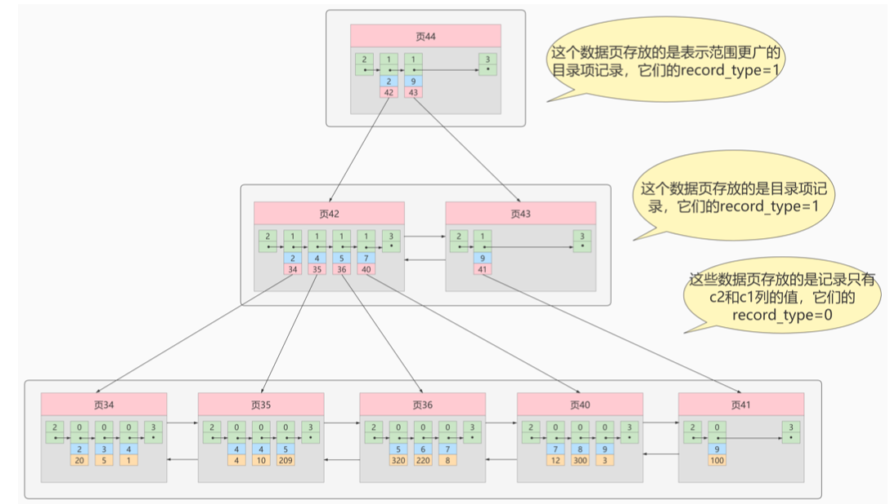
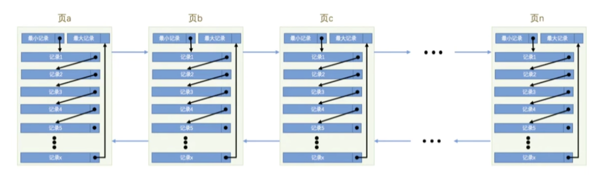
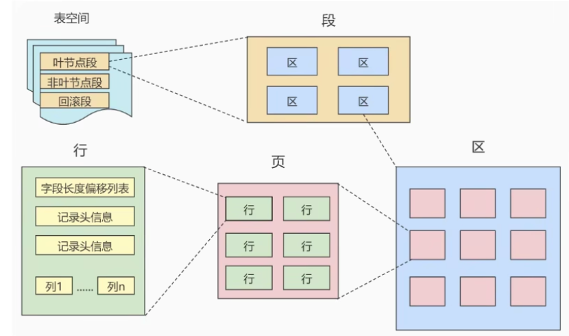
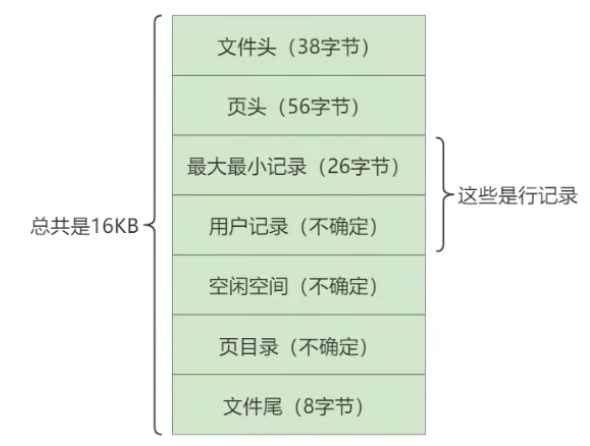
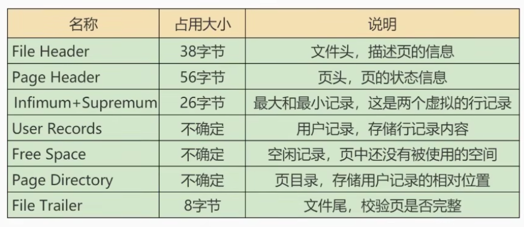

# MySQL 进阶

## 参考资料

- [MySQL 数据库教程天花板，mysql 安装到 mysql 高级，强！硬！\_哔哩哔哩\_bilibili](https://www.bilibili.com/video/BV1iq4y1u7vj?p=96)

## 用户与权限管理

### 用户管理

#### 登录服务器

```bash
mysql –h hostname|hostIP –P port –u username –p DatabaseName –e "SQL语句"
```

#### 创建用户

```sql
CREATE USER 用户名 [IDENTIFIED BY '密码'][,用户名 [IDENTIFIED BY '密码']];

CREATE USER zhang3 IDENTIFIED BY '123123'; # 默认host是 %
CREATE USER 'kangshifu'@'localhost' IDENTIFIED BY '123456';
```

#### 修改用户

```sql
# 改名
UPDATE mysql.user SET USER='li4' WHERE USER='wang5';
FLUSH PRIVILEGES;
```

#### 删除用户

```sql
DROP USER user[,user]...;

DROP USER li4 ; # 默认删除host为%的用户
DROP USER 'kangshifu'@'localhost';
```

#### 修改密码

```sql
# 1 只要有权限就可以改
ALTER USER USER() IDENTIFIED BY 'new_password';
alter user 'root'@'localhost' identified by 'abc123';

# 2，只能使用 root 用户改
SET PASSWORD='new_password';
SET PASSWORD FOR 'username'@'hostname'='new_password';
```

### 权限管理

```sql
show privileges;
```

```sql
GRANT 权限1,权限2,...权限n ON 数据库名称.表名称 TO 用户名@用户地址 [IDENTIFIED BY ‘密码口令’];

GRANT SELECT,INSERT,DELETE,UPDATE ON atguigudb.* TO li4@localhost ;
# 赋予所有权限，但是不包括 grant 权限
GRANT ALL PRIVILEGES ON *.* TO joe@'%' IDENTIFIED BY '123';
# WITH GRANT OPTION 这个选项表示该用户可以将自己拥有的权限授权给别人
GRANT ALL PRIVILEGES ON *.* TO joe@'%' IDENTIFIED BY '123' with grant option;
```

```sql
SHOW GRANTS;
SHOW GRANTS FOR CURRENT_USER;
SHOW GRANTS FOR CURRENT_USER();
SHOW GRANTS FOR 'user'@'主机地址' ;
```

```sql
REVOKE 权限1,权限2,...权限n ON 数据库名称.表名称 FROM 用户名@用户地址;

REVOKE ALL PRIVILEGES ON *.* FROM joe@'%';
REVOKE SELECT,INSERT,UPDATE,DELETE ON mysql.* FROM joe@localhost;
```

### 角色管理

```sql
CREATE ROLE 'role_name'[@'host_name'] [,'role_name'[@'host_name']]...


CREATE ROLE 'manager'@'localhost';
```

```sql
GRANT privileges ON table_name TO 'role_name'[@'host_name'];

GRANT SELECT ON demo.settlement TO 'manager';
```

```sql
SHOW GRANTS FOR 'manager';
```

```sql
REVOKE privileges ON tablename FROM 'rolename';
```

```sql
DROP ROLE 'school_read';
```

```sql
GRANT role [,role2,...] TO user [,user2,...];

GRANT 'school_read' TO 'kangshifu'@'localhost';
# 要手动激活角色
SET DEFAULT ROLE ALL TO 'kangshifu'@'localhost';
SELECT CURRENT_ROLE();
```

```sql
REVOKE role FROM user;
```

## 存储引擎

- InnoDB：具备外键支持功能的事务存储引擎；
- MyISAM：主要的非事务处理存储引擎。

## 索引结构

### InnoDB

在 InnoDB 中，数据和索引存放在相同的结构中，InnoDB 的数据文件就是一颗 B+树。

物理上分为聚簇索引和非聚簇索引。

#### 聚簇索引

每个表都有一个聚簇索引，数据和索引存放在一起。默认使用主键进行索引，如果没有主键则引擎会生成一个隐藏列作为主键。

- 使用记录主键值的大小进行记录和页的排序；
  - 页内的记录是按照主键的大小顺序排成一个单向链表；
  - 存放目录项记录的页分为不同层次，在同一层次中也是根据页中用户记录的主键大小顺序排成一个双向链表。
-  B+树的叶子节点存储的是完整的用户记录。

优点：

- 数据访问更快，因为聚簇索引将索引和数据保存在同一个 B+树中，因此从聚簇索引中获取数据比非 聚簇索引更快；
- 聚簇索引对于主键的 排序查找 和 范围查找 速度非常快；
- 按照聚簇索引排列顺序，查询显示一定范围数据的时候，由于数据都是紧密相连，数据库不用从多 个数据块中提取数据，所以 节省了大量的 io 操作。

缺点：

- 插入速度严重依赖于插入顺序，按照主键的顺序插入是最快的方式，否则将会出现页分裂，严重影 响性能。因此，对于 InnoDB 表，我们一般都会定义一个 自增的 ID 列为主键；
- 更新主键的代价很高，因为将会导致被更新的行移动。因此，对于 InnoDB 表，我们一般定义主键为 不可更新；
- 二级索引访问需要两次索引查找，第一次找到主键值，第二次根据主键值找到行数据。

#### 非聚簇索引

也称为辅助索引/二级索引。

对于表中其它字段的索引就是非聚簇索引。

其中页内节点的记录是按照该列的值大小排序的单项链表，除了保存该列的值之外，还保存了该条记录的主键 ID，目的是为了保证页内节点的唯一性；

其中记录保存了该列的值和主键值，在查找的时候如果需要其他字段的值的话会根据主键值去聚簇索引中查找该记录。

联合索引也是非聚簇索引，如果 a、b 字段联合索引的话，会先按照 a 字段排序、再按照 b 字段排序。

### MyISAM

在 MyISAM，数据和索引是分离的，索引中存放了对应数据在文件中的相对位置。

### 数据结构

#### Hash

- 只能等值比较，无法范围查找
- 无序
- 需要处理哈希冲突
- 对联合索引处理不好，不能使用联合索引中的部分字段查找
- InnoDB 不支持 Hash 索引

#### B-Tree





#### B+Tree



B+树和 B 树的差异：

1. B+树中只在叶子结点存放数据，非叶子结点只作索引；
2. B+树中所有关键字都在叶子结点出现，叶子结点构成一个有序链表，结点内部的关键字也构成了有序链表；
3. B+树中非叶子结点的关键字也会存储在子节点中，B 树中某个节点包含的关键字不会存储在子节点中。

## InnoDB 数据存储结构

### 数据存储的基本结构

InnoDB 将数据划分为页，页默认大小是 16KB。

以页作为磁盘和内存之间交互的基本单位，一个页中可以存储多条行记录。



页面之间可以不在物理上连续，只需要通过双向链表关联即可。每个数据页中的记录都会按照主键值排序，形成单项链表。



### 页的内部结构

按类型划分页：

- 数据页（保存 B+树节点）
- 系统页
- Undo 页
- 事务数据页





### 行格式

## 使用索引

### 索引分类

1. 普通索引（`INDEX`）
2. 唯一索引（`UNIQUE INDEX`）
3. 主键索引（`PRIMARY KEY`）
4. 单列索引（`INDEX`）
5. 联合索引（`INDEX`）
6. 全文索引（`FULLTEXT INDEX`）
7. 空间索引（`SPATIAL INDEX`）

### 查看索引

```sql
SHOW INDEX FROM test1;
```

### 创建索引

```sql
# 建表时一起创建索引
# 1. 普通索引
CREATE TABLE book(
  book_id INT ,
  book_name VARCHAR(100),
  authors VARCHAR(100),
  info VARCHAR(100) ,
  comment VARCHAR(100),
  year_publication YEAR,
  INDEX(year_publication)
);
# 2. 唯一索引
CREATE TABLE test1(
  id INT NOT NULL,
  name varchar(30) NOT NULL,
  UNIQUE INDEX uk_idx_id(id)
);
# 3. 主键索引
CREATE TABLE student (
  id INT(10) UNSIGNED  AUTO_INCREMENT ,
  student_no VARCHAR(200),
  student_name VARCHAR(200),
  PRIMARY KEY(id)
);
# 4. 单列索引
CREATE TABLE test2(
  id INT NOT NULL,
  name CHAR(50) NULL,
  INDEX single_idx_name(name(20))
);
# 5. 组合索引
CREATE TABLE test3(
  id INT(11) NOT NULL,
  name CHAR(30) NOT NULL,
  age INT(11) NOT NULL,
  info VARCHAR(255),
  INDEX multi_idx(id,name,age)
);
# 6. 全文索引
CREATE TABLE test4(
  id INT NOT NULL,
  name CHAR(30) NOT NULL,
  age INT NOT NULL,
  info VARCHAR(255),
  FULLTEXT INDEX futxt_idx_info(info)
);
SELECT * FROM papers WHERE MATCH(title,content) AGAINST (‘查询字符串’);
# 7. 空间索引
CREATE TABLE test5(
  geo GEOMETRY NOT NULL,
  SPATIAL INDEX spa_idx_geo(geo)
);

# 建表后创建索引
ALTER TABLE table_name ADD [UNIQUE | FULLTEXT | SPATIAL] [INDEX | KEY] [index_name] (col_name[length],...) [ASC | DESC]

CREATE [UNIQUE | FULLTEXT | SPATIAL] INDEX index_name ON table_name (col_name[length],...) [ASC | DESC]
```

### 删除索引

```sql
ALTER TABLE table_name DROP INDEX index_name;
DROP INDEX index_name ON table_name;
```

### 降序索引

MySQL 8.0 新特性。创建索引时使某个字段降序排序在 B+树中。

在某些情况下可以提升效率，如查询时使用某个字段降序排列作为条件。

```sql
CREATE TABLE ts1(a int,b int,index idx_a_b(a,b desc));
```

### 隐藏索引

MySQL 8.0 新特性。可以手动隐藏某个索引而不删除它，使查询优化器不使用它。

当索引被隐藏时，它的内容仍然是和正常索引一样实时更新的。如果一个索引需要长期被隐藏，那么可以将其删除，因为索引的存在会影响插入、更新和删除的性能。

```sql
 CREATE TABLE tablename(
    propname1 type1[CONSTRAINT1],
    propname2 type2[CONSTRAINT2],
    ......
    propnamen typen,
    INDEX [indexname](propname1 [(length)]) INVISIBLE
);

CREATE INDEX indexname ON tablename(propname[(length)]) INVISIBLE;
ALTER TABLE tablename ADD INDEX indexname (propname [(length)]) INVISIBLE;
# 切换成隐藏索引
ALTER TABLE tablename ALTER INDEX index_name INVISIBLE;
# 切换成非隐藏索引
ALTER TABLE tablename ALTER INDEX index_name VISIBLE;
```

