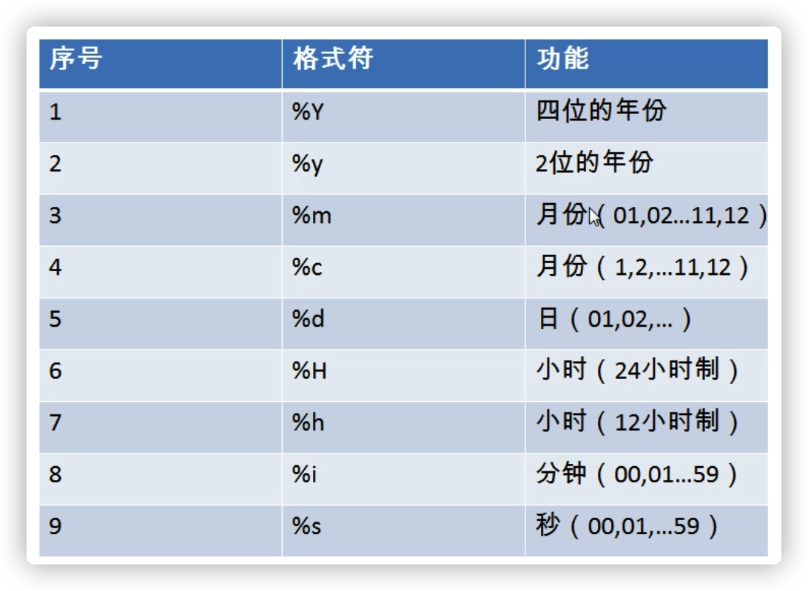

# MySQL

## 参考资料

- [【宋红康】MySQL 数据库（mysql 安装/基础/高级/优化）_哔哩哔哩_bilibili](https://www.bilibili.com/video/BV1iq4y1u7vj)

## 数据库的作用

1. 实现数据持久化
2. 使用完整的管理系统统一管理

## 名词解释

- DB（Database），数据库，它保存了一系列有组织的数据
- DBMS（Database Management System），数据库管理系统，简称数据库软件，可以对数据库进行操作
- DBA（Database Administrator），数据库管理员
- SQL（Structure Query Language），结构化查询语言

## 关系型数据库

### 概念

- 关系型数据库的典型数据结构就是`数据表`，这些数据表的组成都是结构化的（Structured）。

- 将数据放到表中，表再放到库中。

### 关系

- 一对一
- 一对多
- 多对多
- 自我引用

## 命令行

```bash
mysql -h localhost -P 3306 -u root -proot
```

- `-P`指定端口
- `-p`指定密码，密码可以不写在命令中，只指定参数而不写密码的话会在交互式命令行中输入密码，不会在密码历史或屏幕中暴露密码

## 默认数据库

// TODO Mysql 默认带的几个数据库的作用

## SQL

### SQL 概念

结构化查询语言（Structured Query Language），是一种规范，用来操作关系型数据库。但是每种数据库在实现上有略微不同，称为「方言」；

### 分类

1. DDL（Data Definition Language）数据定义语言：用于操作数据库对象，如数据库、表、字段等。关键字：`create`、`drop`、`alter`、`rename`、`truncate` ；
2. DML（Data Manipulation Language）数据操作语言：用于操作数据本身。关键字 `insert`、`delete`、`update`、`select` ；
3. DCL（Data Control Language）数据控制语言：用户操作数据库 的访问权限和安全级别，以及管理用户，关键字 `grant`、`revoke`、`commit`、`rollback`、`savepoint`。

### 规则

- SQL 可以写在一行或者多行。为了提高可读性，各子句分行写，必要时使用缩进
- 每条命令以`;`或 `\g`或`\G`结束
  - `\g`和`\G`只能在命令行中使用
  - `\g`和`;`的效果一样
  - `\G`会将结果表转置，行列转换

- 关键字不能被缩写也不能分行
- 关于标点符号
  - 必须保证所有的`()`、`单引号`、`双引号`是成对结束的
  - 必须使用**英文**状态下的**半角**输入方式
  - 字符串型和日期时间类型的数据可以使用单引号表示
  - 列的别名，尽量使用双引号，而且不建议省略`as`

### 规范

这是建议遵守的，不强制。

- MySQL 在 Windows 环境下是大小写不敏感的
- MySQL 在 Linux 环境下是大小写敏感的
  - 数据库名、表名、表的别名、变量名是严格区分大小写的
  - 关键字、函数名、列名（或字段名）、列的别名（字段的别名） 是忽略大小写的。
- 推荐采用统一的书写规范
  - 数据库名、表名、表别名、字段名、字段别名等都小写
  - SQL 关键字、函数名、绑定变量等都大写

### 注释

```sql
-- 单行注释
# 单行注释
/*
  多行注释
 */
```

### DDL

#### SHOW

查询所有数据库。

```sql
show databases;
```

查询数据库创建语法，以及数据库字符集。

```sql
show create database mysql;
```

查询所有表。

```sql
show tables;
show tables from test;
```

查询当前选择的数据库。

```sql
select database();
```

查询变量。

```sql
show variables like '%char%';
```

#### CREATE

创建数据库。

```sql
create database db1;
```

只在不存在的情况下创建。

```sql
create database if not exists db2;
```

指定使用其他字符集。

```sql
create database db3 character set gbk;
```

综合到一起。

```sql
create database if not exists db4 character set gbk;
```

创建表。

```sql
create table table_name(
    id int,
    name varchar(32)
);
```

复制表结构。

```sql
create table stu like student;
```

#### DESCRIBE/DESC

显示表结构。

```sql
describe employees;
desc employees;
```

### DQL

#### SELECT

```sql
select [distinct | ] 字段列表
from 表名列表
where 条件列表
group by 分组条件
having 分组之后的条件
order by 排序
limit 分页条件
escape '转义字符'
```

#### 字段列表

每个字段用逗号`,`分隔；可以用`*`代表所有字段。生产环境中不建议用`*`，性能不好。

#### 关键词

用在字段列表之前：

- `distinct`：去除重复行

用在字段列表：

- `as`：起别名，别名可以为中文；可以有空格，但是需要用双引号包裹起来。

在字段名和关键词名称冲突的时候，可以用着重号来包裹字段名，以区分字段名和关键词。

`from`之后可以用关键词`dual`，表示伪表，和不加`fron dual`一样，加了是保持查询语句格式完整。

#### 运算符

- `+`、`-`、`*`、`/`、`div`、`%`、`mod`
  - `/`和`div`一样
  - `%`和`mod`一样
  - `100 + '1'`的结果是`101`，字符串转为数值（隐式转换）

- `>`、`<`、`>=`、`<=`、`=`、`<>`、`!=`
  - `<>`和`!=`一样
  - `=`，在判断的时候不区分大小写，MySQL是这样的
- `<=>`，安全等于，可以用来判断`null`
  - 除了这个运算符，`null`参与运算的结果都是`null`
- `between` ... `and` ...
- `in()`
- `like`
  - `_`：单个字符
  - `%`：多个字符
- `is null`
- `is not null`
- `and`、`&&`
- `or`、`||`
- `not`、`!`

#### 排序

如果不指定排序方式的话，默认是 `asc`，升序排序。字段名可以是别名。

```sql
select * from student order by id desc, name asc;
```

#### 单行函数

##### 字符函数

- `length()`，字符串长度，中文字符长度和字符集有关
- `concat()`，拼接字符串
- `upper()`，字符串转大写
- `lower()`，字符串转小写
- `substr(str, pos, len)`/`substring()`，编号从 1 开始
- `instr(str, substr)`，搜索字符串第一次出现的位置
- `trim()`，去除字符串前后空格
- `trim('a' FROM 'aaaabaaaaa')`，去除字符串前后的`a`
- `lpad(str, len, padstr)`，左填充字符串，直到达到长度`len`
- `rpad()`，右填充
- `replace()`，替换子串

##### 数学函数

- `round()`，四舍五入
- `ceil()`，数轴向右取整
- `floor()`，数轴向左取整
- `truncate(x, n)`，保留`n`位小数，后面的全都舍弃
- `mod()`，求余数
- `least()`，求最小值
- `greatest()`，求最大值

##### 日期函数

- `now()`，日期和时间
- `curdate()`，日期
- `curtime()`，时间
- `year(now())`，获取年的部分
- `month()`，数字月
- `monthname()`，英语月
- `day()`
- `hour()`
- `minute()`
- `hour()`
- `str_to_date()`，字符转日期
- `date_format()`，日期转字符



##### 其它函数

- `version()`，查询 MySQL 版本
- `database()`，当前选择的数据库
- `user()`，当前用户
- `isnull()`，判断是否为`null`

##### 流程控制函数

- `if(exp1, exp2, exp3)`，相当于三元运算符
- `CASE `

```sql
SELECT
	salary ,
	department_id ,
	CASE
		department_id
when 30 then salary * 1.1
		when 40 then salary * 1.2
		when 50 then salary * 1.3
		else salary
	end as new_salary
from
	employees
```

#### 聚合函数

将一列数据作为一个整体，进行纵向计算。所有聚合函数都排除了 `null` 值的计算。

- `count()`
  - `count(*)` 只要这一行不全为 `null`，就能算作一行
  - `count(1)`，统计有多少行
- `max()`
- `min()`
- `sum()`
- `avg()`

可以和`distinct`搭配使用。

```sql
select SUM(DISTINCT salary) from employees;
```

#### 分组

分组之后只能查询分组字段或聚合函数，因为其他独立字段已经没有意义了。

`where` 在分组之前条件限定，如果不满足结果不会参与分组。

`having` 可以在分组之后限定条件，不满足条件不参与查询，可以使用聚合函数，可以使用查询字段的别名。

#### 分页

`limit` 是 MySQL 的方言。

```sql
limit 开始索引，查多少条
```

#### 多表查询

内连接，左右表不匹配则不显示该行。

```sql
-- 隐式内连接
select t1.name, t1.gender, t2.name from emp as t1, dept as t2 where t1. = t2.dep_id;

-- 显式内连接，inner 可以省略
select t1.name, t1.gender, t2.name from emp as t1 inner join dept as t2 on t1.dept_id = t2.id
```

外连接，不匹配的行也会显示。

```sql
-- 左外连接，左表会全部显示，右表不匹配的字段会显示 null
-- outer 可以省略
left outer join

-- 右外连接，右表会全部显示，...
right join
```

子查询，查询中嵌套查询。

1. `where` 型子查询：指把内部查询的结果作为外层查询的比较条件；
2. `from` 型子查询：把内层的查询结果当成临时表，供外层 SQL 再次查询；
3. `in` 子查询：内层查询语句仅返回一个数据列，这个数据列的值将供外层查询语句进行比较；
4. `exists` 子查询：内层的返回 true，外层才会执行；
5. `any` 子查询：只要满足内层子查询中的任意一个比较条件，就返回一个结果作为外层查询条件；
6. `all` 子查询：内层子查询返回的结果需同时满足所有内层查询条件；
7. 比较运算符子查询：子查询中可以使用比较运算符。

```sql
-- where 型
select cat_id,good_id,good_name from goods where good_id in(selct max(good_id) from goods group by cat_id);

-- from 型
select * from (select cat_id,good_id,good_name from goods order by cat_id asc, good_id desc) as tep group by cat_id;

-- all 型
select * from department where did > all(SELECT did from employee);
```

## 数据结构

## 事务

## 存储引擎
