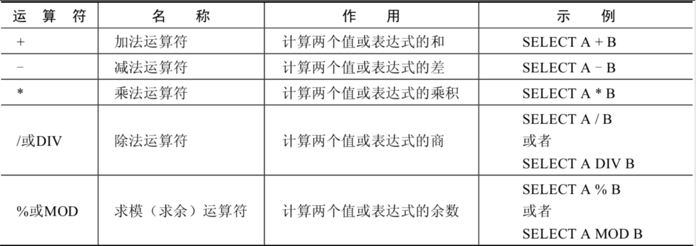
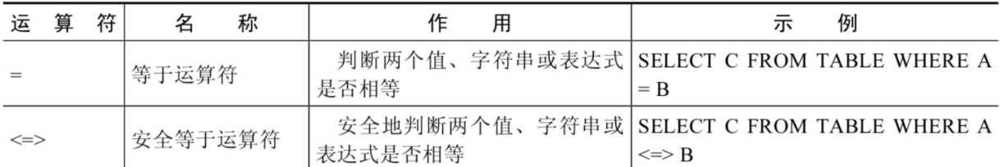
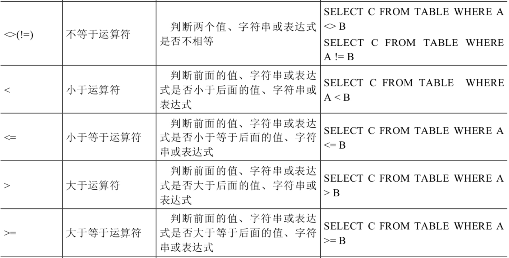
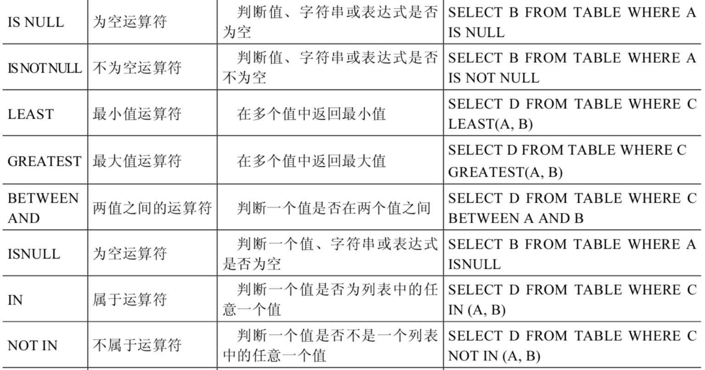
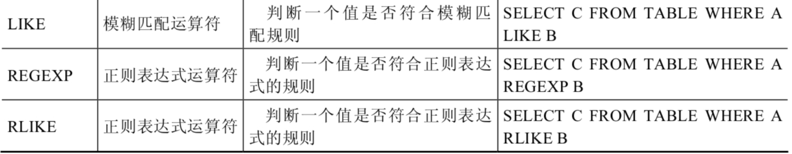
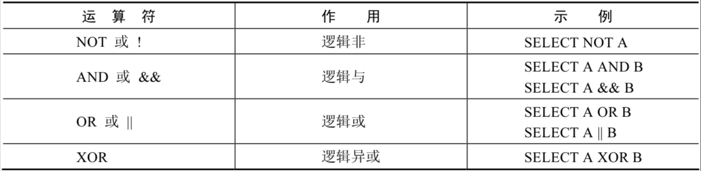
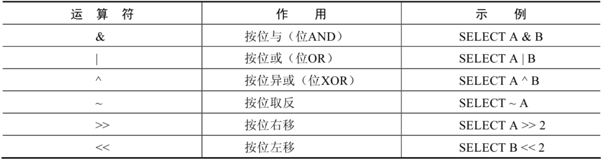
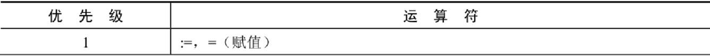
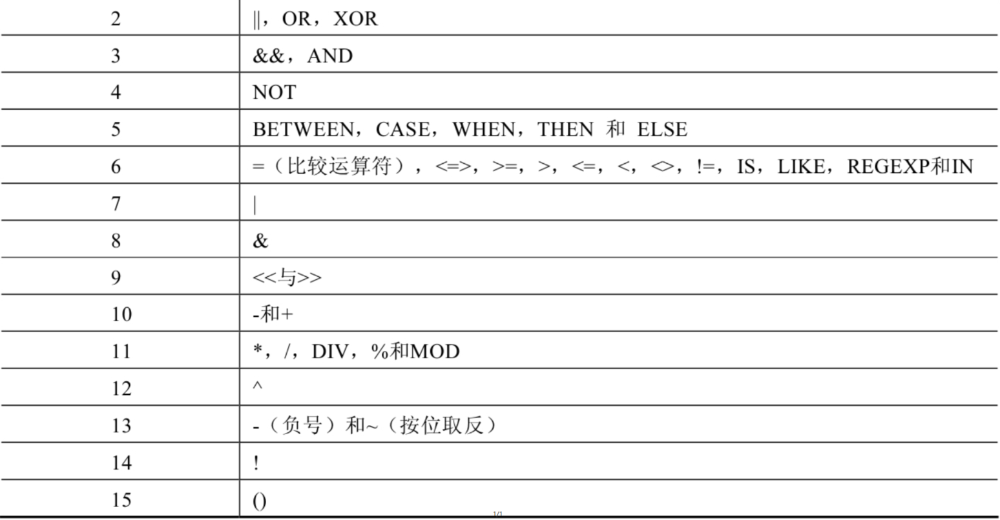

# MySQL

## 参考资料

- [【宋红康】MySQL 数据库（mysql 安装/基础/高级/优化）_哔哩哔哩_bilibili](https://www.bilibili.com/video/BV1iq4y1u7vj)

## 数据库的作用

1. 实现数据持久化
2. 使用完整的管理系统统一管理

## 名词解释

- DB（Database），数据库，它保存了一系列有组织的数据
- DBMS（Database Management System），数据库管理系统，简称数据库软件，可以对数据库进行操作
- DBA（Database Administrator），数据库管理员
- SQL（Structure Query Language），结构化查询语言

## 关系型数据库

### 概念

- 关系型数据库的典型数据结构就是`数据表`，这些数据表的组成都是结构化的（Structured）。

- 将数据放到表中，表再放到库中。

### 关系

- 一对一
- 一对多
- 多对多
- 自我引用

## 命令行

```bash
mysql -h localhost -P 3306 -u root -proot
```

- `-P`指定端口
- `-p`指定密码，密码可以不写在命令中，只指定参数而不写密码的话会在交互式命令行中输入密码，不会在密码历史或屏幕中暴露密码

## 默认数据库

// TODO Mysql 默认带的几个数据库的作用

## SQL

### SQL 概念

结构化查询语言（Structured Query Language），是一种规范，用来操作关系型数据库。但是每种数据库在实现上有略微不同，称为「方言」；

### 分类

1. DDL（Data Definition Language）数据定义语言：用于操作数据库对象，如数据库、表、字段等。关键字：`create`、`drop`、`alter`、`rename`、`truncate` ；
2. DML（Data Manipulation Language）数据操作语言：用于操作数据本身。关键字 `insert`、`delete`、`update`、`select` ；
3. DCL（Data Control Language）数据控制语言：用户操作数据库 的访问权限和安全级别，以及管理用户，关键字 `grant`、`revoke`、`commit`、`rollback`、`savepoint`。

### 规则

- SQL 可以写在一行或者多行。为了提高可读性，各子句分行写，必要时使用缩进
- 每条命令以`;`或 `\g`或`\G`结束
  - `\g`和`\G`只能在命令行中使用
  - `\g`和`;`的效果一样
  - `\G`会将结果表转置，行列转换
- 关键字不能被缩写也不能分行
- 关于标点符号
  - 必须保证所有的`()`、`单引号`、`双引号`是成对结束的
  - 必须使用**英文**状态下的**半角**输入方式
  - 字符串型和日期时间类型的数据可以使用单引号表示
  - 列的别名，尽量使用双引号，而且不建议省略`as`

### 规范

这是建议遵守的，不强制。

- MySQL 在 Windows 环境下是大小写不敏感的
- MySQL 在 Linux 环境下是大小写敏感的
  - 数据库名、表名、表的别名、变量名是严格区分大小写的
  - 关键字、函数名、列名（或字段名）、列的别名（字段的别名）是忽略大小写的。
- 推荐采用统一的书写规范
  - 数据库名、表名、表别名、字段名、字段别名等都小写
  - SQL 关键字、函数名、绑定变量等都大写

### 注释

```sql
-- 单行注释
# 单行注释
/*
  多行注释
 */
```

## SELECT 语句

```sql
select [distinct | ] 字段列表
from 表名列表
where 条件列表
group by 分组条件
having 分组之后的条件
order by 排序
limit 分页条件
escape '转义字符'
```

### 去除重复行

使用关键字`DISTINCT`去除重复行。

1. `DISTINCT`需要放到所有列名的前面
2. `DISTINCT`是对后面所有列名的组合进行去重

### 字段名和关键字冲突

在表名或字段名和关键字冲突时可能会造成歧义，这是使用着重号包裹字段名来避免歧义。

```sql
SELECT * FROM `ORDER`;
```

### 转义字符

默认的转义字符是`\`。

比如在使用`like`进行模糊查询的时候使用`_`作为单个字符的通配符，如果此时就是需要查询含有下划线的行，则需对其进行转义，如`_\__`，中间的下划线就被转义了。

使用`ESCAPE`来自定义转义字符，如`ESCAPE '&'`，意为使用`$`作为转义字符，此查询语句中的转义字符不再是`\`了。

## 运算符

### 算数运算符



### 比较运算符





- 如果等号两边的值、字符串或表达式都为字符串，则 MySQL 会按照字符串进行比较，其比较的是每个字符串中字符的 ANSI 编码是否相等。
- 如果等号两边的值一个是整数，另一个是字符串，则 MySQL 会将字符串转化为数字进行比较。
- 如果等号两边的值、字符串或表达式中有一个为 NULL，则比较结果为 NULL。





LIKE 运算符通常使用如下通配符。

- `%`匹配 0 个或多个字符。
- `_`只能匹配一个字符。

`REGEXP`和`RLIKE`均表示用正则表达式进行匹配。

### 逻辑运算符



### 位运算符



### 运算符的优先级

下图中数字编号越大，优先级越高。





### `NULL`参与运算

所有运算符或列值遇到`null`值，运算的结果都为`null`。

使用下面的方法安全处理`null`值。

1. `<=>`
2. `is null`
3. `is not null`
4. `isnull()`
5. `ifnull()`

## 排序

使用`ORDER BY`子句排序。

```sql
select * from 表 order by 字段 1 [, 字段 2, ...] [asc | desc];
```

- `ASC`（Ascend），升序，默认排序方式
- `DESC`（Descend），降序

可以多字段同时排序，在前面字段相同的情况下会比较后面的字段。

## 分页

使用`LIMIT`进行分页。

```sql
select * from 表 limit [offset,] rows;
```

- `offset`表示从第几行之后开始，最小值为`0`，可省略，默认为`0`
- `rows`表示查询出多少行

## 多表查询

### 内连接

```sql
select * from a [inner] join b on a.id = b.id;
```

只会显示两表的交集，结果集的行必须出现在两个表中。

### 外连接

```sql
select * from a left | right [outer] join b on a.id = b.id;
```

- 左外连接：结果集中的行不仅包含符合连接条件的行，同时还包括左表中的不符合连接条件的行，这些行中来自副表的字段内容都是`NULL`。
- 右外连接：同理。

### 全链接

MySQL 没有全连接，可以使用`UNION`来实现。

- `UNION`操作符返回两个查询的结果集的并集，去除重复记录。
- `UNION ALL`不除重复记录。

### SQL99 语法新特性

#### 自然连接

使用`NATURAL JOIN`来简化多表查询操作，此时会自动将两表中所有同名字段进行等值连接。

#### `USING`连接

使用`USING`来简化`ON`子句，如果连接条件中的字段名称相同的话可以使用。

```sql
select * from a join b on a.id = b.id;
select * from a join b using (id);
```

## 单行函数

### 数值函数

| 函数                | 用法                                                         |
| ------------------- | ------------------------------------------------------------ |
| ABS(x)              | 返回 x 的绝对值                                                |
| SIGN(X)             | 返回 X 的符号。正数返回 1，负数返回-1，0 返回 0                   |
| PI()                | 返回圆周率的值                                               |
| CEIL(x)，CEILING(x) | 返回大于或等于某个值的最小整数                               |
| FLOOR(x)            | 返回小于或等于某个值的最大整数                               |
| LEAST(e1,e2,e3…)    | 返回列表中的最小值                                           |
| GREATEST(e1,e2,e3…) | 返回列表中的最大值                                           |
| MOD(x,y)            | 返回 X 除以 Y 后的余数                                           |
| RAND()              | 返回 0~1 的随机值                                              |
| RAND(x)             | 返回 0~1 的随机值，其中 x 的值用作种子值，相同的 X 值会产生相同的随机数 |
| ROUND(x)            | 返回一个对 x 的值进行四舍五入后，最接近于 X 的整数               |
| ROUND(x,y)          | 返回一个对 x 的值进行四舍五入后最接近 X 的值，并保留到小数点后面 Y 位 |
| TRUNCATE(x,y)       | 返回数字 x 截断为 y 位小数的结果                                 |
| SQRT(x)             | 返回 x 的平方根。当 X 的值为负数时，返回 NULL                     |

#### 角度与弧度互换函数

| 函数       | 用法                                  |
| ---------- | ------------------------------------- |
| RADIANS(x) | 将角度转化为弧度，其中，参数 x 为角度值 |
| DEGREES(x) | 将弧度转化为角度，其中，参数 x 为弧度值 |

#### 三角函数

| 函数       | 用法                                                         |
| ---------- | ------------------------------------------------------------ |
| SIN(x)     | 返回 x 的正弦值，其中，参数 x 为弧度值                           |
| ASIN(x)    | 返回 x 的反正弦值，即获取正弦为 x 的值。如果 x 的值不在-1 到 1 之间，则返回 NULL |
| COS(x)     | 返回 x 的余弦值，其中，参数 x 为弧度值                           |
| ACOS(x)    | 返回 x 的反余弦值，即获取余弦为 x 的值。如果 x 的值不在-1 到 1 之间，则返回 NULL |
| TAN(x)     | 返回 x 的正切值，其中，参数 x 为弧度值                           |
| ATAN(x)    | 返回 x 的反正切值，即返回正切值为 x 的值                         |
| ATAN2(m,n) | 返回两个参数的反正切值                                       |
| COT(x)     | 返回 x 的余切值，其中，X 为弧度值                               |

#### 指数与对数

| 函数                 | 用法                                                 |
| -------------------- | ---------------------------------------------------- |
| POW(x,y)，POWER(X,Y) | 返回 x 的 y 次方                                         |
| EXP(X)               | 返回 e 的 X 次方，其中 e 是一个常数，2.718281828459045     |
| LN(X)，LOG(X)        | 返回以 e 为底的 X 的对数，当 X <= 0 时，返回的结果为 NULL  |
| LOG10(X)             | 返回以 10 为底的 X 的对数，当 X <= 0 时，返回的结果为 NULL |
| LOG2(X)              | 返回以 2 为底的 X 的对数，当 X <= 0 时，返回 NULL          |

#### 进制间的转换

| 函数          | 用法                     |
| ------------- | ------------------------ |
| BIN(x)        | 返回 x 的二进制编码        |
| HEX(x)        | 返回 x 的十六进制编码      |
| OCT(x)        | 返回 x 的八进制编码        |
| CONV(x,f1,f2) | 返回 f1 进制数变成 f2 进制数 |

### 字符串函数

MySQL 中，字符串的位置是从 1 开始的。

| 函数                              | 用法                                                         |
| --------------------------------- | ------------------------------------------------------------ |
| ASCII(S)                          | 返回字符串 S 中的第一个字符的 ASCII 码值                         |
| CHAR_LENGTH(s)                    | 返回字符串 s 的字符数。作用与 CHARACTER_LENGTH(s) 相同           |
| LENGTH(s)                         | 返回字符串 s 的字节数，和字符集有关                            |
| CONCAT(s1,s2,......,sn)           | 连接 s1,s2,......,sn 为一个字符串                              |
| CONCAT_WS(x, s1,s2,......,sn)     | 同 CONCAT(s1,s2,...) 函数，但是每个字符串之间要加上 x           |
| INSERT(str, idx, len, replacestr) | 将字符串 str 从第 idx 位置开始，len 个字符长的子串替换为字符串 replacestr |
| REPLACE(str, a, b)                | 用字符串 b 替换字符串 str 中所有出现的字符串 a                    |
| UPPER(s) 或 UCASE(s)              | 将字符串 s 的所有字母转成大写字母                              |
| LOWER(s)  或 LCASE(s)              | 将字符串 s 的所有字母转成小写字母                              |
| LEFT(str,n)                       | 返回字符串 str 最左边的 n 个字符                                 |
| RIGHT(str,n)                      | 返回字符串 str 最右边的 n 个字符                                 |
| LPAD(str, len, pad)               | 用字符串 pad 对 str 最左边进行填充，直到 str 的长度为 len 个字符     |
| RPAD(str ,len, pad)               | 用字符串 pad 对 str 最右边进行填充，直到 str 的长度为 len 个字符     |
| LTRIM(s)                          | 去掉字符串 s 左侧的空格                                        |
| RTRIM(s)                          | 去掉字符串 s 右侧的空格                                        |
| TRIM(s)                           | 去掉字符串 s 开始与结尾的空格                                  |
| TRIM(s1 FROM s)                   | 去掉字符串 s 开始与结尾的 s1                                    |
| TRIM(LEADING s1 FROM s)           | 去掉字符串 s 开始处的 s1                                        |
| TRIM(TRAILING s1 FROM s)          | 去掉字符串 s 结尾处的 s1                                        |
| REPEAT(str, n)                    | 返回 str 重复 n 次的结果                                         |
| SPACE(n)                          | 返回 n 个空格                                                  |
| STRCMP(s1,s2)                     | 比较字符串 s1,s2 的 ASCII 码值的大小                             |
| SUBSTR(s,index,len)               | 返回从字符串 s 的 index 位置其 len 个字符，作用与 SUBSTRING(s,n,len)、MID(s,n,len) 相同 |
| LOCATE(substr,str)                | 返回字符串 substr 在字符串 str 中首次出现的位置，作用于 POSITION(substr IN str)、INSTR(str,substr) 相同。未找到，返回 0 |
| ELT(m,s1,s2,…,sn)                 | 返回指定位置的字符串，如果 m=1，则返回 s1，如果 m=2，则返回 s2，如果 m=n，则返回 sn |
| FIELD(s,s1,s2,…,sn)               | 返回字符串 s 在字符串列表中第一次出现的位置                    |
| FIND_IN_SET(s1,s2)                | 返回字符串 s1 在字符串 s2 中出现的位置。其中，字符串 s2 是一个以逗号分隔的字符串 |
| REVERSE(s)                        | 返回 s 反转后的字符串                                          |
| NULLIF(value1,value2)             | 比较两个字符串，如果 value1 与 value2 相等，则返回 NULL，否则返回 value1 |

### 日期和时间函数

#### 获取日期、时间

| 函数                                                         | 用法                           |
| ------------------------------------------------------------ | ------------------------------ |
| **CURDATE()** ，CURRENT_DATE()                               | 返回当前日期，只包含年、月、日 |
| **CURTIME()** ，CURRENT_TIME()                              | 返回当前时间，只包含时、分、秒 |
| **NOW()** / SYSDATE() / CURRENT_TIMESTAMP() / LOCALTIME() / LOCALTIMESTAMP() | 返回当前系统日期和时间         |
| UTC_DATE()                                                   | 返回 UTC（世界标准时间）日期    |
| UTC_TIME()                                                   | 返回 UTC（世界标准时间）时间    |

#### 日期与时间戳的转换

| 函数                     | 用法                                                         |
| ------------------------ | ------------------------------------------------------------ |
| UNIX_TIMESTAMP()         | 以 UNIX 时间戳的形式返回当前时间。SELECT UNIX_TIMESTAMP() ->1634348884 |
| UNIX_TIMESTAMP(date)     | 将时间 date 以 UNIX 时间戳的形式返回。                           |
| FROM_UNIXTIME(timestamp) | 将 UNIX 时间戳的时间转换为普通格式的时间                       |

#### 获取月份、星期、星期数、天数等函数

| 函数                                     | 用法                                            |
| ---------------------------------------- | ----------------------------------------------- |
| YEAR(date) / MONTH(date) / DAY(date)     | 返回具体的日期值                                |
| HOUR(time) / MINUTE(time) / SECOND(time) | 返回具体的时间值                                |
| MONTHNAME(date)                          | 返回月份：January，...                          |
| DAYNAME(date)                            | 返回星期几：MONDAY，TUESDAY.....SUNDAY          |
| WEEKDAY(date)                            | 返回周几，注意，周 1 是 0，周 2 是 1，。。。周日是 6   |
| QUARTER(date)                            | 返回日期对应的季度，范围为 1～4                  |
| WEEK(date) ， WEEKOFYEAR(date)           | 返回一年中的第几周                              |
| DAYOFYEAR(date)                          | 返回日期是一年中的第几天                        |
| DAYOFMONTH(date)                         | 返回日期位于所在月份的第几天                    |
| DAYOFWEEK(date)                          | 返回周几，注意：周日是 1，周一是 2，。。。周六是 7 |

#### 时间和秒钟转换的函数

| 函数                 | 用法                                                         |
| -------------------- | ------------------------------------------------------------ |
| TIME_TO_SEC(time)    | 将 time 转化为秒并返回结果值。转化的公式为：`小时*3600+分钟*60+秒` |
| SEC_TO_TIME(seconds) | 将 seconds 描述转化为包含小时、分钟和秒的时间                |

#### 计算日期和时间的函数

| 函数                                                         | 用法                                           |
| ------------------------------------------------------------ | ---------------------------------------------- |
| DATE_ADD(datetime, INTERVAL  expr type)，ADDDATE(date,INTERVAL expr type) | 返回与给定日期时间相差 INTERVAL 时间段的日期时间 |
| DATE_SUB(date,INTERVAL expr type)，SUBDATE(date,INTERVAL expr type) | 返回与 date 相差 INTERVAL 时间间隔的日期           |

| 函数                         | 用法                                                         |
| ---------------------------- | ------------------------------------------------------------ |
| ADDTIME(time1,time2)         | 返回 time1 加上 time2 的时间。当 time2 为一个数字时，代表的是`秒`，可以为负数 |
| SUBTIME(time1,time2)         | 返回 time1 减去 time2 后的时间。当 time2 为一个数字时，代表的是`秒`，可以为负数 |
| DATEDIFF(date1,date2)        | 返回 date1 - date2 的日期间隔天数                              |
| TIMEDIFF(time1, time2)       | 返回 time1 - time2 的时间间隔                                  |
| FROM_DAYS(N)                 | 返回从 0000 年 1 月 1 日起，N 天以后的日期                          |
| TO_DAYS(date)                | 返回日期 date 距离 0000 年 1 月 1 日的天数                           |
| LAST_DAY(date)               | 返回 date 所在月份的最后一天的日期                             |
| MAKEDATE(year,n)             | 针对给定年份与所在年份中的天数返回一个日期                   |
| MAKETIME(hour,minute,second) | 将给定的小时、分钟和秒组合成时间并返回                       |
| PERIOD_ADD(time,n)           | 返回 time 加上 n 后的时间                                        |

#### 日期的格式化与解析

| 函数                              | 用法                                       |
| --------------------------------- | ------------------------------------------ |
| DATE_FORMAT(date,fmt)             | 按照字符串 fmt 格式化日期 date 值              |
| TIME_FORMAT(time,fmt)             | 按照字符串 fmt 格式化时间 time 值              |
| GET_FORMAT(date_type,format_type) | 返回日期字符串的显示格式                   |
| STR_TO_DATE(str, fmt)             | 按照字符串 fmt 对 str 进行解析，解析为一个日期 |

### 流程控制函数

| 函数                                                         | 用法                                            |
| ------------------------------------------------------------ | ----------------------------------------------- |
| IF(value,value1,value2)                                      | 如果 value 的值为 TRUE，返回 value1，否则返回 value2 |
| IFNULL(value1, value2)                                       | 如果 value1 不为 NULL，返回 value1，否则返回 value2  |
| CASE WHEN 条件 1 THEN 结果 1 WHEN 条件 2 THEN 结果 2 .... [ELSE resultn] END | 相当于 Java 的 if...else if...else...              |
| CASE  expr WHEN 常量值 1 THEN 值 1 WHEN 常量值 1 THEN 值 1 .... [ELSE 值 n] END | 相当于 Java 的 switch...case...                    |

### 加密与解密函数

| 函数                        | 用法                                                         |
| --------------------------- | ------------------------------------------------------------ |
| PASSWORD(str)               | 返回字符串 str 的加密版本，41 位长的字符串。加密结果`不可逆`，常用于用户的密码加密 |
| MD5(str)                    | 返回字符串 str 的 md5 加密后的值，也是一种加密方式。若参数为 NULL，则会返回 NULL |
| SHA(str)                    | 从原明文密码 str 计算并返回加密后的密码字符串，当参数为 NULL 时，返回 NULL。`SHA 加密算法比 MD5 更加安全`。 |
| ENCODE(value,password_seed) | 返回使用 password_seed 作为加密密码加密 value                   |
| DECODE(value,password_seed) | 返回使用 password_seed 作为加密密码解密 value                   |

### MySQL 信息函数

| 函数                                                  | 用法                                                     |
| ----------------------------------------------------- | -------------------------------------------------------- |
| VERSION()                                             | 返回当前 MySQL 的版本号                                    |
| CONNECTION_ID()                                       | 返回当前 MySQL 服务器的连接数                              |
| DATABASE()，SCHEMA()                                  | 返回 MySQL 命令行当前所在的数据库                          |
| USER()，CURRENT_USER()、SYSTEM_USER()，SESSION_USER() | 返回当前连接 MySQL 的用户名，返回结果格式为“主机名 @用户名” |
| CHARSET(value)                                        | 返回字符串 value 自变量的字符集                            |
| COLLATION(value)                                      | 返回字符串 value 的比较规则                                |

### 其他函数

| 函数                           | 用法                                                         |
| ------------------------------ | ------------------------------------------------------------ |
| FORMAT(value,n)                | 返回对数字 value 进行格式化后的结果数据。n 表示`四舍五入`后保留到小数点后 n 位 |
| INET_ATON(ipvalue)             | 将以点分隔的 IP 地址转化为一个数字                             |
| INET_NTOA(value)               | 将数字形式的 IP 地址转化为以点分隔的 IP 地址                     |
| BENCHMARK(n,expr)              | 将表达式 expr 重复执行 n 次。用于测试 MySQL 处理 expr 表达式所耗费的时间 |
| CONVERT(value USING char_code) | 将 value 所使用的字符编码修改为 char_code                       |

## 聚合函数

聚合函数作用于一组数据，并对一组数据返回一个值。

### AVG 和 SUM 函数

可以对**数值型数据**使用`AVG`和`SUM`函数。

### MIN 和 MAX 函数

可以对**任意数据类型**的数据使用`MIN`和`MAX`函数。

### COUNT 函数

- `COUNT(*)`返回表中记录总数，适用于**任意数据类型**。
- `COUNT(expr)`返回**expr 不为空**的记录总数。

- **问题：用`count(*)`，`count(1)`，`count(列名)`谁好呢？**

  其实，对于 MyISAM 引擎的表是没有区别的。这种引擎内部有一计数器在维护着行数。

  Innodb 引擎的表用`count(*)`,`count(1)`直接读行数，复杂度是 O(n)，因为 innodb 真的要去数一遍。但好于具体的`count(列名)`。

- **问题：能不能使用`count(列名)`替换`count(*)`?**

  不要使用 count(列名) 来替代 `count(*)`，`count(*)`是 SQL92 定义的标准统计行数的语法，跟数据库无关，跟 NULL 和非 NULL 无关。

  说明：`count(*)`会统计值为 NULL 的行，而`count(列名)`不会统计此列为 NULL 值的行。

### GROUP BY

可以使用`GROUP BY`子句将表中的数据分成若干组。

在`SELECT`列表中的字段都必须出现在`GROUP BY`子句中，除了在聚合函数中的字段。如果不遵守的话在 MySQL 中不会提示错误，但是这个字段在行中是无意义的。

```sql
SELECT   department_id, AVG(salary)
FROM     employees
GROUP BY department_id ;
```

包含在`GROUP BY`子句中的列不必包含在`SELECT`列表中。

```sql
SELECT   AVG(salary)
FROM     employees
GROUP BY department_id ;
```

`GROUP BY`后可以有多个列，此时按这些列的各个组合进行分组。

使用`WITH ROLLUP`关键字之后，在所有查询出的分组记录之后增加一条记录，就是将所有组的数据代入到聚合函数中。没有使用聚合函数的列显示为 NULL。

### HAVING

1. `HAVING`不能单独使用，必须要跟`GROUP BY`一起使用。
2. 用来过滤分组结果，满足条件的分组行才会被查询出来。
3. 在之后可以使用聚合函数。

`WHERE`和`HAVING`的对比。

1. `WHERE`跟在`FROM`后面，`HAVING`跟在`GROUP BY`后面；
2. `WHERE`后面不能使用聚合函数，`HAVING`可以；
3. `WHERE`在分组前筛选，`HAVING`在分组后筛选；
4. 在多表查询中`WHERE`的效率更高，所以不涉及到聚合函数的条件写在`WHERE`中更好。

## SELECT 的执行过程

在 SELECT 语句执行这些步骤的时候，每个步骤都会产生一个`虚拟表`，然后将这个虚拟表传入下一个步骤中作为输入。需要注意的是，这些步骤隐含在 SQL 的执行过程中，对于我们来说是不可见的。

```sql
SELECT DISTINCT player_id, player_name, count(*) as num # 顺序 5
FROM player JOIN team ON player.team_id = team.team_id # 顺序 1
WHERE height > 1.80 # 顺序 2
GROUP BY player.team_id # 顺序 3
HAVING num > 2 # 顺序 4
ORDER BY num DESC # 顺序 6
LIMIT 2 # 顺序 7
```

## 子查询

子查询指一个查询语句嵌套在另一个查询语句内部的查询。

- 子查询要包含在括号内
- 将子查询放在比较条件的右侧
- 单行操作符对应单行子查询，多行操作符对应多行子查询

在下列子句中都可以写子查询。

- `SELECT`
- `FROM`
- `WHERE`
- `HAVING`
- `ORDER BY`

### 单行子查询

单行比较操作符后面只能是单行子查询。

### 多行子查询

多行操作符后面可以是单行子查询，也可以是多行子查询。

| 操作符 | 含义                                                         |
| ------ | ------------------------------------------------------------ |
| `IN`   | 等于列表中的**任意一个**                                     |
| `ANY`  | 需要和单行比较操作符一起使用，和子查询返回的**某一个**值比较，只要有一行满足条件即可 |
| `ALL`  | 需要和单行比较操作符一起使用，和子查询返回的**所有**值比较，需要所有行都满足条件 |
| `SOME` | 实际上是 ANY 的别名，作用相同，一般常使用 ANY                   |

### 相关子查询

子查询会执行多次。子查询中使用了外部的信息。

### `EXISTS`与`NOT EXISTS`

用在`WHERE`子句中。`EXISTS`与`NOT EXISTS`后面都跟一个子查询，如果子查询返回有数据则`EXISTS`返回`1`，否则返回`0`；`NOT EXISTS`正相反。

```sql
SELECT
	employee_id ,
	last_name ,
	job_id ,
	department_id
from
	employees e
WHERE
	EXISTS (
	select
		1
	from
		employees e2
	WHERE
		e2.manager_id = e.employee_id
);
```

### 相关更新

使用相关子查询依据一个表中的数据更新另一个表的数据。

```sql
UPDATE employees e
SET department_name =  (SELECT department_name
	                       FROM   departments d
	                       WHERE  e.department_id = d.department_id);
```

### 相关删除

使用相关子查询依据一个表中的数据删除另一个表的数据。

```sql
DELETE FROM employees e
WHERE employee_id in
           (SELECT employee_id
            FROM   emp_history
            WHERE  employee_id = e.employee_id);
```

## 创建表和管理表

### 标识符命名规则

- 数据库名、表名不得超过 30 个字符，变量名限制为 29 个
- 必须只能包含 `A–Z`、`a–z`、`0–9`和`_`共 63 个字符
- 同一个 MySQL 软件中，数据库不能同名；同一个库中，表不能重名；同一个表中，字段不能重名
- 必须保证你的字段没有和保留字、数据库系统或常用方法冲突。如果坚持使用，请在 SQL 语句中使用`（着重号）引起来
- 保持字段名和类型的一致性：在命名字段并为其指定数据类型的时候一定要保证一致性，假如数据类型在一个表里是整数，那在另一个表里可就别变成字符型了

### MySQL 中的数据类型

| 类型             | 类型举例                                                     |
| ---------------- | ------------------------------------------------------------ |
| 整数类型         | TINYINT、SMALLINT、MEDIUMINT、**INT（或 INTEGER）**、BIGINT     |
| 浮点类型         | FLOAT、DOUBLE                                                |
| 定点数类型       | **DECIMAL**                                                  |
| 位类型           | BIT                                                          |
| 日期时间类型     | YEAR、TIME、**DATE**、DATETIME、TIMESTAMP                    |
| 文本字符串类型   | CHAR、**VARCHAR**、TINYTEXT、TEXT、MEDIUMTEXT、LONGTEXT      |
| 枚举类型         | ENUM                                                         |
| 集合类型         | SET                                                          |
| 二进制字符串类型 | BINARY、VARBINARY、TINYBLOB、BLOB、MEDIUMBLOB、LONGBLOB      |
| JSON 类型         | JSON 对象、JSON 数组                                           |
| 空间数据类型     | 单值：GEOMETRY、POINT、LINESTRING、POLYGON；<br/>集合：MULTIPOINT、MULTILINESTRING、MULTIPOLYGON、GEOMETRYCOLLECTION |

其中，常用的几类类型介绍如下。

| 数据类型      | 描述                                                         |
| ------------- | ------------------------------------------------------------ |
| INT           | 从 $-2^{31}$ 到 $2^{31}-1$ 的整型数据。存储大小为 4 个字节       |
| CHAR(size)    | 定长字符数据。若未指定，默认为 1 个字符，最大长度 255        |
| VARCHAR(size) | 可变长字符数据，根据字符串实际长度保存，**必须指定长度**     |
| FLOAT(M,D)    | 单精度，占用 4 个字节，$M=整数位 + 小数位$，$D=小数位$。 $D<=M<=255$，$0<=D<=30$，默认 $M+D<=6$ |
| DOUBLE(M,D)   | 双精度，占用 8 个字节，$D<=M<=255$，$0<=D<=30$，默认 $M+D<=15$ |
| DECIMAL(M,D)  | 高精度小数，占用 $M+2$ 个字节，$D<=M<=65$，$0<=D<=30$，最大取值范围与 DOUBLE 相同。 |
| DATE          | 日期型数据，格式「YYYY-MM-DD」                               |
| BLOB          | 二进制形式的长文本数据，最大可达 4G                          |
| TEXT          | 长文本数据，最大可达 4G                                      |

常见数据类型的属性，如下：

| MySQL 关键字        | 含义                     |
| ------------------ | ------------------------ |
| NULL               | 数据列可包含 NULL 值       |
| NOT NULL           | 数据列不允许包含 NULL 值   |
| DEFAULT            | 默认值                   |
| PRIMARY KEY        | 主键                     |
| AUTO_INCREMENT     | 自动递增，适用于整数类型 |
| UNSIGNED           | 无符号                   |
| CHARACTER SET name | 指定一个字符集           |

### 数据类型精讲

#### 整数类型

| **整数类型** | **字节** | 有符号数取值范围                         | 无符号数取值范围       |
| ------------ | -------- | ---------------------------------------- | ---------------------- |
| TINYINT      | 1        | -128~127                                 | 0~255                  |
| SMALLINT     | 2        | -32768~32767                             | 0~65535                |
| MEDIUMINT    | 3        | -8388608~8388607                         | 0~16777215             |
| INT、INTEGER | 4        | -2147483648~2147483647                   | 0~4294967295           |
| BIGINT       | 8        | -9223372036854775808~9223372036854775807 | 0~18446744073709551615 |

#### 浮点类型


#### 定点数类型

| 数据类型                 | 字节数  | 含义               |
| ------------------------ | ------- | ------------------ |
| DECIMAL(M,D),DEC,NUMERIC | M+2 字节 | 有效范围由 M 和 D 决定 |

#### 位类型

| 二进制字符串类型 | 长度 | 长度范围     | 占用空间            |
| ---------------- | ---- | ------------ | ------------------- |
| BIT(M)           | M    | 1 <= M <= 64 | 约为 (M + 7)/8 个字节 |

#### 日期与时间类型

| 类型      | 名称     | 字节 | 日期格式            | 最小值                  | 最大值                 |
| --------- | -------- | ---- | ------------------- | ----------------------- | ---------------------- |
| YEAR      | 年       | 1    | YYYY 或 YY            | 1901                    | 2155                   |
| TIME      | 时间     | 3    | HH:MM:SS            | -838:59:59              | 838:59:59              |
| DATE      | 日期     | 3    | YYYY-MM-DD          | 1000-01-01              | 9999-12-03             |
| DATETIME  | 日期时间 | 8    | YYYY-MM-DD HH:MM:SS | 1000-01-01 00:00:00     | 9999-12-31 23:59:59    |
| TIMESTAMP | 日期时间 | 4    | YYYY-MM-DD HH:MM:SS | 1970-01-01 00:00:00 UTC | 2038-01-19 03:14:07UTC |

#### 文本字符串类型

| 字符串 (文本) 类型 | 特点     | 长度 | 长度范围        | 占用的存储空间        |
| ---------------- | -------- | ---- | --------------- | --------------------- |
| CHAR(M)          | 固定长度 | M    | 0 <= M <= 255   | M 个字节               |
| VARCHAR(M)       | 可变长度 | M    | 0 <= M <= 65535 | (实际长度 + 1) 个字节 |

| 文本字符串类型 | 特点               | 长度 | 长度范围                         | 占用的存储空间 |
| -------------- | ------------------ | ---- | -------------------------------- | -------------- |
| TINYTEXT       | 小文本、可变长度   | L    | 0 <= L <= 255                    | L + 2 个字节   |
| TEXT           | 文本、可变长度     | L    | 0 <= L <= 65535                  | L + 2 个字节   |
| MEDIUMTEXT     | 中等文本、可变长度 | L    | 0 <= L <= 16777215               | L + 3 个字节   |
| LONGTEXT       | 大文本、可变长度   | L    | 0 <= L<= 4294967295（相当于 4GB） | L + 4 个字节   |

#### ENUM 类型

| 文本字符串类型 | 长度 | 长度范围        | 占用的存储空间 |
| -------------- | ---- | --------------- | -------------- |
| ENUM           | L    | 1 <= L <= 65535 | 1 或 2 个字节     |

#### SET 类型

| 成员个数范围（L 表示实际成员个数） | 占用的存储空间 |
| --------------------------------- | -------------- |
| 1 <= L <= 8                       | 1 个字节        |
| 9 <= L <= 16                      | 2 个字节        |
| 17 <= L <= 24                     | 3 个字节        |
| 25 <= L <= 32                     | 4 个字节        |
| 33 <= L <= 64                     | 8 个字节        |

#### 二进制字符串类型

| 二进制字符串类型 | 特点     | 值的长度             | 占用空间  |
| ---------------- | -------- | -------------------- | --------- |
| BINARY(M)        | 固定长度 | M （0 <= M <= 255）  | M 个字节   |
| VARBINARY(M)     | 可变长度 | M（0 <= M <= 65535） | M+1 个字节 |

| 二进制字符串类型 | 值的长度 | 长度范围                          | 占用空间     |
| ---------------- | -------- | --------------------------------- | ------------ |
| TINYBLOB         | L        | 0 <= L <= 255                     | L + 1 个字节 |
| BLOB             | L        | 0 <= L <= 65535（相当于 64KB）     | L + 2 个字节 |
| MEDIUMBLOB       | L        | 0 <= L <= 16777215（相当于 16MB） | L + 3 个字节 |
| LONGBLOB         | L        | 0 <= L <= 4294967295（相当于 4GB） | L + 4 个字节 |

#### JSON 类型

```sql
INSERT INTO test_json (js)
VALUES ('{"name":"songhk", "age":18, "address":{"province":"beijing", "city":"beijing"}}');

SELECT js -> '$.name' AS NAME,js -> '$.age' AS age ,js -> '$.address.province' AS province, js -> '$.address.city' AS city
    -> FROM test_json;
```

#### 空间类型

MySQL 的空间数据类型（Spatial Data Type）对应于 OpenGIS 类，包括单值类型：GEOMETRY、POINT、LINESTRING、POLYGON 以及集合类型：MULTIPOINT、MULTILINESTRING、MULTIPOLYGON、GEOMETRYCOLLECTION。

### 管理数据库

#### 创建数据库

```sql
CREATE DATABASE 数据库名;
CREATE DATABASE 数据库名 CHARACTER SET 'utf8mb4';
CREATE DATABASE IF NOT EXISTS 数据库名 CHARACTER SET 'utf8mb4';
```

数据库不能改名，只能删除重建。

#### 使用数据库

```sql
# 查看所有数据库
SHOW DATABASES;

# 查询建表语句
SHOW CREATE DATABASE 数据库名;

# 选择使用某个数据库
USE 数据库名;

# 查看当前正在使用的数据库
SELECT DATABASE();
```

#### 修改数据库

```sql
# 更改数据库字符集
ALTER DATABASE 数据库名 CHARACTER SET 字符集;
```

#### 删除数据库

```sql
DROP DATABASE 数据库名;
# 数据库不存在时不会报错
DROP DATABASE IF EXISTS 数据库名;
```

### 管理表

#### 创建表

```sql
# 方式一 直接创建表
CREATE TABLE [IF NOT EXISTS] 表名(
	字段1, 数据类型 [约束条件] [默认值],
	字段2, 数据类型 [约束条件] [默认值],
	字段3, 数据类型 [约束条件] [默认值],
	……
	[表约束条件]
);
```

```sql
CREATE TABLE dept(
    -- int 类型，自增
	deptno INT(2) AUTO_INCREMENT,
	dname VARCHAR(14),
	loc VARCHAR(13),
    -- 主键
    PRIMARY KEY (deptno)
);
```

```sql
# 方式二 基于子查询创建表，并导入数据
CREATE TABLE 表名
	[(列, 列...)]
AS (子查询)
```

```sql
CREATE TABLE emp1 AS SELECT * FROM employees;
```

#### 使用表

```sql
# 查看当前数据库下的所有表
show tables;

# 查询建表语句
show create table t1;

# 查询表结构
desc t1;
describe t1;
```

#### 修改表

```sql
# 新增列
ALTER TABLE 表名 ADD 【COLUMN】 字段名 字段类型 【FIRST|AFTER 字段名】;

ALTER TABLE dept80
ADD job_id varchar(15);

# 修改列
ALTER TABLE 表名 MODIFY 【COLUMN】 字段名1 字段类型 【DEFAULT 默认值】【FIRST|AFTER 字段名2】;

ALTER TABLE	dept80
MODIFY last_name VARCHAR(30);

ALTER TABLE	dept80
MODIFY salary double(9,2) default 1000;

# 重名命列
ALTER TABLE 表名 CHANGE 【column】 列名 新列名 新数据类型;

ALTER TABLE  dept80
CHANGE department_name dept_name varchar(15);

# 删除列
ALTER TABLE 表名 DROP 【COLUMN】字段名

ALTER TABLE  dept80
DROP COLUMN  job_id;
```

#### 重命名表

```sql
# 方式一
RENAME TABLE emp
TO myemp;

# 方式二
ALTER table dept
RENAME [TO] detail_dept;  -- [TO] 可以省略
```

#### 删除表

- 在 MySQL 中，当一张数据表没有与其他任何数据表形成关联关系时，可以将当前数据表直接删除；
- 数据和结构都被删除；
- 所有正在运行的相关事务被提交；
- 所有相关索引被删除；
- `DROP TABLE`语句不能回滚。

```sql
DROP TABLE [IF EXISTS] 数据表1 [, 数据表2, …, 数据表n];

DROP TABLE dept80;
```

#### 清空表

- 删除表中所有的数据；
- 释放表的存储空间；
- `TRUNCATE`语句**不能回滚**，而使用`DELETE`语句删除数据，可以回滚。

```sql
TRUNCATE TABLE detail_dept;
```

> 阿里开发规范：
>
> 【参考】TRUNCATE TABLE 比 DELETE 速度快，且使用的系统和事务日志资源少，但 TRUNCATE 无事务且不触发 TRIGGER，有可能造成事故，故不建议在开发代码中使用此语句。
>
> 说明：TRUNCATE TABLE 在功能上与不带 WHERE 子句的 DELETE 语句相同。

### DDL 原子化

MySQL 8 中支持。在执行 DDL 语句的时候遇到错误可以回滚，不会部分提交。

## DCL

- `COMMIT`，一旦提交，数据就写入到数据库中，不能回滚了；
- `ROLLBACK`，回滚到最近一次`COMMIT`之后。

```sql
# 不器用自动提交，默认情况下是自动提交的
SET autocommit = FALSE
```

## DML

### 插入数据

```sql
# 1
INSERT INTO 表名
VALUES (value1,value2,....);

INSERT INTO departments
VALUES (70, 'Pub', 100, 1700);

# 2
INSERT INTO 表名(column1 [, column2, …, columnn])
VALUES (value1 [,value2, …, valuen]);

INSERT INTO departments(department_id, department_name)
VALUES (80, 'IT');

# 3
INSERT INTO table_name
VALUES
(value1 [,value2, …, valuen]),
(value1 [,value2, …, valuen]),
……
(value1 [,value2, …, valuen]);

INSERT INTO emp(emp_id,emp_name)
    VALUES (1001,'shkstart'),
    (1002,'atguigu'),
    (1003,'Tom');

# 4 将查询结果插入到表中
INSERT INTO 目标表名
(tar_column1 [, tar_column2, …, tar_columnn])
SELECT
(src_column1 [, src_column2, …, src_columnn])
FROM 源表名
[WHERE condition]

INSERT INTO emp2
SELECT *
FROM employees
WHERE department_id = 90;
```

### 更新数据

```sql
UPDATE table_name
SET column1=value1, column2=value2, … , column=valuen
[WHERE condition]
```

### 删除数据

```sql
DELETE FROM table_name [WHERE <condition>];
```

### 计算列

MySQL 8 新特性。某一列的值是通过别的列计算得来的。

在 MySQL 8.0 中，`CREATE TABLE`和`ALTER TABLE`中都支持增加计算列。

```sql
CREATE TABLE tb1(
id INT,
a INT,
b INT,
c INT GENERATED ALWAYS AS (a + b) VIRTUAL
);

INSERT INTO tb1(a,b) VALUES (100,200);

SELECT * FROM tb1;
```

```
+------+------+------+------+
| id   | a    | b    | c    |
+------+------+------+------+
| NULL |  100 |  200 |  300 |
+------+------+------+------+
```

