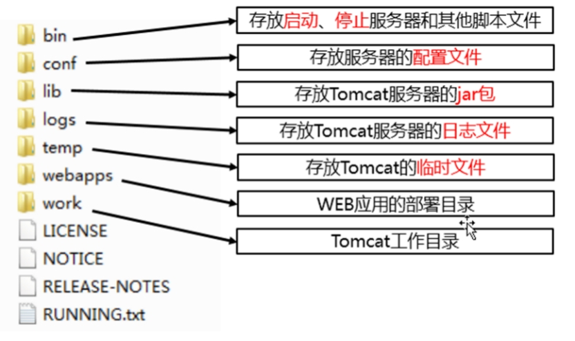
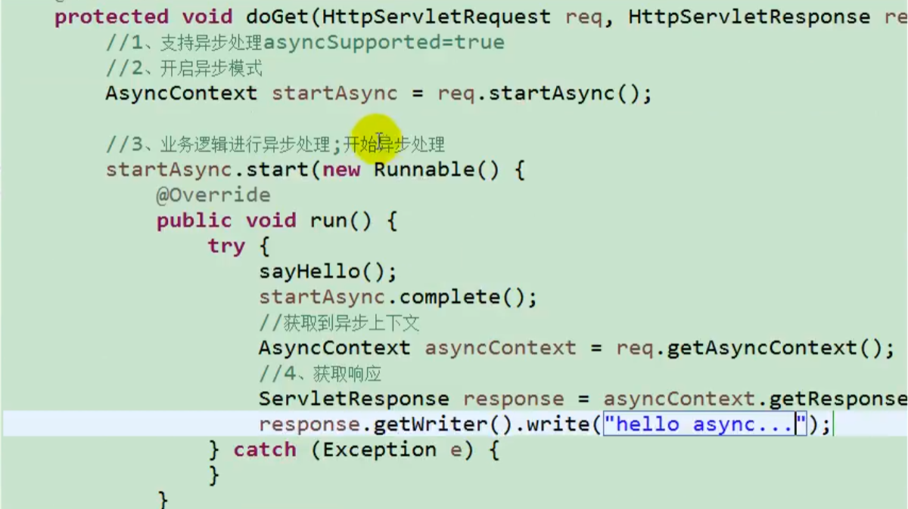

# Java Web

## 参考资料

- [尚硅谷丨 2022 版 JavaWeb 教程 (全新技术栈，全程实战)\_哔哩哔哩\_bilibili](https://www.bilibili.com/video/BV1AS4y177xJ)
- [JavaWeb | 代码重工](https://heavy_code_industry.gitee.io/code_heavy_industry/pro001-javaweb/)
- [Web 阶段 [还没开始写]](https://www.wolai.com/518LcmX2Ruo7c7SKaVbrNz)
- [group javax.servlet has published 4 artifact(s) with total 41 version(s)](https://javadoc.io/doc/javax.servlet)

## Tomcat

### Tomcat 简介

Servlet 容器，实现了 Servlet 标准。

### Tomcat 目录结构



## Servlet

### 概念

Server applet，运行在服务器端的小程序。

Servlet 属于 Java EE 标准，用于企业级 Web 开发，后改名为 Jakarta EE。

Servlet、Tomcat 和 Java 版本选择请参考 *Tomcat 网站* [^1]。关于 Servlet 名称历史及版本历史可以参考其 *维基百科页面* [^2]。

### 引入

- 4.0.1 及之前使用此 Maven 坐标，搭配 Tomcat 9 及之前版本。

    ```xml title="pom.xml"
    <!-- https://mvnrepository.com/artifact/javax.servlet/javax.servlet-api -->
    <dependency>
        <groupId>javax.servlet</groupId>
        <artifactId>javax.servlet-api</artifactId>
        <version>4.0.1</version>
        <scope>provided</scope>
    </dependency>
    ```

- 4.0.2 及之后使用此坐标。

    ```xml title="pom.xml"
    <!-- https://mvnrepository.com/artifact/jakarta.servlet/jakarta.servlet-api -->
    <dependency>
        <groupId>jakarta.servlet</groupId>
        <artifactId>jakarta.servlet-api</artifactId>
        <version>4.0.4</version>
        <scope>provided</scope>
    </dependency>
    ```

- 5.0 之后使用此坐标，搭配 Tomcat 10 使用。从 5 开始后包名改变了。

    ```xml title="pom.xml"
    <!-- https://mvnrepository.com/artifact/jakarta.servlet/jakarta.servlet-api -->
    <dependency>
        <groupId>jakarta.servlet</groupId>
        <artifactId>jakarta.servlet-api</artifactId>
        <version>6.0.0</version>
        <scope>provided</scope>
    </dependency>
    ```

### 快速入门

1. 创建 JavaEE 项目
2. 定义一个类，实现`javax.servlet.Servlet`接口
3. 实现接口中的抽象方法，只重写`service`方法就可以
4. 配置 Servlet
5. 改 `web.xml` 文件

    ```xml title="web.xml"
    <!--    配置 Servlet-->
    <servlet>
        <servlet-name>demo</servlet-name>
        <servlet-class>me.iuok.web.Demo</servlet-class>
    </servlet>

    <servlet-mapping>
        <servlet-name>demo</servlet-name>
        <url-pattern>/</url-pattern>
    </servlet-mapping>
    ```

### 生命周期

1. 构造器方法；
2. `void init(ServletConfig servletConfig)`默认第一次被访问时执行，只会执行一次，设置 `<load-on-startup>0</load-on-startup>` 可以在启动时自动执行；
3. `void service(ServletRequest servletRequest, ServletResponse servletResponse)`每次访问服务的时候都会执行；
4. `void destroy()`关闭时执行，只执行一次。

### 体系结构

- `Servlet`只是一个接口，我们要使用它的话需要实现里面所有的抽象方法；
- `GenericServlet`对所有抽象方法作了空实现，我们只需要重写自己需要用到的方法，比如`service()`，其它不需要的方法保持默认即可；
- `HttpServlet` 对`Servlet`作了更多的封装，`service`也不需要我们自己写了，它在 `service`方法里对请求方式作了判断，然后转发请求到对应的 `doGet`、`doPost` 等方法中，我们只需要重写这些方法就可以。

### ServletConfig

- `String getInitParameter(String name)`可以从配置文件中读取`init-param`中的内容。

    ```xml title="web.xml"
    <servlet>
        <servlet-name>exampleServlet</servlet-name>
        <servlet-class>me.iuok.servlet.ExampleServlet</servlet-class>
        <init-param>
                <param-name>encode</param-name>
                <param-value>UTF-8</param-value>
        </init-param>
    </servlet>
    ```

    ```java
    Enumeration<String> parameterNames = config.getInitParameterNames();
    while (parameterNames.hasMoreElements()) {
        String parameterName = parameterNames.nextElement();
        String value = config.getInitParameter(parameterName);
        log.info("{}: {}", parameterName, value);
    }
    ```

- `Enumeration<String> getInitParameterNames()`
- `ServletContext getServletContext()`
- `String getServletName()`

### ServletContext

当前 Servlet 类的实例，可以和容器通讯。

- `Enumeration<String> getInitParameterNames()`获取`context-param`配置，这是所有 Servlet 都可以读取的。这里的`context-param`没有写在`servlet`标签之内。

    ```xml title="web.xml"
    <context-param>
        <param-name>encoding</param-name>
        <param-value>UTF-8</param-value>
    </context-param>
    ```

- `String getInitParameter(String name)`
- `String getContextPath()`获取项目路径，在前面会有一个`/`
- `String getRealPath(String path)`获取文件在磁盘上的真实路径

1. 获取 MIME 类型
   - `String getMimeType(String file)`
2. 域对象：共享数据，所用会话所有请求的数据，在整个容器的生命周期里都存在
   - `void setAttribute(String name, Object object)`
   - `Object getAttribute(String name)`
   - `void removeAttribute(String name)`
3. 获取文件的绝对路径
   - `String getRealPath(String path)`

两种获取办法：

1. ServletContext `servletRequset.getServletContext()`
2. ServletContext `genericServlet.getServletContext()`

### HttpServlet

直接实现`Servlet`来实现方法太麻烦，以后直接继承`HttpServlet`。它重写了`Servlet`方法，现在就不需要写`service`方法了。

- `doGet(HttpServletRequest req, HttpServletResponse resp)`
- `doXxx(...)`

### ServletRequest

- 获取请求参数
  - `String getParameter(String name)`
  - `Enumeration<String> getParameterNames()`
  - `String[] getParameterValues(String name)`
  - `Map<String,String[]> getParameterMap()`
- `RequestDispatcher getRequestDispatcher(String path)`获取请求转发器实例，`path`指定转发目的地，根目录包括项目路径

### HttpServletRequest

是`ServletRequest`的子接口。

- `String getContextPath()`获取项目路径，在 ServletContext 中也有一个相同的方法

### ServletResponse

- `ServletOutputStream getOutputStream()`获取输出字节流
- `PrintWriter getWriter()`获取输出字符流
- `void setCharacterEncoding(String charset)`设置响应内容的编码格式
- `void setContentType(String type)`加一个请求头`Content-Type`，可以告诉浏览器返回内容的编码格式

### HttpServletResponse

是`ServletResponse`的子接口。

- `void sendRedirect(String location)`发送重定向信息；设置状态码为 302，`Location`为重定向的地址；浏览器会重新对这个地址发送请求，根目录不包括项目路径，如果需要的时候要手动拼接。
- `setHeader(String name, String value)`设置请求头
- `void setStatus(int sc)`设置响应状态码

### RequestDispatcher

- `forward(ServletRequest request, ServletResponse response)`转发请求，可以携带上下文信息，是内部转发，将 request 和 response 交给别的处理器处理，跟流水线一样。
- `include(ServletRequest request, ServletResponse response)`

### 解决乱码问题

GET 请求的参数乱码，修改 Tomcat 的配置文件，在`server.xml`中修改`Connector`标签，添加`URIEncoding="utf-8"`属性。

POST 请求的参数乱码，手动指定 request 数据的编码方式。

```java
req.setCharacterEncoding("utf-8");
```

响应内容中的乱码，可以设置服务器端的编码方式。

```java
resp.setCharacterEncoding("utf-8");
```

并且设置响应头让浏览器知道编码方式。以下二选一，功能一样。

```java
resp.setContentType("text/html;charset=utf-8");
resp.setHeader("Content-Type", "text/html;charset=utf-8");
```

### Cookie

- Cookie[] `httpServletRequest.getCookies()`
- void `httpServletResponse.addCookie(Cookie cookie)`

### HttpSession

- HttpSession `httpServletRequest.getSession()`

Session 是服务端会话技术，依赖 Cookie 运行，在 Cookie 中的名字是`JSESSIONID`。使用下面的命令来获取或者创建一个 Session。

```java
HttpSession session = request.getSession(true);
```

Session 中可以保存数据，可以在同一个会话中进行访问。

```java
String s = reader.readLine();
session.setAttribute("value", s);

Object value = session.getAttribute("value");
writer.write((String) value);
```

默认情况下 Session 会在浏览器关闭后失效，可以通过设置值为`JSESSIONID`的 Cookie 的失效时间来保持 Seesion。

```java
HttpSession session = req.getSession();
Cookie cookie = new Cookie("JSESSIONID", session.getId());
cookie.setMaxAge(60 * 60);
resp.addCookie(cookie);
```

## JSP

Java Server Pages，既可以写 HTML 标签，又可以写 Java 代码。它本质上就是一个 Servlet。

### 脚本标签

1. `<% coding here %>`定义的 Java 代码在 service 方法中
2. `<%! coding here %>`定义的类的成员
3. `<%= coding here %>`直接输出里面的变量

### 指令

用于配置 JSP 页面以及导入资源文件。

```jsp
<%@ 指令名称 属性名1=属性值1 %>
```

1. page：用于配置页面
   1. contentType
   2. pageEncoding
   3. import：导包
   4. errorPage：当前页面发生错误之后会自动跳转到指定的错误页面
   5. isErrorPage：当前页面是否是错误页面，可以使用内置对象 exception
   6. isELIgnored：是否忽略 EL 表达式
2. include：导入其它页面
   1. file
3. taglib：导入标签库
   1. prefix
   2. uri

### 注释

```jsp
<%-- 中间是注释 --%>
```

### 九大隐含对象

在 JSP 页面中不需要创建可以直接使用的对象。

| JSP 内置对象  | 实例对象              | 备注       |
| :------------ | --------------------- | ---------- |
| `out`         | `JspWriter`           | 字符输出流 |
| `config`      | `ServletConfig`       |            |
| `page`        | `Servlet`             |            |
| `pageContext` | `PageContext`         |            |
| `exception`   | `Throwable`           |            |
| `request`     | `HttpServletRequest`  |            |
| `response`    | `HttpServletResponse` |            |
| `application` | `ServletContext`      |            |
| `session`     | `HttpSession`         |            |

关于`out`字符输出流：

1. 和`response.getWriter()`类似
2. `getWriter()`的输出不管定义在 JSP 的哪个位置都会先于`out`输出

### 四大域对象

| 域对象        | 类型                 | 范围          | 备注              |
| ------------- | -------------------- | ------------- | ----------------- |
| `PageContext` | `PageContext`        | 当前 JSP 页面 | 只能在 JSP 中获取 |
| `Request`     | `HttpServletRequest` | 当前请求      |                   |
| `Seesion`     | `HttpSession`        | 当前会话      |                   |
| `Application` | `ServletContext`     | 当前应用      |                   |

### EL 表达式

Expression Language，可以简化 JSP 页面上 Java 代码的书写。

语法：`${表达式}`

在 EL 表达式之前加反斜线可以忽略这个表达式的解析。

#### 运算符

1. 算术运算符
2. 比较运算符
3. 逻辑运算符
4. 空运算符
   1. empty：判断字符串、数组或集合是否为 null 或长度为 0
   2. not empty

#### 获取值

语法：

1. `${域名称 .键名}`
2. `${键名}`
   1. 从最小的域开始依次寻找这个键名的值

#### 获取对象的属性

属性：去掉 get/set 之后剩余的部分第一个字母小写。

#### List

`${域 .键名 [索引]}`

#### Map

- `${域 .键名.key}`
- `${域 .键名.["key"]}`

### JSTL

JSP Standard Tag Library，JSP 标准标签库。用于简化和替换 JSP 页面上的 Java 代码。

1. 导入 jar
2. 在页面中引入标签库：taglib 指令
3. 使用标签

常用标签

1. if
   1. test：接收布尔表达式，如果表达式为 true 则显示标签体内容
2. choose-when-otherwise
3. foreach
   1. begin
   2. end
   3. var
   4. step
   5. varStatus：循环状态
      1. .index：var 定义变量的值
      2. .count：循环次数
   6. items

## Filter

### Filter 快速入门

新类实现接口`Filter`，重写方法。

### web.xml 配置 Filter

1. Filter 配置要写在 Servlet 配置之前；
2. Filter 的顺序按照在配置文件中书写的顺序执行。

```xml title="web.xml"
<web-app>
    <filter>
        <filter-name>XmlFilter</filter-name>
        <filter-class>o.e.filter.XmlFilter</filter-class>
    </filter>
    <filter-mapping>
        <filter-name>XmlFilter</filter-name>
        <url-pattern>*</url-pattern>
    </filter-mapping>

    <servlet>
        <servlet-name>EchoServlet</servlet-name>
        <servlet-class>o.e.servlet.EchoServlet</servlet-class>
        <load-on-startup>1</load-on-startup>
    </servlet>
    <servlet-mapping>
        <servlet-name>EchoServlet</servlet-name>
        <url-pattern>/echo</url-pattern>
    </servlet-mapping>
</web-app>
```

### 注解配置 Filter

1. Filter 的顺序按照全类名排序。

```java title="HelloFilter.java"
@Slf4j
@WebFilter("*")
public class HelloFilter implements Filter {

    @Override
    public void init(FilterConfig filterConfig) throws ServletException {
        log.debug("HelloFilter 初始化");
    }

    @Override
    public void doFilter(ServletRequest request, ServletResponse response, FilterChain chain) throws IOException, ServletException {
        log.debug("HelloFilter 前");
        chain.doFilter(request, response);
        log.debug("HelloFilter 后");
    }

    @Override
    public void destroy() {
        log.debug("HelloFilter 销毁");
    }

}
```

### Filter 生命周期

1. 服务器启动的时候会创建 Filter，调用 `init` 方法
2. 每次拦截时执行 `doFilter` 方法
3. 服务器正常关闭时会调用 `destroy` 方法

### 拦截路径

- `url-pattern`
  - 精确匹配`index.html`
  - 路径匹配`/hello/*`
  - 后缀匹配`*.jsp`
- `servlet-name`访问指定的 Servlet 时会通过过滤器

### 拦截方式

- dispatcherTypes
  - REQUEST：浏览器直接请求资源会被拦截，默认值
  - FORWARD：内部转发的会被拦截
  - INCLUDE：包含访问
  - ERROR：错误跳转
  - ASYNC：异步访问

### 过滤器链

默认过滤器全类名字符排序小的过滤器先执行。

在 web.xml 中写在前面的先执行。

## Listener

### 监听器列表

1. `ServletContextListener`，监听 ServletContext 对象的创建与销毁；
2. `HttpSessionListener`，监听 HttpSession 对象的创建与销毁；
3. `ServletRequestListener`，监听 ServletRequest 对象的创建与销毁；
4. `ServletContextAttributeListener`，监听 ServletContext 中属性的创建、修改和销毁；
5. `HttpSessionAttributeListener`，监听 HttpSession 中属性的创建、修改和销毁；
6. `ServletRequestAttributeListener`，监听 ServletRequest 中属性的创建、修改和销毁；
7. `HttpSessionBindingListener`，监听某个对象在 Session 域中的创建与移除；
8. `HttpSessionActivationListener`，监听某个对象在 Session 中的序列化与反序列化。

### 使用监听器

1. 新类，实现监听器`XXXListener`接口
2. 重写方法
3. 注册

## Servlet 3.0

### 注解配置

Servlet 3.0 之后提供了 Servlet 注解支持，可以不用`web.xml`就能完成 Web 开发，要求 Tomcat >= 7，属于 JSR-315 规范。

- `@WebServlet`，注册 Servlet。
- `@WebFilter`
- `@WebListener`
- `@WebInitParam`，当需要初始化参数的时候可以配合此注解使用

### ServletContentInitializer

在类路径下的「META-INF/services/」下创建一个名为「javax.servlet.ServletContainerInitializer」的文本文件，其中为一个全限定类名，该类为`ServletContentInitializer`的实现类。在Servlet容器启动的时候会调用类中的回调方法完成初始化，可以注册Servlet、Listener 和 Filter，替代`web.xml`。

### 异步请求



[^1]: [Apache Tomcat® - Which Version Do I Want?](https://tomcat.apache.org/whichversion.html)
[^2]: [Jakarta Servlet - Wikipedia](https://en.wikipedia.org/wiki/Jakarta_Servlet#History)
