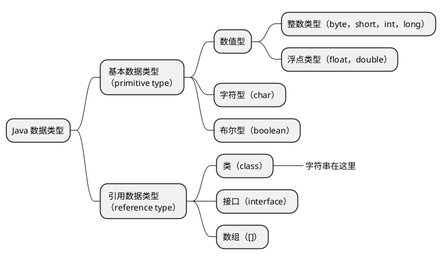

# Java

## 参考资料

- [2021 年度全网最全 Java 学习路线 - 哔哩哔哩](https://www.bilibili.com/read/cv5216534)
- [尚硅谷 Java 零基础入门教程（含百道 Java 真题，2 万多行 Java 代码实战）_哔哩哔哩_bilibili](https://www.bilibili.com/video/BV1Kb411W75N)
- [30 天搞定 Java 核心技术-程序员标配，人手一套尚硅谷教程](http://www.atguigu.com/download_detail.shtml?v=129)
- [30 天搞定 Java 核心技术（上） - 谷粒学苑 - Java 培训|大数据培训|前端培训|HTML5 培训|Linux 运维培训_程序员一站式 IT 在线学习平台 - Powered By EduSoho](https://www.gulixueyuan.com/goods/show/203?targetId=309&preview=0)

## Java 语言概述

### 软件开发介绍

#### 人机交互方式

- 图形化界面（Graphical User Interface, GUI）
- 命令行方式（Command Line Interface, CLI）

#### 常用的 DOS 命令

- `dir`列出目录下的文件以及文件夹
- `md`创建目录
- `rd`删除目录
- `cd`进入指定目录
- `cd..`进入上级目录
- `cd\`进入根目录
- `del`删除文件
- `exit`退出 DOS 命令行
- `echo`回显；可以用输出重定向输出内容到文件，如`echo javase > 1.txt`
- <kbd>TAB</kbd>代码提示
- <kbd>←</kbd><kbd>→</kbd>移动光标
- <kbd>↑</kbd><kbd>↓</kbd>调整历史命令
- <kbd>Delete</kbd><kbd>Backspace</kbd>删除字符

### 计算机编程语言介绍

- 第一代语言：机器语言，指令以二进制代码形式存在；
- 第二代语言：汇编语言，使用助剂符表示一条机器指令；
- 第三代语言：高级语言。

### Java 语言概述

Java 语言是 SUN（**S**tanford **U**niversity **N**etwork）1995 年推出的一门高级编程语言。

编程语言排行榜：[index | TIOBE - The Software Quality Company](https://www.tiobe.com/tiobe-index/)。

#### Java 简史

- 1991 年 Green 项目，开发语言最初命名为 Oak （橡树）
- 1996 年，发布 JDK 1.0
- 1999 年，Java 分成 J2SE、J2EE 和 J2ME，JSP/Servlet 技术诞生
- 2004 年，发布里程碑式版本 JDK 1.5，为突出此版本的重要性，更名为 JDK 5.0
- 2005 年，J2SE -> JavaSE，J2EE -> JavaEE，J2ME -> JavaME
- 2009 年，Oracle 公司收购 SUN，交易价格 74 亿美元
- 2014 年，发布 JDK 8.0，是继 JDK 5.0 以来变化最大的版本
- 2018 年 3 月，发布 JDK 10.0，版本号也称为 18.3
- 2018 年 9 月，发布 JDK 11.0，版本号也称为 18.9

#### Java 技术体系平台

- Java SE（Java Standard Edition）标准版，面向桌面级应用开发；
- Java EE（Java Enterprise Edition）企业版，是为开发企业环境下的应用程序提供的一套解决方案。该技术体系中包含的技术如 Servlet 、JSP 等，主要针对于 Web 应用程序开发；
- ava ME（Java Micro Edition）小型版，支持 Java 程序运行在移动终端上的平台；
- Java Card，支持一些 Java 小程序（Applets）运行在小内存设备（如智能卡）上的平台。

### Java 语言的环境搭建

- JRE（Java Runtime Environment，Java 运行环境）
- JDK（Java Development Kit，Java 开发工具包）


### 开发体验——Hello World

1. 编写
   1. 文件以`.java`为后缀
   2. 以类为基本单位
   3. 一个文件中只能由一个`public`类
   4. 如果存在`public`类，则源代码文件名需要与类名相同
   5. 程序的入口为固定写法，`public static void main(String[] args) { /* ... */ }`
   6. 语句之间用分号分隔
2. 编译，`javac A.java`
3. 运行，`java 类名`


### 注释

1. 单行注释，`// 注释`
2. 多行注释，`/* 注释 */`
3. 文档注释，`/** @author Roddy */`，可以用`javadoc`工具解析，生成代码文档

### Java API 文档

- [Java 8 中文版 - 在线 API 中文手册 - 码工具](https://www.matools.com/api/java8)
- [Overview (Java Platform SE 8 )](https://docs.oracle.com/javase/8/docs/api/)

## Java 基本语法

### 关键字与保留字

[Java Language Keywords (The Java™ Tutorials > Learning the Java Language > Language Basics)](https://docs.oracle.com/javase/tutorial/java/nutsandbolts/_keywords.html)

关键字（keyword）：被 Java 语言赋予了特殊含义，用做专门用途的字符串（单词）。关键字中所有字母都为小写。

保留字（reserverd word）：现有 Java 版本尚未使用，但以后版本可能会作为关键字使用。有两个`goto`、`const`。


### 标识符

#### 命名规则

Java 对各种变量、方法和类等要素命名时使用的字符序列称为标识符。

- 由 26 个英文字母大小写，`0-9` 、`_`或 `$` 组成；
- 数字不可以开头；
- 不可以使用关键字和保留字，但能包含关键字和保留字；
- Java 中严格区分大小写，长度无限制；
- 标识符不能包含空格。

#### 命名规范

命名规范，不强制但是强烈建议。

- 包名：`xxxyyyzzz`
- 类名、接口名：`XxxYyyZzz`
- 变量名、方法名：`xxxYyyZzz`
- 常量名：`XXX_YYY_ZZZ`

### 变量

#### 概念

- 内存中的一个存储区域
- 该区域的数据可以在同一类型范围内不断变化
- 变量是程序中最基本的存储单元。包含变量类型、变量名和存储的值。

#### 作用

用于在内存中保存数据。

#### 使用规则

- Java 中每个变量必须先声明，后使用
- 使用变量名来访问这块区域的数据
- 变量的作用域为其定义所在的一对`{}`内
- 变量只有在其作用域内才有效
- 同一个作用域内，不能定义重名的变量

#### 变量分类

##### 按类型分类




##### 按声明位置分类

- 成员变量：在方法体外，类内部声明的变量；
  - 实例变量：没有`static`修饰的变量；
  - 类变量：有`static`修饰的变量。
- 局部变量：在方法体内部声明的变量。

#### 变量的初始值

成员变量有初始值，**局部变量没有初始值**，需要显示初始化，不然不能通过编译检查。

| 数据类型  | 默认值                       |
| :-------- | ---------------------------- |
| `byte`    | `0`                          |
| `short`   | `0`                          |
| `int`     | `0`                          |
| `long`    | `0L`                         |
| `float`   | `0.0F`                       |
| `double`  | `0.0`                        |
| `char`    | `0`（`int`类型）或`'\u0000'` |
| `boolean` | `false`                      |
| 引用类型  | `null`                       |

#### 数据类型的大小和范围

// TODO 补充图表

| #    | 数据类型  | 占用存储空间 | 表数范围                                             | 备注                                                         |
| ---- | --------- | ------------ | ---------------------------------------------------- | ------------------------------------------------------------ |
| 1    | `byte`    | 1 字节        | $[-128,127]$ |                                                              |
| 2    | `short`   | 2            | $[-2^{15},2^{15}-1]$ |                                                              |
| 3    | `int`     | 4            | $[-2^{32},2^{32}-1]$（约为 21 亿） | 默认的整数类型                                               |
| 4    | `long`    | 8            |                                                          | 数字后面加`l`或`L`可声明为此类型                             |
| 5    | `float`   | 4            | 尾数可以精确到 7 位有效数字 | 后加`f`或`F`                                                 |
| 6    | `double`  | 8            | 精度是`float`的两倍 | 默认的浮点数字类型                                           |
| 7    | `char`    | 2            | `\u0000`\~`\uFFFF`，即`0`\~`65535`，无符号 16 位二进制数 | 存储一个 Unicode 编码字符，用一对单引号`''`包括，可以用 Unicode 编码，比如`'\u00443'` |
| 8    | `boolean` |              |                                                      | 只可以在`true`或`false`两个字面量之间取值                    |

#### 自动类型转换

```java
int a = 100;
long b = a;
```


- 容量（表数范围/精度）小的类型在需要的时候会自动转为容量大的类型，不会丢失精度；
- 有多种类型的数据混合运算时，系统首先自动将所有数据转换成容量最大的那种数据类型，然后再进行计算；
- `byte`、`short`、`char`之间不会相互转换，它们三种类型在计算时会首先转为`int`类型；
- `boolean`类型不会与其他类型转换；
- 任何基本数据类型和`Sting`字符串在进行`+`运算时，基本数据类型会首先被转换为字符串类型，参与字符串拼接。

#### Unicode 与 ASCII

`char`类型的变量在转换为`int`类型的时候会转换为对应 Unicode 编码的十进制值。Unicode 兼容 ASCII。

- [ASCII Table](https://www.cs.cmu.edu/~pattis/15-1XX/common/handouts/ascii.html)
- [Unicode 14.0 Character Code Charts](https://www.unicode.org/charts/)

#### String

- `String`不是基本数据类型，而是引用数据类型，它是一个类；
- 可以使用字面量方式声明，用双引号`""`包括；
- 也可以用`new String()`的方式创建对象；
- `String`在和`+`使用的时候意义为字符串拼接而不是加法，在和基本数据类型进行拼接运算时，基本数据类型会首先被转为`String`类型；

#### 强制类型转换

```java
long a = 100L;
int b = (int) a;
```

- `boolean`类型不可以被转换为其他类型；
- 如果想把更大容量/更高精度的类型转为小容量/低精度类型的时候可以用强制类型转换，有丢失精度的和数据的风险。

### 进制

这是常用进制在 Java 中的声明方式。

| 进制              | 开头       |
| ----------------- | ---------- |
| 二进制（Binary）  | `0b`或`0B` |
| 八进制（Octal）   | `0`        |
| 十进制（Decimal） |            |
| 十六进制（Hex）   | `0x`或`0X` |

### 运算符

#### 算术运算符


- `%`的结果和前一个操作数的正负相同，与后一个操作数的正负无关；
- `(a++)++`是行不通的，编译错误。

#### 赋值运算符

- `=`
- 当两侧的数据类型不一致的时候，可以使用自动类型转换或强制类型转换处理
- 支持连续赋值
- 扩展赋值运算符，不会改变原有的数据类型
  - `+=`，`a+=b <=> a=a+b`
  - `-=`
  - `*=`
  - `/=`
  - `%=`

```java
short s = 3;
s = s + 2; // 编译不通过
s += 2; // 不改变原来的数据类型
```

#### 比较运算符


比较运算符的结果都是`boolean`类型，要么是`true`，要么是`false`。

#### 逻辑运算符


#### 位运算符


- 位运算符对**整数**的二进制进行运算；
- `<<`左移一位相当于$\times2$；
- `>>`右移一位相当于$\div2$；
- 没有无符号左移运算符`<<<`；
- 异或`^`在交换两个整数类型变量的值的时候有妙用，异或三次次即可交换值，不需要中间变量。

```java
// 加减交换整数值
// 可能会超出 int 的范围
n1 = n1 + n2;
n2 = n1 - n2;
n1 = n1 - n2;

// 用异或交换整数值
n1 = n1 ^ n2;
n2 = n1 ^ n2;
n1 = n1 ^ n2;
```

#### 三元运算符

```
（条件表达式） ? 表达式 1 : 表达式 2;
```

- 当条件表达式为`true`时，执行表达式 1，整个表达式的值为表达式 1 的结果；否则执行表达式 2，整个表达式的结果为表达式 2 的结果；
- 表达式 1 和表达式 2 必须是**同种类型**。

#### 运算符的优先级


### 程序流程控制

#### 顺序结构

Java 程序在整体上是顺序结构的，依据语句书写的顺序从前往后执行。

#### 分支结构

- `if`
- `if-else`
- `switch-case`
  - `switch`表达式中的值必须是下面几种类型之一
    - `byte`
    - `short`
    - `int`
    - `char`
    - `Enum`（JDK 5）
    - `String`（JDK 7）
  - `case`子句的值必须是常量，不能是变量名或者不确定值的表达式；
  -  所有`case`字句的值应该互斥；
  - `break`关键字用于跳出`switch`结构，如果没有使用`break`则会接着向下执行，意味着可以匹配多个`case`；
  - `default`子句是可选的，位置也是灵活的（不一定要写在`case`语句之后），在没有匹配到`case`语句时会执行`default`子句中的表达式；
  - 如果`default`语句写在`case`语句之前，并且没有`break`，在匹配`default`语句之后还会向下执行`case`里的语句，直到遇到`break`或者执行完毕。这是一个很反直觉的行为，所以`default`子句尽量写在最后，并且如果不是特殊情况下，每条`case`语句都应包含一个`break`。

#### 循环结构

- `for`
- `while`
- `do-while`

## 数组

### 数组的概述

数组（Array）是**多个相同数据类型**按**一定顺序排列**的集合。

- 数组本身是**引用数据类型**，而数组中的元素可以是**任何数据类型**，包括基本数据类型和引用数据类型；
- 数组在内存中是一整块连续的空间，数组名引用的是这块连续空间的首地址；
- 数组的长度一旦确定就不能修改。

### 一维数组

#### 声明

```java
int a[];
int[] a;
```

#### 动态初始化

```java
int[] arr = new int[3];
arr[0] = 3;
```

#### 静态初始化

```java
int[] arr = new int[]{1, 2, 3};
// 类型推断
int[] arr = {1, 2, 3};
```

#### 默认值

数组成员具有默认值，和成员<u>变量的初始值</u>规则相同。不管是通过动态初始化还是静态初始化的方式来初始化数组，数组成员都有默认值，不过通过静态初始化方式初始化之后，数组成员的值又立刻被修改了一次。

### 多维数组的使用

#### 声明

```java
int arr[][];
int [][] arr;
// 也可以这样写 int[] arr[]，也是二维数组的声明
int[] arr[] = new int[3][3];

// 注意特殊写法
// x 是一维数组，y 是二维数组
int[] x, y[];
```

#### 动态初始化

```java
int arr[][] = new int[3][2];
arr[0][1] = 2;
```

```java
// 后面的可以先不初始化
int arr[][] = new int[3][];
arr[0] = new int[3];
arr[0][2] = 1;

// 多维数组不必是规则矩阵形式
arr[1] = new int[2];
arr[1][1] = 2;
```

#### 静态初始化

```java
int[][] arr = new int[][]{{1, 1, 1}, {2, 2, 2}, {3, 3, 3}};
// 类型推断
int[][] arr = {{1, 1, 1}, {2, 2, 2}, {3, 3, 3}};
```

## 面向对象编程

### 面向过程与面向对象

面向**过程**编程（Procedure Oriented Programming，POP），以函数为最小单位，考虑怎么做；

面向**对象**编程（Object Oriented Programming, OOP），以类/对象为最小单位，考虑谁来做。

### 面向对象的三大特征

#### 封装（Encapsulation）

隐藏对象内部的复杂性，只对外公开简单的接口。便于外界调用，从而提高系统的安全性、可扩展性和可维护性。

| 修饰符      | 同一个类           | 同一个包           | 不同包的子类       | 同一个工程         |
| ----------- | ------------------ | ------------------ | ------------------ | ------------------ |
| `private`   | :white_check_mark: |                    |                    |                    |
| （空）      | :white_check_mark: | :white_check_mark: |                    |                    |
| `protected` | :white_check_mark: | :white_check_mark: | :white_check_mark: |                    |
| `public`    | :white_check_mark: | :white_check_mark: | :white_check_mark: | :white_check_mark: |

在修饰`class`时只能用`public`或者空修饰符。

#### 继承（Inheritance）

子类继承了父类，就继承了父类的**所有方法和属性**。但是父类中的`private`成员进行了隐藏，不能直接访问。

父类中的成员，无论是公有还是私有，均被子类继承。只是因为访问控制修饰符的原因，子类不能对继承的私有成员直接进行访问。

子类不会继承父类的构造器，但是一定会调用父类的构造器。

Java 中只能实现单继承。

Java 中所有的类都直接或间接继承自`Object`类。

子类可以根据需要方法重写（Overwrite）。

- 子类中的方法和父类中的方法必须有相同的名称和参数列表；
- 子类方法的**返回值类型不能大于**父类方法的返回值类型；
- 子类方法的**访问权限不能小于**父类方法的访问权限；
  - 父类中的`private`方法不能被重写，但是可以在子类中声明相同方法签名的方法，不称为重写；
  - 父类中的`static`方法也不能被重写，可以重新声明。
- 子类方法抛出的**异常不能大于**父类方法的异常。

#### 多态（Polymorphism）

编译时和运行时对象类型不一致，就出现了对象的多态性。子类对象可以替代父类对象使用。

编译时，看左边（类型声明）；运行时，看右边（对象实例）。

多态不适用于属性，属性是在编译器确定的，运行时也看左边。

意味着方法会被完全覆盖，但是属性不会被覆盖。但是依然可以在子类内部通过`super`关键字调用**直接父类**中被覆盖的方法。

可以通过向上转型和向下转型来使用继承树中各个类的属性和方法。

`instanceof`运算符用来判断某一个对象是否是某个类或该类子类的实例，返回`true`或`false`。

`java.lang.Object#getClass`方法可以获取对象的运行时类名。

#### ~~抽象~~

也算是面向对象的特征之一，如果有人问的话。

### 类和对象

类（Class）是对一类事物的描述，是抽象的、概念上的定义；

对象（Object）是实际存在的该类事物的每个个体，也称为实例（Instance）。

### 类的成员

#### 属性

属性（Field）又称为成员变量，分为实例变量（没有`static`修饰）和类变量（有`static`修饰）。

#### 方法

方法的**重载**（Overload）指的是在同一个类内同名但是参数列表不完全相同的多个方法；

方法的**重写**（Overwrite）指的是在子类中对父类中已有的方法进行重新实现，方法的签名相同（返回值和抛出的异常范围可以更小）。

参数的值传递：对于基本数据类型，形参（方法内可以操作的参数）就是实参的复制，对形参的改变不会影响到实参；对于引用数据类型，形参是实参内存地址的复制，对形参直接修改不会影响到实参，通过形参名指向的内存地址对该对象/数组内的成员进行操作实际上就是对实参的操作。

#### 构造器

// TODO 补充构造器内容 public 和 protected 的构造器有什么区别吗

- 没有返回值
- 在创建对象的时候自动执行
- 可以用`public`/`protected`/`private`修饰

#### 代码块

#### 内部类

在 Java 中，允许在在类中定义类结构，称为内部类。内部类的名称不能与外部类的名称相同。

可以被以下关键词修饰：

1. `static`
2. `final`
3. `abstract`
4. **成员内部类**可以被四种不同的权限修饰符修饰

##### 成员内部类

- 静态内部类
  - 可以调用外部类的静态成员，包括私有的；
  - 在外部可以直接实例化。

```java
InnerClassTest.StaticA staticA = new InnerClassTest.StaticA();
```

- 非静态内部类
  - 可以调用外部的非静态成员，相当于`外部类类名。this. 成员`，包括私有的；
  - 在内部类中`this`指向自身，`外部类类名。this`可以访问外部类的`this`；
  - 在外部实例化非静态内部类时需要先实例化外部类，通过外部类实例化内部类。

```java
A.B.C c = new InnerClassTest().new A().new B().new C();
```

##### 局部内部类

定义在方法中。

- 局部内部类可以使用外部方法的局部变量，但是该变量必须是`final`的，Java 8 中在局部内部类使用的外部局部变量会自动声明为`final`的 Java 8 之前需要手动声明。由局部内部类和局部变量的不同生命周期所致；
- 不能使用权限修饰符，和局部变量一样；
- 不能使用`static`修饰，因此也不能包含静态成员。

##### 匿名内部类

- 匿名内部类必须继承父类或实现接口
- 匿名内部类只有一个对象
- 匿名内部类的对象只能用多态形式引用

### 关键字

#### `class`

用于定义类，只能用`public`或者空权限修饰符。

#### `this`

- 实例本身的引用；
- 在构造器中代表正在初始化的对象；
- 可以在构造器中调用其它重载的构造器，必须放在构造器代码块的首行。

#### `super`

- 用于显式调用继承来的成员（成员变量/方法）；
- 用于调用直接父类的构造器，必须在子类的构造器中使用，必须在代码块的第一行；

#### `static`

`static`可以用来修饰：

1. 属性
2. 方法
3. 代码块
4. 内部类

被修饰的成员有以下特点：

- 随着类的加载而加载，只会加载一次
- 优先于对象存在
- 修饰的成员被所有该类的对象共享
- 访问权限允许时，可以不创建对象，直接通过类名调用

#### `final`

`final`可以用来修饰：

1. 类，表示该类不能被继承
2. 方法，表示该方法不能被重写
3. 成员变量，表示该变量的值不能被修改，即为常量，必须在声明时赋值或者在构造器中赋值
4. 局部变量
5. 形参，表明形参在方法的代码块内不能被修改

#### `abstract`

`abstract`可以用来修饰：

1. 类，抽象类
   1. 抽象类不能被实例化，必须有子类继承它并且实现所有的抽象方法之后才能实例化子类
   2. 如果子类没有重写所有的抽象方法，子类也必须声明为抽象类，含有抽象方法的类必须声明为抽象类
   3. 不能用`abstract`修饰`final`类
   3. 抽象类可以有构造器
2. 方法，抽象方法
   1. 含有抽象方法的类必须声明为抽象类
   2. 不能用`abstract`修饰`private`方法、静态方法、`final`方法

#### `interface`

用于定义接口。

接口的思想就是定义了规范，继承是“是不是”的关系，而接口是“能不能”的关系。

- 接口的所有成员变量默认都是`public static final`修饰的
- 接口中的所有方法都默认都是`public abstract`修饰的
- 接口没有构造器
- 一个类可以实现多个接口
- 接口也可以实现其它接口
- 接口与实现类之间也可以表现出多态的特性

Java 8 中对接口的增强：

1. 静态方法

2. 默认方法

   1. 如果实现了接口并继承了一个类，并且接口中有默认方法和类中的方法同名同参数列表，则接口中的默认方法会被忽略，遵循类优先原则，子类在通过`super`调用父类方法的时候会调用类中的方法而不是接口中的默认方法，如果需要调用接口中的默认方法可以通过`接口名。super. 方法名 ()`来调用。

      ```java
      public class InterfaceTest {
          public static void main(String[] args) {
              new C().a();
          }
      }

      interface A {
          default void a() {
              System.out.println("a");
          }
      }

      abstract class B {
          public void a() {
              System.out.println("b");
          }
      }

      class C extends B implements A {
          @Override
          public void a() {
              super.a();
              A.super.a();
          }
      }
      ```

> 接口可以完全取代抽象类吗？
>
> 不能，抽象类有类的结构，比如说构造器，抽象类可以私有的成员；接口中只能定义`public`的成员。抽象类可以实现更多细节，接口更轻量。能用接口实现的就尽量用接口，不能用接口实现的采用抽象类。

#### `package`

指明本源文件中定义的类所在的包。

#### `import`

`import`用于声明本源文件中用到的外部类的包位置。

`java.lang`包下的类不需要声明，可以直接用。

`import static`用于引入外部的静态成员（静态变量/静态方法），可以直接在本源文件中通过名称调用，不用再加上其所在的类名。

#### `native`

用来修饰方法，表明该方法不是用 Java 语言实现的，而是用底层的 C 语言或者 C++ 实现的。

### 类的初始化顺序

在编译后的字节码文件中不存在构造器，转而出现了`<init>()`方法，该方法包括：

1. 代码块中的代码
2. 显示赋值的代码
3. 构造器中的代码

其中 1 和 2 的执行顺序与代码的实际顺序相同，构造器中的代码总是最后执行。

`<init>()`方法的数量与构造函数的数量相同，调用构造方法实际上就是调用了对应的该方法。

也不存在代码块了，代码块中的代码都拷贝到每个`<init>()`方法中了。显示赋值也消失了，也同时放在该方法中执行。执行顺序与源码中的书写顺序一致。

最后才是构造器中原有的代码执行。

在有继承的情况下，先在父类中按照此顺序执行，然后再到子类中按照此顺序执行。

如果子类重写了父类的方法，则会调用子类中的该方法而不是父类中的方法。

静态代码块在类初始化的时候执行，所以优先级最高。

1. 父类：成员变量之前的静态代码块
2. 父类：成员变量之后的静态代码块
3. 子类：成员变量之前的静态代码块
4. 子类：成员变量之后的静态代码块
5. 父类：成员变量之前的代码块
6. 父类：显式赋值
7. 父类：成员变量之后的代码块
8. 父类：构造方法
9. 子类：成员变量之前的代码块
10. 子类：显式赋值
11. 子类：成员变量之后的代码块
12. 子类：构造方法

## 异常处理

### 异常概述

程序执行中发生的不正常情况称为“异常”。开发过程中的语法错误和逻辑错误不属于异常。

### 异常体系结构


`Throwable`是所有异常的公共父类，只有此类才能被抛出或者抓取。

- `Error`，Java 虚拟机无法解决的严重的问题，如 JVM 内部系统严重错误、资源耗尽等严重情况等，一般不编写针对性的代码进行处理，捕获了也没用，应该从其它方面解决这些问题；
- `Exception`，其它因编程错误或偶然的外在因素导致的一般性问题，可以使用针对性的代码进行处理。
  - `RuntimeException`，运行时异常，不建议捕获，应该尽量避免。因为这些异常发生比较频繁，如果在代码中显示捕获的话不利于阅读；
  - 其它异常，在编译时就能发现并且必须处理的异常，要么捕获，要么一直抛出到最上级。

### 常见异常

### 异常处理机制

#### `try-catch-finally`

- `try`
  - 包裹可能发生异常的代码块。如果出现异常就会在当前执行的语句处中断。
  - 如果在`catch`中捕获了该类型的异常就会跳转到对应的`catch`代码块。
  - 如果显式抛出异常则当前方法中断，异常交给调用者处理。
  - 如果都没有则程序中断。
- `catch`
  - 捕获某种类型的异常，可以多个`catch`并列，在捕获到异常之后进行对应处理。
- `finaly`
  - 不管有没有发生异常，该代码段都会执行，通常用于资源清理工作，确保无论何时资源都能被正常关闭。
  - 如果该代码块里使用了`return`语句，那么在`try`或者`catch`代码块里的` return`语句将失效，因为在执行` try`代码块里的`return`语句之前会先执行`finally`代码段里的`return`，然后方法就终止了。
  - 还有需要注意的是，如果在`finally`代码块里没有`return`语句的情况下，修改返回变量的值是无效的，在执行`finally`代码块之前就已经将返回值给到`return`处了，再执行`return`的时候不会拿最新的变量值，类似于`i++`的机制。

#### `throws`

写在参数列表之后，方法体之前。表明当前方法可能会抛出异常的类型，这些异常不会在该方法内被处理。告知调用者在使用此方法的时候应该对这些异常进行处理，要么捕获要么再抛出。

#### `throw`

在方法体内中使用，主动抛出一个异常，终止该方法。

如果是一个编译时异常就需要在`throws`后声明，如果是运行时异常就不用声明。

### 自定义异常

从`Exception`或者它的子类派生出一个新类即可。

## 多线程

### 多线程基本概念

- 程序（Program）是一段有序执行的静态代码的集合；
- 进程（Process）是程序的一次执行过程，有生命周期；
- 线程（Thread）是进程的进一步细分，比进程更轻量化，在线程之间切换的开销更小，效率更高，多个线程可以共享相同的内存区域。

一个 Java 程序至少有三个线程：主线程、垃圾回收线程和异常处理线程。

- 并行：多个 CPU 同时执行多个任务；
- 并发：一个 CPU 采用时间片同时执行多个任务。

### 线程的创建和使用

#### 继承`Thread`类

1. 从 Thread 类中派生出一个新类，重写`run`方法；
2. 创建线程类的对象，调用`start`方法，Java 会新开一个线程，执行`run`方法。

#### 实现`Runnable`接口

1. 新类，实现 Runnable 接口，重写`run`方法；
2. 还是通过`Thread`类来执行，它有一个构造方法接收`Runnable`类型的参数；
3. 调用`Thread`对象的`start`方法来启动线程。

#### `Callable`和`FutureTask`

Java 5 新增，可以获得线程运行完毕之后的结果，返回值具有泛型支持。

新类，实现`Callable`接口，重写`call()`方法。

用`FutureTask`套`Callable`，再用`Thread`套`FutureTask`。

可以用`FutureTask`的`get()`方法获取返回值，这个方法会一直阻塞直到得到结果。

```java
CallableDemo cd = new CallableDemo();
FutureTask<String> task = new FutureTask<>(cd);
new Thread(task).start();
log.info("Task started.");
String result = task.get();
log.info("Result got： {}", result);
```

#### 线程池

Java 5 中提供的线程池 API，`ExecutorService`和`Executors`。

可以手动创建线程池。

`ExecutorService`是接口，常见子类有`ThreadPoolExecutor`。

也可以使用`Executors`工具类来创建预先定义好设置的线程池。

- `Executors.newCachedThreadPool()`
- `newFixedThreadPool()`
- `newSingleThreadPool()`
- `newScheduledThreadPool()`

创建线程池之后会拿到一个`ExecutorService`接口的对象，其实现类为`ThreadPoolExecutor`，其中有两个方法可以提交新任务。

- `submit(Runnable task)`执行成功返回`null`
- `submit(Callable<T> task)`有返回值
- `execute(Runnable command)`无返回值

### `Thread`类中的常用方法

- `run`要求子类重写，它的方法体也成为线程体
- `start`线程启动
- `sleep(long millis)`阻塞线程
- `getName`获取线程名称，默认是自动生成的，也可以在实例化对象的时候传递给构造器
- `setName`设置线程名称
- `static currentThread`获取当前线程的实例
- `getPriority`获取线程优先级，默认线程的优先级和它被创建的线程的优先级相同，主线程的默认优先级是 5
- `setPriority`设置线程优先级，范围为$[1,10]$，越大约高，但是执行时间还得看系统的调度策略
- `checkAccess`判断当前线程有没有权限修改目标线程
- `stop()`废弃的中断线程方法
- `interrupt`中断线程，如果在线程外部中断要确保有权限修改该线程。如果线程被其它方法阻塞的时候中断还会抛出异常
- `join`在线程外执行，阻塞当前线程，一直等到该线程执行完毕
- `yeld`放弃本次 CPU 时间

### 线程的生命周期

以下是操作系统概念中的线程的生命周期。

| 状态名 | 解释         | 触发条件                                        |
| ------ | ------------ | ----------------------------------------------- |
| 创建   | 新建但未开始 | 在生成线程对象，并没有调用该对象的`start()`方法 |
| 就绪   | 处于就绪队列 | `start()`之后，但未获得 CPU 时间片                |
| 运行   | 正在执行     | 获得 CPU 时间片                                   |
| 阻塞   | 处于阻塞队列 | 等待资源、`wait()`、`sleep()`、`suspend()`      |
| 死亡   | 执行完毕     | `run()`方法运行完毕或者调用`stop()`方法         |


JDK 中用枚举类`Thread.State`定义了线程的几种状态。

| 状态名         | 解释                 | 触发条件                                      |
| -------------- | -------------------- | --------------------------------------------- |
| NEW            | 新建但未开始         | `new`之后，`start()`之前                      |
| RUNNABLE       | 可运行               | 正在运行或者处于就绪队列                      |
| BLOCKED        | 阻塞                 | 等待监视器锁或者调用`wait()`                  |
| WAITTING       | 等待                 | `wait()`                                      |
| TIMED_WAITTING | 可自行返回的等待状态 | `sleep()`、带时间的`wait()`、带时间的`join()` |
| TERMINATED     | 执行完毕             | `run()`方法运行完毕或者调用`stop()`方法       |

### 线程的同步

#### 同步代码块

```java
synchronized（锁对象）{}
```

规定一段代码，在任何时刻只能有一个对象运行。在运行之前会检查锁对象是否已加锁，如果没有，在运行的时候就给锁对象加锁，运行结束之前解锁。

关于锁对象，要确保它在每个实例中是同一个对象。以继承`Thread`方式创建的线程中就不能使用`this`作为锁对象，因为每个实例中的`Thread`对象不同；以实现`Runnable`接口方式创建的线程可以使用`this`作为锁对象，因为在创建线程的时候可以只有一个该类的实例，然后通过这唯一的实例去创建线程。并且在后一种方式中，所有线程共享数据，不需要用`static`修饰。

#### 同步方法

用`synchronized`修饰方法，同一时刻只能有一个线程执行此方法。

同步方法无法自己选择锁对象。对于非静态方法，锁对象是`this`；对于静态方法，锁对象是当前类的`Class`对象。 使用的时候就要判断锁对象合不合适。

#### `Lock`

在 Java 5 之后提供了一种新的方式来确保线程安全，可以通过显式定义同步锁对象来实现同步。

`java.util.concurrent.locks.Lock`接口是控制多个线程对共享资源进行访问的工具。`ReentrantLock`是该接口的实现类。


### 线程的通信

在 Object 类中定义了一些方法。

- `wait`在被手动唤醒之前一直暂停此线程，必须由锁对象（线程监视器对象）来调用
- `notify`唤醒一个正在等待的线程，从上次暂停的地方继续执行
- `notifyAll`唤醒所有正在等待的线程，在多个生产者和多个消费者的时候注意用

> `wait()`和`sleep()`
>
> `Object.wait()`会释放锁，`Thread.sleep()`不会释放锁。

生产者和消费者问题。

```java

```

### 懒汉单例模式的线程安全问题

常规方法，使创建对象的操作互斥，只允许创建一个对象。

```java
class Lazy {
    private static Lazy INSTANCE;

    private Lazy() {
    }

    public static Lazy getInstance() {
        if (INSTANCE == null) {
            // 外层判断为了提高效率
            // 当内层已经创建好对象之后，其它线程和创建对象的线程就不是竞争关系了
            // 可以直接去取已经创建好的实例
            synchronized (Lazy.class) {
                if (INSTANCE == null) {
                    // 内层判断为了安全
                    INSTANCE = new Lazy();
                }
            }
        }

        return INSTANCE;
    }
}
```

还有一种更简单的方法，利用内部类不会随着外部类的初始化而初始化的特点，完成懒汉单例。

```java
class SimpleLazy {

    private SimpleLazy() {
    }

    public static SimpleLazy getInstance() {
        return Inner.INSTANCE;
    }

    // 内部类不会随着外部类的初始化而初始化
    // 静态代码不会随着外部类的初始化而执行
    // 而是在使用的时候才会初始化
    private static class Inner {
        public static final SimpleLazy INSTANCE = new SimpleLazy();
    }

}
```

### ThreadLocal

数据容器，和线程绑定。每个线程得到的值不一样。

## 枚举类

## 注解

## 常用类

### Object

`Object`是所有类的根父类。

- `java.lang.Object#equals`，比较两个对象，默认行为和比较运算符`==`相同，都是比较内存地址，子类可以根据需要对该方法进行重写，对内容进行比对；
- `java.lang.Object#hashCode`，默认根据内存地址计算对象的哈希值，如果重写了`equals`方法则原则上需要重写此方法；
- `java.lang.Object#clone`，返回对象的复制，是一个`protected`方法，子类需要重写此方法并调用`super.clone()`，也可以自己实现克隆细节，并实现`Cloneable`接口；
- `java.lang.Object#finalize`，在对象被回收之前垃圾回收器会调用此方法，子类可以重写此方法来在被回收之前做一些事情；可以通过`System.gc()`或`Runtime.getRuntime().gc()`来通知垃圾回收器进行回收，但是否会进行回收是不确定的；
- `java.lang.Object#toString`，默认返回类名和内存地址，子类可以重写此方法来自定义返回内容；
- `java.lang.Object#getClass`，获取当前对象的**运行时**类名。

### 包装类

Java 提供了 8 种基本数据类型的包装类，使得基本数据类型的变量具有类的特征。

| 基本数据类型 | 包装类      |
| ------------ | ----------- |
| `byte`       | `Byte`      |
| `short`      | `Short`     |
| `int`        | `Integer`   |
| `long`       | `Long`      |
| `float`      | `Float`     |
| `double`     | `Double`    |
| `boolean`    | `Boolean`   |
| `char`       | `Character` |

其中，`Byte`、`Short`、`Integer`、`Long`、`Float`和`Double`都是`Number`的子类。

JDK 1.5 提供的自动拆箱和自动封箱的机制可以让基本数据类型和包装类自动转换。

```java
Integer a = 5;
int b = a;
```

基本数据类型->包装类

1. 自动拆箱/封箱
2. 使用包装类的构造器，将基本数据类型传入

包装类->基本数据类型

1. 自动拆箱/封箱
2. 使用包装类的方法`xxxValue()`，如`Integer#intValue()`

#### Integer

缓存了$[-128,127]$的包装类对象。在使用自动装箱的创建`Integer` 对象的时候会使用到缓存。使用`new` 创建的对象则不会。

### Arrays

### String

`String`->基本数据类型

使用各个包装类的方法，使用的时候注意可能会抛出异常

- `Integer.parseInt()`
- `Float.parseFloat()`

基本数据类型->`String`

- `String.valueOf()`
- 使用连接运算符`+`，`1 + "" = "1"`

## 常用接口

## 日期时间

## 集合

## 范型

## IO 流

## 反射

## 动态代理

## 新特性

### Java 8

### Java 9

### Java 10

### Java 11
