# Java

## 参考资料

- [2021 年度全网最全 Java 学习路线 - 哔哩哔哩](https://www.bilibili.com/read/cv5216534)
- [尚硅谷 Java 零基础入门教程（含百道 Java 真题，2 万多行 Java 代码实战）_哔哩哔哩_bilibili](https://www.bilibili.com/video/BV1Kb411W75N)
- [30 天搞定 Java 核心技术-程序员标配，人手一套尚硅谷教程](http://www.atguigu.com/download_detail.shtml?v=129)
- [30 天搞定 Java 核心技术（上） - 谷粒学苑 - Java 培训|大数据培训|前端培训|HTML5 培训|Linux 运维培训_程序员一站式 IT 在线学习平台 - Powered By EduSoho](https://www.gulixueyuan.com/goods/show/203?targetId=309&preview=0)

## Java 语言概述

### 软件开发介绍

#### 人机交互方式

- 图形化界面（Graphical User Interface, GUI）
- 命令行方式（Command Line Interface, CLI）

#### 常用的 DOS 命令

- `dir`列出目录下的文件以及文件夹
- `md`创建目录
- `rd`删除目录
- `cd`进入指定目录
- `cd..`进入上级目录
- `cd\`进入根目录
- `del`删除文件
- `exit`退出 DOS 命令行
- `echo`回显；可以用输出重定向输出内容到文件，如`echo javase > 1.txt`
- <kbd>TAB</kbd>代码提示
- <kbd>←</kbd><kbd>→</kbd>移动光标
- <kbd>↑</kbd><kbd>↓</kbd>调整历史命令
- <kbd>Delete</kbd><kbd>Backspace</kbd>删除字符

### 计算机编程语言介绍

- 第一代语言：机器语言，指令以二进制代码形式存在；
- 第二代语言：汇编语言，使用助剂符表示一条机器指令；
- 第三代语言：高级语言。

### Java 语言概述

Java 语言是 SUN（**S**tanford **U**niversity **N**etwork）1995 年推出的一门高级编程语言。

编程语言排行榜：[index | TIOBE - The Software Quality Company](https://www.tiobe.com/tiobe-index/)。

#### Java 简史

- 1991 年 Green 项目，开发语言最初命名为 Oak （橡树）
- 1996 年，发布 JDK 1.0
- 1999 年，Java 分成 J2SE、J2EE 和 J2ME，JSP/Servlet 技术诞生
- 2004 年，发布里程碑式版本 JDK 1.5，为突出此版本的重要性，更名为 JDK 5.0
- 2005 年，J2SE -> JavaSE，J2EE -> JavaEE，J2ME -> JavaME
- 2009 年，Oracle 公司收购 SUN，交易价格 74 亿美元
- 2014 年，发布 JDK 8.0，是继 JDK 5.0 以来变化最大的版本
- 2018 年 3 月，发布 JDK 10.0，版本号也称为 18.3
- 2018 年 9 月，发布 JDK 11.0，版本号也称为 18.9

#### Java 技术体系平台

- Java SE（Java Standard Edition）标准版，面向桌面级应用开发；
- Java EE（Java Enterprise Edition）企业版，是为开发企业环境下的应用程序提供的一套解决方案。该技术体系中包含的技术如 Servlet 、JSP 等，主要针对于 Web 应用程序开发；
- ava ME（Java Micro Edition）小型版，支持 Java 程序运行在移动终端上的平台；
- Java Card，支持一些 Java 小程序（Applets）运行在小内存设备（如智能卡）上的平台。

### Java 语言的环境搭建

- JRE（Java Runtime Environment，Java 运行环境）
- JDK（Java Development Kit，Java 开发工具包）

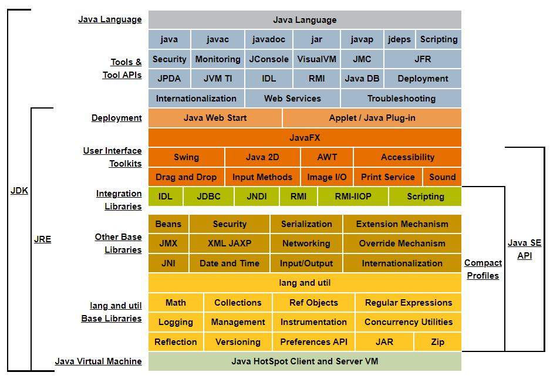

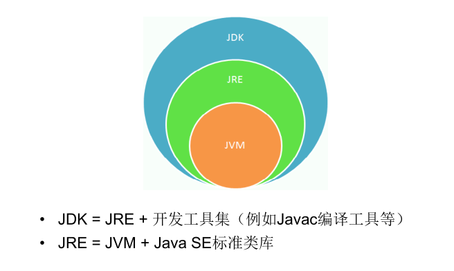

### 开发体验——Hello World

1. 编写
   1. 文件以`.java`为后缀
   2. 以类为基本单位
   3. 一个文件中只能由一个`public`类
   4. 如果存在`public`类，则源代码文件名需要与类名相同
   5. 程序的入口为固定写法，`public static void main(String[] args) { /* ... */ }`
   6. 语句之间用分号分隔
2. 编译，`javac A.java`
3. 运行，`java 类名`

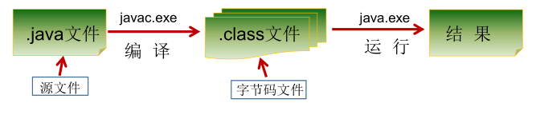

### 注释

1. 单行注释，`// 注释`
2. 多行注释，`/* 注释 */`
3. 文档注释，`/** @author Roddy */`，可以用`javadoc`工具解析，生成代码文档

### Java API 文档

- [Java 8 中文版 - 在线 API 中文手册 - 码工具](https://www.matools.com/api/java8)
- [Overview (Java Platform SE 8 )](https://docs.oracle.com/javase/8/docs/api/)

## Java 基本语法

### 关键字与保留字

[Java Language Keywords (The Java™ Tutorials > Learning the Java Language > Language Basics)](https://docs.oracle.com/javase/tutorial/java/nutsandbolts/_keywords.html)

关键字（keyword）：被 Java 语言赋予了特殊含义，用做专门用途的字符串（单词）。关键字中所有字母都为小写。

保留字（reserverd word）：现有 Java 版本尚未使用，但以后版本可能会作为关键字使用。有两个`goto`、`const`。

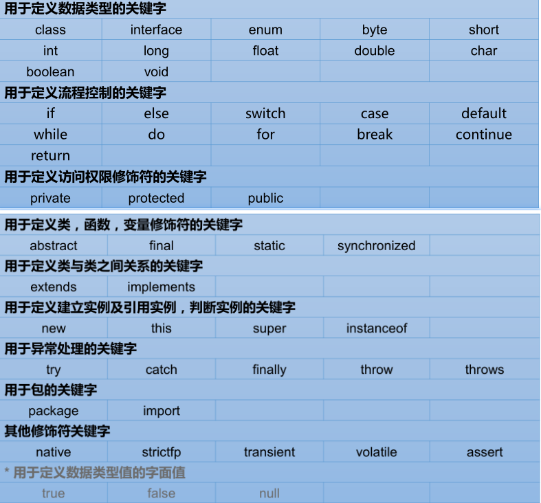

### 标识符

#### 命名规则

Java 对各种变量、方法和类等要素命名时使用的字符序列称为标识符。

- 由 26 个英文字母大小写，`0-9` 、`_`或 `$` 组成；
- 数字不可以开头；
- 不可以使用关键字和保留字，但能包含关键字和保留字；
- Java 中严格区分大小写，长度无限制；
- 标识符不能包含空格。

#### 命名规范

命名规范，不强制但是强烈建议。

- 包名：`xxxyyyzzz`
- 类名、接口名：`XxxYyyZzz`
- 变量名、方法名：`xxxYyyZzz`
- 常量名：`XXX_YYY_ZZZ`

### 变量

#### 概念

- 内存中的一个存储区域
- 该区域的数据可以在同一类型范围内不断变化
- 变量是程序中最基本的存储单元。包含变量类型、变量名和存储的值。

#### 作用

用于在内存中保存数据。

#### 使用规则

- Java 中每个变量必须先声明，后使用
- 使用变量名来访问这块区域的数据
- 变量的作用域为其定义所在的一对`{}`内
- 变量只有在其作用域内才有效
- 同一个作用域内，不能定义重名的变量

#### 变量分类

##### 按类型分类

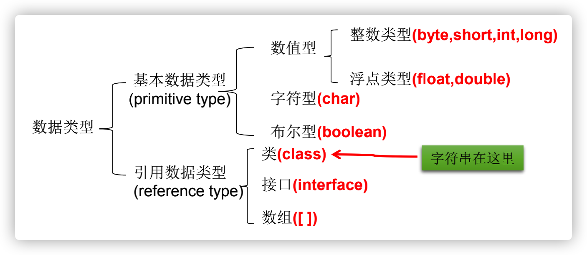

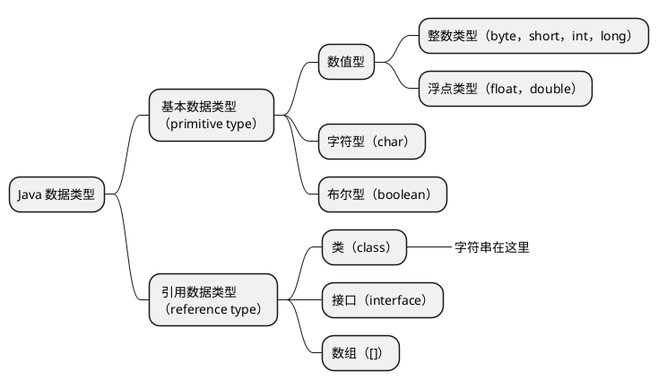

##### 按声明位置分类

- 成员变量：在方法体外，类内部声明的变量；
  - 实例变量：没有`static`修饰的变量；
  - 类变量：有`static`修饰的变量。
- 局部变量：在方法体内部声明的变量。

#### 变量的初始值

成员变量有初始值，**局部变量没有初始值**，需要显示初始化，不然不能通过编译检查。

| 数据类型  | 默认值                       |
| :-------- | ---------------------------- |
| `byte`    | `0`                          |
| `short`   | `0`                          |
| `int`     | `0`                          |
| `long`    | `0L`                         |
| `float`   | `0.0F`                       |
| `double`  | `0.0`                        |
| `char`    | `0`（`int`类型）或`'\u0000'` |
| `boolean` | `false`                      |
| 引用类型  | `null`                       |

#### 数据类型的大小和范围

// TODO 补充图表

| #    | 数据类型  | 占用存储空间 | 表数范围                                             | 备注                                                         |
| ---- | --------- | ------------ | ---------------------------------------------------- | ------------------------------------------------------------ |
| 1    | `byte`    | 1 字节        | $[-128,127]$ |                                                              |
| 2    | `short`   | 2            | $[-2^{15},2^{15}-1]$ |                                                              |
| 3    | `int`     | 4            | $[-2^{32},2^{32}-1]$（约为 21 亿） | 默认的整数类型                                               |
| 4    | `long`    | 8            |                                                          | 数字后面加`l`或`L`可声明为此类型                             |
| 5    | `float`   | 4            | 尾数可以精确到 7 位有效数字 | 后加`f`或`F`                                                 |
| 6    | `double`  | 8            | 精度是`float`的两倍 | 默认的浮点数字类型                                           |
| 7    | `char`    | 2            | `\u0000`\~`\uFFFF`，即`0`\~`65535`，无符号 16 位二进制数 | 存储一个 Unicode 编码字符，用一对单引号`''`包括，可以用 Unicode 编码，比如`'\u00443'` |
| 8    | `boolean` |              |                                                      | 只可以在`true`或`false`两个字面量之间取值                    |

#### 自动类型转换

```java
int a = 100;
long b = a;
```

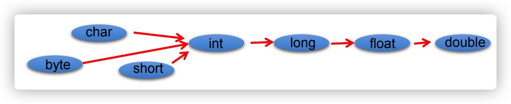

- 容量（表数范围/精度）小的类型在需要的时候会自动转为容量大的类型，不会丢失精度；
- 有多种类型的数据混合运算时，系统首先自动将所有数据转换成容量最大的那种数据类型，然后再进行计算；
- `byte`、`short`、`char`之间不会相互转换，它们三种类型在计算时会首先转为`int`类型；
- `boolean`类型不会与其他类型转换；
- 任何基本数据类型和`Sting`字符串在进行`+`运算时，基本数据类型会首先被转换为字符串类型，参与字符串拼接。

#### Unicode 与 ASCII

`char`类型的变量在转换为`int`类型的时候会转换为对应 Unicode 编码的十进制值。Unicode 兼容 ASCII。

- [ASCII Table](https://www.cs.cmu.edu/~pattis/15-1XX/common/handouts/ascii.html)
- [Unicode 14.0 Character Code Charts](https://www.unicode.org/charts/)

#### String

- `String`不是基本数据类型，而是引用数据类型，它是一个类；
- 可以使用字面量方式声明，用双引号`""`包括；
- 也可以用`new String()`的方式创建对象；
- `String`在和`+`使用的时候意义为字符串拼接而不是加法，在和基本数据类型进行拼接运算时，基本数据类型会首先被转为`String`类型；

#### 强制类型转换

```java
long a = 100L;
int b = (int) a;
```

- `boolean`类型不可以被转换为其他类型；
- 如果想把更大容量/更高精度的类型转为小容量/低精度类型的时候可以用强制类型转换，有丢失精度的和数据的风险。

### 进制

这是常用进制在 Java 中的声明方式。

| 进制              | 开头       |
| ----------------- | ---------- |
| 二进制（Binary）  | `0b`或`0B` |
| 八进制（Octal）   | `0`        |
| 十进制（Decimal） |            |
| 十六进制（Hex）   | `0x`或`0X` |

### 运算符

#### 算术运算符

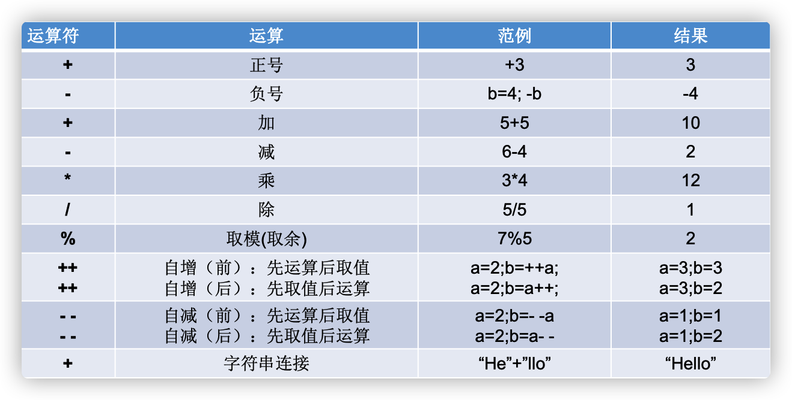

- `%`的结果和前一个操作数的正负相同，与后一个操作数的正负无关；
- `(a++)++`是行不通的，编译错误。

#### 赋值运算符

- `=`
- 当两侧的数据类型不一致的时候，可以使用自动类型转换或强制类型转换处理
- 支持连续赋值
- 扩展赋值运算符，不会改变原有的数据类型
  - `+=`，`a+=b <=> a=a+b`
  - `-=`
  - `*=`
  - `/=`
  - `%=`

```java
short s = 3;
s = s + 2; // 编译不通过
s += 2; // 不改变原来的数据类型
```

#### 比较运算符

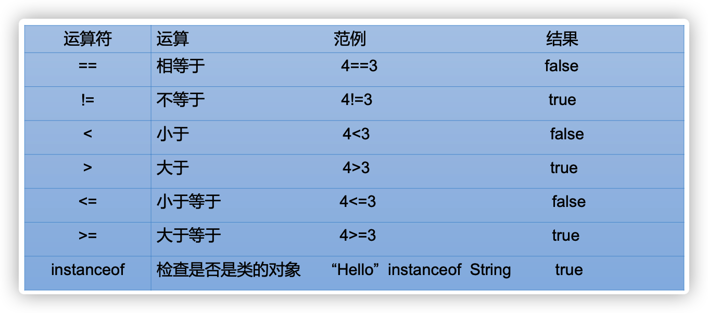

比较运算符的结果都是`boolean`类型，要么是`true`，要么是`false`。

#### 逻辑运算符

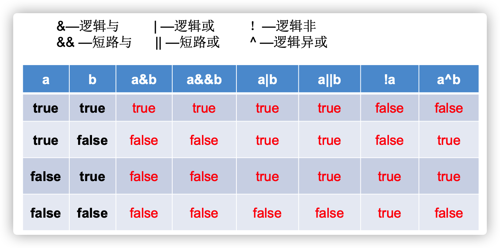

#### 位运算符

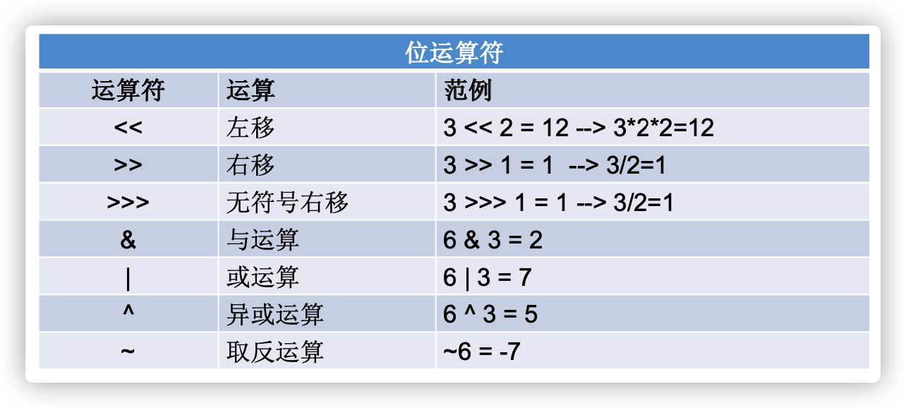

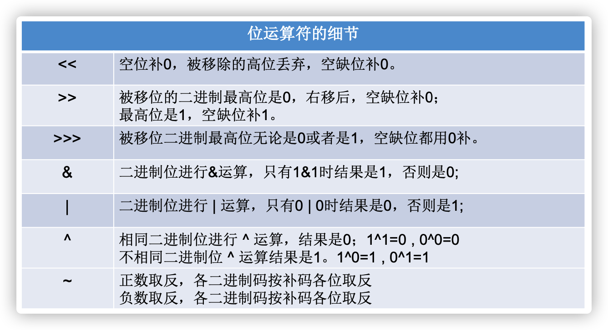

- 位运算符对**整数**的二进制进行运算；
- `<<`左移一位相当于$\times2$；
- `>>`右移一位相当于$\div2$；
- 没有无符号左移运算符`<<<`；
- 异或`^`在交换两个整数类型变量的值的时候有妙用，异或三次次即可交换值，不需要中间变量。

```java
// 加减交换整数值
// 可能会超出 int 的范围
n1 = n1 + n2;
n2 = n1 - n2;
n1 = n1 - n2;

// 用异或交换整数值
n1 = n1 ^ n2;
n2 = n1 ^ n2;
n1 = n1 ^ n2;
```

#### 三元运算符

```
（条件表达式） ? 表达式 1 : 表达式 2;
```

- 当条件表达式为`true`时，执行表达式 1，整个表达式的值为表达式 1 的结果；否则执行表达式 2，整个表达式的结果为表达式 2 的结果；
- 表达式 1 和表达式 2 必须是**同种类型**。

#### 运算符的优先级

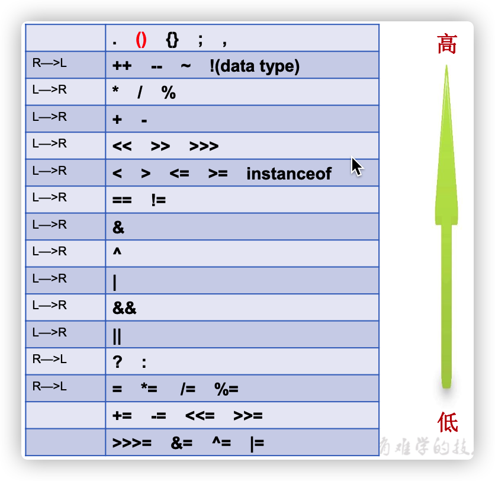

### 程序流程控制

#### 顺序结构

Java 程序在整体上是顺序结构的，依据语句书写的顺序从前往后执行。

#### 分支结构

- `if`
- `if-else`
- `switch-case`
  - `switch`表达式中的值必须是下面几种类型之一
    - `byte`
    - `short`
    - `int`
    - `char`
    - `Enum`（JDK 5）
    - `String`（JDK 7）
  - `case`子句的值必须是常量，不能是变量名或者不确定值的表达式；
  -  所有`case`字句的值应该互斥；
  - `break`关键字用于跳出`switch`结构，如果没有使用`break`则会接着向下执行，意味着可以匹配多个`case`；
  - `default`子句是可选的，位置也是灵活的（不一定要写在`case`语句之后），在没有匹配到`case`语句时会执行`default`子句中的表达式；
  - 如果`default`语句写在`case`语句之前，并且没有`break`，在匹配`default`语句之后还会向下执行`case`里的语句，直到遇到`break`或者执行完毕。这是一个很反直觉的行为，所以`default`子句尽量写在最后，并且如果不是特殊情况下，每条`case`语句都应包含一个`break`。

#### 循环结构

- `for`
- `while`
- `do-while`

## 数组

### 数组的概述

数组（Array）是**多个相同数据类型**按**一定顺序排列**的集合。

- 数组本身是**引用数据类型**，而数组中的元素可以是**任何数据类型**，包括基本数据类型和引用数据类型；
- 数组在内存中是一整块连续的空间，数组名引用的是这块连续空间的首地址；
- 数组的长度一旦确定就不能修改。

### 一维数组

#### 声明

```java
int a[];
int[] a;
```

#### 动态初始化

```java
int[] arr = new int[3];
arr[0] = 3;
```

#### 静态初始化

```java
int[] arr = new int[]{1, 2, 3};
// 类型推断
int[] arr = {1, 2, 3};
```

#### 默认值

数组成员具有默认值，和成员<u>变量的初始值</u>规则相同。不管是通过动态初始化还是静态初始化的方式来初始化数组，数组成员都有默认值，不过通过静态初始化方式初始化之后，数组成员的值又立刻被修改了一次。

### 多维数组的使用

#### 声明

```java
int arr[][];
int [][] arr;
// 也可以这样写 int[] arr[]，也是二维数组的声明
int[] arr[] = new int[3][3];

// 注意特殊写法
// x 是一维数组，y 是二维数组
int[] x, y[];
```

#### 动态初始化

```java
int arr[][] = new int[3][2];
arr[0][1] = 2;
```

```java
// 后面的可以先不初始化
int arr[][] = new int[3][];
arr[0] = new int[3];
arr[0][2] = 1;

// 多维数组不必是规则矩阵形式
arr[1] = new int[2];
arr[1][1] = 2;
```

#### 静态初始化

```java
int[][] arr = new int[][]{{1, 1, 1}, {2, 2, 2}, {3, 3, 3}};
// 类型推断
int[][] arr = {{1, 1, 1}, {2, 2, 2}, {3, 3, 3}};
```

## 面向对象编程

### 面向过程与面向对象

面向**过程**编程（Procedure Oriented Programming，POP），以函数为最小单位，考虑怎么做；

面向**对象**编程（Object Oriented Programming, OOP），以类/对象为最小单位，考虑谁来做。

### 面向对象的三大特征

#### 封装（Encapsulation）

隐藏对象内部的复杂性，只对外公开简单的接口。便于外界调用，从而提高系统的安全性、可扩展性和可维护性。

| 修饰符      | 同一个类           | 同一个包           | 不同包的子类       | 同一个工程         |
| ----------- | ------------------ | ------------------ | ------------------ | ------------------ |
| `private`   | :white_check_mark: |                    |                    |                    |
| （空）      | :white_check_mark: | :white_check_mark: |                    |                    |
| `protected` | :white_check_mark: | :white_check_mark: | :white_check_mark: |                    |
| `public`    | :white_check_mark: | :white_check_mark: | :white_check_mark: | :white_check_mark: |

在修饰`class`时只能用`public`或者空修饰符。

#### 继承（Inheritance）

子类继承了父类，就继承了父类的**所有方法和属性**。但是父类中的`private`成员进行了隐藏，不能直接访问。

父类中的成员，无论是公有还是私有，均被子类继承。只是因为访问控制修饰符的原因，子类不能对继承的私有成员直接进行访问。

子类不会继承父类的构造器，但是一定会调用父类的构造器。

Java 中只能实现单继承。

Java 中所有的类都直接或间接继承自`Object`类。

子类可以根据需要方法重写（Overwrite）。

- 子类中的方法和父类中的方法必须有相同的名称和参数列表；
- 子类方法的**返回值类型不能大于**父类方法的返回值类型；
- 子类方法的**访问权限不能小于**父类方法的访问权限；
  - 父类中的`private`方法不能被重写，但是可以在子类中声明相同方法签名的方法，不称为重写；
  - 父类中的`static`方法也不能被重写，可以重新声明。
- 子类方法抛出的**异常不能大于**父类方法的异常。

#### 多态（Polymorphism）

编译时和运行时对象类型不一致，就出现了对象的多态性。子类对象可以替代父类对象使用。

编译时，看左边（类型声明）；运行时，看右边（对象实例）。

多态不适用于属性，属性是在编译器确定的，运行时也看左边。

意味着方法会被完全覆盖，但是属性不会被覆盖。但是依然可以在子类内部通过`super`关键字调用**直接父类**中被覆盖的方法。

可以通过向上转型和向下转型来使用继承树中各个类的属性和方法。

`instanceof`运算符用来判断某一个对象是否是某个类或该类子类的实例，返回`true`或`false`。

`java.lang.Object#getClass`方法可以获取对象的运行时类名。

#### ~~抽象~~

也算是面向对象的特征之一，如果有人问的话。

### 类和对象

类（Class）是对一类事物的描述，是抽象的、概念上的定义；

对象（Object）是实际存在的该类事物的每个个体，也称为实例（Instance）。

### 类的成员

#### 属性

属性（Field）又称为成员变量，分为实例变量（没有`static`修饰）和类变量（有`static`修饰）。

#### 方法

方法的**重载**（Overload）指的是在同一个类内同名但是参数列表不完全相同的多个方法；

方法的**重写**（Overwrite）指的是在子类中对父类中已有的方法进行重新实现，方法的签名相同（返回值和抛出的异常范围可以更小）。

参数的值传递：对于基本数据类型，形参（方法内可以操作的参数）就是实参的复制，对形参的改变不会影响到实参；对于引用数据类型，形参是实参内存地址的复制，对形参直接修改不会影响到实参，通过形参名指向的内存地址对该对象/数组内的成员进行操作实际上就是对实参的操作。

#### 构造器

// TODO 补充构造器内容 public 和 protected 的构造器有什么区别吗

- 没有返回值
- 在创建对象的时候自动执行
- 可以用`public`/`protected`/`private`修饰

#### 代码块

#### 内部类

在 Java 中，允许在在类中定义类结构，称为内部类。内部类的名称不能与外部类的名称相同。

可以被以下关键词修饰：

1. `static`
2. `final`
3. `abstract`
4. **成员内部类**可以被四种不同的权限修饰符修饰

##### 成员内部类

- 静态内部类
  - 可以调用外部类的静态成员，包括私有的；
  - 在外部可以直接实例化。

```java
InnerClassTest.StaticA staticA = new InnerClassTest.StaticA();
```

- 非静态内部类
  - 可以调用外部的非静态成员，相当于`外部类类名。this. 成员`，包括私有的；
  - 在内部类中`this`指向自身，`外部类类名。this`可以访问外部类的`this`；
  - 在外部实例化非静态内部类时需要先实例化外部类，通过外部类实例化内部类。

```java
A.B.C c = new InnerClassTest().new A().new B().new C();
```

##### 局部内部类

定义在方法中。

- 局部内部类可以使用外部方法的局部变量，但是该变量必须是`final`的，Java 8 中在局部内部类使用的外部局部变量会自动声明为`final`的 Java 8 之前需要手动声明。由局部内部类和局部变量的不同生命周期所致；
- 不能使用权限修饰符，和局部变量一样；
- 不能使用`static`修饰，因此也不能包含静态成员。

##### 匿名内部类

- 匿名内部类必须继承父类或实现接口
- 匿名内部类只有一个对象
- 匿名内部类的对象只能用多态形式引用

### 关键字

#### `class`

用于定义类，只能用`public`或者空权限修饰符。

#### `this`

- 实例本身的引用；
- 在构造器中代表正在初始化的对象；
- 可以在构造器中调用其它重载的构造器，必须放在构造器代码块的首行。

#### `super`

- 用于显式调用继承来的成员（成员变量/方法）；
- 用于调用直接父类的构造器，必须在子类的构造器中使用，必须在代码块的第一行；

#### `static`

`static`可以用来修饰：

1. 属性
2. 方法
3. 代码块
4. 内部类

被修饰的成员有以下特点：

- 随着类的加载而加载，只会加载一次
- 优先于对象存在
- 修饰的成员被所有该类的对象共享
- 访问权限允许时，可以不创建对象，直接通过类名调用

#### `final`

`final`可以用来修饰：

1. 类，表示该类不能被继承
2. 方法，表示该方法不能被重写
3. 成员变量，表示该变量的值不能被修改，即为常量，必须在声明时赋值或者在构造器中赋值
4. 局部变量
5. 形参，表明形参在方法的代码块内不能被修改

#### `abstract`

`abstract`可以用来修饰：

1. 类，抽象类
   1. 抽象类不能被实例化，必须有子类继承它并且实现所有的抽象方法之后才能实例化子类
   2. 如果子类没有重写所有的抽象方法，子类也必须声明为抽象类，含有抽象方法的类必须声明为抽象类
   3. 不能用`abstract`修饰`final`类
   3. 抽象类可以有构造器
2. 方法，抽象方法
   1. 含有抽象方法的类必须声明为抽象类
   2. 不能用`abstract`修饰`private`方法、静态方法、`final`方法

#### `interface`

用于定义接口。

接口的思想就是定义了规范，继承是“是不是”的关系，而接口是“能不能”的关系。

- 接口的所有成员变量默认都是`public static final`修饰的
- 接口中的所有方法都默认都是`public abstract`修饰的
- 接口没有构造器
- 一个类可以实现多个接口
- 接口也可以实现其它接口
- 接口与实现类之间也可以表现出多态的特性

Java 8 中对接口的增强：

1. 静态方法
2. 默认方法

如果实现了接口并继承了一个类，并且接口中有默认方法和类中的方法同名同参数列表，则接口中的默认方法会被忽略，遵循类优先原则，子类在通过`super`调用父类方法的时候会调用类中的方法而不是接口中的默认方法，如果需要调用接口中的默认方法可以通过`接口名。super. 方法名 ()`来调用。

```java
public class InterfaceTest {
  public static void main(String[] args) {
    new C().a();
  }
}

interface A {
  default void a() {
    System.out.println("a");
  }
}

abstract class B {
  public void a() {
    System.out.println("b");
  }
}

class C extends B implements A {
  @Override
  public void a() {
    super.a();
    A.super.a();
  }
}
```

> 接口可以完全取代抽象类吗？
>
> 不能，抽象类有类的结构，比如说构造器，抽象类可以私有的成员；接口中只能定义`public`的成员。抽象类可以实现更多细节，接口更轻量。能用接口实现的就尽量用接口，不能用接口实现的采用抽象类。

#### `package`

指明本源文件中定义的类所在的包。

#### `import`

`import`用于声明本源文件中用到的外部类的包位置。

`java.lang`包下的类不需要声明，可以直接用。

`import static`用于引入外部的静态成员（静态变量/静态方法），可以直接在本源文件中通过名称调用，不用再加上其所在的类名。

#### `native`

用来修饰方法，表明该方法不是用 Java 语言实现的，而是用底层的 C 语言或者 C++ 实现的。

### 类的初始化顺序

在编译后的字节码文件中不存在构造器，转而出现了`<init>()`方法，该方法包括：

1. 代码块中的代码
2. 显示赋值的代码
3. 构造器中的代码

其中 1 和 2 的执行顺序与代码的实际顺序相同，构造器中的代码总是最后执行。

`<init>()`方法的数量与构造函数的数量相同，调用构造方法实际上就是调用了对应的该方法。

也不存在代码块了，代码块中的代码都拷贝到每个`<init>()`方法中了。显示赋值也消失了，也同时放在该方法中执行。执行顺序与源码中的书写顺序一致。

最后才是构造器中原有的代码执行。

在有继承的情况下，先在父类中按照此顺序执行，然后再到子类中按照此顺序执行。

如果子类重写了父类的方法，则会调用子类中的该方法而不是父类中的方法。

静态代码块在类初始化的时候执行，所以优先级最高。

1. 父类：成员变量之前的静态代码块
2. 父类：成员变量之后的静态代码块
3. 子类：成员变量之前的静态代码块
4. 子类：成员变量之后的静态代码块
5. 父类：成员变量之前的代码块
6. 父类：显式赋值
7. 父类：成员变量之后的代码块
8. 父类：构造方法
9. 子类：成员变量之前的代码块
10. 子类：显式赋值
11. 子类：成员变量之后的代码块
12. 子类：构造方法

## 异常处理

### 异常概述

程序执行中发生的不正常情况称为“异常”。开发过程中的语法错误和逻辑错误不属于异常。

### 异常体系结构

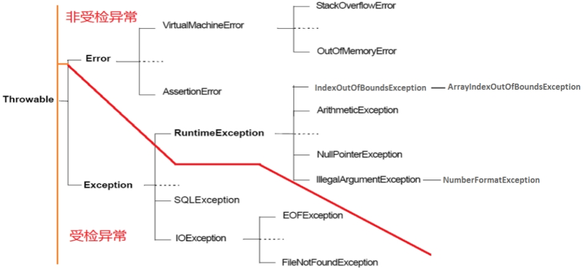

`Throwable`是所有异常的公共父类，只有此类才能被抛出或者抓取。

- `Error`，Java 虚拟机无法解决的严重的问题，如 JVM 内部系统严重错误、资源耗尽等严重情况等，一般不编写针对性的代码进行处理，捕获了也没用，应该从其它方面解决这些问题；
- `Exception`，其它因编程错误或偶然的外在因素导致的一般性问题，可以使用针对性的代码进行处理。
  - `RuntimeException`，运行时异常，不建议捕获，应该尽量避免。因为这些异常发生比较频繁，如果在代码中显示捕获的话不利于阅读；
  - 其它异常，在编译时就能发现并且必须处理的异常，要么捕获，要么一直抛出到最上级。

### 常见异常

### 异常处理机制

#### `try-catch-finally`

- `try`
  - 包裹可能发生异常的代码块。如果出现异常就会在当前执行的语句处中断。
  - 如果在`catch`中捕获了该类型的异常就会跳转到对应的`catch`代码块。
  - 如果显式抛出异常则当前方法中断，异常交给调用者处理。
  - 如果都没有则程序中断。
- `catch`
  - 捕获某种类型的异常，可以多个`catch`并列，在捕获到异常之后进行对应处理。
- `finaly`
  - 不管有没有发生异常，该代码段都会执行，通常用于资源清理工作，确保无论何时资源都能被正常关闭。
  - 如果该代码块里使用了`return`语句，那么在`try`或者`catch`代码块里的` return`语句将失效，因为在执行` try`代码块里的`return`语句之前会先执行`finally`代码段里的`return`，然后方法就终止了。
  - 还有需要注意的是，如果在`finally`代码块里没有`return`语句的情况下，修改返回变量的值是无效的，在执行`finally`代码块之前就已经将返回值给到`return`处了，再执行`return`的时候不会拿最新的变量值，类似于`i++`的机制。

#### `try-with`

// TODO

#### `throws`

写在参数列表之后，方法体之前。表明当前方法可能会抛出异常的类型，这些异常不会在该方法内被处理。告知调用者在使用此方法的时候应该对这些异常进行处理，要么捕获要么再抛出。

#### `throw`

在方法体内中使用，主动抛出一个异常，终止该方法。

如果是一个编译时异常就需要在`throws`后声明，如果是运行时异常就不用声明。

### 自定义异常

从`Exception`或者它的子类派生出一个新类即可。

## 多线程

### 多线程基本概念

- 程序（Program）是一段有序执行的静态代码的集合；
- 进程（Process）是程序的一次执行过程，有生命周期；
- 线程（Thread）是进程的进一步细分，比进程更轻量化，在线程之间切换的开销更小，效率更高，多个线程可以共享相同的内存区域。

一个 Java 程序至少有三个线程：主线程、垃圾回收线程和异常处理线程。

- 并行：多个 CPU 同时执行多个任务；
- 并发：一个 CPU 采用时间片同时执行多个任务。

### 线程的创建和使用

#### 继承 Thread 类

1. 从 Thread 类中派生出一个新类，重写`run`方法；
2. 创建线程类的对象，调用`start`方法，Java 会新开一个线程，执行`run`方法。

#### 实现 Runnable 接口

1. 新类，实现 Runnable 接口，重写`run`方法；
2. 还是通过`Thread`类来执行，它有一个构造方法接收`Runnable`类型的参数；
3. 调用`Thread`对象的`start`方法来启动线程。

#### Callable 和 FutureTask

Java 5 新增，可以获得线程运行完毕之后的结果，返回值具有泛型支持。

新类，实现`Callable`接口，重写`call()`方法。

用`FutureTask`套`Callable`，再用`Thread`套`FutureTask`。

可以用`FutureTask`的`get()`方法获取返回值，这个方法会一直阻塞直到得到结果。

```java
CallableDemo cd = new CallableDemo();
FutureTask<String> task = new FutureTask<>(cd);
new Thread(task).start();
log.info("Task started.");
String result = task.get();
log.info("Result got： {}", result);
```

#### 线程池

Java 5 中提供的线程池 API，`ExecutorService`和`Executors`。

可以手动创建线程池。

`ExecutorService`是接口，常见子类有`ThreadPoolExecutor`。

也可以使用`Executors`工具类来创建预先定义好设置的线程池。

- `Executors.newCachedThreadPool()`
- `newFixedThreadPool()`
- `newSingleThreadPool()`
- `newScheduledThreadPool()`

创建线程池之后会拿到一个`ExecutorService`接口的对象，其实现类为`ThreadPoolExecutor`，其中有两个方法可以提交新任务。

- `submit(Runnable task)`执行成功返回`null`
- `submit(Callable<T> task)`有返回值
- `execute(Runnable command)`无返回值

### Thread 类中的常用方法

- `run`要求子类重写，它的方法体也成为线程体
- `start`线程启动
- `sleep(long millis)`阻塞线程
- `getName`获取线程名称，默认是自动生成的，也可以在实例化对象的时候传递给构造器
- `setName`设置线程名称
- `static currentThread`获取当前线程的实例
- `getPriority`获取线程优先级，默认线程的优先级和它被创建的线程的优先级相同，主线程的默认优先级是 5
- `setPriority`设置线程优先级，范围为$[1,10]$，越大约高，但是执行时间还得看系统的调度策略
- `checkAccess`判断当前线程有没有权限修改目标线程
- `stop()`废弃的中断线程方法
- `interrupt`中断线程，如果在线程外部中断要确保有权限修改该线程。如果线程被其它方法阻塞的时候中断还会抛出异常
- `join`在线程外执行，阻塞当前线程，一直等到该线程执行完毕
- `yeld`放弃本次 CPU 时间

### 线程的生命周期

以下是操作系统概念中的线程的生命周期。

| 状态名 | 解释         | 触发条件                                        |
| ------ | ------------ | ----------------------------------------------- |
| 创建   | 新建但未开始 | 在生成线程对象，并没有调用该对象的`start()`方法 |
| 就绪   | 处于就绪队列 | `start()`之后，但未获得 CPU 时间片                |
| 运行   | 正在执行     | 获得 CPU 时间片                                   |
| 阻塞   | 处于阻塞队列 | 等待资源、`wait()`、`sleep()`、`suspend()`      |
| 死亡   | 执行完毕     | `run()`方法运行完毕或者调用`stop()`方法         |

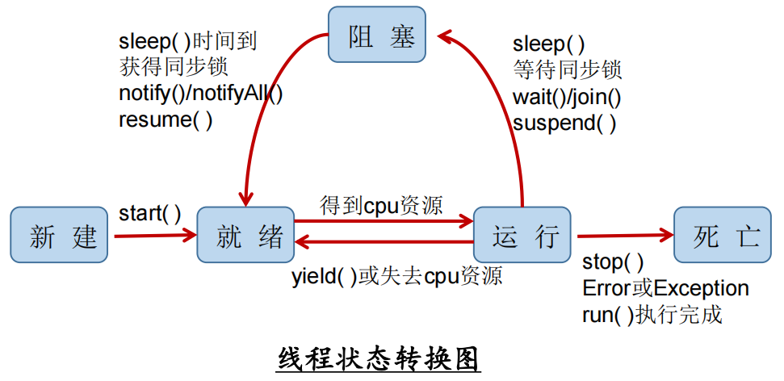

JDK 中用枚举类`Thread.State`定义了线程的几种状态。

| 状态名         | 解释                 | 触发条件                                      |
| -------------- | -------------------- | --------------------------------------------- |
| NEW            | 新建但未开始         | `new`之后，`start()`之前                      |
| RUNNABLE       | 可运行               | 正在运行或者处于就绪队列                      |
| BLOCKED        | 阻塞                 | 等待监视器锁或者调用`wait()`                  |
| WAITTING       | 等待                 | `wait()`                                      |
| TIMED_WAITTING | 可自行返回的等待状态 | `sleep()`、带时间的`wait()`、带时间的`join()` |
| TERMINATED     | 执行完毕             | `run()`方法运行完毕或者调用`stop()`方法       |

### 线程的同步

#### 同步代码块

```java
synchronized（锁对象）{}
```

规定一段代码，在任何时刻只能有一个对象运行。在运行之前会检查锁对象是否已加锁，如果没有，在运行的时候就给锁对象加锁，运行结束之前解锁。

关于锁对象，要确保它在每个实例中是同一个对象。以继承`Thread`方式创建的线程中就不能使用`this`作为锁对象，因为每个实例中的`Thread`对象不同；以实现`Runnable`接口方式创建的线程可以使用`this`作为锁对象，因为在创建线程的时候可以只有一个该类的实例，然后通过这唯一的实例去创建线程。并且在后一种方式中，所有线程共享数据，不需要用`static`修饰。

#### 同步方法

用`synchronized`修饰方法，同一时刻只能有一个线程执行此方法。

同步方法无法自己选择锁对象。对于非静态方法，锁对象是`this`；对于静态方法，锁对象是当前类的`Class`对象。 使用的时候就要判断锁对象合不合适。

#### Lock

在 Java 5 之后提供了一种新的方式来确保线程安全，可以通过显式定义同步锁对象来实现同步。

`java.util.concurrent.locks.Lock`接口是控制多个线程对共享资源进行访问的工具。`ReentrantLock`是该接口的实现类。

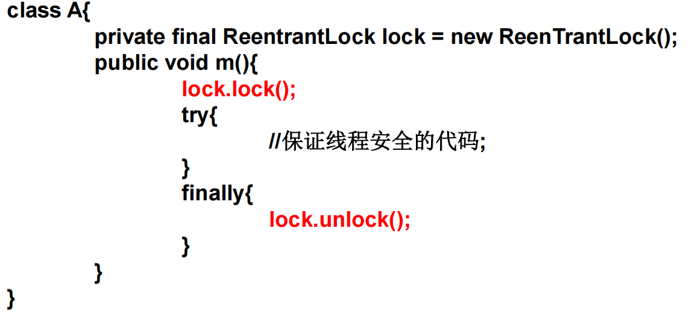

### 线程的通信

在 Object 类中定义了一些方法。

- `wait`在被手动唤醒之前一直暂停此线程，必须由锁对象（线程监视器对象）来调用
- `notify`唤醒一个正在等待的线程，从上次暂停的地方继续执行
- `notifyAll`唤醒所有正在等待的线程，在多个生产者和多个消费者的时候注意用

> `wait()`和`sleep()`
>
> `Object.wait()`会释放锁，`Thread.sleep()`不会释放锁。

生产者和消费者问题。

```java
package org.example.thread_test;

import lombok.extern.slf4j.Slf4j;

import java.util.concurrent.ExecutorService;
import java.util.concurrent.Executors;

public class ProducerConsumerTest {

    public static void main(String[] args) {
        ExecutorService pool = Executors.newFixedThreadPool(7);

        Clerk clerk = new Clerk();
        Producer producer = new Producer(clerk);
        Consumer consumer = new Consumer(clerk);

        pool.execute(producer);
        pool.execute(consumer);

        pool.shutdown();
    }

}

@Slf4j
class Producer implements Runnable {

    private Clerk clerk;

    public Producer(Clerk clerk) {
        this.clerk = clerk;
    }

    @Override
    public void run() {
        while (true) {
            clerk.add();
        }
    }
}

@Slf4j
class Consumer implements Runnable {

    private Clerk clerk;

    public Consumer(Clerk clerk) {
        this.clerk = clerk;
    }

    @Override
    public void run() {
        while (true) {
            clerk.minus();
        }
    }
}

@Slf4j
class Clerk {

    private int count = 0;

    public static final int MAX = 20;

    public synchronized void add() {
        try {
            Thread.sleep(100L);
        } catch (InterruptedException e) {
            e.printStackTrace();
        }
        if (count < MAX) {
            log.info("生产 1，剩余 {}", ++count);
            notify();
        } else {
            try {
                wait();
            } catch (InterruptedException e) {
                e.printStackTrace();
            }
        }
    }

    public synchronized void minus() {
        try {
            Thread.sleep(100L);
        } catch (InterruptedException e) {
            e.printStackTrace();
        }
        if (count > 0) {
            log.info("消费 1，剩余 {}", --count);
            notify();
        } else {
            try {
                wait();
            } catch (InterruptedException e) {
                e.printStackTrace();
            }
        }
    }

}
```

### 懒汉单例模式的线程安全问题

常规方法，使创建对象的操作互斥，只允许创建一个对象。

```java
class Lazy {
    private static Lazy INSTANCE;

    private Lazy() {
    }

    public static Lazy getInstance() {
        if (INSTANCE == null) {
            // 外层判断为了提高效率
            // 当内层已经创建好对象之后，其它线程和创建对象的线程就不是竞争关系了
            // 可以直接去取已经创建好的实例
            synchronized (Lazy.class) {
                if (INSTANCE == null) {
                    // 内层判断为了安全
                    INSTANCE = new Lazy();
                }
            }
        }

        return INSTANCE;
    }
}
```

还有一种更简单的方法，利用内部类不会随着外部类的初始化而初始化的特点，完成懒汉单例。

```java
class SimpleLazy {

    private SimpleLazy() {
    }

    public static SimpleLazy getInstance() {
        return Inner.INSTANCE;
    }

    // 内部类不会随着外部类的初始化而初始化
    // 静态代码不会随着外部类的初始化而执行
    // 而是在使用的时候才会初始化
    private static class Inner {
        public static final SimpleLazy INSTANCE = new SimpleLazy();
    }

}
```

### ThreadLocal

数据容器，和线程绑定。每个线程得到的值不一样。

## 枚举类

Java 5 之后，有了`enum`关键字，可以更方便地实现枚举类。

枚举类型不能继承其它类型，因为枚举类型的每个实例实际上继承了`java.lang.Enum`抽象类。

```java
protected Enum(String name,
               int ordinal);
public final String name();
public final int ordinal();
```

在编译的时候编译器会将`enum`真正转化为`Enum`的子类，所以可以使用该类的方法。

并且`Enum`类重写了`toString()`方法，默认返回`name`属性值。

`Enum`类中还有一个静态方法`valueOf`，可以获取对应值的枚举类实例。

```java
public static <T extends Enum<T>> T valueOf(Class<T> enumType,
                                            String name)
```

还有一个`values`方法不是继承的，而是编译器添加的。它存在于每个枚举类中，能获取到该类的对应值的枚举类实例。

```java
public static T[] values()
```

枚举类可以实现接口，并且每个常量可以分别对接口有不同的实现。也可以统一实现接口，跟正常用法一样。

```java
public class Test6 {
    public static void main(String[] args) {
        MyEnum.A.test(); // a
        MyEnum.B.test(); // b
        MyEnum.C.test(); // 统一实现
    }
}

interface MyInterface {
    void test();
}

enum MyEnum implements MyInterface {
    A {
        @Override
        public void test() {
            System.out.println("a");
        }
    },
    B {
        @Override
        public void test() {
            System.out.println("b");
        }
    },
    C;

    @Override
    public void test() {
        System.out.println("统一实现");
    }
}
```

## 注解

其实也是一种注释，是代码级别的注释，会被编译器处理。普通注释会被编译器直接忽略。不直接修改程序逻辑，可以通过反射读取出注解信息，根据需要作出不同行为。

### 预定义注解

- `@Override`，标注在方法上，在编译时会检查这个方法是否符合重写的要求，一定确保这个方法成功重写了父类的方法。给程序员看的时候也能快速看出这是一个重写的方法。
- `@Deprecated`，标注方法，表明该方法已弃用，有更好的实现供选择。
- `@SuppressWarnings`，抑制编译时的警告信息，可以作用在类、类成员、方法参数等。会抑制在该类型作用域内的所有警告信息。`value`参数可以传入具体抑制哪种警告，或者传入”all“抑制所有警告信息。

### 文档注释相关注解

- `@author`
- `@param`
- `@return`
- `@see`
- `@since`
- `@version`
- `@exception`
- `@throws`
- ...

### 自定义注解

#### 定义注解

属性的数据类型有限制：

- 基本数据类型
- `String`
- 枚举
- `Class`
- `Annotaion`
- 以上这些类型的数组

属性可以有默认值，可以通过`default`关键字来实现。

```java
@Target({ElementType.TYPE, ElementType.METHOD})
@Retention(RetentionPolicy.RUNTIME)
@interface Test7 {

    String value() default "111";

    String[] name();

}
```

#### 元注解

标注在注解声明处的注解。

- `@Target`指明注解可以标注的位置。
- `@Retention`指明注解的生命周期。
  - `SOURCE`只在源码阶段有效，就跟普通的注释一样，编译的时候丢弃
  - `CLASS`在编译的时候会保存到字节码文件中，但是虚拟机不会在运行时保留，默认是这个级别
  - `RUNTIME`会在运行时保留，可以通过反射读取
- `@Documented`被 javadoc 读取。
- `@Inherited`继承的时候也会继承到注解。

#### 使用

在合适位置标注，以`@`开头。

如果注解没有属性，不需要加括号。

如果注解只需传入一个`value`属性，则直接传入属性即可。

如果需要传入的属性有多个，或者传入的单个属性不是`value`，则需要使用键值对的形式传入对应的值。

如果传入的属性要求是数组，在数组只有一个元素的情况下可以省略花括号`{}`。

```java
@Test7(value = "", name = "")
@Target({ElementType.TYPE, ElementType.METHOD})
@Retention(RetentionPolicy.RUNTIME)
@interface Test7 {

    String value();

    String[] name();

}
```

#### 读取

参考反射相关知识。

### Java 8 注解新特性

#### `@Repeatable`可重复注解

在 JDK8 之前如果需要重复注解的话，需要新建一个注解，其中包含目标注解的数组，通过数组来重复使用注解。

在 JDK8 中新增了一个元注解`@Repeatable`，还是需要一个新的注解包含目标注解的数组，但是不需要用数组的方式传递了，直接标注多个同类型的注解即可。

#### 类型注解

`@Target`的参数`ElementType`的枚举值多了两个：

- `TYPE_PARAMETER`：表明注解可以使用在类型变量的声明语句中，如泛型声明；
- `TYPE_USE`：表示注解能使用在任何类型的语句中，泛型、变量类型转换、抛出的异常。

## 常用类

### Object

`Object`是所有类的根父类。

- `equals`，比较两个对象，默认行为和比较运算符`==`相同，都是比较内存地址，子类可以根据需要对该方法进行重写，对内容进行比对；
- `hashCode`，默认根据内存地址计算对象的哈希值，如果重写了`equals`方法则原则上需要重写此方法；
- `clone`，返回对象的复制，是一个`protected`方法，子类需要重写此方法并调用`super.clone()`，也可以自己实现克隆细节，并实现`Cloneable`接口；
- `finalize`，在对象被回收之前垃圾回收器会调用此方法，子类可以重写此方法来在被回收之前做一些事情；可以通过`System.gc()`或`Runtime.getRuntime().gc()`来通知垃圾回收器进行回收，但是否会进行回收是不确定的；
- `toString`，返回对象的字符串表示，建议所有子类重写。默认返回”类名@十六进制 hash“。
- `getClass`，获取当前对象的**运行时**类名。

### 包装类

Java 提供了 8 种基本数据类型的包装类，使得基本数据类型的变量具有类的特征。

| 基本数据类型 | 包装类      |
| ------------ | ----------- |
| `byte`       | `Byte`      |
| `short`      | `Short`     |
| `int`        | `Integer`   |
| `long`       | `Long`      |
| `float`      | `Float`     |
| `double`     | `Double`    |
| `boolean`    | `Boolean`   |
| `char`       | `Character` |

其中，`Byte`、`Short`、`Integer`、`Long`、`Float`和`Double`都是`Number`的子类。

#### 自动装箱与自动拆箱

JDK 1.5 提供的自动拆箱和自动封箱的机制可以让基本数据类型和包装类自动转换。在需要的时候，自动在基本数据类型和包装类之间转换。

```java
Integer a = 5;
int b = a;`
```

#### 缓存

为了提高性能，比较常用的基本数据类型的包装类会被缓存。

通过`new`关键字获取的对象在堆中，直接得到的包装类在方法区中，这个才是被缓存的。

| 基本数据类型 | 包装类    | 缓存            |
| ------------ | --------- | --------------- |
| byte         | Byte      | $[-128,127]$    |
| short        | Short     | $[-128,127]$    |
| int          | Integer   | $[-128,127]$    |
| long         | Long      | $[-128,127]$    |
| float        | Float     | 不缓存          |
| double       | Double    | 不缓存          |
| char         | Character | $[0,127]$       |
| boolean      | Boolean   | `true`和`false` |

#### 常用 API

##### 字符串解析

各个包装类都有一个`parseXxx`的方法，用于从字符串中解析出对应类型的值，返回包装类。

```java
public static int parseInt(String s) throws NumberFormatException
```

##### Integer

- `MAX_VALUE`int 类型可表示的最大值，2^{31}-1231−1
- `MIN_VALUE`最小值，-2^{31}−231
- `toBinaryString`转为二进制字符串
- `toOctalString`八进制
- `toHexString`十六进制

##### Character

- `toUpperCase`
- `toLowerCase`

### System

包含三个流：

- `PrintStream out`
- `InputStream in`
- `PrintStream err`

这是系统默认的输出流，可以通过`setIn`、`SetOut`、`SetErr`来替换掉系统默认的输出流。

常用方法：

- `currentTimeMillis()`
- `arraycopy(Object src, int srcPos, Object dest, int destPos, int length)`
- `exit(int status)`
- `getProperty(String key)`

### String

#### 与基本数据类型的转换

`String`->基本数据类型

使用各个包装类的方法，使用的时候注意可能会抛出异常

- `Integer.parseInt()`
- `Float.parseFloat()`

基本数据类型->`String`

- `String.valueOf()`
- 使用连接运算符`+`，`1 + "" = "1"`

#### 特殊性

通过字面量声明的 String 对象存在常量池中，是不可变的，只要修改了字符串就会产生新对象。通过`new`关键字取得的字符串对象不在常量池中。

常量池里的对象可以共享，提高性能。

#### 常量池位置

Java 6，在方法区；

Java 7，在堆中专门划分了一块区域来存储字符串常量；

Java 8，在元空间（Meta space）中，类似于方法区，甚至可以独立于 JVM 存在。

#### 底层存储结构

Java 8，使用`char[]`存储；

Java 9，使用`byte[]`存储。

#### 不可变性

`char[]`使用`final`修饰，意味着数组不能扩容。同时它也是私有的，外部也不能修改某一个元素的值；String 提供的所有对字符串修改的方法都会返回一个新对象。

#### 字面量和直接创建对象的不同

```java
String str = new String("str");
```

在这个过程中产生了两个对象；`"str"`是一个对象，在常量池；又通过`new`关键字得到一个对象，在堆。两者的`char values[]`指向相同的地址。具体代码在 String 的构造器中。

#### 拼接

```java
String s1 = "hello";
String s2 = "world";

String s3 = "helloworld";

String s4 = s1 + "world";
String s5 = s1 + s2;
String s6 = "hello" + "world";

System.out.println(s3 == s4); // false
System.out.println(s3 == s5); // false
System.out.println(s3 == s6); // true
```

只要有变量参与的拼接，结果都在堆中。`s6`在编译期间就可以确定结果，所以存在常量池中。

如果给 s1 和 s2 加上`final`修饰，那么结果都为`true`。

#### 常用方法

- `equals(Object anObject)`
- `equalsIgnoreCase(String anotherString)`
- `compareTo(String anotherString)`
- `compareToIgnoreCase(String str)`
- `intern()`把字符串放入常量池，并返回引用
- `length()`
- `isEmpty()`
- `concat(String str)`与另一个字符串相连接，相当于`+`
- `trim()`移除开头和结尾的空白字符
- `substring(begin, end)`返回子字符串，索引从 0 开始，包含包含左边不包含右边。左闭右开
- `toCharArray()`转为字符数组
- `getBytes()`转为字节数组

#### 字典排序

String 实现了`Comparable`接口，但是默认是按照 Unicode 编码值排序。

`java.lang.Collator`类实现了`Comparator`接口，可以选择各地的语言习惯来排序。

在有拼音排序的需求的时候可以采用这个方法来实现。

```java
Collator collator = Collator.getInstance(Locale.CHINESE);
int compare = collator.compare("差", "啊");
System.out.println(compare);
```

### StringBuffer

可变字符序列。线程安全。效率更低。而`StringBuilder`相反。默认容量是 16。

没有重写`equals`方法，比较的是内存地址。

### StringBuilder

可变字符序列，Java 5 新增，非线程安全。默认长度是 16，在需要的时候会自动扩容到原来长度的 2 倍再加上 2。

没有重写`equals`方法，比较的是内存地址。

- `append`
- `insert`
- `delete`

### Math

- `abs`绝对值
- 三角函数
- `sqrt`平方根
- `pow`幂运算
- `round`四舍五入
- `ceil`返回比参数大的最近一个整数
- `floor`返回比参数小的最近一个整数

### Random

- `nextInt(int)`，随机返回一个在$[0,i-1]$之间的数。

```java
// 返回一个 [left, right] 之间的数
public static int randomInt(int left, int right) {
    Random random = new Random();
    return random.nextInt(right - left + 1) + left;
}
```

### BigInteger

支持更大的范围，多了一些运算方法。

### BigDecimal

精度更高。注意 buyo

- `add`
- `subtract`
- `multiply`
- `divide`

## 日期时间

### 旧日期时间

#### Date

除了下面两个构造器，其它的都过时了。

- `Date()`当前日期获得对象
- `Date(long date)`毫秒时间戳转为日期

其中大部分方法也已经过时，可以被`Calendar`或者`DateFormat`中的方法替换。

`java.sql.Date`是 `java.util.Date`的子类，无特殊需要的情况下均用`java.util.Date`。

#### Calendar

这是一个抽象类，可以使用它的实现类`GregorianCalendar`。可以通过`Calendar.getInstance()`来获取它的实例。

- `getInstance()`获取实现类的实例
- `getInstance(Locale aLocale)`
- `getInstance(TimeZone zone)`
- `get(int field)`通过常量值来获取当前日历对象的某个字段值，比如年份

#### TimeZone

抽象类，可以用静态方法`getTimeZone`来获取实现类的实例。

- `getTimeZone(String ID)`
- `getAvailableIDs()`获取所有时区 id

#### DateFormat

这也是一个抽象类，用的是`SimpleDateFormat`。

- `SimpleDateFormat(String pattern)`构造器，出入格式化字符串
- `format(Date date)`将日期对象格式化，返回字符串
- `parse(String source)`按照格式将字符串解析为日期对象

### 新日期时间

Java 8 引入了新的日期时间 API。新的对象是不可变的，修改会产生新对象。

新引入了另一套处理日期时间的体系，Date 可以通过`toInstant()`方法转为新 API。

#### LocalDate

`yyyy-MM-dd`格式的日期。

#### LocalTime

只有时间。

#### LocalDateTime

日期时间。

- `static now()`基于现在的时间创建对象
- `static of()`给定日期时间创建对象
- `getMonth`
- `getXxx`
- `withMonth`修改月份并返回一个新对象
- `withXxx`
- `plusXxx`加时间
- `minusXxx`减时间
- `isLeapYear`是否是闰年
- `format`格式化，返回字符串
- `static parse`给定字符串和格式解析为时间对象

#### Duration

时间之间的间隔。更精确。

#### Period

日期之间的间隔。

#### Instant

瞬时时间。可以精确到纳秒。从 1970 年的开始算的。没有其它任何上下文信息。

#### ZonedDateTime

带时区的时间。

#### TemporalAdjuster

时间调整期，这是一个接口。在`TemporalAdjusters`中有许多方法可以得到它的实例。

#### DateTimeFormatter

格式化器。可以用来格式化日期或从字符串解析出日期时间。

- `ofPattern`

## 工具类

### Arrays

- `copyOf`
  - `System.arraycopy()`
- `sort`

### Collections

Collection 相关的工具类，其中包含了大量的静态方法，方法的参数或者返回值是 Collection。

### Objects

### Spliterators

### Files

### Paths

## 常用接口

### Comparable

自然排序。需要比较的对象自身实现此接口。`String`及包装类都实现了此接口。

```java
public int compareTo(T o);
```

### Compartor

定制排序。作为一个比较器，参数需要放入两个对比的对象。

```java
int compare(T o1, T o2);
```

### Serializable

## 集合


### Collection

是单列数据结构的父接口。

#### for 循环遍历

通过`size()`方法得到集合的长度，通过元素下标遍历，下标从 0 开始。

#### 迭代器遍历

调用`Iterable#iterator()`方法来得到迭代器对象，每次调用都会得到一个新的迭代器对象。

- `Iterator<E> iterator()`

迭代器是一次性使用的，元素的顺序不能保证，只能向后遍历，不能回溯。Java 8 新加入了`forEachRemaining`方法，可以用函数式接口完成遍历。

- `boolean hasNext()`
- `E next()`
- `void remove()`
- `void forEachRemaining(Consumer<? super E> action)`

在迭代器的过程中不能使用集合本身的有关元素修改的操作如`add()`和`remove()`，不然迭代器在下次迭代的时候会抛出异常，这样做的是为了避免同步问题。

在`AbstractList`中有一个`modCount`变量，在涉及到对列表元素进行修改的方法中会将`modCount++`。在迭代器`Itr`构造的时候会保存当前的`modCount`值为`expectedModCount`，在每次迭代和`remove()`之前都会比对这两个值，如果不相等则意味着在迭代器之外有操作对列表元素进行了修改，为了避免同步问题就会抛出`ConcurrentModificationException`异常。

如果没有调用`next()`直接调用`remove()`，或者在调用了`next()`之后调用了两次`remove()`，都会抛出`IllegalStateException`异常。迭代器`Ite`中维护了一个`lastRet`变量，默认是`-1`，在调用`next()`之后会更新为当前元素的下标，在调用`remove()`之后会更新为`-1`，在调用`remove()`之前会对其进行检查，如果从来没有调用过`next()`或者调用两次`remove()`的时候会抛出异常。

#### for-each 循环

Java 5 中新增的语法糖，实际上调用的是迭代器的方法，所以有和迭代器一样的限制。数组也可以用这种方式遍历。注意遍历过程中的元素变量只是局部变量。

```java
for(Person p: persons){
  System.out.println(p);
}
```

### List

- `Vector`出现较早（Java 1.0），是线程安全的，效率低
- `ArrayList`出现较晚（Java 1.2），是非线程安全的，效率高
- `LinkedList`的数据结构是双向链表，其它两者的数据结构是数组，因此对于频繁的插入、删除操作，`LinkedList`的效率更高

### Set

无序、不可重复的数据结构。底层用的是`Map`，只用了 key 的那一列。

- `HashSet`，无序，线程不安全，可以存储`null`值，底层用`HashMap`
- `LinkedHashSet`，元素可以按照添加的顺序遍历，是`HashSet`的子类，底层用`LinkedHashMap`
- `TreeSet`，可以对添加的对象进行排序，底层用`TreeMap`

### Queue

`LinkedList`是`Deque`的实现类，可以当作栈或队列使用。

// TODO 补充方法名

### Map

是双列数据结构的顶层接口。Map 的底层也是数组，每个位置放的都是一个`Entry`，其中包含了 key 和 value。

- `Hashtable`，Java 1.0 引入，当时还没有`Map`接口，后来 Java 1.2 抽取 Map 接口，`Hashtable`是线程安全的，其中`table`是小写，key 不能是`null`
- `Properties`，`Hashtable`的子类，用于读取和写入`.properties`文件，内容也是键值对的形式，key 和 value 都是`String`类型
- `HashMap`，`Map`的主要实现类，非线程安全，key 可以为`null`
- `LinkedHashMap`，存储`key`的时候不仅仅存储 key 的内容，而是存储了一个双向链表的节点，可以按照元素加入的顺序来遍历
- `TreeMap`，底层用红黑树，是排序二叉树的一种

## 泛型

可以在编译期间进行类型检查，更安全。避免了强制类型转换，更方便。

### 泛型类/接口

```java
class/interface 类名<T1, T2> extends .... {
  T1 t1;
  T2 t2;
  public T1 fn(T2 t2){

  }
}
```

- 如果在实例化时没有指定泛型，则认为此泛型类型为`Object`
- 静态方法/静态成员不能用类声明的泛型

### 泛型方法

只有声明了泛型参数列表的方法才是泛型方法，泛型方法声明的泛型参数列表只能在这个方法中使用。不论其所在的类是否是泛型类。

```java
//修饰符 泛型 返回值类型 方法名 参数列表
public <T extends Object> T[] toArray(T ...a);
```

### 类型通配符

- `<?>`任意类型，除了`null`外不让存，可以取，取出来是`Object`类型的
- `<? extends Xxx>`必须是继承此类
- `<T extends Number & Serializable>`，可以有多个限制，但是父类只能有一个，并且必须写在第一位，后面可以跟多个接口
- `<? super Xxx>`必须是此类的父类

## I/O

流的分类：

1. 操作数据单位
   1. 字节流
   2. 字符流
2. 数据的流向
   1. 输入流
   2. 输出流
3. 流的角色
   1. 节点流
   2. 处理流


|                  | Byte Based Input                                             | Byte Based Output                                            | Character Based Input                                        | Character Based Output                                       |
| ---------------- | ------------------------------------------------------------ | ------------------------------------------------------------ | ------------------------------------------------------------ | ------------------------------------------------------------ |
| Basic            | [InputStream](http://tutorials.jenkov.com/java-io/inputstream.html) | [OutputStream](http://tutorials.jenkov.com/java-io/outputstream.html) | [Reader](http://tutorials.jenkov.com/java-io/reader.html) [InputStreamReader](http://tutorials.jenkov.com/java-io/inputstreamreader.html) | [Writer](http://tutorials.jenkov.com/java-io/writer.hml) [OutputStreamWriter](http://tutorials.jenkov.com/java-io/outputstreamwriter.html) |
| Arrays           | [ByteArrayInputStream](http://tutorials.jenkov.com/java-io/bytearrayinputstream.html) | [ByteArrayOutputStream](http://tutorials.jenkov.com/java-io/bytearrayoutputstream.html) | [CharArrayReader](http://tutorials.jenkov.com/java-io/chararrayreader.html) | [CharArrayWriter](http://tutorials.jenkov.com/java-io/chararraywriter.html) |
| Files            | [FileInputStream](http://tutorials.jenkov.com/java-io/fileinputstream.html) [RandomAccessFile](http://tutorials.jenkov.com/java-io/randomaccessfile.html) | [FileOutputStream](http://tutorials.jenkov.com/java-io/fileoutputstream.html) [RandomAccessFile](http://tutorials.jenkov.com/java-io/randomaccessfile.html) | [FileReader](http://tutorials.jenkov.com/java-io/filereader.html) | [FileWriter](http://tutorials.jenkov.com/java-io/filewriter.html) |
| Pipes            | [PipedInputStream](http://tutorials.jenkov.com/java-io/pipedinputstream.html) | [PipedOutputStream](http://tutorials.jenkov.com/java-io/pipedoutputstream.html) | [PipedReader](http://tutorials.jenkov.com/java-io/pipedreader.html) | [PipedWriter](http://tutorials.jenkov.com/java-io/pipedwriter.html) |
| Buffering        | [BufferedInputStream](http://tutorials.jenkov.com/java-io/bufferedinputstream.html) | [BufferedOutputStream](http://tutorials.jenkov.com/java-io/bufferedoutputstream.html) | [BufferedReader](http://tutorials.jenkov.com/java-io/bufferedreader.html) | [BufferedWriter](http://tutorials.jenkov.com/java-io/bufferedwriter.html) |
| Filtering        | [FilterInputStream](http://tutorials.jenkov.com/java-io/filterinputstream.html) | [FilterOutputStream](http://tutorials.jenkov.com/java-io/filteroutputstream.html) | [FilterReader](http://tutorials.jenkov.com/java-io/filterreader.html) | [FilterWriter](http://tutorials.jenkov.com/java-io/filterwriter.html) |
| Parsing          | [PushbackInputStream](http://tutorials.jenkov.com/java-io/pushbackinputstream.html) [StreamTokenizer](http://tutorials.jenkov.com/java-io/streamtokenizer.html) |                                                              | [PushbackReader](http://tutorials.jenkov.com/java-io/pushbackreader.html) [LineNumberReader](http://tutorials.jenkov.com/java-io/linenumberreader.html) |                                                              |
| Strings          |                                                              |                                                              | [StringReader](http://tutorials.jenkov.com/java-io/stringreader.html) | [StringWriter](http://tutorials.jenkov.com/java-io/stringwriter.html) |
| Data             | [DataInputStream](http://tutorials.jenkov.com/java-io/datainputstream.html) | [DataOutputStream](http://tutorials.jenkov.com/java-io/dataoutputstream.html) |                                                              |                                                              |
| Data - Formatted |                                                              | [PrintStream](http://tutorials.jenkov.com/java-io/printstream.html) |                                                              | [PrintWriter](http://tutorials.jenkov.com/java-io/printwriter.html) |
| Objects          | [ObjectInputStream](http://tutorials.jenkov.com/java-io/objectinputstream.html) | [ObjectOutputStream](http://tutorials.jenkov.com/java-io/objectoutputstream.html) |                                                              |                                                              |
| Utilities        | [SequenceInputStream](http://tutorials.jenkov.com/java-io/sequenceinputstream.html) |                                                              |                                                              |                                                              |

表格内容来自 [Java IO Tutorial (jenkov.com)](http://tutorials.jenkov.com/java-io/index.html)。

### File

代表一个文件或目录。

### RandomAccessFile

支持随机读写的文件。对象中维护了一个指针，所有对文件的读写都相对于当前的指针。

### 转换流

下面的两个类可以将字节流转换为字符流。

- `InputStreamReader`
- `OutputStreamWriter`

### 打印流

- `PrintStream`，是`OutputStream`的子类
- `PrintWriter`，是`Writer`的子类

`System.in`、`System.out`和`System.err`都是`PrintStream`。

`PrintWriter`少了一些参数为`byte[]`的方法，不能直接写出字节，其它方法都差不多。

以上两者的输出方法都不会抛出 I/O 异常。

### 数据流

- `DataInputStream`
- `DataOutputStream`

将基本数据类型和`String`持久化和读入。

### 对象流

- `ObjectInputStream`
- `ObjectOutputStream`

将基本数据类型和`String`持久化和读入。

对象的序列化和反序列化操作。

在序列化和反序列化的过程中会忽略掉静态成员变量和用`transient`修饰的成员变量。

要求被操作的类实现`java.io.Serializable`或`java.io.Externalizable`接口。

`private static final long serialVersionUID`用于标识当前对象的版本号，如果不显式声明的话系统会根据类的结构自动计算一个并写入到序列化的结果中。在反序列化的时候会将内存中加载的类的`serialVersionUID`和序列化结果中的`serialVersionUID`对比，如果不相同则抛出`InvalidClassException`异常。

如果显式声明了该字段，并且两个类结构不相同的情况下，反序列化的过程中会尽量读取变量值。如果新增了字段则该字段为默认值，如果删除了字段则忽略该字段；如果更改了字段的类型则会抛出`InvalidClassException`异常。

在反序列化的过程中可能会抛出`ClassNotFoundException`。

## NIO

Java 1.4 引入，更高效的流操作。

## NIO 2

Java 7 引入，对 NIO 进行了扩展。

### Path

### Paths

### Files

## 网络编程

### InetAddress

### ServerSocket

TCP 服务端。

### Socket

TCP 客户端。

### DatagramSocket

UDP，不分服务端与客户端。

非面向连接，不可靠的。

### DatagramPacket

UDP 数据包。

### URL

## 反射

Reflection（反射）是被视为动态语言的关键，反射机制允许程序在执行期借助于 Reflection API 取得任何类的内部信息，并能直接操作任意对象的内部属性及方法。

### 获取 Class 实例的方式

1. `Object.class`
2. `new Object().getClass()`
3. `Class.forName("com.example.A")`
4. `<当前类>.class.getClassLoader().loadClass("com.example.A")`

### Class 对象的类型

1. `class`类
2. `interface`接口
3. `[]`数组，只要数据类型和维度相同就是同一种 Class
4. `enum`枚举
5. `@interface`注解
6. 基本数据类型
7. `void`

## 动态代理

使用一个代理将对象包装起来，然后用该代理对象取代原始对象。任何对原始对象的调用都要通过代理。代理对象决定是否以及何时将方法调用转到原始对象上。

JDK 提供的动态代理要求被代理类必须实现接口。

### Proxy

`java.lang.reflect.Proxy`是专门完成代理的操作类，是所有动态代理类的父类。通过此类为一个或多个接口动态地生成实现类。

```java
public static Object newProxyInstance(ClassLoader loader,
                                      Class<?>[] interfaces,
                                      InvocationHandler h)
                               throws IllegalArgumentException
```

创建代理对象的过程就是创建了一个实现了接口的子类对象，并没有创建被代理的对象。

```java
public class ProxyTest {

    public static void main(String[] args) {

        Handler handler = new Handler();
        handler.setInstance(new A());

        Object instance = Proxy.newProxyInstance(A.class.getClassLoader(), A.class.getInterfaces(), handler);

        ((Inter) instance).say("hello");
    }

}

class Handler implements InvocationHandler {

    private Inter instance;

    public void setInstance(Inter instance) {
        this.instance = instance;
    }

    @Override
    public Object invoke(Object proxy, Method method, Object[] args) throws Throwable {
        for (Class<?> anInterface : proxy.getClass().getInterfaces()) {
            System.out.println(anInterface);
        }
        System.out.println(method);
        args[0] = "replace";
        return instance == null ? null : method.invoke(instance, args);
    }

}
```

## 新特性

### Java 7

#### switch 支持 String

#### try-with-resources

#### NIO 2

#### 泛型推断

### Java 8

#### 函数式（Functional）接口

单方法接口。

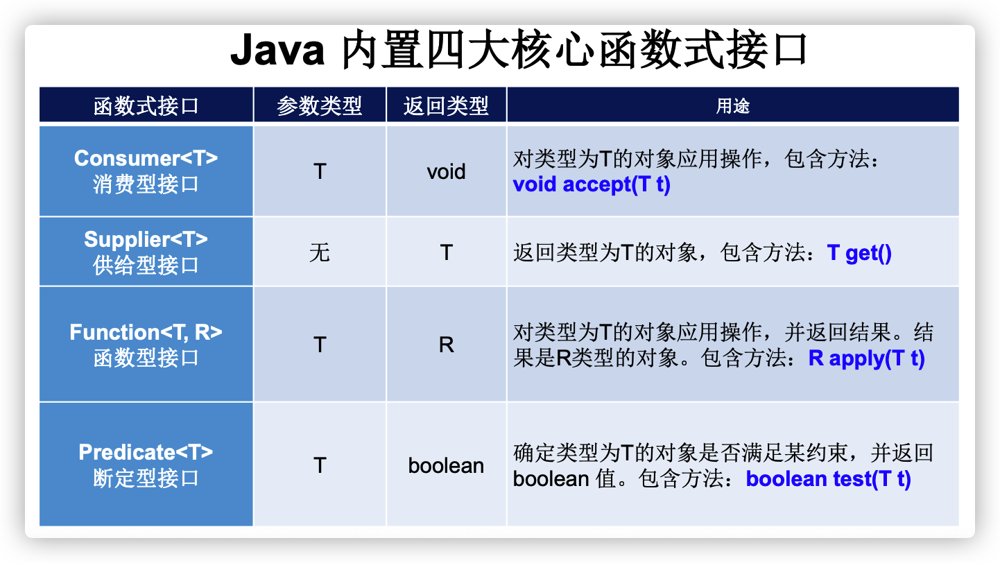

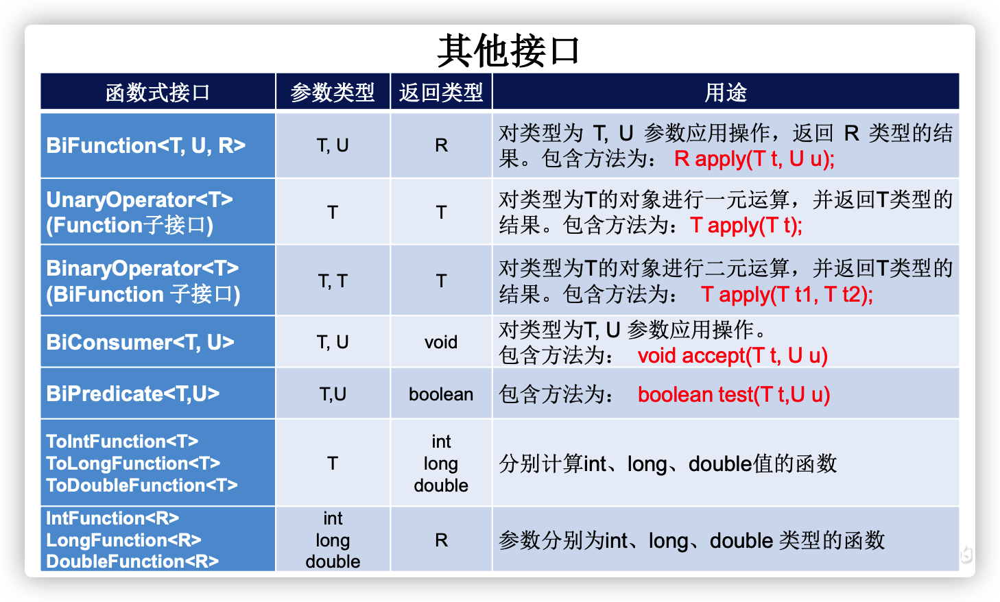

#### Lambda 表达式

简化 SAM（Single Abstract Method）接口实现的语法糖。

```
（形参列表）->{Lambda 体}
```

1. 如果 Lambda 体里面只有一句话，则可以省略`{}`以及里面的分号；
2. 如果形参列表中形参类型是已知的，那么数据类型可以省略；
3. 如果形参列表只有一个形参，并且数据类型可以省略，则可以省略括号；
4. 如果只有一句`ruturn`语句，可以省略`return`；
5. 如果没有形参，`()`不能省略。

#### 方法引用与构造器引用

当 Lambda 体的实现是调用一个现有的方法来实现，并且抽象方法的参数列表与该方法的参数列表对象，那么就可以使用**方法引用**来简化。

```java
list.forEach(num -> System.out.println(num));
list.forEach(System.out::println);
```

如果第一个形参是调用方法的，剩下的都作为此方法的参数，也可以使用方法引用。

```java
Arrays.sort(arr, (e1, e2) -> {e1.compareToIgnoreCase(e2)});
Arrays.sort(arr, String::compareToIgnoreCase);
```

**构造器引用**，当 Lambda 的方法体是通过创建对象实现的，并且形参列表一致。

```java
Supplier<String> s = String::new;
// String[]::new 数组构造器
```

#### Stream API

数据加工流。

- Stream 不负责存储数据，它只负责对数据进行处理
- Stream 不会改变源对象，每次处理都会返回一个有结果的新 Stream
- Stream 是延迟执行的，在获取结果的时候才会执行之前的操作方法

##### 创建

1. `<集合对象>.stream()`
2. `Arrays.stream(arr)`
3. `static <T> Stream<T> of(T... values)`
4. `static <T> Stream<T> generate(Supplier<T> s)`产生一个无限流
5. `static <T> Stream<T> iterate(T seed, UnaryOperator<T> f)`无限流

##### 中间操作

- `Stream<T> filter(Predicate<? super T> predicate)`
- `Stream<T> distinct()`
- `Stream<T> limit(long maxSize)`
- `Stream<T> skip(long n)`
- `static concat()`合并两个流
- `Stream<T> peek(Consumer<? super T> action)`对每个元素执行操作，相当于 forEach，但是不是终止操作
- `Stream<T> sorted()`
- `Stream<T> sorted(Comparator<? super T> comparator)`
- `<R> Stream<R> map(Function<? super T,? extends R> mapper)`对每个元素执行操作，返回该函数返回的元素组成的流
- `<R> Stream<R> flatMap(Function<? super T,? extends Stream<? extends R>> mapper)`

##### 终结操作

- `void forEach(Consumer<? super T> action)`
- `long count()`
- `boolean allMatch(Predicate<? super T> predicate)`
- `boolean anyMatch(Predicate<? super T> predicate)`
- `boolean noneMatch(Predicate<? super T> predicate)`
- `Optional<T> findFirst()`返回第一个元素
- `Optional<T> findAny()`返回任意一个
- `Optional<T> min(Comparator<? super T> comparator)`
- `Optional<T> max(Comparator<? super T> comparator)`
- `T reduce(T identity, BinaryOperator<T> accumulator)`相当于 JS 中的 reduce，从左到右依次处理元素值，identity 是初始值，每次 accumulator 的返回值会累加到 identity 上，最后返回该值。
- `<R,A> R collect(Collector<? super T,A,R> collector)`把流中的数据收集起来，在`Collectors`中有许多方法来提供`Collectoer`的实现类。

#### Optional

单值容器。

- `public static <T> Optional<T> of(T value)`存值
- `public static <T> Optional<T> ofNullable(T value)`可以存 null，如果是 null 则返回空 Optional
- `static <T> Optional<T> empty()`直接返回一个空的容器
- `public boolean isPresent()`
- `public T get()`
- `public void ifPresent(Consumer<? super T> consumer)`
- `public Optional<T> filter(Predicate<? super T> predicate)`
- `public T orElse(T other)`如果不是空的返回容器中的值，如果是空的返回另一个值
- `public T orElseGet(Supplier<? extends T> other)`如果是空的执行方法，返回该方法的返回值
- `public Optional<T> filter(Predicate<? super T> predicate)`
- `public <U> Optional<U> map(Function<? super T,? extends U> mapper)`

#### 接口中的默认方法和静态方法

在之前的接口笔记中有介绍。

#### 新的日期时间 API

在之前的笔记中有提及。

### Java 9

#### 模块化系统

在`src`目录下用`module-info.java`文件来声明模块信息。

通过`module`、`export`和`requires`关键字来声明模块信息。

#### 交互式编程环境 jShell

类似于`python`和`node`的命令行交互式编程环境。

#### 接口私有方法

Java 9 中接口方法可以用`private`修饰。

#### 匿名实现类使用泛型

在 Java 8 中，匿名实现类不能声明泛型，Java 9 中可以。

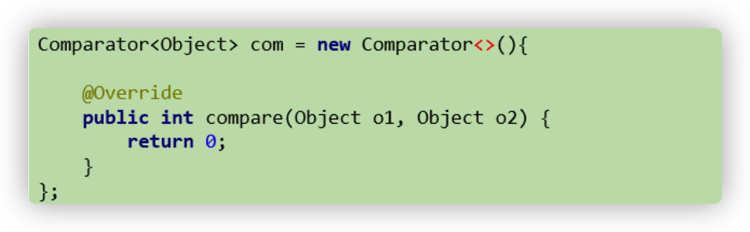

#### try-with-resources sheng

#### 局部变量类型推断

### Java 10

### Java 11
