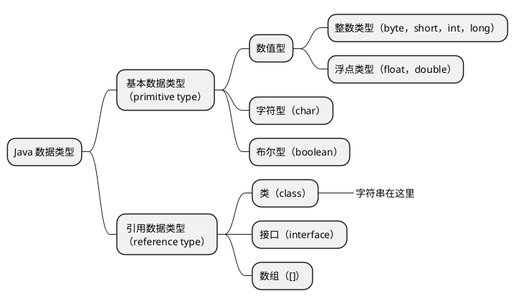

# Java

## 参考资料

- [2021 年度全网最全 Java 学习路线 - 哔哩哔哩](https://www.bilibili.com/read/cv5216534)
- [尚硅谷 Java 零基础入门教程（含百道 Java 真题，2 万多行 Java 代码实战）_哔哩哔哩_bilibili](https://www.bilibili.com/video/BV1Kb411W75N)
- [30 天搞定 Java 核心技术-程序员标配，人手一套尚硅谷教程](http://www.atguigu.com/download_detail.shtml?v=129)
- [30 天搞定 Java 核心技术（上） - 谷粒学苑 - Java 培训|大数据培训|前端培训|HTML5 培训|Linux 运维培训_程序员一站式 IT 在线学习平台 - Powered By EduSoho](https://www.gulixueyuan.com/goods/show/203?targetId=309&preview=0)

## Java 语言概述

### 软件开发介绍

#### 人机交互方式

- 图形化界面（Graphical User Interface, GUI）
- 命令行方式（Command Line Interface, CLI）

#### 常用的 DOS 命令

- `dir`列出目录下的文件以及文件夹
- `md`创建目录
- `rd`删除目录
- `cd`进入指定目录
- `cd..`进入上级目录
- `cd\`进入根目录
- `del`删除文件
- `exit`退出 DOS 命令行
- `echo`回显；可以用输出重定向输出内容到文件，如`echo javase > 1.txt`
- <kbd>TAB</kbd>代码提示
- <kbd>←</kbd><kbd>→</kbd>移动光标
- <kbd>↑</kbd><kbd>↓</kbd>调整历史命令
- <kbd>Delete</kbd><kbd>Backspace</kbd>删除字符

### 计算机编程语言介绍

- 第一代语言：机器语言，指令以二进制代码形式存在；
- 第二代语言：汇编语言，使用助剂符表示一条机器指令；
- 第三代语言：高级语言。

### Java 语言概述

Java 语言是 SUN（**S**tanford **U**niversity **N**etwork）1995 年推出的一门高级编程语言。

编程语言排行榜：[index | TIOBE - The Software Quality Company](https://www.tiobe.com/tiobe-index/)。

#### Java 简史

- 1991 年 Green 项目，开发语言最初命名为 Oak （橡树）
- 1996 年，发布 JDK 1.0
- 1999 年，Java 分成 J2SE、J2EE 和 J2ME，JSP/Servlet 技术诞生
- 2004 年，发布里程碑式版本 JDK 1.5，为突出此版本的重要性，更名为 JDK 5.0
- 2005 年，J2SE -> JavaSE，J2EE -> JavaEE，J2ME -> JavaME
- 2009 年，Oracle 公司收购 SUN，交易价格 74 亿美元
- 2014 年，发布 JDK 8.0，是继 JDK 5.0 以来变化最大的版本
- 2018 年 3 月，发布 JDK 10.0，版本号也称为 18.3
- 2018 年 9 月，发布 JDK 11.0，版本号也称为 18.9

#### Java 技术体系平台

- Java SE（Java Standard Edition）标准版，面向桌面级应用开发；
- Java EE（Java Enterprise Edition）企业版，是为开发企业环境下的应用程序提供的一套解决方案。该技术体系中包含的技术如 Servlet 、JSP 等，主要针对于 Web 应用程序开发；
- ava ME（Java Micro Edition）小型版，支持 Java 程序运行在移动终端上的平台；
- Java Card，支持一些 Java 小程序（Applets）运行在小内存设备（如智能卡）上的平台。

### Java 语言的环境搭建

- JRE（Java Runtime Environment，Java 运行环境）
- JDK（Java Development Kit，Java 开发工具包）


### 开发体验——Hello World

1. 编写
   1. 文件以`.java`为后缀
   2. 以类为基本单位
   3. 一个文件中只能由一个`public`类
   4. 如果存在`public`类，则源代码文件名需要与类名相同
   5. 程序的入口为固定写法，`public static void main(String[] args) { /* ... */ }`
   6. 语句之间用分号分隔
2. 编译，`javac A.java`
3. 运行，`java 类名`


### 注释

1. 单行注释，`// 注释`
2. 多行注释，`/* 注释 */`
3. 文档注释，`/** @author Roddy */`，可以用`javadoc`工具解析，生成代码文档

### Java API 文档

- [Java 8 中文版 - 在线 API 中文手册 - 码工具](https://www.matools.com/api/java8)
- [Overview (Java Platform SE 8 )](https://docs.oracle.com/javase/8/docs/api/)

## Java 基本语法

### 关键字与保留字

[Java Language Keywords (The Java™ Tutorials > Learning the Java Language > Language Basics)](https://docs.oracle.com/javase/tutorial/java/nutsandbolts/_keywords.html)

关键字（keyword）：被 Java 语言赋予了特殊含义，用做专门用途的字符串（单词）。关键字中所有字母都为小写。

保留字（reserverd word）：现有 Java 版本尚未使用，但以后版本可能会作为关键字使用。有两个`goto`、`const`。


### 标识符

#### 命名规则

Java 对各种变量、方法和类等要素命名时使用的字符序列称为标识符。

- 由 26 个英文字母大小写，`0-9` 、`_`或 `$` 组成；
- 数字不可以开头；
- 不可以使用关键字和保留字，但能包含关键字和保留字；
- Java 中严格区分大小写，长度无限制；
- 标识符不能包含空格。

#### 命名规范

命名规范，不强制但是强烈建议。

- 包名：`xxxyyyzzz`
- 类名、接口名：`XxxYyyZzz`
- 变量名、方法名：`xxxYyyZzz`
- 常量名：`XXX_YYY_ZZZ`

### 变量

#### 概念

- 内存中的一个存储区域
- 该区域的数据可以在同一类型范围内不断变化
- 变量是程序中最基本的存储单元。包含变量类型、变量名和存储的值。

#### 作用

用于在内存中保存数据。

#### 使用规则

- Java 中每个变量必须先声明，后使用
- 使用变量名来访问这块区域的数据
- 变量的作用域为其定义所在的一对`{}`内
- 变量只有在其作用域内才有效
- 同一个作用域内，不能定义重名的变量

#### 变量分类

##### 按类型分类




##### 按声明位置分类

- 成员变量：在方法体外，类内部声明的变量；
  - 实例变量：没有`static`修饰的变量；
  - 类变量：有`static`修饰的变量。
- 局部变量：在方法体内部声明的变量。

#### 变量的初始值

成员变量有初始值，**局部变量没有初始值**，需要显示初始化，不然不能通过编译检查。

| 数据类型  | 默认值                       |
| :-------- | ---------------------------- |
| `byte`    | `0`                          |
| `short`   | `0`                          |
| `int`     | `0`                          |
| `long`    | `0L`                         |
| `float`   | `0.0F`                       |
| `double`  | `0.0`                        |
| `char`    | `0`（`int`类型）或`'\u0000'` |
| `boolean` | `false`                      |
| 引用类型  | `null`                       |

#### 数据类型的大小和范围

// TODO 补充图表

| #    | 数据类型  | 占用存储空间 | 表数范围                                             | 备注                                                         |
| ---- | --------- | ------------ | ---------------------------------------------------- | ------------------------------------------------------------ |
| 1    | `byte`    | 1 字节        | $[-128,127]$ |                                                              |
| 2    | `short`   | 2            | $[-2^{15},2^{15}-1]$ |                                                              |
| 3    | `int`     | 4            | $[-2^{32},2^{32}-1]$（约为 21 亿） | 默认的整数类型                                               |
| 4    | `long`    | 8            |                                                          | 数字后面加`l`或`L`可声明为此类型                             |
| 5    | `float`   | 4            | 尾数可以精确到 7 位有效数字 | 后加`f`或`F`                                                 |
| 6    | `double`  | 8            | 精度是`float`的两倍 | 默认的浮点数字类型                                           |
| 7    | `char`    | 2            | `\u0000`\~`\uFFFF`，即`0`\~`65535`，无符号 16 位二进制数 | 存储一个 Unicode 编码字符，用一对单引号`''`包括，可以用 Unicode 编码，比如`'\u00443'` |
| 8    | `boolean` |              |                                                      | 只可以在`true`或`false`两个字面量之间取值                    |

#### 自动类型转换

```java
int a = 100;
long b = a;
```


- 容量（表数范围/精度）小的类型在需要的时候会自动转为容量大的类型，不会丢失精度；
- 有多种类型的数据混合运算时，系统首先自动将所有数据转换成容量最大的那种数据类型，然后再进行计算；
- `byte`、`short`、`char`之间不会相互转换，它们三种类型在计算时会首先转为`int`类型；
- `boolean`类型不会与其他类型转换；
- 任何基本数据类型和`Sting`字符串在进行`+`运算时，基本数据类型会首先被转换为字符串类型，参与字符串拼接。

#### Unicode 与 ASCII

`char`类型的变量在转换为`int`类型的时候会转换为对应 Unicode 编码的十进制值。Unicode 兼容 ASCII。

- [ASCII Table](https://www.cs.cmu.edu/~pattis/15-1XX/common/handouts/ascii.html)
- [Unicode 14.0 Character Code Charts](https://www.unicode.org/charts/)

#### String

- `String`不是基本数据类型，而是引用数据类型，它是一个类；
- 可以使用字面量方式声明，用双引号`""`包括；
- 也可以用`new String()`的方式创建对象；
- `String`在和`+`使用的时候意义为字符串拼接而不是加法，在和基本数据类型进行拼接运算时，基本数据类型会首先被转为`String`类型；

#### 强制类型转换

```java
long a = 100L;
int b = (int) a;
```

- `boolean`类型不可以被转换为其他类型；
- 如果想把更大容量/更高精度的类型转为小容量/低精度类型的时候可以用强制类型转换，有丢失精度的和数据的风险。

### 进制

这是常用进制在 Java 中的声明方式。

| 进制              | 开头       |
| ----------------- | ---------- |
| 二进制（Binary）  | `0b`或`0B` |
| 八进制（Octal）   | `0`        |
| 十进制（Decimal） |            |
| 十六进制（Hex）   | `0x`或`0X` |

### 运算符

#### 算术运算符


- `%`的结果和前一个操作数的正负相同，与后一个操作数的正负无关；
- `(a++)++`是行不通的，编译错误。

#### 赋值运算符

- `=`
- 当两侧的数据类型不一致的时候，可以使用自动类型转换或强制类型转换处理
- 支持连续赋值
- 扩展赋值运算符，不会改变原有的数据类型
  - `+=`，`a+=b <=> a=a+b`
  - `-=`
  - `*=`
  - `/=`
  - `%=`

```java
short s = 3;
s = s + 2; // 编译不通过
s += 2; // 不改变原来的数据类型
```

#### 比较运算符


比较运算符的结果都是`boolean`类型，要么是`true`，要么是`false`。

#### 逻辑运算符


#### 位运算符


- 位运算符对**整数**的二进制进行运算；
- `<<`左移一位相当于$\times2$；
- `>>`右移一位相当于$\div2$；
- 没有无符号左移运算符`<<<`；
- 异或`^`在交换两个整数类型变量的值的时候有妙用，异或三次次即可交换值，不需要中间变量。

```java
// 加减交换整数值
// 可能会超出 int 的范围
n1 = n1 + n2;
n2 = n1 - n2;
n1 = n1 - n2;

// 用异或交换整数值
n1 = n1 ^ n2;
n2 = n1 ^ n2;
n1 = n1 ^ n2;
```

#### 三元运算符

```
（条件表达式） ? 表达式 1 : 表达式 2;
```

- 当条件表达式为`true`时，执行表达式 1，整个表达式的值为表达式 1 的结果；否则执行表达式 2，整个表达式的结果为表达式 2 的结果；
- 表达式 1 和表达式 2 必须是**同种类型**。

#### 运算符的优先级


### 程序流程控制

#### 顺序结构

Java 程序在整体上是顺序结构的，依据语句书写的顺序从前往后执行。

#### 分支结构

- `if`
- `if-else`
- `switch-case`
  - `switch`表达式中的值必须是下面几种类型之一
    - `byte`
    - `short`
    - `int`
    - `char`
    - `Enum`（JDK 5）
    - `String`（JDK 7）
  - `case`子句的值必须是常量，不能是变量名或者不确定值的表达式；
  -  所有`case`字句的值应该互斥；
  - `break`关键字用于跳出`switch`结构，如果没有使用`break`则会接着向下执行，意味着可以匹配多个`case`；
  - `default`子句是可选的，位置也是灵活的（不一定要写在`case`语句之后），在没有匹配到`case`语句时会执行`default`子句中的表达式；
  - 如果`default`语句写在`case`语句之前，并且没有`break`，在匹配`default`语句之后还会向下执行`case`里的语句，直到遇到`break`或者执行完毕。这是一个很反直觉的行为，所以`default`子句尽量写在最后，并且如果不是特殊情况下，每条`case`语句都应包含一个`break`。

#### 循环结构

- `for`
- `while`
- `do-while`

## 数组

### 数组的概述

数组（Array）是**多个相同数据类型**按**一定顺序排列**的集合。

- 数组本身是**引用数据类型**，而数组中的元素可以是**任何数据类型**，包括基本数据类型和引用数据类型；
- 数组在内存中是一整块连续的空间，数组名引用的是这块连续空间的首地址；
- 数组的长度一旦确定就不能修改。

### 一维数组

#### 声明

```java
type var[];
type[] var;

int a[];
int[] a;
```

#### 动态初始化

```java
int[] arr = new int[3];
arr[0] = 3;
```

#### 静态初始化

```java
int[] arr = new int[]{1, 2, 3};
```

#### 默认值

数组成员具有默认值，和成员<u>变量的初始值</u>规则相同。不管是通过动态初始化还是静态初始化的方式来初始化数组，数组成员都有默认值，不过通过静态初始化方式初始化之后，数组成员的值又立刻被修改了一次。

### 多维数组的使用

#### 声明

```java
int arr[][];
int [][] arr;
```

#### 动态初始化

```java
int arr[][] = new int[][]{};
```

#### 静态初始化

```java
int[][] arr = new int[][]{{1, 1, 1}, {2, 2, 2}, {3, 3, 3}};
```
