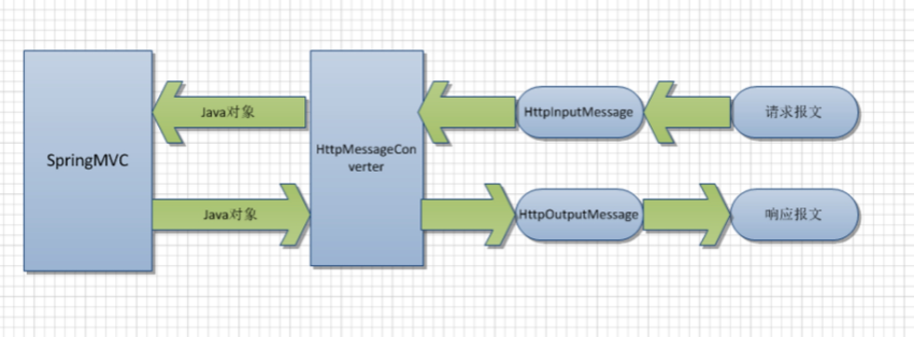
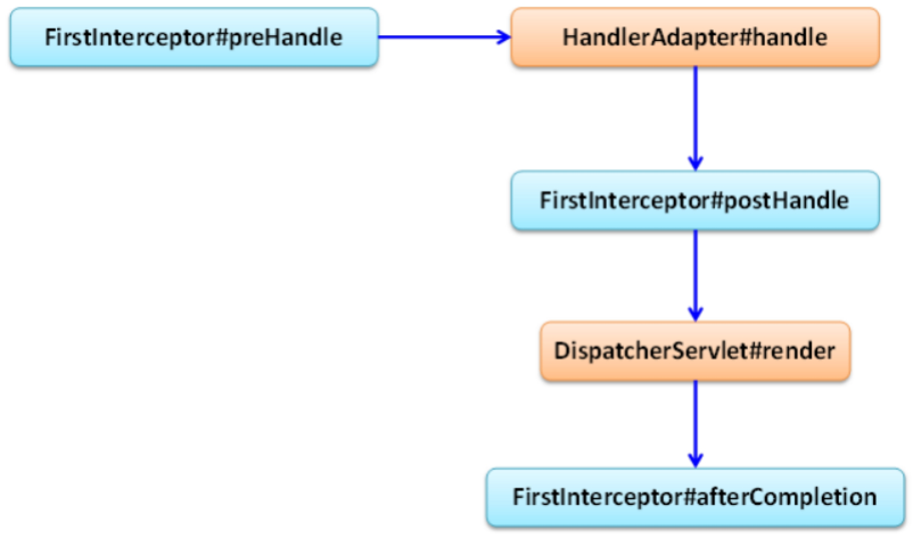
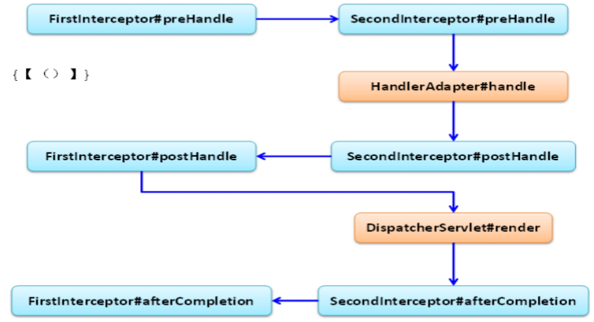
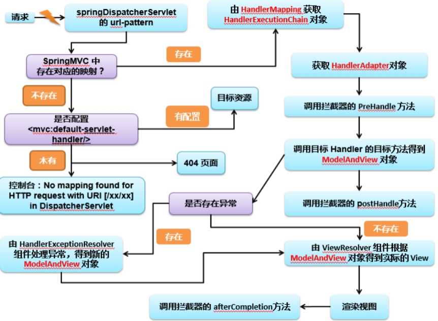

# Spring MVC

## 参考资料

- [Maven Repository: org.springframework » spring-web](https://mvnrepository.com/artifact/org.springframework/spring-web)
- [spring-web 5.2.7.RELEASE javadoc (org.springframework)](https://javadoc.io/doc/org.springframework/spring-web/latest/index.html)
- [spring-webmvc 5.2.7.RELEASE javadoc (org.springframework)](https://javadoc.io/doc/org.springframework/spring-webmvc/latest/index.html)

## 快速开始

1. 创建 Maven 工程，导入依赖

2. 配置 web.xml，在 Tomcat 容器开始运行时加载 SpringMVC 的 Servlet。并且给了初始化参数，告知 Spring 配置文件的位置。之后再把 SpringMVC 的 Servlet 映射到所有请求上，所有请求都经过此 Servlet 处理。

    如果不告知配置文件路径，则默认为`/WEB-INF/springMVC-{servlet-name}.xml`，其中`servlet-name`是在`web.xml`中配置的`<servlet-name>`的值。

    ```xml
    <servlet>
        <servlet-name>dispatcherServlet</servlet-name>
        <servlet-class>org.springframework.web.servlet.DispatcherServlet</servlet-class>
        <init-param>
            <param-name>contextConfigLocation</param-name>
            <param-value>classpath:mvc.xml</param-value>
        </init-param>
        <load-on-startup>1</load-on-startup>
    </servlet>

    <servlet-mapping>
        <servlet-name>dispatcherServlet</servlet-name>
        <url-pattern>/</url-pattern>
    </servlet-mapping>
    ```

3. 配置 Spring，开启包扫描，开启注解支持，并配置一个视图解析器，注入参数

    ```xml
    <context:component-scan base-package="me.iuok"/>

    <!--    注解支持-->
    <mvc:annotation-driven/>

    <!--    视图解析器-->
    <bean id="viewResolver" class="org.springframework.web.servlet.view.InternalResourceViewResolver">
        <property name="prefix" value="/WEB-INF/pages/"/>
        <property name="suffix" value=".jsp"/>
    </bean>
    ```

4. 编写 Controller，处理业务逻辑

    ```java
    @Slf4j
    @Controller
    public class HelloController {

        @RequestMapping("/hello")
        public String sayHello() {
            log.info("HelloController.sayHello");
            return "success";
        }

    }
    ```

5. 当访问 `/hello` 的时候就会显示 `/WEB-INF/pages/success.jsp` 里的内容了。

## 配置文件配置项

- `<mvc:default-servlet-handler/>`

会在 web.xml 中定义一个`DefaultServletHttpRequestHandler`，路径是`/`。

用户配置的`DispatcherServlet`的优先级更高，当收到请求时首先交给用户配置的 Servlet 进行处理，如果处理不了再交给默认的。

所以这个 Servlet 能处理静态资源。

- `<mvc:annotation-driven/>`

开启注解扫描。不然注解不生效。

## 注解

### @RequestMapping

可以标注在类上也可以标注在方法上，如果标注在类上则所有的方法上的映射继承类上的映射。

| 属性名    | 说明                                | 示例                                                         |
| --------- | ----------------------------------- | ------------------------------------------------------------ |
| `value`   | =`path`                             |                                                              |
| `path`    | 用于建立请求 URL 和方法之间的关系。 |                                                              |
| `method`  | 限制请求方式                        | `username`必须出现参数；`!username`不能出现此参数；`username=who`限制参数取值 |
| `params`  | 限制参数                            |                                                              |
| `headers` | 限制请求头，和 params 类似          |                                                              |

#### Ant 风格资源地址匹配

1. `?`匹配任意一个字符
2. `*`匹配单层路径
3. `**`匹配多层路径

### @RequestParam

只能标注在方法参数上，把 request 中的表单参数绑定到方法参数上。用于在自动注入不好使的情况下，方法参数名称可以和表单参数名称不相同。

| 属性名         | 说明                                    |
| -------------- | --------------------------------------- |
| `value`        | =`name`                                 |
| `name`         | 参数名                                  |
| `required`     | 是否必须有，默认为 true，不提供就会异常 |
| `defaultValue` | 默认值                                  |

### @RequestBody

标注在方法参数上，用于获取请求体的内容，比如以 JSON 格式传入数据的时候。GET 方法没有请求体，所以不适用。

### @RequestHeader

标注在方法参数上，用于绑定 request 中的 header 值。

### @PathVariable

标注在方法参数上，用于绑定 @RequestMapping 路径里的变量。

```java
@RequestMapping("/param/{id}")
public void pathVariable(@PathVariable("id") String id) {}
```

### @CookieValue

标注在方法参数上，用于绑定 Cookie 值。

### @ResponseBody

可以标注在类上和方法上，可以把方法的返回值直接输出到 response。

如果返回值是对象可以自动转为 json 格式输出，需要导入 [Jackson](https://mvnrepository.com/artifact/com.fasterxml.jackson.core/jackson-databind) 的依赖。

## 请求参数绑定

在控制器方法参数列表里写上参数，MVC 就会自动注入参数。

### 原生 Servlet 类型

1. HttpServletRequest
2. HttpServletResponse
3. HttpSession
4. java.security.Principal
5. Locale
6. InputStream
7. OutputStream
8. Reader
9. Writer

### 基本数据类型和 String 类型

### 实体类型

- `HttpEntity<>`
- `ResponseEntity<>`
- `RequestEntity<>`

## 数据共享

### ModelAndView

```java
@RequestMapping("/hello")
public ModelAndView test() {
    ModelAndView modelAndView = new ModelAndView();
    log.info("test 方法被执行");
    modelAndView.addObject("msg", "你好");
    modelAndView.setViewName("test");
    return modelAndView;
}
```

### Map

```java
@RequestMapping("/map")
public String map(Map<String, Object> map) {
    map.put("msg", "hello");
    return "test";
}
```

### Model

```java
@RequestMapping("/model")
public String map(String username, String password, Model model) {
    model.addAttribute("username", username);
    model.addAttribute("password", password);
    return "charset";
}
```

## 转发与重定向

```java
return "forward:/hello"
```

```java
return "redirect:/index.jsp";
```

## HttpMessageConveter



负责将请求信息转为对象，将对象输出为响应信息。

使用`HttpEntity<T>`/`ResponseEntity<T>`作为处理方法的入参或返回值。

## 文件下载

返回值类型`ResponseEntity<byte []>`。

```java
@RequestMapping("/testResponseEntity")
public ResponseEntity<byte[]> testResponseEntity(HttpSession session) throws IOException {
    ServletContext servletContext = session.getServletContext();
    InputStream resourceAsStream = servletContext.getResourceAsStream("/files/abc.txt");
    byte[] body = new byte[resourceAsStream.available()];
    resourceAsStream.read(body);
    MultiValueMap<String, String> headers = new HttpHeaders();
    headers.add("Content-Disposition", "attachment;filename=abc.txt");
    HttpStatus statusCode = HttpStatus.OK;
    return new ResponseEntity<byte[]>(body, headers, statusCode);
}
```

## 文件上传

- 上传表单要求`method="post"`，`enctype="multipart/form-data"`

```html
<form action="testUpload" method="post" enctype="multipart/form-data">
    文件：<input type="file" name="file"/><br><br>
    描述：<input type="text" name="desc"/><br><br>
    <input type="submit" value="提交"/>
</form>
```

- 导入依赖

[Maven Repository: commons-fileupload » commons-fileupload](https://mvnrepository.com/artifact/commons-fileupload/commons-fileupload)

- 配置`multipartResolver`，id 必须是这个

```xml
<bean id="multipartResolver" class="org.springframework.web.multipart.commons.CommonsMultipartResolver">
    <property name="defaultEncoding" value="utf-8"/>
    <property name="maxUploadSize" value="8888"/>
</bean>
```

- 处理

```java
@RequestMapping(value = "/upload", method = RequestMethod.POST)
public String upload(String desc, MultipartFile file) throws IOException {
    file.transferTo(Paths.get(""));
    return "test";
}
```

- 多文件上传，表单改成多个同名的上传域

```java
@RequestMapping(value = "/upload", method = RequestMethod.POST)
public String upload(String desc, @RequestParam("file") MultipartFile[] files) throws IOException {
    for (MultipartFile file : files) {
        file.transferTo(Paths.get(""));
    }
    return "test";
}
```

## 拦截器

类似于 Servlet 中的过滤器，对处理进行预处理和后处理。

1. 新类，实现`HandlerIntercepter`接口，或者继承`HandlerInterceptorAdapter`，重写方法
2. 配置文件

    ```xml
    <!--    拦截器-->
    <mvc:interceptors>
        <mvc:interceptor>
            <!--        要拦截的方法-->
            <mvc:mapping path=""/>
            <!--        不拦截的方法-->
            <mvc:exclude-mapping path=""/>
            <!--            拦截器-->
            <bean class="" id=""/>
        </mvc:interceptor>
    </mvc:interceptors>
    ```

### 执行顺序



1. pre()
2. controller
3. post()
4. xxx.jsp
5. afterCompletion()



对于多个拦截器的执行顺序。`preHandle`是顺序执行；`postHandle`是倒序执行；`afterCompletion`也是倒序执行。

在执行`preHandle`时，只要遇到一个返回`false`，剩下的拦截器都不会执行了，`postHandle`都不会执行。但是返回`false`之前的其它拦截器的`afterCompletion`还是会继续执行。

## 异常处理

Controller 调用 Service，Service 调用 DAO，异常都是向上抛出的，最终交由 DispatcherServlet 进行处理。

1. 新类，实现 HandlerExceptionResolver；
2. 重写方法
3. 在配置文件里配置 bean

或者有个更简单的办法，自带的有个`SimpleMappingExceptionResolver`。可以快捷地将异常与视图名对应，发生异常时自动跳转到对应视图，带上异常信息，key 是`exception`。可以把所有异常作一个通用处理。

## 整体运行流程



## 与 Spring 整合

- [SpringMVC 与 Spring 整合_Hudie.的博客-CSDN 博客_springmvc+spring 整合](https://blog.csdn.net/weixin_43691058/article/details/105453601)
- [Spring 整合 SpringMVC | 码农家园](https://www.codenong.com/cs106050175/)

SpringMVC 与 Spring 整合是为了**分工明确**。

- web.xml

```xml
<servlet>
<servlet-name>springDispatcherServlet</servlet-name>
    <servlet-class>org.springframework.web.servlet.DispatcherServlet</servlet-class>
    <init-param>
        <param-name>contextConfigLocation</param-name>
        <param-value>classpath:springmvc.xml</param-value>
    </init-param>
    <load-on-startup>1</load-on-startup>
</servlet>
<servlet-mapping>
    <servlet-name>springDispatcherServlet</servlet-name>
    <url-pattern>/</url-pattern>
</servlet-mapping>

<context-param>
    <param-name>contextConfigLocation</param-name>
    <param-value>classpath:spring.xml</param-value>
</context-param>
<listener>
    <listener-class>org.springframework.web.context.ContextLoaderListener</listener-class>
</listener>
```

- mvc.xml

```xml
<context:component-scan base-package="com.gql" use-default-filters="false">
    <context:include-filter type="annotation" expression="org.springframework.stereotype.Controller"/>
</context:component-scan>
```

- spring.xml

```xml
<context:component-scan base-package="com.gql">
    <context:exclude-filter type="annotation" expression="org.springframework.stereotype.Controller"/>
</context:component-scan>
```

两个容器同时存在情况下，Spring 容器作为父容器，SpringMVC 容器作为子容器。

SpringMVC 容器中的 Bean 可以引用 Spring 容器中的 Bean，反过来则不行。

## 异步请求

Servlet 3.0 中的异步请求在 SpringMVC 里也作了支持。有两种方式实现异步请求。

### Callable

控制器返回一个`Callable`对象。

```java
@GetMapping("/callable")
public Callable<String> callable() {
    log.info(Thread.currentThread().getName());

    return () -> {
        log.info(Thread.currentThread().getName());
        return "你好";
    };
}
```

### DeferredResult

控制器返回一个`DeferredResult`对象，然后在其他线程中等待任务完成的时候调用`setResult()`方法。

```java
@GetMapping("/deferredResult")
public DeferredResult<String> deferredResult() {
    DeferredResult<String> deferredResult = new DeferredResult<>();
    processDeferredResult(deferredResult);
    log.info("AsyncController.deferredResult");
    log.info(Thread.currentThread().getName());
    return deferredResult;
}

private void processDeferredResult(DeferredResult<String> deferredResult) {
    new Thread(() -> {
        try {
            Thread.sleep(2000);
        } catch (InterruptedException e) {
            e.printStackTrace();
        }

        deferredResult.setResult("Hello");
        log.info("AsyncController.processDeferredResult");
        log.info(Thread.currentThread().getName());
    }).start();
}
```
