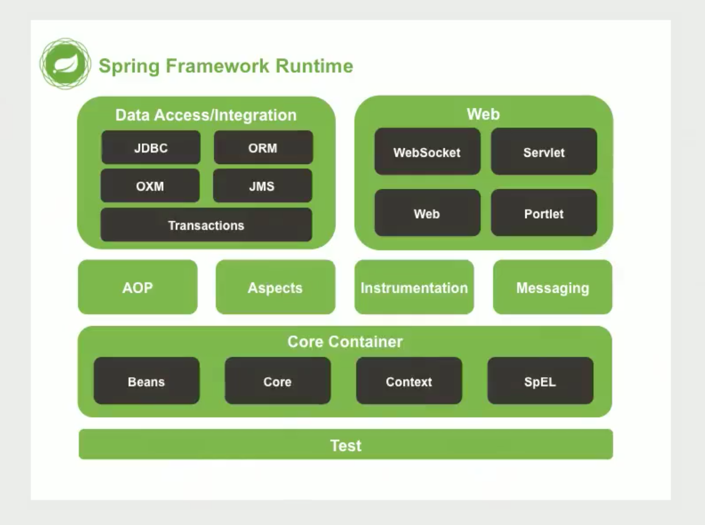
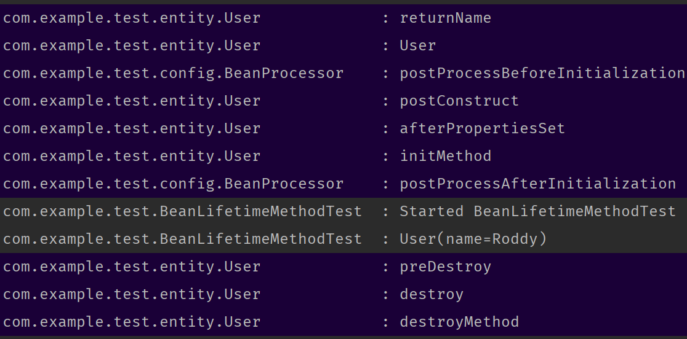
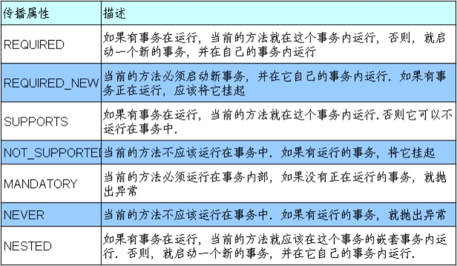

# Spring

## 参考资料

- [【尚硅谷】SSM 框架全套教程，MyBatis+Spring+SpringMVC+SSM 整合一套通关\_哔哩哔哩\_bilibili](https://www.bilibili.com/video/BV1Ya411S7aT)

## 概述

### Spring 的优势

1. 解耦
2. AOP
3. 声明式事务
4. 方便测试
5. 方便集成各种优秀框架

### Spring 的体系结构



## IoC

### 核心容器

ApplicationContext 的三个常用实现类：

1. `ClassPathXmlApplicationContext`，加载类路径下的配置文件
2. `FileSystemXmlApplicationContext`，加载磁盘任意目录下的配置文件
3. `AnnotationConfigApplicationContext`，读取注解创建容器

```xml
<!-- bean.xml -->
<bean id="userDao" class="me.iuok.dao.UserDao"></bean>
```

```java
// 获取核心容器
ClassPathXmlApplicationContext ac = new ClassPathXmlApplicationContext("bean.xml");

// 两种获取方法都可以
UserDao bean = (UserDao) ac.getBean("userDao");
UserDao userDao = ac.getBean("userDao", UserDao.class);
```

### Spring 对 Bean 的管理细节

#### 创建 Bean 的三种方式

1. 使用默认构造函数创建。在 xml 中配置了 Bean 的 id 和 class，并且没有配置其它配置项就会使用对象的默认空参构造器来实例化对象，如果该对象没有空参构造器就会抛出异常；

    ```xml
    <bean id="userDao" class="me.iuok.dao.UserDao"/>
    ```

2. 使用工厂类中的方法创建对象，获取其返回值，并存入容器。先创建工厂实例，再调用工厂方法；

    ```xml
    <bean id="factory" class="me.iuok.dao.UserDao"/>
    <bean id="userDao" factory-bean="factory" factory-method="getInstance"/>
    ```

3. 使用工厂类中的静态方法创建对象，获取其返回值，并存入容器。因为是静态方法所以不用事先创建工厂类的实例。

    ```xml
    <bean id="userDao" class="me.iuok.dao.UserDao" factory-method="getInstance"/>
    ```

#### Bean 对象的作用范围

调整 bean 标签的 `scope` 属性。

| scope          | 说明                                                |
| -------------- | --------------------------------------------------- |
| singleton      | 单例，默认值                                        |
| prototype      | 多例                                                |
| request        | 只在 request 域生效                                 |
| session        | session 域                                          |
| global-session | 集群的 session 域，用于在负载均衡的机器之间共享数据 |

#### Bean 对象的生命周期

1. 单例模式，Bean 的生命周期和容器的生命周期相同
    1. 创建对象：默认情况下，Bean 的创建随着容器的创建
    2. 存活：只要容器存活，对象就存活
    3. 销毁对象：随着容器的销毁
2. 多例
    1. 创建对象：向容器索取的时候创建
    2. 存活：一直存活，Spring 不会关闭它
    3. 销毁对象：被其它机制销毁，比如手动关闭，被垃圾回收等

可以配置 bean 标签的 `init-method` 和 `destroy-method` 属性来分别制定初始化方法和销毁方法，Spring 容器在创建和销毁对象的时候会调用。

```xml
<bean id="userDao" class="me.iuok.dao.UserDao" init-method="init" destroy-method="destroy"/>
```

#### InitializingBean

是一个接口，规定了`afterPropertiesSet()`方法。

#### DisposableBean

是一个接口，规定了`destory()`方法。

#### JSR-250

有两个注解`@PostConstruct`和`@PreDestory`，在`javax.annotation`下，Spring 对这两个注解作了支持，可以控制 Bean 的生命周期方法。

其实 JSR-250 中的`@PostConstruct`和`@PreDestory`就是在`InitDestoryAnnotationBeanPostProcessor`中被处理的。

#### BeanPostProcessor

实现接口`org.springframework.beans.factory.config.BeanPostProcessor`，可以给 Bean 的生命周期加两个步骤。

该接口有`postProcessBeforeInitialization`和`postProcessAfterInitialization`两个方法，分别在所有初始化方法调用之前和之后调用，控制所有 Bean 的生命周期。

`@AutoWired`是在`AutoWiredAnnotationBeanPostProcessor`中被处理的。

#### 完整生命周期

1. 通过构造器或工厂方法创建 Bean 实例；
2. `populateBean()`为 Bean 的属性赋值
3. `postProcessBeforeInitialization()`
4. `@PostConstruct`标注的方法
5. `InitialingBean`接口中的`afterPropertiesSet()`方法
6. `initMethod`指定的初始化方法
7. `postProcessAfterInitialization()`
8. Bean 可以使用了
9. `@PreDestory`标注的方法
10. `DisposableBean`中的`destory()`方法
11. `destroyMethod`指定的销毁方法



### 依赖注入

Dependency injection，在当前类需要其他类的对象，由 Spring 容器为我们提供，我们只需在配置文件中维护依赖关系。

#### 使用构造函数注入

```java
public class User {

    private UserDao userDao;

    public User(UserDao userDao) {
        this.userDao = userDao;
    }
}
```

```xml
<bean id="userDao" class="me.iuok.dao.UserDao" init-method="init" destroy-method="destroy"/>

<bean id="user" class="me.iuok.domain.User">
    <constructor-arg name="userDao" ref="userDao"/>
</bean>
```

| 属性名 | 说明                                                 |
| ------ | ---------------------------------------------------- |
| type   | 指定参数类型，写全类名，在有歧义的时候指定，平常不用 |
| index  | 指定参数的索引，从 0 开始                            |
| name   | 指定参数的名称，通常用这个而不是索引                 |
| value  | 直接给构造参数赋值，用于基本数据类型和 String 类型   |
| ref    | 引用另一个 bean 来给构造参数赋值                     |

#### setter 注入

通过 set 方法注入属性。set 方法名去掉 set 之后剩下的部分首字母小写就称为属性（Property）。

- `name`，属性名
- `value`，属性值
- `ref`，Bean 引用

```java
public class User {

    private UserDao userDao;

    public void setUserDao(UserDao userDao) {
        this.userDao = userDao;
    }
}
```

引用其他 Bean 注入。

```xml
<bean id="userDao" class="me.iuok.domain.UserDao">
    <!-- ... -->
</bean>

<bean id="user" class="me.iuok.domain.User">
    <property name="userDao" ref="userDao"/>
</bean>
```

直接定义一个内部 Bean 供自己使用，这个 Bean 没有 ID。

```xml
<bean id="user" class="me.iuok.domain.User">
    <property name="userDao">
        <bean class="me.iuok.domain.UserDao">
            <!-- ... -->
        </bean>
    </property>
</bean>
```

#### p 名称空间

为了简化 XML 配置，采用属性配置信息而非子元素配置信息，就是`property`标签的简便写法。

使用`p:fieldName-ref="BeanId"`语法还可以引用其他 Bean。

```xml
<bean
    id="studentSuper"
    class="com.atguigu.helloworld.bean.Student"
    p:studentId="2002" p:stuName="Jerry2016" p:age="18" />
```

#### 复杂类型的注入

还可以注入诸如 List、Map 之类的复杂类型，通过构造方法和属性都可以注入。

```xml
<bean id="user" class="me.iuok.domain.User" init-method="init">
    <constructor-arg name="list">
        <array>
            <value>aaa</value>
            <value>bbb</value>
            <value>ccc</value>
            <value>ddd</value>
        </array>
    </constructor-arg>

    <property name="userDao" ref="userDao"/>
    <property name="list">
        <array>
            <value>aaa</value>
            <value>bbb</value>
            <value>ccc</value>
            <value>ddd</value>
        </array>
    </property>
</bean>
```

| 标签名 | 注入类型  | 备注                           |
| ------ | --------- | ------------------------------ |
| array  | List 或数组  | `<value>value</value>`         |
| list   | List  | 同上                           |
| set    | List  | 同上                           |
| props  | Map   | `<prop key="key">value</prop>` |
| map    | Map   | `<entry key="" value=""/>`     |

只需要记住两组就可以了，标签可以混用。

- `util:list`标签可以定义一个数组，供其它地方引用；
- `util:map`标签可以定义一个 Map，供其它地方引用。

#### 特殊值注入

使用`null`标签来表示 null 值。

```xml
<bean id="user" class="me.iuok.domain.User">
    <property name="userDao">
        <null />
    </property>
</bean>
```

在`CDATA`标签内的内容可以不用转义，这是一个特殊的标签，所以只能放在标签的内容部分，不能放入属性部分。下面的例子中小于号`<`就不用转义。

```xml
<property name="expression">
    <value><![CDATA[a < b]]></value>
</property>
```

### 引入外部配置文件

`context:property-placeholder`来引入外部配置文件，使用 SpEL 表达式`${prop.userName}`来引用值。

```xml
<context:property-placeholder location="classpath:jdbc.properties"/>
```

### FactoryBean

实现`org.springframework.beans.factory.FactoryBean`接口，并且将该类注册到容器中后，配置的 Bean 不是该类本身，而是`getObject()`返回的那个实例。

如果想获取 FactoryBean 类本身的话，需要在 ID 前面加上「&」字符。此机制的实现细节在`BeanFactory`工厂接口中。

### 基于注解的配置

基于注解的配置所要达成的目的和基于配置文件的配置所要达成的目的相同，都是为了降低程序间的耦合，只是配置的形式不一样。

#### 不完全注解

首先在配置文件中开启包扫描。

```xml
<context:component-scan base-package="me.iuok"/>
```

#### 完全注解

可以新建一个类作为配置类，替换掉 xml 配置，使所有的配置都在 Java 代码中完成。此时在新建容器的时候就要使用 `AnnotationConfigApplicationContext` 类了。

- `@Configuration`，标注当前类是一个配置类。
- `@ComponentScan`，和`context:component-scan`标签的作用一样，开启包扫描，自动扫描 Bean 并加入容器。
- `@Bean(name)`，标注在方法上，用于将该方法的返回值对象存入容器中。id 默认为当前方法名称，可以用 name 属性指定。如果该方法有参数，Spring 自动完成依赖注入。还可以搭配创建对象里的一些注解使用，用于替换 bean 标签里的其它属性。`initMethod`和`destoryMethod`来指定初始化和销毁方法。
- `@Lazy`，懒加载，针对单实例 Bean。容器启动的时候不创建对象，在第一次获取 Bean 的时候才创建对象并进行初始化。
- `@Conditional`，根据条件判断是否注册 Bean。其中属性是`Condition`接口，需要自己实现来决定是否注册 Bean。
- `@Import`，用于导入其它配置类，在其它配置类上就不用写`@Configuration`注解了，也不用在扫描包的时候加上其它类的包名了。可以传入一个普通类作为配置类；可以传入`ImportSelector`接口，指定需要导入的类的全限定类名；可以传入`ImportBeanDefinitionRegister`接口，手动向容器中注册 Bean。
- `@PropertySource`，指定 properties 配置文件，Spring 会自动解析。开头写上 `classpath:` 或者 `file:` 来指明这个文件来自类路径还是来自系统路径。可以搭配`@Value`和 SpEL 使用，`${key}` 就能直接拿到配置文件里的配置项。
- `@Profile`，根据当前环境，动态激活组件。在什么都没配置的情况下，默认激活的 profile 是 default。可以用虚拟机参数指定激活的 prifile，`-Dspring.profiles.active=dev`。

#### 创建对象

| 注解          | 说明   |
| ------------- | ------ |
| `@Component`  |        |
| `@Controller` | 表现层 |
| `@Service`    | 业务层 |
| `@Repository` | 持久层 |

它们的作用完全相同，都是创建当前类的对象并存入容器中。

其它三个都是 `@Component` 的别名，通过这个注解标记 `@AliasFor(annotation = Component.class)`。

起多个名字的原因是为了方便在不同场景使用，让业务更清晰。

属性`value`用于指定 Bean 的 id，默认为首字母小写的当前类名。

```java
@Component
public class UserDao {

    public void init() {
        log.info("init");
    }

    public void destroy() {
        log.info("destroy");
    }
}
```

- `@Scope(value)`，设置作用范围，和 bean 标签中的 scope 属性达到的效果是一样的，取值也一样。
- `@PostConstruct`，用于标注初始化方法。
- `@PreDestroy`，用于标注销毁方法。

#### 依赖注入注解

- `@Autowired`：可以标注在成员变量上，也可以标注在方法参数上。只要容器中只有唯一一个对应该类型的对象，就可以直接注入。如果有多个匹配就会注入 id 与该变量名称相同的 Bean。使用注解注入时就不需要 setter 了。可以使用在数组和集合类型上，会自动装配所有满足要求的 Bean。如果使用在`Map<String, Xxx>`上，会自动装配所有满足要求的 Bean，并且把 id 作为 key。
- `@Primary`：在自动装配的时候作为首选候选者。
- `@Order`：以数值指定候选 Bean 的优先级排序。
- `@Qualifier(value)`：搭配上一个注解使用，在匹配类型的情况下再指定 Bean 的 id。在给方法参数标注的时候可以单独使用。
- `@Resource(name)`：JSR-250，直接指定 Bean 的 id 进行注入，单独使用。
- `@Inject`：JSR-330，需要导入`javax.inject`相关包，和`@AutoWired`类似，但是没有`required`属性。
- `@Value(value)`：用于注入基本类型和 String 类型的数据，可以使用 SpEL 表达式来注入环境变量中的值，写法为 `${exp}`。还可以搭配`@PropertySource`来引用配置文件。

### `Aware`接口

如果想使用 Spring 底层的组件如`ApplicationContext`、`BeanFactory`、`Environment`等，可以实现`org.springframework.beans.factory.Aware`接口的子接口。这些依赖（大部分）都会在`ApplicationContextAwareProcessor`中被注入，该类是`BeanPostProcessor`的实现类。

- `ApplicationContextAware`
- `EnvironmentAware`
- `BeanFactoryAware`
- `...`

## AOP

### 概念

Aspect Oriented Programming，面向切面编程。减少重复代码，降低程序耦合，提升开发效率。

| 英文         | 中文      | 说明                                                         |
| ------------ | --------- | ------------------------------------------------------------ |
| Joinpoint    | 连接点    | 被拦截到的点，在 Spring 中，指的是方法                       |
| Pointcut     | 切入点    | 被增强的 Joinpoint                                           |
| Advice       | 通知/增强 | 拦截后做的事情，有前置通知、后置通知、异常通知、最终通知和环绕通知 |
| Introduction | 引介      | 是一种特殊的通知，是指在不修改源码的前提下可以在运行期间动态地添加一些方法或者属性 |
| Target       | 目标对象  | 被代理的目标对象                                             |
| Weaving      | 织入      | 把增强应用到目标对象来创建新的代理对象的过程                 |
| Proxy        | 代理      | 一个类被 AOP 织入增强之后，就产生一个结果代理类              |
| Aspect       | 切面      | 是切入点和通知的结合                                         |

### XML 配置

1. 导入依赖

    ```xml
    <!-- https://mvnrepository.com/artifact/org.springframework/spring-aspects -->
    <dependency>
        <groupId>org.springframework</groupId>
        <artifactId>spring-aspects</artifactId>
        <version>5.3.22</version>
    </dependency>
    ```

2. 目标对象要实现接口

    ```java
    public interface UserService {

        void hello();

    }
    ```

    ```java
    @Slf4j
    public class UserServiceImpl implements UserService {
        public void hello() {
            log.info("UserServiceImpl.hello()");
        }
    }
    ```

3. 把目标对象和通知类交由容器管理

    ```xml
    <bean id="userService" class="me.iuok.service.impl.UserServiceImpl"/>
    <bean id="logger" class="me.iuok.util.Logger"/>
    ```

4. 开始织入

    ```xml
    <aop:config>
        <!-- 可以配置切面表达式引用 -->
        <aop:pointcut id="serviceImpl" expression="execution(* me.iuok.service.impl.*.*(..))"/>

        <!-- id 可以随便, ref 引用通知类 -->
        <aop:aspect id="logAdvice" ref="logger">
            <!-- 配置前置通知，method 设置调用方法，pointcut 是切入点表达式 -->
            <aop:before method="before" pointcut="execution(public void me.iuok.service.impl.UserServiceImpl.hello())"/>
            <!-- 后置通知-->
            <aop:after-returning method="afterReturning" pointcut="execution(* me.iuok.service.impl.*.*(..))"/>
            <!-- 异常通知-->
            <aop:after-throwing method="afterThrowing" pointcut-ref="serviceImpl"/>
            <!-- 最终通知-->
            <aop:after method="after" pointcut-ref="serviceImpl"/>
        </aop:aspect>
    </aop:config>
    ```

5. 测试

    ```java
    // 注意这里要使用目标对象的接口类型
    UserService userService = ac.getBean("userService", UserService.class);
    userService.hello();
    ```

#### 切入点表达式

- `execution(<exp>)`
- `execution(public void me.iuok.service.impl.UserServiceImpl.hello())`
- 格式：访问修饰符 返回值类型 包名。类名。方法名 (参数类型列表)

1. 访问修饰符
    1. 可以省略，表示任意
2. 返回值
    1. 可以使用通配符 `*` 表示任意类型
3. 包名
    1. 可以使用通配符 `*`，但是多少级包就需要使用多少个通配符
    2. 可以使用 `..` 表示当前包和子包
4. 类名和方法名
    1. 都可以使用通配符
5. 参数列表
    1. 可以直接写数据类型
    2. 基本数据类型直接写，引用数据类型写全类名
    3. 也可以使用通配符 `*` 表示任意类型，但是不包括没有参数的
    4. 可以使用 `..` 表示有无参数均可的任意类型
6. 全通配写法：`* *..*.*(..)`

#### 环绕通知

环绕通知就是整个增强后的方法，在 Spring 中它可以通过代码配置其它各种通知在何时何处如何实现。

配置方式实现的通知执行顺序不太可靠，如果对执行顺序有很高要求的话可以使用代码配置环绕通知，使用`@Order`注解来决定顺序。

```xml
<aop:config>
    <!-- 可以配置切面表达式引用 -->
    <aop:pointcut id="serviceImpl" expression="execution(* me.iuok.service.impl.*.*(..))"/>

    <!-- id 可以随便, ref 引用通知类 -->
    <aop:aspect id="logAdvice" ref="logger">
        <!-- 环绕通知 -->
        <aop:around method="around" pointcut-ref="serviceImpl"/>
    </aop:aspect>
</aop:config>
```

```java
public Object around(ProceedingJoinPoint pjp) {
    Object object = null;

    try {
        log.info("before");
        object = pjp.proceed(pjp.getArgs());
        log.info("after-returning");
    } catch (Throwable throwable) {
        throwable.printStackTrace();
        log.info("after-throwing");
    } finally {
        log.info("after");
    }

    return object;
}
```

### 注解配置

1. 开启包扫描和自动代理，可以使用 XML 开启也可以使用注解开启

    ```xml
    <context:component-scan base-package="me.iuok"/>
    <aop:aspectj-autoproxy/>
    ```

    ```java
    @Configuration
    @ComponentScan(basePackages = "me.iuok")
    @EnableAspectJAutoProxy
    public class AppConfig {

    }
    ```

2. 把目标类和通知类都交由容器管理

    ```java
    @Slf4j
    @Service
    public class UserService {
        public Integer sayHello() {
            log.info("UserService.sayHello");
            return 1;
        }
    }
    ```

3. 在通知类上标注 `@Aspect` 注解，表明这是一个通知类

    ```java
    @Slf4j
    @Aspect
    @Component
    public class LogAspect { ... }
    ```

4. 在方法上加入通知注解

    ```java
    @Before("pt()")
    public void before(JoinPoint joinPoint) {
        log.info("Aspect: before，{}", joinPoint.toLongString());
    }

    @After("pt()")
    public void after(JoinPoint joinPoint) {
        log.info("Aspect: after，{}", joinPoint.toLongString());
    }

    @AfterThrowing(value = "pt()", throwing = "e")
    public void afterThrowing(JoinPoint joinPoint, Exception e) {
        log.info("Aspect: afterThrowing，{}, {}", joinPoint.toLongString(), e);
    }

    @AfterReturning(value = "pt()", returning = "returning")
    public void afterReturning(JoinPoint joinPoint, Object returning) {
        log.info("Aspect: afterReturning，{}, {}", joinPoint.toLongString(), returning);
    }
    ```

5. 同时也可以引用切入点表达式，注意引用的时候要用方法名加括号

    ```java
    @Pointcut("execution(* me.iuok.service.impl.*.*(..))")
    private void pt(){}
    ```

### 声明式事务

#### XML 配置声明式事务

1. 配置数据库信息

    ```xml
    <context:property-placeholder location="classpath:jdbc.properties"/>

    <bean id="dataSource" class="org.springframework.jdbc.datasource.DriverManagerDataSource">
        <constructor-arg name="username" value="${jdbc.username}"/>
        <constructor-arg name="password" value="${jdbc.password}"/>
        <constructor-arg name="url" value="${jdbc.url}"/>
    </bean>

    <bean id="jdbcTemplate" class="org.springframework.jdbc.core.JdbcTemplate">
        <constructor-arg name="dataSource" ref="dataSource"/>
    </bean>
    ```

2. 把 DAO 和 Service 交由容器管理

    ```xml
    <bean id="mockDao" class="me.iuok.dao.impl.MockDaoImpl">
        <constructor-arg name="jdbcTemplate" ref="jdbcTemplate"/>
    </bean>

    <bean id="mockService" class="me.iuok.service.impl.MockServiceImpl">
        <constructor-arg name="mockDao" ref="mockDao"/>
    </bean>
    ```

3. 配置事务管理器

    ```xml
    <bean id="transactionManager" class="org.springframework.jdbc.datasource.DataSourceTransactionManager">
        <constructor-arg name="dataSource" ref="dataSource"/>
    </bean>
    ```

4. 配置事务的通知，与事务管理器关联；并为事务配置规则，这里为 login 方法配置了规则。其中 name 属性可以用通配符 `*`

    ```xml
    <tx:advice id="txAdvice" transaction-manager="transactionManager">
        <tx:attributes>
            <tx:method name="login" read-only="true"/>
        </tx:attributes>
    </tx:advice>
    ```

5. 配置切入点表达式，并与通知关联

    ```xml
    <aop:config>
        <aop:pointcut id="pt" expression="execution(* me.iuok.service.impl.*.*(..))"/>
        <aop:advisor advice-ref="txAdvice" pointcut-ref="pt"/>
    </aop:config>
    ```

6. 完成，根据配置，在执行 login 方法的时候会开启只读事务。

#### 注解配置声明式事务

1. `@EnableTransactionManagement`开启事务支持

    ```java
    @Configuration
    @ComponentScan(basePackages = "me.iuok")
    @PropertySource("classpath:jdbc.properties")
    @EnableTransactionManagement
    public class AppConfig {}
    ```

2. 把数据库连接相关的对象仍到容器里

    ```java
    @Bean
    public DriverManagerDataSource driverManagerDataSource(@Value("${jdbc.url}") String url,
                                                            @Value("${jdbc.username}") String username,
                                                            @Value("${jdbc.password}") String password) {
        return new DriverManagerDataSource(url, username, password);
    }

    @Bean
    public JdbcTemplate jdbcTemplate(DriverManagerDataSource driverManagerDataSource) {
        return new JdbcTemplate(driverManagerDataSource);
    }
    ```

3. 把 TransactionManager 也仍到容器里

    ```java
    @Bean("transactionManager")
    public DataSourceTransactionManager dataSourceTransactionManager(DataSource dataSource) {
        return new DataSourceTransactionManager(dataSource);
    }
    ```

4. `@Transactional` 在需要使用事务的服务类上标注注解，可以标注在类上，也可以标注在方法上，用于设置类全局规则和针对于方法的自定义规则。

    ```java
    @Service
    @Transactional
    public class MockServiceImpl implements MockService {

        private MockDao mockDao;

        @Autowired
        public MockServiceImpl(MockDao mockDao) {
            this.mockDao = mockDao;
        }

        @Transactional(readOnly = true)
        public Mock login(String username, String password) {
            List<Mock> mocks = mockDao.findByEmail(username);

            return mocks.isEmpty() ? null : mocks.get(0);
        }

    }
    ```

5. 完成，相对于 xml 配置方式来说，注解配置在一定程度上更简单，但是它不支持切入点表达式，所以不能用通配符配置。

#### 说明

声明式事务在默认情况下只针对运行时异常回滚，编译时异常不回滚。

#### 事务的传播行为



#### 事务的隔离级别

| 隔离级别                      |        脏读        |     不可重复读     |        幻读        |
| :---------------------------- | :----------------: | :----------------: | :----------------: |
| READ UNCOMMITTED              | :heavy_check_mark: | :heavy_check_mark: | :heavy_check_mark: |
| READ COMMITTED                |        :x:         | :heavy_check_mark: | :heavy_check_mark: |
| REPEATABLE READ（MySQL 默认） |        :x:         |        :x:         | :heavy_check_mark: |
| SERIALIZABLE                  |        :x:         |        :x:         |        :x:         |

## 与其他组件的整合

### JUnit4

#### 依赖

1. junit ≥ 4.1.2
2. spring-context
3. spring-test

#### 替换 JUnit 的默认启动类

在测试类上标注。

```java
@RunWith(SpringJUnit4ClassRunner.class)
```

#### 指定 Spring 配置

如果是配置文件就指定 `locations`，如果是配置类就指定 `classes`。

```java
@ContextConfiguration(classes = Config.class)
```

这就搭建好 Spring 的测试运行环境了，就可以在测试类中使用 Spring 的注解了。

### Junit5

```java
@ExtendWith(SpringExtension.class)
@ContextConfiguration("classpath:spring/Spring.xml")
```

还有一个更简单的写法，集成了上面两个注解。

```java
@SpringJUnitConfig(locations = "classpath:spring/Spring.xml")
```

### JdbcTemplate

```xml
<!-- https://mvnrepository.com/artifact/org.springframework/spring-jdbc -->
<dependency>
    <groupId>org.springframework</groupId>
    <artifactId>spring-jdbc</artifactId>
    <version>5.3.22</version>
```

```java
@Configuration
@ComponentScan(basePackages = "me.iuok")
@PropertySource("classpath:jdbc.properties")
public class AppConfig {

    @Bean
    public DriverManagerDataSource driverManagerDataSource(@Value("${jdbc.url}") String url,
                                                           @Value("${jdbc.username}") String username,
                                                           @Value("${jdbc.password}") String password) {
        return new DriverManagerDataSource(url, username, password);
    }

    @Bean
    public JdbcTemplate jdbcTemplate(DriverManagerDataSource driverManagerDataSource) {
        return new JdbcTemplate(driverManagerDataSource);
    }

}
```
