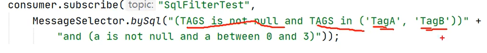
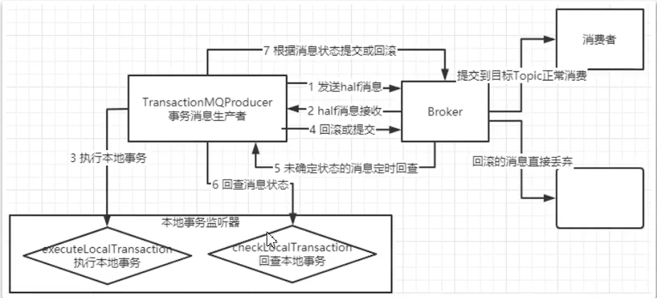

# RocketMQ

## MQ

MQ（Message Queue，消息队列），是一种FIFO的队列。

它的作用有：

1. 异步
2. 解耦
3. 削峰

## RocketMQ介绍

RcoketMQ是一款低延迟、高可靠、可伸缩、易于使用的消息中间件。

### NameServer

注册中心，可以集群。

### Broker

真正负责消息收发和存储的实体，可以主从。

## 单机部署

可以使用Docker Compose来快速部署RocketMQ。

RockerMQ分为NameServer[^1]和Broker[^2]，前者类似于注册中心，后者才是进行存储消息的服务。还有一个第三方服务`rocket-mq-console-ng`[^3][^4]，是RocketMQ的网页控制台。

RocketMQ的NameServer和Broker是同一套代码，只是启动的时候参数不一样。`apacherocketmq/rocketmq-nameserver`和

`apacherocketmq/rocketmq-broker`在启动参数上有不同。

RocketMQ的数据存储在`user.home`目录下，你可以设置`user.home`环境变量来自定义存储路径。在这两个Docker镜像中，该环境变量的值为`/opt`。

```yaml
version: "3"
services:
  nameserver:
    image: apacherocketmq/rocketmq-nameserver:4.5.0-alpine
    volumes:
      - nameserver_logs:/root/logs
    ports:
      - 9876:9876
    environment:
      JAVA_OPT_EXT: " -Xms128m -Xmx128m -Xmn128m"
    command: sh mqnamesrv
  broker:
    image: apacherocketmq/rocketmq-broker:4.5.0-alpine
    depends_on:
      - nameserver
    volumes:
      - broker_data:/root/store
      - broker_logs:/root/logs
      - /root/docker-compose/rocketmq/broker.conf:/home/rocketmq/broker.conf
    ports:
      - 10909:10909
      - 10911:10911
      - 10912:10912
    environment:
      JAVA_OPT_EXT: " -Xms128m -Xmx128m -Xmn128m"
    command: sh mqbroker -c /home/rocketmq/broker.conf
  console:
    image: apacherocketmq/rocketmq-console:2.0.0
    depends_on:
      - nameserver
      - broker
    ports:
      - 8088:8080
    environment:
      LOGGIN_LEVEL_ROOT: info
      ROCKETMQ_CONFIG_NAMESRVADDR: nameserver:9876
      JAVA_OPTS: " -Xms128m -Xmx128m -Xmn128m"
volumes:
  nameserver_logs:
  broker_data:
  broker_logs:
```

根据上面的文件中的配置内容，你还需要为Broker提供配置文件，位于`/root/docker-compose/rocketmq/broker.conf`。

需要配置Broker的外部IP，不然客户端连接不上。

```properties
brokerClusterName = DefaultCluster
brokerName = broker-a
brokerId = 0
deleteWhen = 04
fileReservedTime = 48
brokerRole = ASYNC_MASTER
flushDiskType = ASYNC_FLUSH

namesrvAddr=nameserver:9876
brokerIP1=192.168.229.129
defaultTopicQueueNums=4
autoCreateTopicEnable=true
autoCreateSubscriptionGroup=true
```

接着使用`docker compose up -d`就可以启动容器了，容器名字都会加上当前文件夹名作为前缀。

可以使用`docker compose ps`查看容器的运行状态。

## 集群部署

// TODO 还没学，学了再写

## 开发

首先为了使用方便，定义了一些常量。

```java
public class MQConstant {

    public static final String NAMESERVER_ADDR = "192.168.229.129:9876";

}
```

### 原生API

#### 消费者（推送）

```java
package example.sync;

@Slf4j
public class Consumer {

    public static final String CONSUMER_GROUP = "sync_message_consumer";

    public static void main(String[] args) throws Exception {
        DefaultMQPushConsumer consumer = new DefaultMQPushConsumer(CONSUMER_GROUP);
        consumer.setNamesrvAddr(MQConstant.NAMESERVER_ADDR);
        consumer.setConsumeFromWhere(ConsumeFromWhere.CONSUME_FROM_LAST_OFFSET);
        consumer.subscribe(MQTopicConstant.PRACTISE, MQTagConstant.PRACTISE);
        consumer.registerMessageListener((MessageListenerOrderly) (msgs, context) -> {
            msgs.forEach(messageExt -> {
                log.info("收到消息: {}", messageExt);
                log.info("消息体: {}", new String(messageExt.getBody()));
            });
            return ConsumeOrderlyStatus.SUCCESS;
        });
        consumer.start();
        log.info("Consumer已启动");
        Runtime.getRuntime().addShutdownHook(new Thread(() -> {
            log.info("程序正在退出");
            consumer.shutdown();
        }));
    }

}
```

#### 生产者（同步发送）

```java
package example.sync;

@Slf4j
public class Producer {

    public static final String PRODUCER_GROUP = "sync_message_producer";

    public static void main(String[] args) throws Exception {
        DefaultMQProducer producer = new DefaultMQProducer(PRODUCER_GROUP);
        producer.setNamesrvAddr(MQConstant.NAMESERVER_ADDR);
        producer.start();
        Stream.generate(RandomUtil::randomInt)
                .limit(10)
                .map(i -> new Message(MQTopicConstant.PRACTISE, MQTagConstant.PRACTISE, StrUtil.format("Hello RocketMQ: {}", i).getBytes(StandardCharsets.UTF_8)))
                .forEach(message -> {
                    try {
                        SendResult result = producer.send(message, 10000);
                        log.info("消息已发送: {}", result);
                    } catch (Exception e) {
                        log.error("消息发送失败", e);
                    }
                });
        producer.shutdown();
    }

}
```

#### 生产者（异步发送）

```java
package example.producer;

@Slf4j
public class AsyncMessageProducer {

    public static final String PRODUCER_GROUP = "async_message_producer";

    public static void main(String[] args) throws Exception {
        final int count = 10;
        DefaultMQProducer producer = new DefaultMQProducer(PRODUCER_GROUP);
        producer.setNamesrvAddr(MQConstant.NAMESERVER_ADDR);
        producer.start();
        CountDownLatch countDownLatch = new CountDownLatch(count);
        Stream.generate(RandomUtil::randomInt)
                .limit(count)
                .map(i -> new Message(MQTopicConstant.PRACTISE, MQTagConstant.PRACTISE, StrUtil.format("Hello RocketMQ: {}", i).getBytes(StandardCharsets.UTF_8)))
                .forEach(message -> {
                    try {
                        producer.send(message, new SendCallback() {
                            @Override
                            public void onSuccess(SendResult sendResult) {
                                log.info("消息发送成功: {}", sendResult);
                                countDownLatch.countDown();
                            }

                            @Override
                            public void onException(Throwable e) {
                                log.error("消息发送失败", e);
                                countDownLatch.countDown();
                            }
                        });
                        log.info("消息已发送: {}", message);
                    } catch (Exception e) {
                        log.error("消息发送失败", e);
                    }
                });
        countDownLatch.await();
        producer.shutdown();
    }

}
```

#### 生产者（单向发送）

```java
// org.apache.rocketmq.client.producer.DefaultMQProducer#sendOneway
public void sendOneway(Message msg)
```


#### 消费者（拉取）

主动拉取可以更灵活地消费消息。

// TODO 还需要明白主动拉取后的消费确认机制

```java
package example.consumer;

@Slf4j
public class PullConsumer {

    public static final String CONSUMER_GROUP = "pull_message_consumer";

    public static void main(String[] args) throws Exception {
        DefaultLitePullConsumer consumer = new DefaultLitePullConsumer(CONSUMER_GROUP);
        consumer.setConsumeFromWhere(ConsumeFromWhere.CONSUME_FROM_LAST_OFFSET);
        consumer.setNamesrvAddr(MQConstant.NAMESERVER_ADDR);
        consumer.subscribe(MQTopicConstant.PRACTISE, MQTagConstant.ALL);
        consumer.start();
        while (true) {
            List<MessageExt> messages = consumer.poll();
            if (CollUtil.isEmpty(messages)) {
                break;
            }
            messages.forEach(messageExt -> log.info("收到消息: {}", messageExt));
        }
        Runtime.getRuntime().addShutdownHook(new Thread(consumer::shutdown));
    }

}
```

#### 顺序消费

顺序消费要做到需要顺序消费的一组消息都发送到同一个队列上。消费者在消费的时候使用串行消费而不是并发消费。

```java
// org.apache.rocketmq.client.producer.DefaultMQProducer#send
public SendResult send(Message msg, MessageQueueSelector selector, Object arg)
```

`MessageQueueSelector`可以选择发送消息到哪个队列上。

在实际使用中，可以动态地选择队列来实现负载均衡，只要保证需要顺序消费的同一组消息发送到同一个队列上即可。

```java
SendResult sendResult = producer.send(message, (mqs, msg, arg) -> {
                    int i = (Integer) arg % mqs.size();
                    return mqs.get(i);
                }, pair.getKey());
```

#### 广播消息

默认情况下，同一个消费者组在消费消息时有竞争关系。在消费消息的时候设置消费者为广播模式就可以让消费者去掉竞争属性。

```java
// org.apache.rocketmq.client.consumer.DefaultMQPushConsumer#setMessageModel
public void setMessageModel(MessageModel messageModel)
```

`MessageModel`默认为`CLUSTERING`，需要设置为`BROADCASTING`。

```java
consumer.setMessageModel(MessageModel.BROADCASTING);
```

#### 延迟消息

```java
// org.apache.rocketmq.common.message.Message#setDelayTimeLevel
public void setDelayTimeLevel(int level)
```

可以给`Message`设置`delayLevel`，延迟级别分别为`1s 5s 10s 30s 1m 2m 3m 4m 5m 6m 7m 8m 9m 10m 20m 30m 1h 2h`，从1开始数。

#### 批量消息

```java
// org.apache.rocketmq.client.producer.DefaultMQProducer#send
public SendResult send(Collection<Message> msgs)
```

可以简单地把消息封装为`Collection<Message>`，一起发出去。

#### 过滤消息

大多数情况下，可以通过Topic和Tag来过滤消息。

Tag可以用表达式写。

```java
consumer.subscribe(MQTopicConstant.PRACTISE, MessageSelector.byTag("TAG"));
```

在复杂情况下，还可以通过SQL语句来过滤消息。



其中变量`a`可以在发送消息的时候通过`putUserProperty()`放入。

```java
// org.apache.rocketmq.common.message.Message#putUserProperty
public void putUserProperty(final String name, final String value)
```

只有推送模式的Consumer可以使用消息过滤。

#### 事务消息



事务消息的机制是在发送消息时会发送一个办消息，这个消息存放在系统创建的Topic中，对消费者是不可见的。在生产者对消息进行提交之后才会把消息转移到目标Topic。如果生产者没有对消息进行提交，RocketMQ会每隔一段时间进行回查，确认本地事务是否已提交成功，如果是则把消息转移到目标Topic，否则若超过最大回查尝试次数则丢弃消息，默认最大重试次数为15。

### Spring Boot

#### 配置

配置解耦，写在配置文件中。

```properties
rocketmq.name-server=192.168.229.129:9876
rocketmq.producer.group=spring-boot-producer-group
```

#### 生产者（同步发送）

核心是`RocketMQTemplate`，消息的发送都依赖它完成。`RocketMQTemplate`已经在Spring容器中，可以自动注入拿到。其中`destination`的格式为`${topic}:${tag}`。

```java
// org.springframework.messaging.core.AbstractMessageSendingTemplate#send
public void send(D destination, Message<?> message)
```

发送消息用`send()`，参数中的`Message`实际上是`org.springframework.messaging.Message`，而不是`org.apache.rocketmq.common.message.Message`。

`Message`可以用`MessageBuilder`构建。

```java
MessageBuilder.withPayload(payload).build();
```

#### 生产者（异步发送）

```java
// org.apache.rocketmq.spring.core.RocketMQTemplate#asyncSend
public void asyncSend(String destination, Message<?> message, SendCallback sendCallback)
```

#### 生产者（单向发送）

```java
// org.apache.rocketmq.spring.core.RocketMQTemplate#sendOneWay
public void sendOneWay(String destination, Message<?> message)
```

#### 消费者（推送）

消息的消费有了新的抽象。只需实现`RocketMQListener`接口就可以快速完成消息消费。设计原则是一个接口消费一种消息，如果需要消费其他消息则需要多个接口。

```java
package com.example.rocketmqinspringboot.listener;

@Slf4j
@Service
@RocketMQMessageListener(consumerGroup = MQConstant.CONSUMER_GROUP, topic = MQTopicConstant.PRACTISE, selectorExpression = MQTagConstant.PRACTISE)
public class Consumer implements RocketMQListener<String> {

    @Override
    public void onMessage(String message) {
        log.info("收到消息: {}", message);
    }

}
```

上面的例子会直接拿到消息中的Payload并且将之转为泛型对应类型的对象。如果你需要拿到消息的头部信息，把泛型设置为`MessageExt`，其中可以拿到头部信息[^5]。

#### 顺序消费

```java
// org.apache.rocketmq.spring.core.RocketMQTemplate#sendAndReceive
public <T> T sendAndReceive(String destination, Message<?> message, Type type, String hashKey)
```

生产者同一组消息指定相同的`hashKey`，则该组消息会被发送到同一个消息队列上。

```java
// org.apache.rocketmq.spring.annotation.RocketMQMessageListener#consumeMode
ConsumeMode consumeMode() default ConsumeMode.CONCURRENTLY;
```

消费者把`consumeMode`设置为`ORDERLY`。

#### 广播消息

```java
// org.apache.rocketmq.spring.annotation.RocketMQMessageListener#messageModel
MessageModel messageModel() default MessageModel.CLUSTERING;
```

#### 过滤消息

```java
// org.apache.rocketmq.spring.annotation.RocketMQMessageListener#selectorType
SelectorType selectorType() default SelectorType.TAG;

// org.apache.rocketmq.spring.annotation.RocketMQMessageListener#selectorExpression
String selectorExpression() default "*";
```

#### 事务消息

```java
// org.apache.rocketmq.spring.core.RocketMQTemplate#sendMessageInTransaction
public TransactionSendResult sendMessageInTransaction(final String destination, final Message<?> message, final Object arg)
```

发送事务消息依赖`sendMessageInTransaction`完成。`arg`作为自定义参数会被传递到`RocketMQLocalTransactionListener#executeLocalTransaction`中，本地事务逻辑会在该方法中完成。

```java
package com.example.rocketmqinspringboot.controller;

@Operation(summary = "发事务消息")
@PostMapping("/transaction")
public void sendTransactionMessage(@RequestBody String message) {
    TransactionSendResult transactionSendResult = rocketMQTemplate.sendMessageInTransaction(getDestination(), getMessage(message), message);
    log.info("transactionSendResult: {}", transactionSendResult);
}
```

```java
package com.example.rocketmqinspringboot.listener;

@Slf4j
@RocketMQTransactionListener
public class TransactionListener implements RocketMQLocalTransactionListener {
    @Override
    public RocketMQLocalTransactionState executeLocalTransaction(Message msg, Object arg) {
        String orderNumber = new String((byte[]) msg.getPayload());
        log.info("执行事务, {}", orderNumber);
        return RocketMQLocalTransactionState.UNKNOWN;
    }

    @Override
    public RocketMQLocalTransactionState checkLocalTransaction(Message msg) {
        String orderNumber = new String((byte[]) msg.getPayload());
        log.info("回查, {}", orderNumber);
        return RocketMQLocalTransactionState.COMMIT;
    }
}
```

发送事务消息时，一个`RocketMQTemplate`对应一个`RocketMQLocalTransactionListener`，该`RocketMQTemplate`所发出的事务消息都会在对应的`RocketMQLocalTransactionListener`中执行。

如果需要定义多个事务消息监听器，就需要多个`RocketMQListener`，对应多个`RocketMQLocalTransactionListener`。

```java
package com.example.rocketmqinspringboot.config;

@ExtRocketMQTemplateConfiguration
public class ExtRocketMQTemplate extends RocketMQTemplate {
}
```

```java
package com.example.rocketmqinspringboot.listener;

@RocketMQTransactionListener(rocketMQTemplateBeanName = "extRocketMQTemplate")
public class ExtTransactionListener implements RocketMQLocalTransactionListener {
    @Override
    public RocketMQLocalTransactionState executeLocalTransaction(Message msg, Object arg) {
        return RocketMQLocalTransactionState.UNKNOWN;
    }

    @Override
    public RocketMQLocalTransactionState checkLocalTransaction(Message msg) {
        return RocketMQLocalTransactionState.COMMIT;
    }
}
```

### Spring Cloud Stream

Spring Cloud Stream是Spring官方提供的一个针对所有开源的消息系统进行统一封装。

#### 配置

```java
package com.example.rocketmqspringcloudstream;

@EnableBinding({Source.class, Sink.class})
@SpringBootApplication
public class RocketmqSpringCloudStreamApplication {

    public static void main(String[] args) {
        SpringApplication.run(RocketmqSpringCloudStreamApplication.class, args);
    }

}
```

`Source`和`Sink`是Spring Cloud Stream提供的简单的消息输入和输出通道。

```properties
spring.cloud.stream.bindings.input.destination=STREAM_TOPIC
spring.cloud.stream.bindings.input.group=STREAM_GROUP
spring.cloud.stream.bindings.output.destination=STREAM_TOPIC
spring.cloud.stream.rocketmq.binder.name-server=192.168.229.129:9876
```

Spring Cloud Stream关于消息生产和消费的配置都放在配置文件中。

`spring.cloud.stream.bindings`是一个`Map`，可以配置多个通道，`input`就是`Sink`的通道名，`output`就是`Source`的通道名。

如果需要定义其他通道就新增配置文件，然后新增类似于`Sink`和`Sourec`的接口。

#### 生产者

```java
package com.example.rocketmqspringcloudstream.controller;

@Tag(name = "消息")
@Slf4j
@RestController
@RequestMapping("/messages")
public class MessageController {

    @Autowired
    private Source source;

    @Operation(summary = "发同步消息")
    @PostMapping("/sync")
    public void sendSync(@RequestBody String message) {
        Map<String, Object> headers = new HashMap<>();
        headers.put(MessageConst.PROPERTY_TAGS, MQTagConstant.PRACTISE);
        Message<String> msg = MessageBuilder.createMessage(message, new MessageHeaders(headers));
        boolean success = source.output().send(msg);
        log.info("success: {}", success);
    }

}

```

#### 消费者

```java
package com.example.rocketmqspringcloudstream.consumer;

@Slf4j
@Service
public class Consumer {

    @StreamListener(Sink.INPUT)
    public void consume(String message) {
        log.info("收到消息: {}", message);
    }

}
```

## 参考资料

1. [2021年B站讲的最牛掰的RocketMQ 分布式消息中间件：核心原理与最佳实践_哔哩哔哩_bilibili](https://www.bilibili.com/video/BV1h54y1H7YF)
2. [Apache RocketMQ](http://rocketmq.apache.org/)
3. [rocketmq/docs/cn at master · apache/rocketmq](https://github.com/apache/rocketmq/tree/master/docs/cn)
4. [rocketmq-externals/rocketmq-console at master · apache/rocketmq-externals](https://github.com/apache/rocketmq-externals/tree/master/rocketmq-console)
5. [基于 Docker 安装 RocketMQ - 简书](https://www.jianshu.com/p/706588323276)
6. [rocketmq-docker/docker-compose.yml at master · apache/rocketmq-docker](https://github.com/apache/rocketmq-docker/blob/master/templates/docker-compose/docker-compose.yml)
7. [用户手册 · apache/rocketmq-spring Wiki](https://github.com/apache/rocketmq-spring/wiki/%E7%94%A8%E6%88%B7%E6%89%8B%E5%86%8C)

[^1]: [apacherocketmq/rocketmq-nameserver - Docker Image | Docker Hub](https://hub.docker.com/r/apacherocketmq/rocketmq-nameserver)
[^2]: [apacherocketmq/rocketmq-broker - Docker Image | Docker Hub](https://hub.docker.com/r/apacherocketmq/rocketmq-broker)
[^3]: [apacherocketmq/rocketmq-console - Docker Image | Docker Hub](https://hub.docker.com/r/apacherocketmq/rocketmq-console)
[^4]: [rocketmq-externals/rocketmq-console at master · apache/rocketmq-externals](https://github.com/apache/rocketmq-externals/tree/master/rocketmq-console)
[^5]:[常见问题 · apache/rocketmq-spring Wiki](https://github.com/apache/rocketmq-spring/wiki/%E5%B8%B8%E8%A7%81%E9%97%AE%E9%A2%98)


