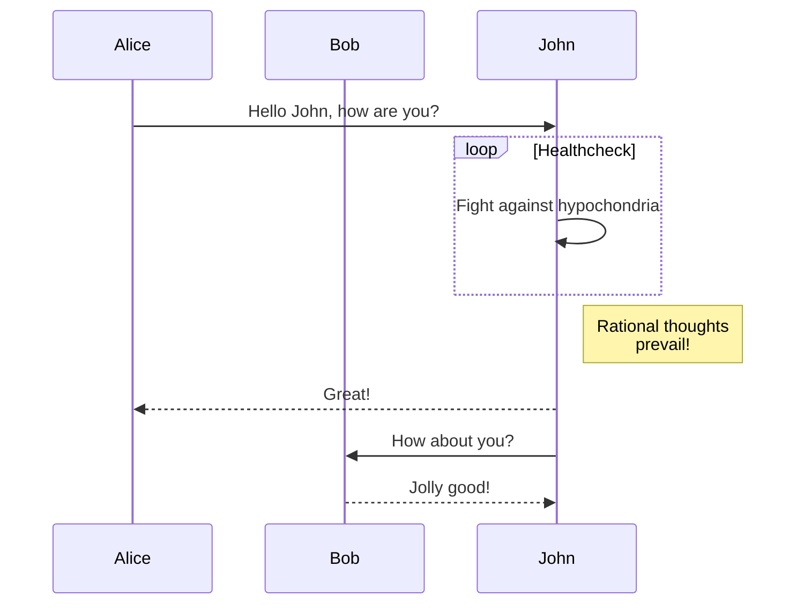
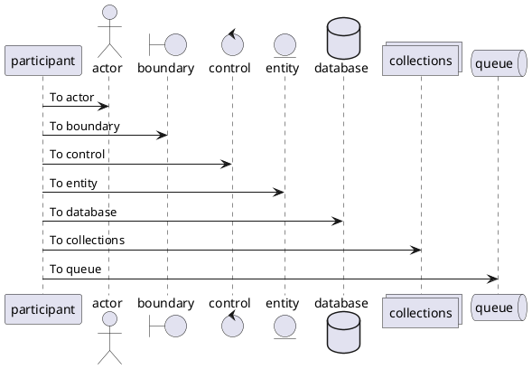

# Markdown 扩展测试

## Mermaid[^1]



## PlantUML[^2]



## 任务列表

- [x] 1
- [ ] 2
- [x] 3
- [ ] 4
- [x] 5

## 代码复制按钮

```
@startuml
participant participant as Foo
actor       actor       as Foo1
boundary    boundary    as Foo2
control     control     as Foo3
entity      entity      as Foo4
database    database    as Foo5
collections collections as Foo6
queue       queue       as Foo7
Foo -> Foo1 : To actor
Foo -> Foo2 : To boundary
Foo -> Foo3 : To control
Foo -> Foo4 : To entity
Foo -> Foo5 : To database
Foo -> Foo6 : To collections
Foo -> Foo7 : To queue
@enduml
```

## TeX[^3]

$c = \sqrt{a^{2}+b_{xy}^{2}+e^{x}}$
$$
c = \sqrt{a^{2}+b_{xy}^{2} +e^{x}}
$$

[^1]: [mermaid - Markdownish syntax for generating flowcharts, sequence diagrams, class diagrams, gantt charts and git graphs.](https://mermaid-js.github.io/mermaid/#/)
[^2]: [开源工具，使用简单的文字描述画 UML 图。](https://plantuml.com/zh/)
[^3]: [Supported Functions · KaTeX](https://katex.org/docs/supported.html)
